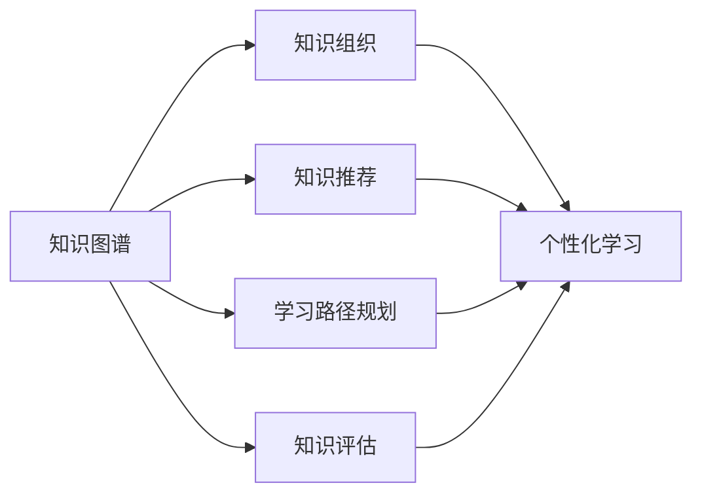

# 自动化智能教育:从知识图谱到个性化学习

## 1. 背景介绍
### 1.1 智能教育的发展历程
#### 1.1.1 传统教育模式的局限性
#### 1.1.2 信息技术与教育的融合
#### 1.1.3 人工智能在教育领域的应用

### 1.2 知识图谱与个性化学习
#### 1.2.1 知识图谱的概念与特点  
#### 1.2.2 个性化学习的内涵与意义
#### 1.2.3 知识图谱在个性化学习中的作用

## 2. 核心概念与联系
### 2.1 知识图谱
#### 2.1.1 知识图谱的定义
知识图谱（Knowledge Graph）是一种结构化的知识表示方法，它以图的形式描述实体之间的关系。在知识图谱中，节点表示实体（如概念、对象等），边表示实体之间的关系（如属性、关联等）。通过构建知识图谱，可以更好地组织、管理和应用知识。

#### 2.1.2 知识图谱的组成要素
知识图谱主要由以下几个要素组成：

- 实体（Entity）：表示现实世界中的对象、概念等，如人物、地点、事件等。
- 关系（Relation）：表示实体之间的联系，如"属于"、"位于"、"朋友"等。
- 属性（Attribute）：描述实体的特征，如"姓名"、"年龄"、"职业"等。
- 事实（Fact）：由实体、关系和属性组成的陈述，表示客观世界中的真实情况。

#### 2.1.3 知识图谱的构建过程
知识图谱的构建通常包括以下步骤：

1. 知识获取：从各种数据源（如结构化数据、半结构化数据、非结构化数据）中提取知识。
2. 知识抽取：使用自然语言处理、机器学习等技术，从获取的知识中识别出实体、关系和属性。
3. 知识融合：对抽取出的知识进行去重、消歧和整合，形成一致的知识表示。
4. 知识存储：将融合后的知识以图的形式存储，常用的存储方式有图数据库、RDF等。
5. 知识应用：利用构建好的知识图谱进行推理、问答、推荐等应用。

### 2.2 个性化学习
#### 2.2.1 个性化学习的定义
个性化学习（Personalized Learning）是根据学习者的个人特点、学习需求和学习行为，提供量身定制的学习内容、学习路径和学习支持，以提高学习效果和学习体验的教育方式。

#### 2.2.2 个性化学习的特点
个性化学习具有以下特点：

- 以学习者为中心：关注学习者的个体差异，根据其特点提供个性化的学习服务。
- 数据驱动：通过收集和分析学习者的学习数据，了解其学习行为和学习需求，为个性化学习提供依据。
- 自适应性：根据学习者的学习进度、学习能力等动态调整学习内容和学习路径，实现自适应学习。
- 多样化：提供多种学习资源和学习活动，满足不同学习者的学习偏好和学习风格。

#### 2.2.3 个性化学习的实现方式
个性化学习的实现方式主要有以下几种：

- 基于规则的个性化：根据预设的规则，如学习者的年龄、学习水平等，提供相应的学习内容和学习路径。
- 基于推荐的个性化：通过协同过滤、内容过滤等推荐算法，根据学习者的学习行为和偏好，推荐适合的学习资源。
- 基于自适应的个性化：通过智能算法，如贝叶斯网络、马尔可夫决策过程等，根据学习者的学习数据，动态调整学习内容和学习路径。

### 2.3 知识图谱与个性化学习的关系
知识图谱与个性化学习密切相关，主要体现在以下几个方面：

- 知识组织：知识图谱提供了一种结构化的知识组织方式，有助于个性化学习系统更好地管理和应用教育知识资源。
- 知识推荐：基于知识图谱的语义关联，可以实现更加精准的学习资源推荐，为学习者提供个性化的学习内容。
- 学习路径规划：利用知识图谱中的概念关系和先后顺序，可以智能生成个性化的学习路径，指导学习者的学习进程。
- 知识评估：结合知识图谱，可以对学习者的知识掌握情况进行全面评估，识别其知识缺失和薄弱环节，提供针对性的学习建议。

下图展示了知识图谱与个性化学习的关系：

## 3. 核心算法原理具体操作步骤
### 3.1 知识图谱构建算法
#### 3.1.1 实体识别与链接
实体识别与链接（Entity Recognition and Linking）是知识图谱构建的重要步骤，其目的是从非结构化文本中识别出实体，并将其链接到知识库中的对应实体。常用的算法包括：

- 基于规则的方法：利用人工定义的规则，如正则表达式、词典等，识别文本中的实体。
- 基于统计的方法：利用机器学习算法，如条件随机场（CRF）、支持向量机（SVM）等，训练实体识别模型。
- 基于深度学习的方法：利用深度神经网络，如循环神经网络（RNN）、卷积神经网络（CNN）等，进行端到端的实体识别。

实体链接通常采用以下步骤：

1. 候选实体生成：根据识别出的实体，在知识库中找出可能的候选实体。
2. 候选实体排序：根据上下文信息、实体流行度等，对候选实体进行排序。
3. 实体消歧：根据排序结果，选择最优的候选实体作为链接结果。

#### 3.1.2 关系抽取
关系抽取（Relation Extraction）是从文本中识别出实体之间的关系，常用的算法包括：

- 基于模式匹配的方法：利用预定义的关系模式，如"实体1-关系-实体2"，从文本中抽取关系。
- 基于监督学习的方法：将关系抽取看作一个分类问题，使用机器学习算法，如支持向量机（SVM）、决策树等，训练关系抽取模型。
- 基于远程监督的方法：利用知识库中已有的实体关系作为训练数据，自动生成训练样本，训练关系抽取模型。
- 基于深度学习的方法：利用深度神经网络，如卷积神经网络（CNN）、循环神经网络（RNN）等，进行端到端的关系抽取。

### 3.2 个性化学习算法
#### 3.2.1 协同过滤算法
协同过滤（Collaborative Filtering）是一种常用的个性化推荐算法，其基本思想是利用用户之间的相似性，为目标用户推荐其他相似用户喜欢的物品。协同过滤算法分为以下两类：

- 基于用户的协同过滤：根据用户之间的相似性，为目标用户推荐相似用户喜欢的物品。
- 基于物品的协同过滤：根据物品之间的相似性，为目标用户推荐与其已喜欢物品相似的其他物品。

协同过滤算法的一般步骤如下：

1. 建立用户-物品评分矩阵：根据用户对物品的评分或行为，构建用户-物品评分矩阵。
2. 计算相似性：计算用户之间或物品之间的相似性，常用的相似性度量有皮尔逊相关系数、余弦相似度等。
3. 生成推荐：根据相似性，为目标用户生成推荐列表，推荐相似用户喜欢或与已喜欢物品相似的物品。

#### 3.2.2 矩阵分解算法
矩阵分解（Matrix Factorization）是另一种常用的个性化推荐算法，其基本思想是将用户-物品评分矩阵分解为低维的用户隐因子矩阵和物品隐因子矩阵，通过隐因子的内积来预测用户对物品的评分。常用的矩阵分解算法包括：

- 奇异值分解（SVD）：将用户-物品评分矩阵分解为用户奇异矩阵、奇异值矩阵和物品奇异矩阵的乘积。
- 非负矩阵分解（NMF）：将用户-物品评分矩阵分解为两个非负矩阵的乘积，一个表示用户隐因子，一个表示物品隐因子。
- 概率矩阵分解（PMF）：在矩阵分解的基础上，引入概率模型，通过最大化后验概率来学习隐因子。

矩阵分解算法的一般步骤如下：

1. 初始化隐因子矩阵：随机初始化用户隐因子矩阵和物品隐因子矩阵。
2. 优化目标函数：通过最小化预测评分与实际评分之间的误差，优化隐因子矩阵，常用的优化方法有随机梯度下降、交替最小二乘等。
3. 生成推荐：利用学习到的隐因子矩阵，预测目标用户对未评分物品的评分，生成推荐列表。

## 4. 数学模型和公式详细讲解举例说明
### 4.1 知识图谱嵌入模型
知识图谱嵌入（Knowledge Graph Embedding）是将知识图谱中的实体和关系映射到低维连续向量空间的方法，使得在向量空间中的操作能够反映实体和关系的语义信息。常用的知识图谱嵌入模型包括：

#### 4.1.1 TransE模型
TransE模型是一种基于平移的知识图谱嵌入模型，其基本思想是将关系看作实体之间的平移向量，即对于一个三元组$(h,r,t)$，应满足$\mathbf{h} + \mathbf{r} \approx \mathbf{t}$，其中$\mathbf{h}$、$\mathbf{r}$、$\mathbf{t}$分别表示头实体、关系和尾实体的嵌入向量。

TransE模型的目标函数如下：

$$\mathcal{L} = \sum_{(h,r,t) \in S} \sum_{(h',r,t') \in S'} [\gamma + d(\mathbf{h} + \mathbf{r}, \mathbf{t}) - d(\mathbf{h'} + \mathbf{r}, \mathbf{t'})]_+$$

其中，$S$表示知识图谱中的正三元组集合，$S'$表示负采样得到的负三元组集合，$\gamma$是超参数，$d$是距离函数（如欧氏距离），$[x]_+ = \max(0, x)$。

TransE模型通过最小化正三元组的距离和负三元组的距离之差，学习实体和关系的嵌入向量。

#### 4.1.2 TransR模型
TransR模型是TransE模型的扩展，考虑到不同关系可能在不同的语义空间中，引入了关系特定的映射矩阵，将实体嵌入到关系特定的语义空间中。

对于一个三元组$(h,r,t)$，TransR模型定义如下：

$$\mathbf{h}_r = \mathbf{M}_r \mathbf{h}, \quad \mathbf{t}_r = \mathbf{M}_r \mathbf{t}$$
$$\mathbf{h}_r + \mathbf{r} \approx \mathbf{t}_r$$

其中，$\mathbf{M}_r$是关系$r$对应的映射矩阵，$\mathbf{h}_r$和$\mathbf{t}_r$分别表示头实体和尾实体在关系$r$特定语义空间中的嵌入向量。

TransR模型的目标函数与TransE类似，通过最小化正三元组和负三元组的距离差来学习实体、关系和映射矩阵的嵌入向量。

### 4.2 个性化学习模型
#### 4.2.1 因子分解机模型
因子分解机（Fact