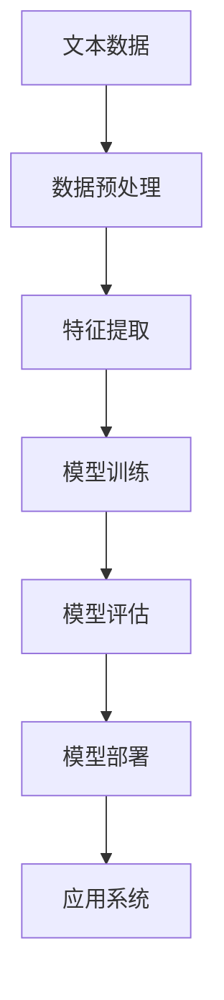

# 自然语言处理(NLP)原理与代码实战案例讲解

## 1.背景介绍

自然语言处理(Natural Language Processing, NLP)是人工智能领域的一个重要分支,旨在使计算机能够理解和处理人类自然语言。随着大数据时代的到来,海量的自然语言数据迅速积累,对自然语言的分析和理解需求也与日俱增。NLP技术已广泛应用于机器翻译、智能问答、信息检索、情感分析等诸多领域。

### 1.1 NLP的发展历程

NLP的发展可以追溯到20世纪50年代,当时的研究主要集中在语法规则和语义分析上。20世纪80年代,统计自然语言处理方法开始兴起,标志着NLP进入了一个新的发展阶段。进入21世纪后,随着深度学习技术的兴起,NLP取得了长足的进步,各种基于神经网络的NLP模型层出不穷。

### 1.2 NLP的挑战

尽管NLP技术取得了长足进步,但仍面临诸多挑战:

- 语言的复杂性和多样性
- 语义的模糊性和多义性
- 语境和背景知识的缺乏
- 数据质量和数据标注的问题
- 算法性能和计算资源的限制

## 2.核心概念与联系

### 2.1 NLP的主要任务

NLP包含多种不同的任务,主要可分为以下几类:

1. **文本分类**:将文本数据分配到预定义的类别或标签中,如情感分析、新闻分类等。
2. **序列标注**:对文本序列中的每个元素进行标注,如命名实体识别、词性标注等。
3. **机器翻译**:将一种自然语言转换为另一种自然语言。
4. **文本生成**:根据给定的输入自动生成自然语言文本,如文本摘要、对话系统等。
5. **信息抽取**:从非结构化文本中提取出结构化的信息,如关系抽取、事件抽取等。
6. **问答系统**:根据问题从知识库中检索相关答案。

### 2.2 NLP的核心技术

NLP涉及多种核心技术,包括但不限于:

1. **词向量表示**:将文本转换为向量形式,以便机器学习模型处理,如Word2Vec、GloVe等。
2. **语言模型**:捕捉语言的统计规律,如N-gram语言模型、神经网络语言模型等。
3. **注意力机制**:在序列数据处理中,对不同位置的信息赋予不同的权重。
4. **transformer**:基于注意力机制的序列到序列模型,广泛应用于机器翻译、文本生成等任务。
5. **预训练模型**:在大规模语料库上预先训练得到的通用语言表示模型,如BERT、GPT等。
6. **迁移学习**:将预训练模型中学习到的知识迁移到下游任务中,提高模型性能。

### 2.3 NLP系统架构

一个典型的NLP系统通常包括以下几个主要模块:

其中:

1. **数据预处理**:对原始文本数据进行清洗、分词、标注等预处理操作。
2. **特征提取**:将文本数据转换为机器学习模型可以处理的特征表示,如词向量、n-gram等。
3. **模型训练**:使用标注数据训练NLP模型,如文本分类、序列标注等任务的模型。
4. **模型评估**:在测试集上评估模型的性能,如准确率、召回率等指标。
5. **模型部署**:将训练好的模型部署到生产环境中,为应用系统提供服务。

## 3.核心算法原理具体操作步骤

### 3.1 词向量表示

词向量表示是NLP中一种常用的技术,将词语映射到一个连续的向量空间中,使得语义相似的词语在向量空间中彼此靠近。常用的词向量表示方法包括Word2Vec和GloVe等。

#### 3.1.1 Word2Vec

Word2Vec是一种基于神经网络的词向量表示方法,包括两种模型:连续词袋模型(CBOW)和Skip-Gram模型。

**CBOW模型**的基本思想是根据上下文词语来预测当前词语。给定上下文词语$w_{t-2}$、$w_{t-1}$、$w_{t+1}$、$w_{t+2}$,模型的目标是最大化预测中心词$w_t$的条件概率:

$$P(w_t|w_{t-2},w_{t-1},w_{t+1},w_{t+2})=\frac{e^{v_{w_t}^{\top}v_c}}{\sum_{w=1}^{V}e^{v_w^{\top}v_c}}$$

其中$V$是词汇表的大小,$v_w$和$v_c$分别表示词$w$和上下文$c$的向量表示。

**Skip-Gram模型**的思路则相反,是根据中心词来预测上下文词语。给定中心词$w_t$,模型的目标是最大化预测上下文词语$w_{t-2}$、$w_{t-1}$、$w_{t+1}$、$w_{t+2}$的条件概率:

$$P(w_{t-2},w_{t-1},w_{t+1},w_{t+2}|w_t)=\prod_{j\in\{-2,-1,1,2\}}P(w_{t+j}|w_t)$$

#### 3.1.2 GloVe

GloVe(Global Vectors for Word Representation)是另一种基于共现矩阵的词向量表示方法。它的基本思想是,如果两个词在语料库中经常同时出现,那么它们的词向量就应该彼此靠近。

GloVe模型将词向量表示为以下最小化目标函数:

$$J=\sum_{i,j=1}^{V}f(X_{ij})(w_i^{\top}\tilde{w}_j+b_i+\tilde{b}_j-\log X_{ij})^2$$

其中$X_{ij}$表示词$i$和词$j$在语料库中的共现次数,$w_i$和$\tilde{w}_j$分别表示词$i$和词$j$的词向量,$b_i$和$\tilde{b}_j$是对应的偏置项,而$f(X_{ij})$是一个权重函数,用于减小常见词对的影响。

通过优化上述目标函数,可以得到每个词的向量表示。

### 3.2 语言模型

语言模型是NLP中一种重要的技术,旨在捕捉语言的统计规律。常用的语言模型包括N-gram语言模型和神经网络语言模型等。

#### 3.2.1 N-gram语言模型

N-gram语言模型是一种基于统计的语言模型,它根据前面$n-1$个词来预测下一个词的概率。形式化地,给定词序列$w_1,w_2,\dots,w_T$,N-gram语言模型的目标是最大化该序列的概率:

$$P(w_1,w_2,\dots,w_T)=\prod_{t=1}^{T}P(w_t|w_{t-n+1},\dots,w_{t-1})$$

其中$n$是N-gram的大小。通常使用最大似然估计来估计N-gram概率:

$$P(w_t|w_{t-n+1},\dots,w_{t-1})=\frac{C(w_{t-n+1},\dots,w_t)}{\sum_{w}C(w_{t-n+1},\dots,w_{t-1},w)}$$

其中$C(\cdot)$表示在语料库中的计数。

#### 3.2.2 神经网络语言模型

神经网络语言模型利用神经网络来建模语言的概率分布。一种常见的神经网络语言模型是基于循环神经网络(RNN)的语言模型。

给定词序列$w_1,w_2,\dots,w_T$,RNN语言模型将每个词$w_t$映射为一个词向量$x_t$,然后计算隐藏状态$h_t$:

$$h_t=\phi(W_hx_t+U_hh_{t-1}+b_h)$$

其中$\phi$是非线性激活函数,如tanh或ReLU,$W_h$、$U_h$和$b_h$是模型参数。

基于隐藏状态$h_t$,模型预测下一个词$w_{t+1}$的概率分布:

$$P(w_{t+1}|w_1,\dots,w_t)=\text{softmax}(W_yh_t+b_y)$$

其中$W_y$和$b_y$是输出层的参数。

通过最大化训练语料库上的对数似然,可以学习到RNN语言模型的参数。

### 3.3 注意力机制

注意力机制是NLP中一种广泛使用的技术,它允许模型在处理序列数据时,对不同位置的信息赋予不同的权重。

#### 3.3.1 加性注意力

加性注意力是一种常见的注意力机制,它将查询向量$q$和一系列键向量$\{k_1,k_2,\dots,k_n\}$作为输入,计算每个键向量与查询向量的相关性分数:

$$e_i=v^{\top}\tanh(W_kk_i+W_qq)$$

其中$W_k$、$W_q$和$v$是可学习的参数。

然后,通过softmax函数将相关性分数归一化为注意力权重:

$$\alpha_i=\frac{e^{e_i}}{\sum_{j=1}^{n}e^{e_j}}$$

最后,使用注意力权重对值向量$\{v_1,v_2,\dots,v_n\}$进行加权求和,得到注意力输出:

$$\text{attn}(q,k,v)=\sum_{i=1}^{n}\alpha_iv_i$$

#### 3.3.2 多头注意力

多头注意力是一种并行计算多个注意力的方式,它可以从不同的表示子空间捕获不同的相关模式。

具体地,给定查询$Q$、键$K$和值$V$,多头注意力首先通过线性变换将它们投影到不同的子空间:

$$\begin{aligned}
Q_i&=QW_i^Q\\
K_i&=KW_i^K\\
V_i&=VW_i^V
\end{aligned}$$

其中$W_i^Q$、$W_i^K$和$W_i^V$是可学习的投影矩阵,下标$i$表示第$i$个注意力头。

然后,对于每个注意力头,计算加性注意力:

$$\text{head}_i=\text{attn}(Q_i,K_i,V_i)$$

最后,将所有注意力头的输出进行拼接,并通过另一个线性变换得到多头注意力的输出:

$$\text{MultiHead}(Q,K,V)=\text{Concat}(\text{head}_1,\dots,\text{head}_h)W^O$$

其中$W^O$是可学习的线性变换矩阵。

多头注意力机制赋予了模型从不同表示子空间关注不同的位置,提高了模型的表达能力。

### 3.4 Transformer

Transformer是一种基于注意力机制的序列到序列模型,广泛应用于机器翻译、文本生成等任务。它完全基于注意力机制,不使用循环神经网络或卷积神经网络,从而更易于并行计算。

#### 3.4.1 Transformer编码器

Transformer编码器由多个相同的层组成,每一层包括两个子层:多头自注意力层和前馈神经网络层。

**多头自注意力层**的输入是一个序列$X=(x_1,x_2,\dots,x_n)$,通过多头注意力机制,每个位置$i$的输出向量$y_i$是所有位置的加权和:

$$y_i=\text{MultiHead}(Q_i,K,V)$$

其中查询$Q_i$是$x_i$的线性变换,而键$K$和值$V$分别是整个输入序列$X$的线性变换。

**前馈神经网络层**对每个位置的向量进行独立的位置wise前馈神经网络变换:

$$\text{FFN}(x_i)=\max(0,xW_1+b_1)W_2+b_2$$

其中$W_1$、$W_2$、$b_1$和$b_2$是可学习的参数。

在每个子层之后,还引入了残差连接和层归一化,以提高模型的性能和稳定性。

#### 