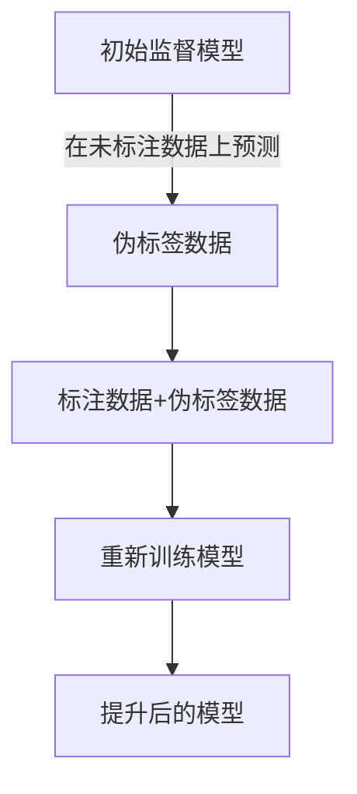
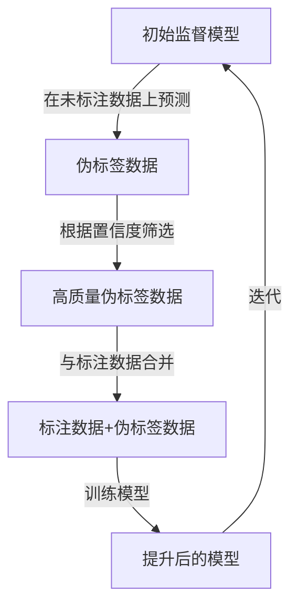

# 自训练：让模型成为自己的老师

## 1. 背景介绍

### 1.1 人工智能发展历程

人工智能(AI)的发展经历了几个重要阶段。早期的AI系统主要依赖于人工设计的规则和知识库。随后,基于统计学习的机器学习方法开始占据主导地位,利用大量数据训练模型。近年来,深度学习技术的兴起带来了突破性进展,使得AI系统能够自主学习特征表示,在计算机视觉、自然语言处理等领域取得了卓越的成绩。

### 1.2 数据驱动的局限性

然而,传统的机器学习和深度学习方法高度依赖于大量标注数据,这在很多领域存在获取成本高、隐私问题等挑战。此外,模型的泛化能力有限,很难处理分布偏移和长尾问题。因此,如何减少对标注数据的依赖,提高模型的泛化性和鲁棒性,成为当前AI发展的重要课题。

### 1.3 自训练的兴起

自训练(Self-Training)作为一种半监督学习范式,通过利用未标注数据"伪标签",有望突破数据瓶颈,提升模型性能。近年来,自训练方法在自然语言处理、计算机视觉等领域取得了令人瞩目的成果,成为AI发展的一个重要方向。

## 2. 核心概念与联系

### 2.1 自训练的基本思想

自训练的核心思想是利用已有的监督模型在未标注数据上产生伪标签,然后将这些伪标签数据与原始标注数据一同用于模型训练,进一步提升模型性能。这种方法可以充分利用未标注数据中蕴含的知识,扩展模型的学习范围。



### 2.2 自训练与半监督学习

自训练属于半监督学习的一种范式。半监督学习旨在利用未标注数据辅助有限的标注数据进行模型训练,从而提高模型性能。除了自训练,半监督学习还包括协同训练、正则化方法等多种技术路线。

### 2.3 自训练与迁移学习

自训练与迁移学习有一定关联。在自训练中,通常会利用在源域(如ImageNet)上预训练的模型作为初始模型,然后在目标域的未标注数据上进行自训练,实现模型的领域适应。因此,自训练可以看作是一种特殊的迁移学习形式。

### 2.4 自训练与主动学习

自训练和主动学习都旨在减少标注数据的需求,但存在一定区别。主动学习通过智能策略选择最有价值的数据进行人工标注,而自训练则是利用模型自身产生伪标签,无需人工参与。两者可以结合使用,形成更加高效的半监督学习范式。

## 3. 核心算法原理具体操作步骤

自训练算法的基本流程如下:



1. **初始化监督模型**

   通常使用在大规模标注数据集(如ImageNet)上预训练的模型作为初始模型。

2. **生成伪标签**

   将初始模型应用于大量未标注数据,为每个样本生成伪标签及对应的置信度分数。

3. **伪标签筛选**

   根据置信度阈值或其他策略,筛选出高质量的伪标签数据。

4. **训练数据构建**

   将筛选出的伪标签数据与原始标注数据合并,构建新的训练数据集。

5. **模型训练**

   使用新的训练数据集对模型进行训练,得到性能提升的模型。

6. **迭代自训练**

   可以将上一步得到的模型作为新的初始模型,重复上述过程,进行多轮迭代训练。

在实际应用中,上述基本流程还可以根据具体任务和数据特点进行多种改进和扩展,例如引入不确定性估计、样本选择策略、正则化机制等,以提高自训练的效果。

## 4. 数学模型和公式详细讲解举例说明

### 4.1 伪标签生成

给定未标注数据样本 $x$,初始模型 $f_\theta$ 可以为其预测标签 $\hat{y}$ 及对应的置信度分数 $p$:

$$\hat{y}, p = f_\theta(x)$$

其中,对于分类任务, $\hat{y}$ 通常为模型预测的类别标签, $p$ 为该类别的预测概率;对于回归任务, $\hat{y}$ 为模型预测的数值, $p$ 可以通过置信度映射函数(如高斯分布)获得。

### 4.2 伪标签筛选策略

常见的伪标签筛选策略包括:

1. **置信度阈值筛选**

   设置一个置信度阈值 $\tau$,只保留置信度 $p$ 大于 $\tau$ 的伪标签样本:

   $$\mathcal{U}' = \{(x, \hat{y}) | p > \tau, (x, \hat{y}, p) \in \mathcal{U}\}$$

   其中 $\mathcal{U}$ 为原始未标注数据集, $\mathcal{U}'$ 为筛选后的伪标签数据集。

2. **前 K% 置信度筛选**

   保留置信度排序后的前 K% 的伪标签样本。

3. **小批量筛选**

   每次从未标注数据集中采样一个小批量,只保留该批次中置信度最高的伪标签样本。

4. **聚类筛选**

   在特征空间中聚类未标注样本,只保留聚类中心及其邻域内的高置信度伪标签样本。

### 4.3 损失函数

在自训练中,通常将标注数据损失和伪标签数据损失相结合,构建总体损失函数:

$$\mathcal{L}(\theta) = \mathcal{L}_l(\theta) + \lambda \mathcal{L}_u(\theta)$$

其中:

- $\mathcal{L}_l(\theta)$ 为标注数据损失,例如交叉熵损失:

  $$\mathcal{L}_l(\theta) = \frac{1}{N_l}\sum_{i=1}^{N_l}\ell(f_\theta(x_i^l), y_i^l)$$

- $\mathcal{L}_u(\theta)$ 为伪标签数据损失,例如:

  $$\mathcal{L}_u(\theta) = \frac{1}{N_u}\sum_{i=1}^{N_u}p_i\ell(f_\theta(x_i^u), \hat{y}_i^u)$$

- $\lambda$ 为平衡两个损失项的超参数。

在实践中,还可以引入不确定性度量、正则化机制等,以提高自训练的鲁棒性。

### 4.4 实例: 图像分类任务

以图像分类任务为例,给定一个包含 $K$ 个类别的标注数据集 $\mathcal{D}_l = \{(x_i^l, y_i^l)\}_{i=1}^{N_l}$ 和一个未标注数据集 $\mathcal{D}_u = \{x_i^u\}_{i=1}^{N_u}$,我们的目标是利用 $\mathcal{D}_u$ 中的未标注数据来提升分类模型的性能。

具体步骤如下:

1. 在 $\mathcal{D}_l$ 上训练一个初始分类模型 $f_\theta$。

2. 对于每个未标注样本 $x_i^u$,利用 $f_\theta$ 预测其类别标签 $\hat{y}_i^u$ 及对应的置信度分数 $p_i^u$:

   $$\hat{y}_i^u, p_i^u = \arg\max_{k=1,...,K} f_\theta(x_i^u)_k$$

3. 根据置信度阈值 $\tau$ 筛选出高质量的伪标签数据集 $\mathcal{D}_u' = \{(x_i^u, \hat{y}_i^u) | p_i^u > \tau\}$。

4. 将 $\mathcal{D}_l$ 和 $\mathcal{D}_u'$ 合并为新的训练数据集 $\mathcal{D}' = \mathcal{D}_l \cup \mathcal{D}_u'$。

5. 在 $\mathcal{D}'$ 上训练分类模型,最小化损失函数:

   $$\mathcal{L}(\theta) = \frac{1}{N_l}\sum_{i=1}^{N_l}\ell(f_\theta(x_i^l), y_i^l) + \lambda\frac{1}{|\mathcal{D}_u'|}\sum_{(x_i^u,\hat{y}_i^u)\in\mathcal{D}_u'}p_i^u\ell(f_\theta(x_i^u), \hat{y}_i^u)$$

   其中 $\ell(\cdot, \cdot)$ 为交叉熵损失函数。

6. 重复步骤2-5,进行多轮迭代训练,直至模型收敛或达到预期性能。

通过上述自训练过程,模型可以充分利用未标注数据中蕴含的知识,从而获得更好的泛化性能。

## 5. 项目实践: 代码实例和详细解释说明

以下是一个使用PyTorch实现的自训练示例代码,用于图像分类任务。为了简洁,我们省略了数据加载、模型定义等辅助代码,仅展示自训练的核心部分。

```python
import torch
import torch.nn as nn
import torch.optim as optim

# 标注数据集和未标注数据集
labeled_dataset = ...
unlabeled_dataset = ...

# 初始化模型和优化器
model = ...
optimizer = optim.SGD(model.parameters(), lr=0.01, momentum=0.9)
criterion = nn.CrossEntropyLoss()

# 自训练超参数
conf_thresh = 0.7  # 置信度阈值
lambda_u = 1.0  # 伪标签损失系数
max_iter = 10  # 最大迭代次数

# 自训练循环
for iter in range(max_iter):
    # 在未标注数据上生成伪标签
    model.eval()
    pseudo_labels = []
    confidences = []
    with torch.no_grad():
        for inputs, _ in unlabeled_dataset:
            inputs = inputs.cuda()
            outputs = model(inputs)
            _, preds = torch.max(outputs, 1)
            confs, _ = torch.max(outputs, 1)
            pseudo_labels.extend(preds.cpu().numpy())
            confidences.extend(confs.cpu().numpy())

    # 筛选高置信度伪标签
    mask = np.array(confidences) >= conf_thresh
    pseudo_labels = np.array(pseudo_labels)[mask]
    inputs_u = unlabeled_dataset.dataset.imgs[mask]

    # 构建训练数据集
    inputs_l, targets_l = next(iter(labeled_dataset))
    inputs_l, targets_l = inputs_l.cuda(), targets_l.cuda()
    inputs_u = torch.stack([torch.from_numpy(np.transpose(img, (2, 0, 1))) for img in inputs_u]).cuda()
    targets_u = torch.from_numpy(pseudo_labels).cuda()

    # 训练模型
    model.train()
    outputs_l = model(inputs_l)
    outputs_u = model(inputs_u)
    loss_l = criterion(outputs_l, targets_l)
    loss_u = lambda_u * criterion(outputs_u, targets_u)
    loss = loss_l + loss_u
    optimizer.zero_grad()
    loss.backward()
    optimizer.step()

    # 打印损失和准确率
    acc_l = ...
    acc_u = ...
    print(f'Iter {iter+1}/{max_iter}, Loss: {loss.item():.4f}, Labeled Acc: {acc_l:.4f}, Unlabeled Acc: {acc_u:.4f}')
```

上述代码的核心步骤如下:

1. 初始化模型、优化器和自训练超参数。

2. 对于每轮迭代:
   - 在未标注数据集上生成伪标签及对应的置信度分数。
   - 根据置信度阈值筛选出高质量的伪标签样本。
   - 从标注数据集和伪标签数据集中采样出训练批次。
   - 计算标注数据损失和伪标签数据损