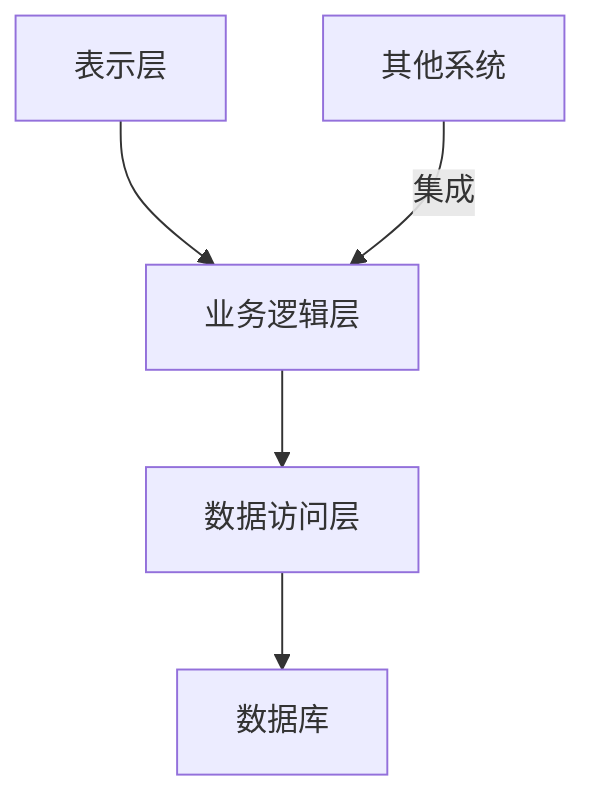

# 药品公司进销存管理系统详细设计与具体代码实现

## 1. 背景介绍

在当今快节奏的商业环境中，药品公司面临着严格的法规要求和复杂的供应链管理挑战。为了确保药品的安全性、有效性和可追溯性,建立一个高效、可靠的进销存管理系统至关重要。本文将探讨如何设计和实现一个全面的药品公司进销存管理系统,涵盖从需求分析到系统架构、核心算法、数据建模、代码实现等各个方面。

## 2. 核心概念与联系

### 2.1 进销存管理

进销存管理是指对原材料、在产品和产成品的采购、生产、销售和库存等环节进行有效管理和控制。在药品公司中,进销存管理系统需要满足以下核心需求:

- 采购管理:跟踪原材料采购订单、供应商信息等。
- 生产管理:计划和控制药品生产流程,确保质量合规。
- 库存管理:实时监控库存水平,优化库存量。
- 销售管理:处理销售订单、发货和收款等。
- 质量控制:确保药品质量符合法规要求,追溯整个供应链。

### 2.2 系统架构

进销存管理系统通常采用分层架构,包括表示层(UI)、业务逻辑层和数据访问层。每一层都有明确的职责分工,促进代码的可维护性和可扩展性。此外,系统还需要与其他系统(如ERP、CRM等)进行集成,实现数据共享和业务协同。



## 3. 核心算法原理具体操作步骤

### 3.1 需求分析

在设计进销存管理系统之前,我们需要全面分析药品公司的业务需求。这通常包括与各部门的利益相关者进行访谈,了解他们的工作流程、痛点和期望。需求分析的结果将形成系统的功能规格说明书,作为后续设计和开发的指导。

### 3.2 数据建模

根据需求分析的结果,我们需要设计一个合理的数据模型,用于存储和管理系统所需的各种数据。常见的数据实体包括:

- 产品(药品)信息:编号、名称、规格、批号等。
- 供应商信息:名称、联系方式、合同等。
- 采购订单:订单号、采购日期、供应商、产品明细等。
- 生产批次:批次号、生产日期、产品、数量等。
- 销售订单:订单号、客户、产品明细、发货信息等。
- 库存记录:产品、批次、数量、位置等。

这些实体之间存在着复杂的关系,需要通过数据建模来准确捕获和表示。常用的数据建模工具包括 ER 图和 UML 类图。

### 3.3 算法设计

进销存管理系统中涉及多种算法,用于解决不同的业务问题。以下是一些常见的算法:

1. **库存优化算法**:根据历史销售数据、产品生命周期等因素,预测未来需求,优化库存水平。常用算法包括时间序列分析、回归分析等。

2. **订单分配算法**:当库存不足时,需要合理分配有限的库存,满足尽可能多的订单。可以使用贪心算法或动态规划算法来解决此问题。

3. **生产计划算法**:根据销售预测和现有库存,制定合理的生产计划,平衡产能利用率和库存成本。常用算法包括线性规划、约束规划等。

4. **供应商选择算法**:根据多个标准(如价格、质量、交货期等)评估并选择最优供应商。可以使用多标准决策算法,如析层次过程法(AHP)。

这些算法的具体实现取决于具体的业务需求和约束条件。在实际开发中,我们还需要考虑算法的性能、可扩展性和容错性等因素。

## 4. 数学模型和公式详细讲解举例说明

在进销存管理系统中,我们经常需要建立数学模型来描述和优化各种业务过程。以下是一些常见的数学模型和公式:

### 4.1 经济订货量(EOQ)模型

经济订货量模型是一种帮助确定最优订货量的经典模型,旨在平衡订货成本和库存持有成本。EOQ 公式如下:

$$EOQ = \sqrt{\frac{2DC_o}{C_h}}$$

其中:
- $D$ 为年度需求量
- $C_o$ 为每次订货的固定成本
- $C_h$ 为每单位产品的年库存持有成本

通过计算 EOQ,我们可以确定每次订货的最优数量,从而最小化总成本。

### 4.2 安全库存量模型

由于需求的不确定性和供应延迟,我们需要保持一定的安全库存量,以避免库存中断。安全库存量公式如下:

$$SS = Z \times \sigma_L \times \sqrt{L}$$

其中:
- $Z$ 为服务水平对应的标准正态分布值
- $\sigma_L$ 为lead time需求的标准差
- $L$ 为lead time(供应延迟时间)

通过设置合适的服务水平(如95%或99%)和估计需求变化,我们可以计算出所需的安全库存量。

### 4.3 产品生命周期模型

产品生命周期模型描述了产品需求随时间的变化模式,通常包括四个阶段:引入期、增长期、成熟期和衰退期。我们可以使用诸如Bass扩散模型等数学模型来拟合和预测产品需求,从而指导生产计划和库存管理。

Bass扩散模型公式如下:

$$N(t) = \frac{m}{1 + ae^{-b(t-c)}}$$

其中:
- $N(t)$ 为累计采纳者数量
- $m$ 为潜在市场总量
- $a$、$b$ 为innovative和imitative采纳系数
- $c$ 为产品引入时间

通过对历史销售数据进行拟合,我们可以估计模型参数,并预测未来的需求趋势。

以上仅是进销存管理系统中数学模型和公式的一小部分示例。在实际应用中,我们还需要根据具体情况选择合适的模型,并进行必要的调整和扩展。

## 5. 项目实践:代码实例和详细解释说明

在本节中,我们将提供一些核心功能模块的代码实例,并对其进行详细解释。为了便于说明,我们假设使用 Java 作为编程语言,并采用 Spring Boot 框架进行开发。

### 5.1 产品管理模块

产品管理模块负责维护药品信息,包括新增、修改、查询等操作。以下是一个简化的 `ProductController` 和 `ProductService` 示例:

```java
// ProductController.java
@RestController
@RequestMapping("/products")
public class ProductController {
    
    @Autowired
    private ProductService productService;

    @PostMapping
    public ResponseEntity<Product> createProduct(@RequestBody ProductDto productDto) {
        Product product = productService.createProduct(productDto);
        return ResponseEntity.ok(product);
    }

    // 其他 CRUD 操作...
}

// ProductService.java
@Service
public class ProductService {

    @Autowired
    private ProductRepository productRepository;

    public Product createProduct(ProductDto productDto) {
        Product product = new Product();
        product.setName(productDto.getName());
        product.setDescription(productDto.getDescription());
        // 设置其他属性...
        return productRepository.save(product);
    }

    // 其他 CRUD 操作...
}
```

在上述示例中,`ProductController` 负责处理 HTTP 请求,并将请求委托给 `ProductService`。`ProductService` 则负责实际的业务逻辑,如创建新产品、更新产品信息等。

为了简化代码,我们省略了一些细节,如输入验证、异常处理等。在实际开发中,这些方面都需要被妥善处理。

### 5.2 采购订单管理模块

采购订单管理模块负责处理原材料采购相关的流程,包括创建采购订单、跟踪订单状态等。以下是一个简化的 `PurchaseOrderController` 和 `PurchaseOrderService` 示例:

```java
// PurchaseOrderController.java
@RestController
@RequestMapping("/purchase-orders")
public class PurchaseOrderController {

    @Autowired
    private PurchaseOrderService purchaseOrderService;

    @PostMapping
    public ResponseEntity<PurchaseOrder> createPurchaseOrder(@RequestBody PurchaseOrderDto purchaseOrderDto) {
        PurchaseOrder purchaseOrder = purchaseOrderService.createPurchaseOrder(purchaseOrderDto);
        return ResponseEntity.ok(purchaseOrder);
    }

    // 其他操作...
}

// PurchaseOrderService.java
@Service
public class PurchaseOrderService {

    @Autowired
    private PurchaseOrderRepository purchaseOrderRepository;

    @Autowired
    private ProductService productService;

    @Autowired
    private SupplierService supplierService;

    public PurchaseOrder createPurchaseOrder(PurchaseOrderDto purchaseOrderDto) {
        PurchaseOrder purchaseOrder = new PurchaseOrder();
        purchaseOrder.setSupplier(supplierService.getSupplierById(purchaseOrderDto.getSupplierId()));
        purchaseOrder.setOrderDate(purchaseOrderDto.getOrderDate());

        List<PurchaseOrderItem> items = new ArrayList<>();
        for (PurchaseOrderItemDto itemDto : purchaseOrderDto.getItems()) {
            PurchaseOrderItem item = new PurchaseOrderItem();
            item.setProduct(productService.getProductById(itemDto.getProductId()));
            item.setQuantity(itemDto.getQuantity());
            items.add(item);
        }
        purchaseOrder.setItems(items);

        return purchaseOrderRepository.save(purchaseOrder);
    }

    // 其他操作...
}
```

在这个示例中,`PurchaseOrderController` 负责处理创建采购订单的 HTTP 请求。`PurchaseOrderService` 则负责实际的业务逻辑,如创建新的采购订单、关联供应商和产品信息等。

需要注意的是,在实际开发中,我们还需要处理各种边界情况和异常,如库存不足、供应商无法供货等情况。此外,我们还需要实现其他功能,如订单状态跟踪、收货确认等。

### 5.3 库存管理模块

库存管理模块负责跟踪和维护药品库存水平,包括入库、出库、库存查询等操作。以下是一个简化的 `InventoryController` 和 `InventoryService` 示例:

```java
// InventoryController.java
@RestController
@RequestMapping("/inventory")
public class InventoryController {

    @Autowired
    private InventoryService inventoryService;

    @PostMapping("/receive")
    public ResponseEntity<InventoryTransaction> receiveProduct(@RequestBody ReceiveProductDto receiveProductDto) {
        InventoryTransaction transaction = inventoryService.receiveProduct(receiveProductDto);
        return ResponseEntity.ok(transaction);
    }

    // 其他操作...
}

// InventoryService.java
@Service
public class InventoryService {

    @Autowired
    private InventoryRepository inventoryRepository;

    @Autowired
    private ProductService productService;

    public InventoryTransaction receiveProduct(ReceiveProductDto receiveProductDto) {
        Product product = productService.getProductById(receiveProductDto.getProductId());
        InventoryTransaction transaction = new InventoryTransaction();
        transaction.setProduct(product);
        transaction.setQuantity(receiveProductDto.getQuantity());
        transaction.setTransactionType(TransactionType.RECEIVE);

        // 更新库存记录
        InventoryRecord record = inventoryRepository.findByProduct(product)
                .orElseGet(() -> new InventoryRecord(product, 0));
        record.setQuantity(record.getQuantity() + receiveProductDto.getQuantity());
        inventoryRepository.save(record);

        return inventoryRepository.save(transaction);
    }

    // 其他操作...
}
```

在这个示例中,`InventoryController` 负责处理收货入库的 HTTP 请求。`InventoryService` 则负责实际的业务逻辑,如更新库存记录、创建库存交易记录等。

需要注意的是,在实际开发中,我们还需要处理各种边界情况和异常,如库存不足、产品信息错误等情况。此外,我们还需要实现其他功能,如库存查询、批次管理、库存调拨等。

## 6. 实际应用场景

进销存管理系统在药品公司的各个环节都有广泛的应用场景,包括但不限于:

1. **采购管理**:通过系统跟踪原材料采购订单,了解供应商交付情况,确保生产所需原料的及时供给。

2. **生产管理**:根据销售预测和现有库存,系统可以自动生成生产计划,指导生产流程,优化产能利