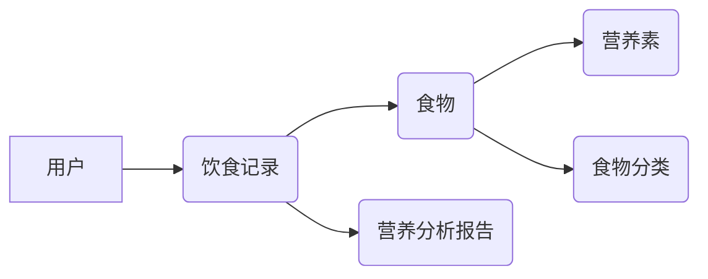

# 营养信息管理系统详细设计与具体代码实现

## 1. 背景介绍

随着人们生活水平的提高和健康意识的增强,合理的饮食和营养摄入受到越来越多的重视。然而,由于现代生活节奏的加快和食品种类的丰富多样,很多人无法准确把握自己的营养摄入情况。为了帮助人们更好地管理饮食,监控营养摄入,我们设计并实现了一个营养信息管理系统。该系统可以记录用户的饮食情况,计算营养素摄入量,并给出合理的饮食建议,从而帮助用户养成健康的饮食习惯,预防营养相关疾病。

### 1.1 营养与健康的重要性

合理的营养是维持人体健康的基础。营养过剩或营养不良都会对身体机能产生不利影响,引发各种疾病。例如,长期摄入过多热量会导致肥胖,增加心血管疾病、糖尿病等慢性病的风险;而营养不良会削弱人体免疫力,影响生长发育。因此,均衡的营养对于维护身体健康至关重要。

### 1.2 饮食记录与分析的必要性

尽管人们意识到了营养的重要性,但在日常生活中,由于缺乏专业知识和工具,很难准确评估自己的营养状况。通过记录饮食情况并进行分析,可以全面了解营养摄入的现状,发现存在的问题,并据此调整饮食结构。营养信息管理系统就是为了满足这一需求而设计的,通过数字化的营养管理帮助人们改善饮食习惯。

### 1.3 营养信息管理系统的目标

营养信息管理系统的主要目标包括:
1. 提供便捷的饮食记录功能,用户可以快速录入食物种类和数量
2. 自动计算食物所含营养成分,评估营养摄入是否均衡
3. 针对用户的营养状况给出饮食建议,引导形成健康的饮食模式  
4. 生成营养分析报告,直观展示一段时间内的营养摄入趋势
5. 提供丰富的营养知识库,帮助用户增强营养健康意识

通过实现上述目标,营养信息管理系统可以成为用户健康饮食的智能助手,为营养健康管理提供数字化解决方案。

## 2. 核心概念与联系

在营养信息管理系统中,涉及到以下几个核心概念:

### 2.1 食物 Food

食物是营养的主要来源,不同食物所含营养成分差异很大。为了进行营养分析,系统需要建立食物数据库,收录常见食物的营养成分信息。每种食物包含名称、类别、可食部、热量、蛋白质、脂肪、碳水化合物、膳食纤维、维生素、矿物质等属性。

### 2.2 营养素 Nutrient 

营养素是人体生长发育和维持正常生理功能所必需的化学物质,包括蛋白质、脂肪、碳水化合物、维生素、矿物质等。每种营养素在人体新陈代谢中发挥不同作用,摄入过多或过少都会影响健康。系统需要参考权威的营养素参考摄入量标准,评估用户的营养摄入是否合理。

### 2.3 食物分类 Food Category

为了方便管理和分析,系统按照一定标准对食物进行分类,常见的分类方法有谷薯类、蔬菜类、水果类、畜肉类、禽肉类、奶类、大豆坚果类等。不同类别食物所含营养成分和推荐摄入量不尽相同。

### 2.4 用户 User

用户是系统的使用主体,通过注册账号使用营养管理功能。系统记录用户的基本信息,包括年龄、性别、身高、体重、日常活动量等,用于计算用户的营养需求量。同时,用户可以设置一些个性化的饮食目标,如减肥、增肌等。

### 2.5 饮食记录 Diet Record 

饮食记录是用户使用系统的日常操作,通过添加当日所食食物的种类和数量,系统自动计算营养摄入量。饮食记录按天进行管理,用户可以查看和修改任意日期的记录。系统根据连续一段时间的饮食记录,分析用户营养状况的变化趋势。

### 2.6 营养分析报告 Nutrition Analysis Report

营养分析报告是系统针对用户一段时间饮食情况生成的综合分析结果,通过图表等形式直观展示各营养素的摄入量及与推荐量的比较。报告还会对存在的营养问题进行提示,并给出改善建议。用户可以定期查看营养报告,了解自己的营养状况是否有所改善。

以上几个核心概念之间的关系如下图所示:



用户通过创建饮食记录,记录所食食物的种类和数量。每种食物都归属于特定的食物分类,并含有多种营养素。系统根据食物的营养成分和用户的饮食记录,生成营养分析报告。通过这些概念的有机结合,营养信息管理系统可以全面分析用户的营养状况,为健康饮食提供参考。

## 3. 核心算法原理与具体操作步骤

营养信息管理系统的核心算法是基于用户的饮食记录,计算各营养素的摄入量,并与推荐摄入量进行比较,评估营养状况。下面详细介绍该算法的原理和实现步骤。

### 3.1 营养素计算原理

1. 每种食物含有多种营养素,如蛋白质、脂肪、碳水化合物等,不同食物的营养素含量差异很大。
2. 用户在饮食记录中添加食物时,需要记录食物的种类和重量(克)。
3. 根据食物的营养成分表,可以计算出每100克食物所含的各营养素的量。
4. 将食物重量乘以每100克食物的营养素含量,即可得到用户摄入的各营养素的绝对值。
5. 将一天内所有食物的营养素摄入量相加,即为一天的总摄入量。

营养素摄入量的计算公式如下:

$每100克食物的营养素含量 = \frac{营养素绝对值}{食物重量} \times 100$

$单份食物营养素摄入量 = \frac{每100克食物的营养素含量}{100} \times 用户摄入食物重量$

$单日营养素总摄入量 = \sum{单份食物营养素摄入量}$

### 3.2 营养素评估原理

1. 参考权威的营养素参考摄入量(RNI)标准,获取各营养素每日推荐摄入量。
2. 计算用户一段时间(如一周)的营养素平均摄入量。
3. 将平均摄入量与推荐摄入量进行比较,得出比例关系。
4. 评估各营养素的摄入是否合理,摄入量过低或过高都视为不合理。
5. 对于摄入不合理的营养素,系统给出相应的饮食建议。

营养素摄入合理度的计算公式如下:

$营养素摄入合理度 = \frac{用户营养素平均摄入量}{推荐摄入量} \times 100\%$

### 3.3 具体操作步骤

基于上述原理,营养素计算和评估的具体步骤如下:

1. 用户在饮食记录中添加当日食物,选择食物种类并输入重量。
2. 系统查询食物营养成分表,计算各营养素的摄入量,并保存到数据库中。
3. 用户可以查看单日的营养素摄入量,了解当日的营养状况。
4. 系统定期(如每周)汇总用户的营养素摄入量,计算平均值。
5. 将平均摄入量与推荐摄入量比较,计算摄入合理度。
6. 生成营养分析报告,对营养状况进行评估,并给出饮食建议。
7. 用户可以查看历史的营养分析报告,了解营养状况的变化趋势。

通过上述步骤,营养信息管理系统可以全面分析用户的营养摄入情况,为改善饮食习惯提供科学依据。

## 4. 数学模型和公式详细讲解举例说明

在营养素计算和评估过程中,涉及到以下几个关键的数学模型和公式,下面通过具体的例子来讲解这些公式的应用。

### 4.1 每100克食物的营养素含量

公式: $每100克食物的营养素含量 = \frac{营养素绝对值}{食物重量} \times 100$

例子: 一份200克的鸡胸肉,含有30克蛋白质。则每100克鸡胸肉的蛋白质含量为:

$每100克鸡胸肉的蛋白质含量 = \frac{30}{200} \times 100 = 15(克)$

### 4.2 单份食物营养素摄入量

公式: $单份食物营养素摄入量 = \frac{每100克食物的营养素含量}{100} \times 用户摄入食物重量$

例子: 用户食用了300克上述鸡胸肉,则这份食物的蛋白质摄入量为:

$单份鸡胸肉的蛋白质摄入量 = \frac{15}{100} \times 300 = 45(克)$

### 4.3 单日营养素总摄入量

公式: $单日营养素总摄入量 = \sum{单份食物营养素摄入量}$

例子: 用户一天内还食用了其他食物,这些食物的蛋白质摄入量分别为: 20克、30克、25克。则这一天的蛋白质总摄入量为:

$单日蛋白质总摄入量 = 45 + 20 + 30 + 25 = 120(克)$

### 4.4 营养素摄入合理度

公式: $营养素摄入合理度 = \frac{用户营养素平均摄入量}{推荐摄入量} \times 100\%$

例子: 成年男性每日蛋白质推荐摄入量为75克,用户连续7天的蛋白质摄入量如下表所示:

| 日期 | 蛋白质摄入量(克) |
|-----|----------------|
| 1   | 120            |
| 2   | 80             |
| 3   | 90             |
| 4   | 100            |
| 5   | 110            |
| 6   | 85             |
| 7   | 95             |

7天的蛋白质平均摄入量为:

$蛋白质平均摄入量 = \frac{120 + 80 + 90 + 100 + 110 + 85 + 95}{7} = 97.14(克)$

则蛋白质摄入合理度为:

$蛋白质摄入合理度 = \frac{97.14}{75} \times 100\% = 129.52\%$

由于该值大于100%,说明用户的蛋白质摄入量略高于推荐量,系统可以给出适当减少蛋白质摄入的建议。

通过上述例子,可以看出这些数学公式在营养计算和分析中的实际应用。系统通过这些公式,可以定量评估用户的营养摄入状况,为科学调整饮食提供依据。

## 5. 项目实践: 代码实例和详细解释说明

下面通过Python代码实例,演示如何实现营养信息管理系统的核心功能。代码主要包括以下几个部分:

### 5.1 食物和营养素数据库

首先需要建立食物和营养素的数据库,用于存储各种食物的营养成分信息。可以使用Python的字典(dict)来表示食物和营养素的属性。示例代码如下:

```python
# 食物数据库
foods = {
    "鸡胸肉": {
        "类别": "禽肉类",
        "蛋白质": 15.0,
        "脂肪": 3.0,
        "碳水化合物": 0,
        "热量": 100
    },
    "牛奶": {
        "类别": "奶类",
        "蛋白质": 3.0,
        "脂肪": 3.5,
        "