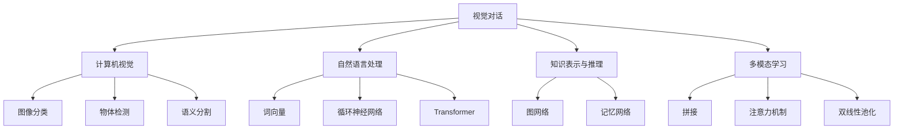

# 视觉对话原理与代码实战案例讲解

## 1.背景介绍
### 1.1 视觉对话的定义与意义
视觉对话(Visual Dialog)是一个新兴的人工智能研究领域,旨在赋予机器通过自然语言与人类就图像内容进行交互对话的能力。与传统的视觉问答(Visual Question Answering)任务不同,视觉对话要求模型能够在多轮对话中理解图像,记忆对话历史,根据当前问题生成恰当的回答。这对于构建更加智能、自然的人机交互系统具有重要意义。

### 1.2 视觉对话的研究现状
视觉对话的研究始于2017年,由Das等人提出。此后,相关研究工作不断涌现,主要集中在对话数据集构建、对话模型设计、评估指标等方面。代表性的工作包括:VisDial数据集、AVSD数据集、Memory Network、Attention机制、GAN等。目前,视觉对话仍是一个富有挑战和潜力的研究课题。

### 1.3 视觉对话的应用前景
视觉对话技术有望应用于智能客服、导购助手、智能教育、医疗诊断等多个领域,提升人机交互体验,拓展人工智能应用边界。同时,视觉对话也是通向通用人工智能的重要一环,对认知科学、自然语言处理、计算机视觉等学科的发展具有促进作用。

## 2.核心概念与联系
### 2.1 计算机视觉
计算机视觉是视觉对话的重要基础,为模型提供图像理解能力。主要涉及图像分类、物体检测、语义分割等任务。视觉对话需要模型具备从图像中提取高层语义信息的能力。

### 2.2 自然语言处理  
自然语言处理是视觉对话的另一大支柱,负责对话历史的编码、当前问题的理解以及回答的生成。涉及词向量、循环神经网络、Transformer等技术。视觉对话对模型提出了多轮语义理解、上下文关联等挑战。

### 2.3 知识表示与推理
视觉对话需要模型具备一定的知识表示与推理能力。模型需要将图像内容、对话历史等信息整合为结构化的知识表示,并基于已有知识进行逻辑推理,生成合理的回答。这通常借助于图网络、记忆网络等技术实现。

### 2.4 多模态学习
视觉对话是一个典型的多模态学习问题,需要模型能够处理图像、文本等不同模态的信息,并学习它们之间的内在关联。常见的多模态融合方法包括拼接、注意力机制、双线性池化等。

### 2.5 概念关系图
下面是视觉对话核心概念之间的关系示意图:

## 3.核心算法原理具体操作步骤
视觉对话的核心算法主要包括:
### 3.1 编码器-解码器框架
1. 使用预训练的CNN(如VGG、ResNet)对图像进行特征提取,得到图像特征向量。
2. 使用RNN(如LSTM、GRU)或Transformer对对话历史进行编码,得到对话特征向量。
3. 将图像特征和对话特征拼接或融合,作为解码器的输入。
4. 使用另一个RNN或Transformer作为解码器,生成回答序列。
5. 计算交叉熵损失,并使用反向传播算法优化模型参数。

### 3.2 注意力机制
1. 在编码器-解码器框架的基础上,引入注意力机制。
2. 对于每个解码步骤,计算当前隐藏状态与图像特征、对话特征的注意力权重。
3. 基于注意力权重,对图像特征、对话特征进行加权求和,得到注意力上下文向量。
4. 将注意力上下文向量与当前隐藏状态拼接,作为解码器的输入。
5. 重复步骤2-4,直到生成完整的回答序列。

### 3.3 记忆网络
1. 将对话历史存储在外部记忆模块中,每个对话轮次对应一个记忆槽。
2. 使用键值对的形式表示每个记忆槽,键为问题向量,值为回答向量。
3. 对于当前问题,通过注意力机制从记忆模块中检索与之最相关的记忆槽。
4. 将检索到的记忆槽与当前问题拼接,作为解码器的输入,生成回答。
5. 将当前问题和生成的回答写入新的记忆槽,更新记忆模块。

### 3.4 强化学习
1. 将视觉对话建模为马尔可夫决策过程,模型的动作为生成的词语。
2. 使用策略梯度等强化学习算法优化模型,奖励函数为评估指标(如BLEU、ROUGE)。
3. 在每个对话轮次,模型根据当前状态(图像、对话历史)选择动作(生成词语)。
4. 根据生成的完整回答计算奖励,并使用策略梯度更新模型参数。
5. 不断进行探索和利用,直到模型收敛。

## 4.数学模型和公式详细讲解举例说明
### 4.1 编码器-解码器框架
编码器-解码器框架可以用下面的数学模型表示:
$$
\begin{aligned}
\mathbf{v} &= \text{CNN}(\mathbf{I}) \\
\mathbf{h}_i &= \text{RNN}(\mathbf{h}_{i-1}, \mathbf{q}_i) \\
\mathbf{o}_t &= \text{RNN}(\mathbf{o}_{t-1}, [\mathbf{v}, \mathbf{h}_n]) \\
p(a_t|a_{<t}, \mathbf{I}, \mathbf{H}) &= \text{softmax}(\mathbf{W}_o\mathbf{o}_t)
\end{aligned}
$$
其中,$\mathbf{I}$为输入图像,$\mathbf{v}$为图像特征向量,$\mathbf{H}=\{\mathbf{q}_1,\mathbf{q}_2,...,\mathbf{q}_n\}$为对话历史,$\mathbf{h}_i$为第$i$轮对话的特征向量,$\mathbf{o}_t$为$t$时刻解码器的隐藏状态,$a_t$为$t$时刻生成的词语,$\mathbf{W}_o$为输出层参数矩阵。

例如,假设输入图像$\mathbf{I}$为一张狗的图片,对话历史$\mathbf{H}$为:
- Human: What is in the image?
- Assistant: The image shows a dog.
- Human: What breed is the dog?

则模型的编码过程可以表示为:
$$
\begin{aligned}
\mathbf{v} &= \text{CNN}(\mathbf{I}) \\
\mathbf{h}_1 &= \text{RNN}(\mathbf{0}, \mathbf{q}_1) \\
\mathbf{h}_2 &= \text{RNN}(\mathbf{h}_1, \mathbf{q}_2) \\
\mathbf{h}_3 &= \text{RNN}(\mathbf{h}_2, \mathbf{q}_3)
\end{aligned}
$$
其中,$\mathbf{q}_1$、$\mathbf{q}_2$、$\mathbf{q}_3$分别对应三个问题的词向量序列。解码过程可以表示为:
$$
\begin{aligned}
\mathbf{o}_1 &= \text{RNN}(\mathbf{0}, [\mathbf{v}, \mathbf{h}_3]) \\
p(a_1|\mathbf{I}, \mathbf{H}) &= \text{softmax}(\mathbf{W}_o\mathbf{o}_1) \\
\mathbf{o}_2 &= \text{RNN}(\mathbf{o}_1, [\mathbf{v}, \mathbf{h}_3]) \\
p(a_2|a_1, \mathbf{I}, \mathbf{H}) &= \text{softmax}(\mathbf{W}_o\mathbf{o}_2) \\
&... \\
\mathbf{o}_T &= \text{RNN}(\mathbf{o}_{T-1}, [\mathbf{v}, \mathbf{h}_3]) \\ 
p(a_T|a_{<T}, \mathbf{I}, \mathbf{H}) &= \text{softmax}(\mathbf{W}_o\mathbf{o}_T)
\end{aligned}
$$
最终生成的回答可能是"It looks like a Labrador Retriever."。

### 4.2 注意力机制
注意力机制可以用下面的数学模型表示:
$$
\begin{aligned}
e_{ti} &= \mathbf{v}_i^\top \mathbf{W}_a \mathbf{o}_t \\
\alpha_{ti} &= \frac{\exp(e_{ti})}{\sum_{j=1}^N \exp(e_{tj})} \\
\mathbf{c}_t &= \sum_{i=1}^N \alpha_{ti} \mathbf{v}_i \\
\mathbf{o}_t &= \text{RNN}(\mathbf{o}_{t-1}, [\mathbf{c}_t, \mathbf{q}_t])
\end{aligned}
$$
其中,$\mathbf{v}_i$为图像第$i$个区域的特征向量,$\mathbf{o}_t$为$t$时刻解码器的隐藏状态,$\mathbf{W}_a$为注意力参数矩阵,$e_{ti}$为$t$时刻对第$i$个区域的注意力得分,$\alpha_{ti}$为归一化后的注意力权重,$\mathbf{c}_t$为$t$时刻的注意力上下文向量。

例如,对于上述狗图片的问题"What breed is the dog?",模型可能会关注图像中狗的特征区域,计算注意力权重:
$$
\begin{aligned}
e_{t1} &= \mathbf{v}_1^\top \mathbf{W}_a \mathbf{o}_t \\
e_{t2} &= \mathbf{v}_2^\top \mathbf{W}_a \mathbf{o}_t \\
&... \\
e_{tN} &= \mathbf{v}_N^\top \mathbf{W}_a \mathbf{o}_t \\
\alpha_{ti} &= \frac{\exp(e_{ti})}{\sum_{j=1}^N \exp(e_{tj})}
\end{aligned}
$$
然后基于注意力权重计算上下文向量:
$$
\mathbf{c}_t = \sum_{i=1}^N \alpha_{ti} \mathbf{v}_i
$$
最后将上下文向量$\mathbf{c}_t$与当前问题$\mathbf{q}_t$拼接,作为RNN的输入,生成回答词语。

### 4.3 记忆网络
记忆网络可以用下面的数学模型表示:
$$
\begin{aligned}
\mathbf{k}_i &= \mathbf{W}_k \mathbf{q}_i \\
\mathbf{v}_i &= \mathbf{W}_v \mathbf{a}_i \\
\mathbf{q} &= \mathbf{W}_q \mathbf{q}_t \\
p_i &= \text{softmax}(\mathbf{k}_i^\top \mathbf{q}) \\
\mathbf{o} &= \sum_i p_i \mathbf{v}_i \\
\mathbf{a}_t &= \text{RNN}(\mathbf{q}_t, \mathbf{o})
\end{aligned}
$$
其中,$\mathbf{k}_i$和$\mathbf{v}_i$分别为第$i$个记忆槽的键和值,$\mathbf{q}_i$和$\mathbf{a}_i$为第$i$轮对话的问题和回答,$\mathbf{W}_k$、$\mathbf{W}_v$、$\mathbf{W}_q$为参数矩阵,$\mathbf{q}_t$为当前问题,$p_i$为当前问题与第$i$个记忆槽的相关性,$\mathbf{o}$为从记忆中检索出的信息,$\mathbf{a}_t$为$t$时刻生成的回答。

例如,对于上述狗图片的对话,前两轮对话可以表示为两个记忆槽:
$$
\begin{aligned}
\mathbf{k}_1 &= \mathbf