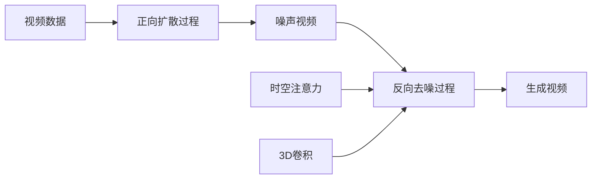

# 视频扩散Video Diffusion原理与代码实例讲解

## 1. 背景介绍

### 1.1 视频扩散的兴起

近年来,随着深度学习技术的飞速发展,视频生成和编辑领域取得了突破性的进展。其中,视频扩散(Video Diffusion)作为一种新兴的视频生成方法,以其高质量、高分辨率、连贯自然的视频生成效果,受到了学术界和工业界的广泛关注。

### 1.2 视频扩散的应用前景

视频扩散技术有着广阔的应用前景,可以应用于电影特效、游戏场景生成、虚拟现实等诸多领域。它能够根据输入的文本描述或参考视频,自动生成逼真的视频画面,大大降低了视频制作的成本和难度。同时,视频扩散还可以用于视频修复、视频插值、视频风格迁移等任务,为视频编辑提供了更加智能高效的工具。

### 1.3 视频扩散的技术挑战

尽管视频扩散取得了可喜的进展,但仍面临着诸多技术挑战:

1. 时间一致性:如何确保生成的视频在时间维度上的连贯性和平滑性,避免出现画面抖动、物体突变等问题。

2. 高分辨率:生成高分辨率(如1024x1024)的视频需要巨大的计算资源和显存,对模型性能和效率提出了更高的要求。 

3. 控制性:如何通过文本或其他条件信息来精细控制生成视频的内容、风格、动作等属性,实现可控的视频生成。

4. 多样性:如何在保证视频质量的同时,生成多样化的视频,避免模式崩溃和过拟合等问题。

## 2. 核心概念与联系

### 2.1 扩散模型

扩散模型(Diffusion Model)是视频扩散的核心,它借鉴了非平衡热力学中的扩散过程,通过迭代的正向扩散和反向去噪过程来生成数据。扩散模型由正向扩散过程和反向去噪过程两部分组成。

#### 2.1.1 正向扩散过程

正向扩散过程将原始数据$x_0$通过加入高斯噪声的方式逐步扩散,得到一系列的噪声数据$x_1,x_2,...,x_T$。这个过程可以表示为:

$$q(x_t|x_{t-1}) = \mathcal{N}(x_t; \sqrt{1-\beta_t} x_{t-1}, \beta_t \mathbf{I})$$

其中$\beta_t$是噪声强度的控制参数。

#### 2.1.2 反向去噪过程

反向去噪过程则从纯高斯噪声$x_T$出发,通过迭代的去噪操作,逐步还原出原始数据$\hat{x}_0$。每一步去噪过程可以表示为:

$$p_\theta(x_{t-1}|x_t) = \mathcal{N}(x_{t-1}; \mu_\theta(x_t, t), \Sigma_\theta(x_t, t))$$

其中$\mu_\theta$和$\Sigma_\theta$是由神经网络参数化的均值和方差。去噪网络的目标是估计噪声残差,从而去除噪声得到原始数据。

### 2.2 时空注意力

视频是时间和空间维度的结合,如何建模视频帧之间的时间依赖和帧内的空间依赖是视频扩散的关键。视频扩散模型通常采用时空注意力机制来实现时空建模:

1. 时间注意力:通过自注意力机制建模视频帧之间的长短期依赖,捕捉视频的时间连贯性。

2. 空间注意力:通过卷积或自注意力机制建模帧内的空间依赖,捕捉物体、纹理、运动等空间特征。

时空注意力可以帮助模型更好地理解和生成连贯、高质量的视频。

### 2.3 3D卷积

传统的扩散模型主要应用于图像生成,而将其拓展到视频领域需要考虑时间维度的建模。一种常见的方法是使用3D卷积来同时处理时间和空间维度。

3D卷积在时间维度上增加了卷积核的深度,可以同时提取空间特征和时间特征。给定一个视频片段$\mathbf{X} \in \mathbb{R}^{T \times H \times W \times C}$,3D卷积的操作可以表示为:

$$\mathbf{Y}_{t,i,j,k} = \sum_{t'=0}^{T-1} \sum_{i'=0}^{H-1} \sum_{j'=0}^{W-1} \sum_{k'=0}^{C-1} \mathbf{W}_{t',i',j',k'} \cdot \mathbf{X}_{t+t',i+i',j+j',k'}$$

其中$\mathbf{W}$是3D卷积核,$T$是时间维度的长度。3D卷积能够有效地捕捉视频的时空特征,是视频扩散模型的重要组件。

### 2.4 概念之间的联系

下图展示了视频扩散模型中几个核心概念之间的联系:

视频数据经过正向扩散过程得到噪声视频,然后通过反向去噪过程生成新的视频。去噪过程中,时空注意力机制建模视频的时间和空间依赖,3D卷积提取时空特征。这些组件相互配合,最终实现了高质量的视频生成。

## 3. 核心算法原理具体操作步骤

视频扩散的核心算法可以分为以下几个步骤:

### 3.1 数据预处理

1. 将视频切分为固定长度的片段,每个片段包含$T$帧图像。
2. 对图像进行归一化、随机裁剪、随机翻转等数据增强操作。
3. 将图像转换为张量格式,形状为$[B, T, C, H, W]$,其中$B$为批次大小。

### 3.2 正向扩散过程

1. 根据扩散步数$T$,计算每一步的噪声强度$\beta_t$。
2. 对于每个视频片段$x_0$,迭代进行正向扩散:
   - 根据$q(x_t|x_{t-1})$,加入高斯噪声得到$x_t$。
   - 记录下每一步的$x_t$和对应的时间步$t$。
3. 得到噪声视频片段$x_T$。

### 3.3 反向去噪过程

1. 从高斯噪声$x_T$开始,迭代进行反向去噪:
   - 将$x_t$和$t$输入去噪网络,估计噪声残差$\epsilon_\theta(x_t, t)$。
   - 根据估计的噪声残差,计算去噪后的$x_{t-1}$。
   - 不断迭代直到得到$\hat{x}_0$。
2. 去噪网络的结构通常包括:
   - 时间注意力模块:建模视频帧之间的依赖。
   - 空间注意力模块:建模帧内的空间依赖。
   - 3D卷积模块:提取时空特征。
   - 残差块:加速网络训练和收敛。
3. 去噪网络的训练目标是最小化估计噪声残差与真实噪声残差的L2损失:

   $$L = \mathbb{E}_{x_0,\epsilon,t} [\| \epsilon - \epsilon_\theta(\sqrt{\bar{\alpha}_t} x_0 + \sqrt{1-\bar{\alpha}_t} \epsilon, t) \|_2^2]$$

   其中$\alpha_t$是噪声强度的累积乘积,$\bar{\alpha}_t=1-\alpha_t$。

### 3.4 视频生成

1. 随机采样高斯噪声$x_T$。
2. 使用训练好的去噪网络,迭代进行反向去噪,得到生成的视频片段$\hat{x}_0$。
3. 将生成的视频片段拼接起来,得到完整的视频。

## 4. 数学模型和公式详细讲解举例说明

### 4.1 正向扩散过程

正向扩散过程可以看作是一个马尔可夫链,每一步的状态只与前一步有关。给定初始状态$x_0$,正向扩散过程逐步加入高斯噪声,得到一系列的噪声状态$x_1,x_2,...,x_T$。

假设噪声强度参数为$\beta_1,\beta_2,...,\beta_T$,且满足$0 < \beta_t < 1$。则正向扩散过程可以表示为:

$$
\begin{aligned}
q(x_1|x_0) &= \mathcal{N}(x_1; \sqrt{1-\beta_1} x_0, \beta_1 \mathbf{I}) \\
q(x_2|x_1) &= \mathcal{N}(x_2; \sqrt{1-\beta_2} x_1, \beta_2 \mathbf{I}) \\
&\vdots \\
q(x_T|x_{T-1}) &= \mathcal{N}(x_T; \sqrt{1-\beta_T} x_{T-1}, \beta_T \mathbf{I})
\end{aligned}
$$

其中$\mathcal{N}(\cdot; \mu, \sigma^2)$表示均值为$\mu$,方差为$\sigma^2$的高斯分布。

通过递推公式,我们可以得到从$x_0$到$x_t$的转移概率:

$$
q(x_t|x_0) = \mathcal{N}(x_t; \sqrt{\bar{\alpha}_t} x_0, (1-\bar{\alpha}_t) \mathbf{I})
$$

其中$\alpha_t = 1-\beta_t$,$\bar{\alpha}_t = \prod_{s=1}^t \alpha_s$。

例如,假设我们有一个初始视频片段$x_0$,噪声强度参数为$\beta_1=0.1,\beta_2=0.2,\beta_3=0.3$。则正向扩散过程为:

$$
\begin{aligned}
q(x_1|x_0) &= \mathcal{N}(x_1; \sqrt{0.9} x_0, 0.1 \mathbf{I}) \\
q(x_2|x_1) &= \mathcal{N}(x_2; \sqrt{0.8} x_1, 0.2 \mathbf{I}) \\
q(x_3|x_2) &= \mathcal{N}(x_3; \sqrt{0.7} x_2, 0.3 \mathbf{I})
\end{aligned}
$$

最终得到噪声视频片段$x_3$。

### 4.2 反向去噪过程

反向去噪过程从纯高斯噪声$x_T$开始,通过迭代的去噪操作,逐步还原出原始视频片段$\hat{x}_0$。每一步去噪过程可以表示为:

$$
p_\theta(x_{t-1}|x_t) = \mathcal{N}(x_{t-1}; \mu_\theta(x_t, t), \Sigma_\theta(x_t, t))
$$

其中$\mu_\theta$和$\Sigma_\theta$是由神经网络参数化的均值和方差。

去噪网络的目标是估计噪声残差$\epsilon_\theta(x_t, t)$,从而去除噪声得到原始视频片段。根据贝叶斯定理,我们可以得到:

$$
p_\theta(x_{t-1}|x_t) \propto q(x_t|x_{t-1}) p_\theta(x_{t-1})
$$

假设$p_\theta(x_{t-1})$服从标准正态分布$\mathcal{N}(0, \mathbf{I})$,则可以推导出:

$$
\begin{aligned}
\mu_\theta(x_t, t) &= \frac{1}{\sqrt{\alpha_t}} \left( x_t - \frac{\beta_t}{\sqrt{1-\bar{\alpha}_t}} \epsilon_\theta(x_t, t) \right) \\
\Sigma_\theta(x_t, t) &= \frac{1-\bar{\alpha}_{t-1}}{1-\bar{\alpha}_t} \beta_t \mathbf{I}
\end{aligned}
$$

去噪网络通过最小化估计噪声残差与真实噪声残差的L2损失来训练:

$$
L = \mathbb{E}_{x_0,\epsilon,t} [\| \epsilon - \epsilon_\theta(\sqrt{\bar{\alpha}_t} x_0 + \sqrt{