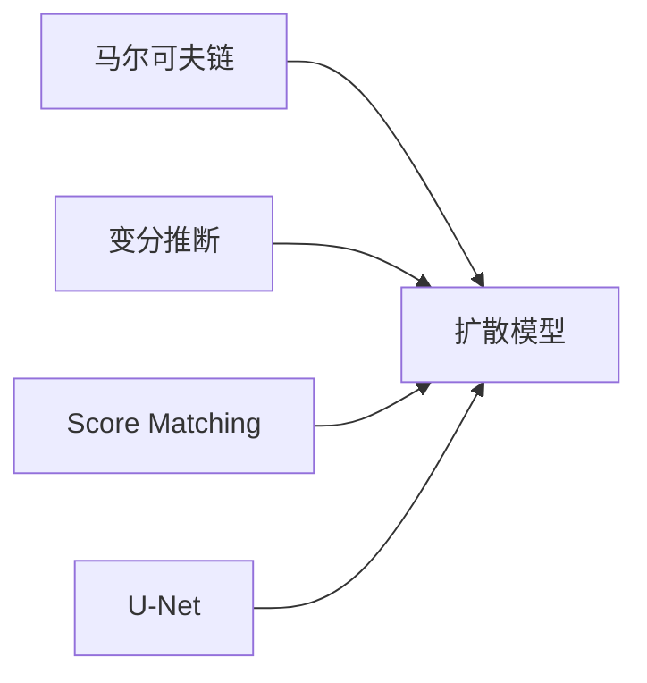

# 视频扩散Video Diffusion原理与代码实例讲解

## 1. 背景介绍  

### 1.1 视频扩散的定义与意义
视频扩散(Video Diffusion)是一种新兴的视频生成技术,它利用扩散模型(Diffusion Model)的思想,通过对视频帧进行逐步去噪,最终生成高质量、连贯自然的视频序列。视频扩散模型具有很大的潜力,可以应用于视频补帧、视频编辑、视频预测等多个领域,为视频内容生产提供了新的思路和方法。

### 1.2 扩散模型的起源与发展
扩散模型最初源于非平衡热力学中的扩散过程,2015年Sohl-Dickstein等人首次将其引入生成模型领域。此后,Ho等人提出DDPM(Denoising Diffusion Probabilistic Models)将其发展成一个完整的生成式框架。扩散模型以其稳定性好、样本多样性强等优点迅速成为图像、音频生成领域的研究热点。最近,扩散模型也开始被应用到视频领域,衍生出视频扩散模型。

### 1.3 视频扩散的研究现状
视频扩散方向的研究尚处于起步阶段,但已经涌现出一批有影响力的工作,如MCVD、DVDGAN、RaMViD等。这些方法从不同角度切入,或利用运动信息引导扩散过程,或将GAN与扩散模型相结合,在视频生成质量和连贯性上取得了可喜的进展。未来,视频扩散技术有望进一步提升,为更多视频应用场景赋能。

## 2. 核心概念与联系

### 2.1 马尔可夫链
马尔可夫链描述了一类离散时间随机过程,其未来状态只与当前状态有关,与过去状态无关。扩散模型本质上是一个马尔可夫链,其中每一步去噪过程只依赖上一时刻的状态。

### 2.2 变分推断
变分推断是一种近似推断方法,通过引入一个易于处理的变分分布来近似真实的后验分布。在扩散模型中,变分推断被用于学习逆向去噪过程的转移概率。

### 2.3 score matching
Score matching是一种估计概率分布的方法,通过最小化模型得分与真实数据得分之间的差异来训练模型。扩散模型的目标函数可以看作一种条件score matching。

### 2.4 U-Net
U-Net是一种U型编解码网络结构,在encoder到decoder之间添加了skip connection,有利于捕捉多尺度特征。U-Net被广泛用作扩散模型的主干网络。

核心概念之间的联系可以用下面的Mermaid图来表示:



## 3. 核心算法原理具体操作步骤

### 3.1 前向扩散过程
1) 给定真实数据 $x_0$,设置扩散步数 $T$
2) for t=1 to T do:
3)    从高斯分布 $\mathcal{N}(0,\beta_t I)$ 采样噪声 $\epsilon_t$
4)    根据 $q(x_t|x_{t-1})=\mathcal{N}(x_t;\sqrt{1-\beta_t} x_{t-1}, \beta_t I)$ 加噪得到 $x_t$
5) end for
6) 最终得到 $x_T$ 作为扩散过程的结果

### 3.2 逆向去噪过程
1) 从标准正态分布 $\mathcal{N}(0,I)$ 采样 $x_T$
2) for t=T downto 1 do:
3)    利用神经网络估计 $p_\theta(x_{t-1}|x_t)=\mathcal{N}(x_{t-1};\mu_\theta(x_t,t),\Sigma_\theta(x_t,t))$
4)    从 $p_\theta(x_{t-1}|x_t)$ 采样得到 $\hat{x}_{t-1}$
5)    $x_{t-1}=\hat{x}_{t-1}$
6) end for
7) 最终得到 $x_0$ 作为生成结果

### 3.3 目标函数
扩散模型的训练目标是最小化变分下界(ELBO):

$$\mathcal{L}_{vlb} = \mathbb{E}_{q(x_{1:T}|x_0)} \Big[\log \frac{q(x_{1:T}|x_0)}{p_\theta(x_{0:T})} \Big]$$

其中 $q(x_{1:T}|x_0)$ 表示前向扩散过程, $p_\theta(x_{0:T})$ 表示逆向去噪过程。

实际优化时,常用一个加权形式的 ELBO:

$$\mathcal{L}_{simple} = \mathbb{E}_{t,x_0,\epsilon} \Big[\| \epsilon - \epsilon_\theta(\sqrt{\bar{\alpha}_t} x_0 + \sqrt{1-\bar{\alpha}_t} \epsilon, t) \|^2 \Big]$$

其中 $\epsilon_\theta$ 是神经网络估计的噪声。

## 4. 数学模型和公式详细讲解举例说明

### 4.1 前向扩散过程的数学形式
前向扩散过程可以表示为一系列的高斯转移:

$$q(x_t|x_{t-1}) = \mathcal{N}(x_t; \sqrt{1-\beta_t} x_{t-1}, \beta_t I)$$

其中 $\beta_t$ 是一个随时间变化的噪声方差调度。

通过递推,我们可以得到任意时刻 $x_t$ 的边缘分布:

$$q(x_t|x_0) = \mathcal{N}(x_t; \sqrt{\bar{\alpha}_t} x_0, (1-\bar{\alpha}_t) I)$$

其中 $\alpha_t = 1-\beta_t$, $\bar{\alpha}_t = \prod_{s=1}^t \alpha_s$。

例如,假设我们设置 $T=1000$,$\beta_1=0.0001$,$\beta_{1000}=0.02$,对 $\beta_t$ 做线性调度,那么在 $t=500$ 时刻有:

$$\begin{aligned}
\beta_{500} &= \beta_1 + \frac{500-1}{1000-1} (\beta_{1000}-\beta_1) \\
            &= 0.0001 + \frac{499}{999} (0.02-0.0001) \\
            &\approx 0.0100005 \\
\bar{\alpha}_{500} &= \prod_{s=1}^{500} (1-\beta_s) \\
                   &\approx 0.0067
\end{aligned}$$

此时 $q(x_{500}|x_0) = \mathcal{N}(x_{500}; \sqrt{0.0067} x_0, 0.9933 I)$,可见噪声已经相当大了。

### 4.2 逆向去噪过程的数学形式
逆向去噪过程的目标是学习从 $x_t$ 恢复 $x_{t-1}$ 的转移概率:

$$p_\theta(x_{t-1}|x_t) = \mathcal{N}(x_{t-1}; \mu_\theta(x_t,t), \Sigma_\theta(x_t,t))$$

其中均值 $\mu_\theta$ 和方差 $\Sigma_\theta$ 由神经网络参数化。

Ho等人证明,最优的均值估计可以表示为:

$$\mu_\theta(x_t,t) = \frac{1}{\sqrt{\alpha_t}} \Big(x_t - \frac{\beta_t}{\sqrt{1-\bar{\alpha}_t}} \epsilon_\theta(x_t,t) \Big)$$

其中 $\epsilon_\theta(x_t,t)$ 是神经网络估计的噪声。

例如,在 $t=500$ 时,给定 $x_{500}$,我们希望得到 $x_{499}$ 的分布:

$$\begin{aligned}
p_\theta(x_{499}|x_{500}) &= \mathcal{N}(x_{499}; \mu_\theta(x_{500},500), \sigma_t^2 I) \\
\mu_\theta(x_{500},500) &= \frac{1}{\sqrt{\alpha_{500}}} \Big(x_{500} - \frac{\beta_{500}}{\sqrt{1-\bar{\alpha}_{500}}} \epsilon_\theta(x_{500},500) \Big) \\
\sigma_{500}^2 &= \tilde{\beta}_{500} = \frac{1-\bar{\alpha}_{499}}{1-\bar{\alpha}_{500}} \beta_{500} \\
               &\approx 0.0001
\end{aligned}$$

可见每一步去噪过程的噪声都比较小,经过多步去噪就可以恢复干净的数据。

## 5. 项目实践：代码实例和详细解释说明

下面我们用PyTorch实现一个简单的视频扩散模型。

```python
import torch
import torch.nn as nn
import torch.nn.functional as F

class VideoDiffusionModel(nn.Module):
    def __init__(self, num_frames, in_channels, out_channels):
        super().__init__()
        self.num_frames = num_frames
        self.in_channels = in_channels
        self.out_channels = out_channels
        
        self.encoder = nn.Sequential(
            nn.Conv3d(in_channels, 64, 3, padding=1),
            nn.ReLU(inplace=True),
            nn.Conv3d(64, 64, 3, padding=1),
            nn.ReLU(inplace=True),
            nn.MaxPool3d(2)
        )
        
        self.decoder = nn.Sequential(
            nn.ConvTranspose3d(64, 64, 2, stride=2),
            nn.ReLU(inplace=True),
            nn.ConvTranspose3d(64, out_channels, 3, padding=1)
        )
        
    def forward(self, x, t):
        # x: (B, num_frames, C, H, W)
        B, F, C, H, W = x.shape
        x = x.permute(0, 2, 1, 3, 4).contiguous() # (B, C, F, H, W)
        
        feat = self.encoder(x)
        feat = feat.view(B, -1) # (B, D)
        
        t_embed = self.time_embedding(t) # (B, D)
        feat = feat + t_embed
        
        feat = feat.view(B, 64, F//2, H//2, W//2)
        x_recon = self.decoder(feat) # (B, C, F, H, W)
        
        x_recon = x_recon.permute(0, 2, 1, 3, 4).contiguous() # (B, F, C, H, W)
        return x_recon
    
    def time_embedding(self, t):
        # t: (B,)
        t = t.unsqueeze(-1) # (B, 1)
        half_dim = self.num_frames * 64 // 2
        emb = torch.arange(half_dim, dtype=torch.float32, device=t.device) / (half_dim - 1)
        emb = torch.exp(-emb * math.log(10000))
        emb = t * emb
        emb = torch.cat([torch.sin(emb), torch.cos(emb)], dim=-1)
        return emb
    
def diffusion_loss(model, x_0, alphas_bar_sqrt, one_minus_alphas_bar_sqrt, t):
    # x_0: (B, F, C, H, W)
    B, F, C, H, W = x_0.shape
    
    noise = torch.randn_like(x_0)
    x_t = alphas_bar_sqrt[t].view(-1, 1, 1, 1, 1) * x_0 + one_minus_alphas_bar_sqrt[t].view(-1, 1, 1, 1, 1) * noise
    
    noise_recon = model(x_t, t)
    loss = F.mse_loss(noise_recon, noise)
    return loss

def train(model, data_loader, optimizer, epochs, device):
    model.train()
    
    alphas_bar_sqrt = torch.sqrt(alphas_bar)
    one_minus_alphas_bar_sqrt = torch.sqrt(1 - alphas_bar)
    
    for epoch in range(epochs):
        for x_0 in data_loader:
            x_0 = x_0.to(device)
            B, F, C, H, W = x_0.shape
            
            t = torch.randint(0, timesteps, (B,), device=device)
            loss = diffusion_loss(model, x_0, alphas_bar_sqrt, one_minus_alphas_bar_sqrt, t)
            
            optimizer.zero_grad()
            loss.backward()
            optimizer.step()
            
        print(f"Epoch {epoch+1}/{epochs}, Loss: {loss.item():.4f}")
        
def generate(model, num_frames, in_channels, out_channels, alphas, device):
    with torch.no_grad():
        x_T = torch.randn(1, num_frames, out_channels, 64, 64).to(device)
        
        for t in reversed(range(timesteps)):
            z = torch.randn_like(x_T) if t > 0 else torch.zeros_like(x_T)
            alpha = alphas[t]
            alpha_bar = alphas_bar[t]
            
            x_t = x_T
            