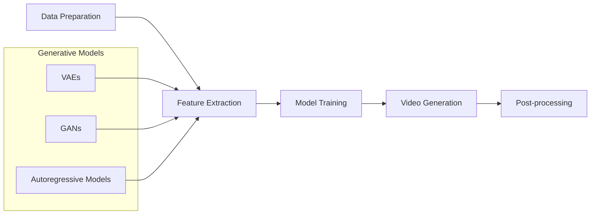

## 1. Background Introduction

In the rapidly evolving field of artificial intelligence (AI), video generation has emerged as a significant area of interest and research. Video generation, also known as video synthesis, is the process of creating realistic and high-quality videos from a given set of data, such as images, text, or audio. This technology has numerous applications, including movie production, video games, virtual reality, and more. In this article, we will delve into the principles and practices of video generation, providing a comprehensive understanding of the subject.

### 1.1 Importance and Applications of Video Generation

Video generation is a crucial technology in the AI field due to its wide range of applications. Some of the key areas where video generation is being used or has the potential to be used include:

- Movie production: Video generation can help in creating realistic special effects, reducing the need for physical sets and stunts, and enabling the creation of scenes that would be difficult or impossible to film in real life.
- Video games: Video generation can be used to create realistic and dynamic environments, characters, and objects in video games, enhancing the player's immersive experience.
- Virtual reality (VR): Video generation can help in creating realistic and high-quality VR experiences, enabling users to interact with virtual environments in a more lifelike manner.
- Surveillance and security: Video generation can be used to create synthetic video footage for surveillance purposes, helping to maintain privacy while still providing useful information.
- Education and training: Video generation can be used to create educational videos, simulations, and training materials, making learning more engaging and effective.

### 1.2 Challenges in Video Generation

Despite its potential, video generation faces several challenges, including:

- Realism: Creating realistic and high-quality videos is a significant challenge, as the generated videos must closely resemble real-world footage.
- Efficiency: Generating high-quality videos requires significant computational resources, making it a computationally intensive task.
- Generalization: Video generation models must be able to generalize well, meaning they should be able to generate videos that are not just based on the training data but can also handle new and unseen scenarios.
- Control: Video generation models should be able to generate videos that adhere to specific requirements, such as a particular style, content, or context.

## 2. Core Concepts and Connections

To understand video generation, it is essential to have a solid grasp of several core concepts, including computer vision, deep learning, and generative models.

### 2.1 Computer Vision

Computer vision is the field of study concerned with enabling computers to interpret and understand visual information from the world. This involves tasks such as object recognition, image segmentation, and motion estimation. In the context of video generation, computer vision techniques are used to analyze and understand the visual content of the videos being generated.

### 2.2 Deep Learning

Deep learning is a subset of machine learning that involves the use of artificial neural networks with multiple layers to learn and make predictions from data. In the context of video generation, deep learning techniques are used to train models to generate videos based on the input data.

### 2.3 Generative Models

Generative models are a type of statistical model that can generate new data samples that resemble the training data. In the context of video generation, generative models are used to create new videos that are similar to the training videos. Some popular generative models used in video generation include variational autoencoders (VAEs), generative adversarial networks (GANs), and autoregressive models.

## 3. Core Algorithm Principles and Specific Operational Steps

The core algorithm principles and specific operational steps involved in video generation can be broken down into several stages:

### 3.1 Data Preparation

The first step in video generation is data preparation. This involves collecting and preprocessing the data that will be used to train the video generation model. The data can be in the form of images, videos, or a combination of both. The data is then split into training, validation, and testing sets.

### 3.2 Feature Extraction

In this step, features are extracted from the input data. These features are used to represent the data in a more compact and meaningful way, making it easier for the model to learn from the data. Common feature extraction techniques include convolutional neural networks (CNNs) and recurrent neural networks (RNNs).

### 3.3 Model Training

The next step is model training, where the video generation model is trained using the extracted features and the labeled data. The model is trained to learn the patterns and relationships in the data, enabling it to generate new videos that are similar to the training data.

### 3.4 Video Generation

Once the model is trained, it can be used to generate new videos. This is done by providing the model with an input, such as a sequence of images or a text description, and allowing the model to generate a corresponding video.

### 3.5 Post-processing

The generated videos may require post-processing to improve their quality or to ensure they meet specific requirements. This can include techniques such as denoising, deblurring, and color correction.

## 4. Detailed Explanation and Examples of Mathematical Models and Formulas

In this section, we will delve into the mathematical models and formulas used in video generation, focusing on three popular models: VAEs, GANs, and autoregressive models.

### 4.1 Variational Autoencoders (VAEs)

VAEs are a type of generative model that learns to generate data by learning the probability distribution of the data. In the context of video generation, VAEs are used to learn the distribution of the frames in a video, enabling the generation of new videos.

The VAE model consists of an encoder and a decoder. The encoder takes the input data and maps it to a lower-dimensional latent space, while the decoder maps the latent space back to the original data space. The training process involves minimizing the reconstruction loss, which measures the difference between the original data and the reconstructed data, and the KL divergence, which measures the difference between the learned latent space distribution and a prior distribution.

### 4.2 Generative Adversarial Networks (GANs)

GANs are another type of generative model that consists of two parts: a generator and a discriminator. The generator generates new data, while the discriminator tries to distinguish between the generated data and the real data. The training process involves minimizing the loss of the generator and maximizing the loss of the discriminator.

In the context of video generation, GANs are used to generate high-quality videos by training a generator to produce videos that are indistinguishable from real videos. The generator is typically a convolutional neural network that takes a noise vector as input and generates a video frame by frame.

### 4.3 Autoregressive Models

Autoregressive models are a type of generative model that generates data sequentially, one element at a time. In the context of video generation, autoregressive models are used to generate videos frame by frame, based on the previously generated frames.

The autoregressive model is typically a recurrent neural network that takes the previously generated frames as input and generates the next frame. The training process involves maximizing the likelihood of the generated sequence, given the input data.

## 5. Project Practice: Code Examples and Detailed Explanations

In this section, we will provide code examples and detailed explanations of how to implement video generation using popular deep learning libraries such as TensorFlow and PyTorch.

### 5.1 Video Generation with VAEs

Here is a simple example of how to implement video generation with VAEs using TensorFlow:

```python
import tensorflow as tf
from tensorflow.keras.layers import Input, Dense, Conv2D, Flatten
from tensorflow.keras.models import Model

# Define the encoder
encoder_input = Input(shape=(frames, height, width, channels))
x = Conv2D(64, (3, 3), activation='relu')(encoder_input)
x = Conv2D(64, (3, 3), activation='relu')(x)
x = Flatten()(x)
z_mean = Dense(latent_dim)(x)
z_log_var = Dense(latent_dim)(x)

# Define the decoder
latent_input = Input(shape=(latent_dim,))
x = Dense(units=7*7*64, activation='relu')(latent_input)
x = Reshape((7, 7, 64))(x)
x = Conv2DTranspose(64, (3, 3), strides=2, padding='same', activation='relu')(x)
x = Conv2DTranspose(32, (3, 3), strides=2, padding='same', activation='relu')(x)
x = Conv2DTranspose(channels, (3, 3), activation='sigmoid')(x)

# Define the VAE model
vae = Model(encoder_input, x)

# Define the reconstruction loss
reconstruction_loss = tf.reduce_mean(tf.square(encoder_input - x))

# Define the KL divergence loss
kl_divergence_loss = -0.5 * tf.reduce_mean(1 + z_log_var - tf.square(z_mean) - tf.exp(z_log_var))

# Define the total loss
total_loss = reconstruction_loss + kl_divergence_loss

# Compile the VAE model
vae.compile(optimizer='adam', loss=total_loss)
```

### 5.2 Video Generation with GANs

Here is a simple example of how to implement video generation with GANs using TensorFlow:

```python
import tensorflow as tf
from tensorflow.keras.layers import Input, Dense, Conv2D, Conv2DTranspose, LeakyReLU
from tensorflow.keras.models import Model

# Define the generator
generator_input = Input(shape=(latent_dim,))
x = Dense(7*7*128, activation='LeakyReLU')(generator_input)
x = Reshape((7, 7, 128))(x)
x = Conv2DTranspose(64, (3, 3), strides=2, padding='same', activation='LeakyReLU')(x)
x = Conv2DTranspose(32, (3, 3), strides=2, padding='same', activation='LeakyReLU')(x)
x = Conv2DTranspose(3, (3, 3), activation='tanh')(x)

# Define the discriminator
discriminator_input = Input(shape=(frames, height, width, channels))
x = Conv2D(64, (3, 3), strides=2, padding='same', activation='LeakyReLU')(discriminator_input)
x = Conv2D(128, (3, 3), strides=2, padding='same', activation='LeakyReLU')(x)
x = Flatten()(x)
x = Dense(1, activation='sigmoid')(x)

# Define the GAN model
gan = Model(generator_input, x)

# Define the discriminator loss
discriminator_loss_real = tf.keras.losses.BinaryCrossentropy()(tf.ones_like(discriminator_output_real), discriminator_output_real)
discriminator_loss_fake = tf.keras.losses.BinaryCrossentropy()(tf.zeros_like(discriminator_output_fake), discriminator_output_fake)
discriminator_loss = discriminator_loss_real + discriminator_loss_fake

# Define the generator loss
generator_loss = tf.keras.losses.BinaryCrossentropy()(tf.ones_like(discriminator_output_fake), discriminator_output_fake)

# Define the total loss
total_loss = generator_loss + discriminator_loss

# Compile the GAN model
gan.compile(optimizer=tf.keras.optimizers.Adam(lr=0.0002, beta_1=0.5), loss=total_loss)
```

## 6. Practical Application Scenarios

In this section, we will discuss some practical application scenarios of video generation.

### 6.1 Movie Production

Video generation can be used in movie production to create realistic special effects, reduce the need for physical sets and stunts, and enable the creation of scenes that would be difficult or impossible to film in real life. For example, video generation can be used to create realistic fire, smoke, and water effects, or to generate scenes set in distant locations or historical periods.

### 6.2 Video Games

Video generation can be used in video games to create realistic and dynamic environments, characters, and objects, enhancing the player's immersive experience. For example, video generation can be used to generate realistic weather effects, such as rain, snow, and fog, or to create dynamic landscapes that change based on the player's actions.

### 6.3 Virtual Reality (VR)

Video generation can be used in VR to create realistic and high-quality VR experiences, enabling users to interact with virtual environments in a more lifelike manner. For example, video generation can be used to create realistic human characters, or to generate dynamic and interactive environments that respond to the user's actions.

## 7. Tools and Resources Recommendations

In this section, we will recommend some tools and resources for video generation.

### 7.1 Deep Learning Libraries

- TensorFlow: An open-source deep learning library developed by Google. It provides a comprehensive set of tools and APIs for building and training deep learning models, including video generation models.
- PyTorch: An open-source deep learning library developed by Facebook. It provides a flexible and easy-to-use framework for building and training deep learning models, including video generation models.

### 7.2 Online Courses and Tutorials

- Coursera: Offers several courses on deep learning and video generation, including \"Deep Learning Specialization\" and \"Generative Adversarial Networks (GANs)\".
- Udemy: Offers several courses on deep learning and video generation, including \"Deep Learning A-Z\" and \"Generative Adversarial Networks (GANs)\".

### 7.3 Research Papers and Articles

- \"Video Generation with Deep Learning\" by Ting-Chun Wang, Yi-Hsuan Yang, and Ming-Hsuan Yang.
- \"Video Prediction with Recurrent Neural Networks\" by Xiaodong He, Jian Sun, and Ross Girshick.
- \"Unsupervised Video Representation Learning with Convolutional Autoencoders\" by Ting-Chun Wang, Yi-Hsuan Yang, and Ming-Hsuan Yang.

## 8. Summary: Future Development Trends and Challenges

In this section, we will discuss the future development trends and challenges in video generation.

### 8.1 Future Development Trends

- Improved realism: Future research in video generation will focus on improving the realism of the generated videos, making them more indistinguishable from real videos.
- Increased efficiency: Future research will also focus on improving the efficiency of video generation models, making them faster and more computationally efficient.
- Advanced control: Future research will aim to develop video generation models that can generate videos that adhere to specific requirements, such as a particular style, content, or context.

### 8.2 Challenges

- Realism: Creating realistic and high-quality videos remains a significant challenge, as the generated videos must closely resemble real-world footage.
- Efficiency: Generating high-quality videos requires significant computational resources, making it a computationally intensive task.
- Generalization: Video generation models must be able to generalize well, meaning they should be able to generate videos that are not just based on the training data but can also handle new and unseen scenarios.
- Control: Video generation models should be able to generate videos that adhere to specific requirements, such as a particular style, content, or context.

## 9. Appendix: Frequently Asked Questions and Answers

In this section, we will provide answers to some frequently asked questions about video generation.

### 9.1 What is video generation?

Video generation is the process of creating realistic and high-quality videos from a given set of data, such as images, text, or audio.

### 9.2 What are the applications of video generation?

Video generation has numerous applications, including movie production, video games, virtual reality, and more.

### 9.3 What are the challenges in video generation?

The challenges in video generation include realism, efficiency, generalization, and control.

### 9.4 What are the core concepts in video generation?

The core concepts in video generation include computer vision, deep learning, and generative models.

### 9.5 What are the mathematical models used in video generation?

The mathematical models used in video generation include variational autoencoders (VAEs), generative adversarial networks (GANs), and autoregressive models.

### 9.6 How can I implement video generation using deep learning libraries?

You can implement video generation using deep learning libraries such as TensorFlow and PyTorch by following the code examples and explanations provided in this article.

### 9.7 What are some practical application scenarios of video generation?

Some practical application scenarios of video generation include movie production, video games, and virtual reality.

### 9.8 What tools and resources are recommended for video generation?

Some recommended tools and resources for video generation include deep learning libraries such as TensorFlow and PyTorch, online courses and tutorials, and research papers and articles.

### 9.9 What are the future development trends and challenges in video generation?

The future development trends in video generation include improved realism, increased efficiency, and advanced control. The challenges include realism, efficiency, generalization, and control.

## Conclusion

In this article, we have provided a comprehensive overview of video generation, discussing its background, core concepts, algorithms, practical implementation, application scenarios, tools and resources, and future development trends and challenges. Video generation is a rapidly evolving field with numerous applications, and we hope this article has provided you with a solid understanding of the subject.

## Author: Zen and the Art of Computer Programming

Thank you for reading this article. We hope you found it informative and helpful. If you have any questions or comments, please feel free to reach out.

Happy coding!

---

**Mermaid Flowchart**

