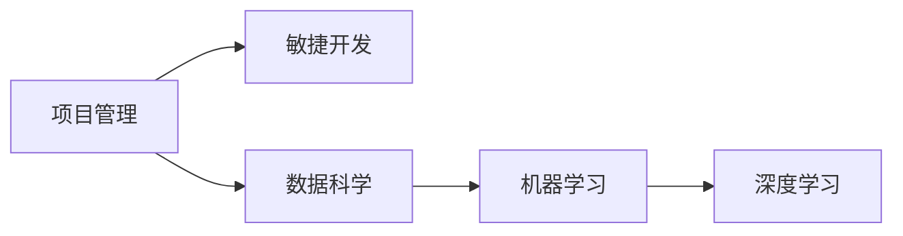

# 解密AI项目生命周期：规划、执行、监控、交付全流程解析

## 1. 背景介绍

人工智能(Artificial Intelligence, AI)项目的生命周期管理是一个复杂而关键的过程,涉及从项目启动到交付的各个阶段。随着AI技术的快速发展和广泛应用,越来越多的组织开始投资AI项目。然而,许多AI项目面临着诸如范围蔓延、预算超支、延迟交付等挑战,导致项目失败。为了确保AI项目的成功,有必要深入了解AI项目生命周期的各个阶段,并采用最佳实践来管理和监控项目进度。

本文将深入探讨AI项目生命周期的四个关键阶段:规划、执行、监控和交付。我们将详细解析每个阶段的目标、任务、挑战和最佳实践,并提供实用的见解和建议,帮助组织更好地管理AI项目,最大限度地提高项目成功率。

### 1.1 AI项目生命周期概述
#### 1.1.1 项目生命周期的定义
#### 1.1.2 AI项目生命周期的特点
#### 1.1.3 AI项目生命周期管理的重要性

### 1.2 AI项目面临的挑战
#### 1.2.1 技术复杂性
#### 1.2.2 数据质量和可用性
#### 1.2.3 伦理和隐私问题
#### 1.2.4 组织变革和人才缺口

## 2. 核心概念与联系

在深入探讨AI项目生命周期的各个阶段之前,我们需要了解一些核心概念及其之间的联系。

### 2.1 项目管理
#### 2.1.1 项目管理的定义和目标
#### 2.1.2 项目管理的五大过程组
#### 2.1.3 项目管理的十大知识领域

### 2.2 敏捷开发
#### 2.2.1 敏捷开发的定义和原则
#### 2.2.2 Scrum框架
#### 2.2.3 敏捷开发在AI项目中的应用

### 2.3 数据科学
#### 2.3.1 数据科学的定义和范围
#### 2.3.2 数据科学流程(CRISP-DM)
#### 2.3.3 数据科学在AI项目中的作用

### 2.4 机器学习
#### 2.4.1 机器学习的定义和分类
#### 2.4.2 监督学习、无监督学习和强化学习
#### 2.4.3 机器学习在AI项目中的应用

### 2.5 深度学习
#### 2.5.1 深度学习的定义和原理
#### 2.5.2 神经网络架构(CNN、RNN、GAN等)
#### 2.5.3 深度学习在AI项目中的应用

下图展示了这些核心概念之间的联系:

## 3. 核心算法原理具体操作步骤

在AI项目生命周期中,选择和实现合适的算法是至关重要的。以下是一些常用的AI算法及其具体操作步骤:

### 3.1 监督学习算法
#### 3.1.1 线性回归
1. 数据预处理和特征工程
2. 选择损失函数(如均方误差)
3. 初始化模型参数
4. 训练模型(如梯度下降)
5. 评估模型性能并进行调优

#### 3.1.2 逻辑回归
1. 数据预处理和特征工程
2. 选择损失函数(如交叉熵)
3. 初始化模型参数
4. 训练模型(如梯度下降)
5. 评估模型性能并进行调优

#### 3.1.3 支持向量机(SVM)
1. 数据预处理和特征工程
2. 选择核函数(如线性核、高斯核)
3. 优化目标函数(如SMO算法)
4. 训练模型
5. 评估模型性能并进行调优

#### 3.1.4 决策树和随机森林
1. 数据预处理和特征工程
2. 选择分裂标准(如基尼指数、信息增益)
3. 构建决策树(如ID3、C4.5、CART)
4. 集成多个决策树(如Bagging、Boosting)
5. 评估模型性能并进行调优

### 3.2 无监督学习算法
#### 3.2.1 K-均值聚类
1. 数据预处理和特征工程
2. 初始化聚类中心
3. 迭代分配数据点到最近的聚类中心
4. 更新聚类中心
5. 重复步骤3和4直到收敛

#### 3.2.2 层次聚类
1. 数据预处理和特征工程
2. 计算数据点之间的距离矩阵
3. 合并最近的两个聚类
4. 更新距离矩阵
5. 重复步骤3和4直到达到预定的聚类数

#### 3.2.3 主成分分析(PCA)
1. 数据预处理和特征工程
2. 计算数据的协方差矩阵
3. 对协方差矩阵进行特征分解
4. 选择前k个特征向量作为主成分
5. 将数据投影到主成分上

### 3.3 深度学习算法
#### 3.3.1 卷积神经网络(CNN)
1. 数据预处理和数据增强
2. 设计CNN架构(如卷积层、池化层、全连接层)
3. 定义损失函数和优化器
4. 训练模型(如前向传播、反向传播)
5. 评估模型性能并进行调优

#### 3.3.2 循环神经网络(RNN)
1. 数据预处理和序列化
2. 设计RNN架构(如LSTM、GRU)
3. 定义损失函数和优化器
4. 训练模型(如BPTT算法)
5. 评估模型性能并进行调优

#### 3.3.3 生成对抗网络(GAN)
1. 数据预处理和噪声生成
2. 设计生成器和判别器架构
3. 定义损失函数和优化器
4. 交替训练生成器和判别器
5. 评估生成结果的质量并进行调优

## 4. 数学模型和公式详细讲解举例说明

在AI项目中,数学模型和公式是算法的基础。以下是一些常用的数学模型和公式,并提供详细的讲解和举例说明:

### 4.1 线性回归
线性回归的目标是找到一个线性函数,使其能够最小化预测值和真实值之间的误差。假设我们有一组训练数据 $\{(x_1, y_1), (x_2, y_2), ..., (x_n, y_n)\}$,其中 $x_i$ 是特征向量, $y_i$ 是对应的目标值。线性回归模型可以表示为:

$$
\hat{y} = w^Tx + b
$$

其中, $w$ 是权重向量, $b$ 是偏置项。我们希望找到最优的 $w$ 和 $b$,使得预测值 $\hat{y}$ 与真实值 $y$ 之间的均方误差最小:

$$
\min_{w,b} \frac{1}{n} \sum_{i=1}^n (w^Tx_i + b - y_i)^2
$$

这个优化问题可以通过梯度下降算法求解。梯度下降算法的更新规则为:

$$
w := w - \alpha \frac{1}{n} \sum_{i=1}^n (w^Tx_i + b - y_i) x_i
$$

$$
b := b - \alpha \frac{1}{n} \sum_{i=1}^n (w^Tx_i + b - y_i)
$$

其中, $\alpha$ 是学习率。

举例说明:假设我们要预测房价based on房屋面积。我们有以下训练数据:

| 面积(平方米) | 价格(万元) |
|-------------|------------|
| 100         | 300        |
| 120         | 360        |
| 150         | 450        |
| 200         | 600        |

我们可以使用线性回归模型来拟合这些数据。通过梯度下降算法,我们可以得到最优的权重 $w$ 和偏置 $b$。假设得到的模型为:

$$
\hat{y} = 3x + 0
$$

这意味着,对于一个面积为 $x$ 平方米的房屋,我们预测其价格为 $3x$ 万元。

### 4.2 逻辑回归
逻辑回归是一种常用的二分类模型。它使用sigmoid函数将线性函数的输出映射到(0,1)区间,表示样本属于正类的概率。假设我们有一组训练数据 $\{(x_1, y_1), (x_2, y_2), ..., (x_n, y_n)\}$,其中 $x_i$ 是特征向量, $y_i \in \{0,1\}$ 是对应的二元标签。逻辑回归模型可以表示为:

$$
P(y=1|x) = \sigma(w^Tx + b) = \frac{1}{1+e^{-(w^Tx + b)}}
$$

其中, $\sigma(\cdot)$ 是sigmoid函数。我们希望找到最优的 $w$ 和 $b$,使得对数似然函数最大化:

$$
\max_{w,b} \sum_{i=1}^n [y_i \log P(y_i=1|x_i) + (1-y_i) \log (1-P(y_i=1|x_i))]
$$

这个优化问题可以通过梯度上升算法求解。梯度上升算法的更新规则为:

$$
w := w + \alpha \sum_{i=1}^n (y_i - P(y_i=1|x_i)) x_i
$$

$$
b := b + \alpha \sum_{i=1}^n (y_i - P(y_i=1|x_i))
$$

举例说明:假设我们要预测一个学生是否会被大学录取based on他的考试成绩和面试表现。我们有以下训练数据:

| 考试成绩 | 面试表现 | 录取结果 |
|----------|----------|----------|
| 80       | 好       | 1        |
| 90       | 一般     | 1        |
| 70       | 好       | 0        |
| 60       | 一般     | 0        |

我们可以使用逻辑回归模型来拟合这些数据。通过梯度上升算法,我们可以得到最优的权重 $w$ 和偏置 $b$。假设得到的模型为:

$$
P(y=1|x) = \sigma(0.05x_1 + 1x_2 - 4)
$$

其中, $x_1$ 表示考试成绩, $x_2$ 表示面试表现(好为1,一般为0)。对于一个考试成绩为 $x_1$、面试表现为 $x_2$ 的学生,我们可以计算出他被录取的概率。

### 4.3 支持向量机(SVM)
支持向量机是一种常用的二分类模型,它的目标是找到一个超平面,使得两类样本能够被最大间隔分开。假设我们有一组训练数据 $\{(x_1, y_1), (x_2, y_2), ..., (x_n, y_n)\}$,其中 $x_i$ 是特征向量, $y_i \in \{-1,1\}$ 是对应的二元标签。SVM的优化目标可以表示为:

$$
\min_{w,b} \frac{1}{2} \|w\|^2 \\
s.t. \quad y_i(w^Tx_i + b) \geq 1, \quad i=1,2,...,n
$$

这是一个凸二次规划问题,可以通过拉格朗日乘子法和SMO算法求解。得到最优的 $w$ 和 $b$ 后,对于一个新的样本 $x$,我们可以通过以下决策函数判断其类别:

$$
f(x) = \text{sign}(w^Tx + b)
$$

举例说明:假设我们要根据用户的年收入和债务情况来预测其是否会违约。我们有以下训练数据:

| 年收入(万元) | 债务(万元) | 是否违约 |
|--------------|------------|----------|
| 10           | 2          | -1       |
| 8            | 3          | -1       |
| 6            | 5          | 1        |
| 4            | 6          | 1        |

我们可以使用SVM模型来拟合这些数据。通过求解上述优化问题,我们可以得到最优的超平面。假设得到的模型为:

$$
f(x) = \text{sign}(x_1 - 2x_2 + 3)
$$

其中,