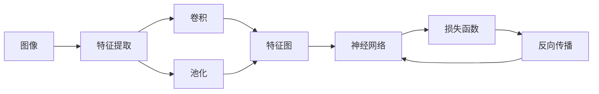

# 计算机视觉(Computer Vision)原理与代码实战案例讲解

## 1. 背景介绍
### 1.1 计算机视觉的定义与发展历程
#### 1.1.1 计算机视觉的定义
计算机视觉(Computer Vision)是一门研究如何使计算机从图像或视频中获取高层次理解的科学。它旨在让计算机像人一样感知和理解视觉世界,使计算机能够从图像或视频中识别和理解复杂的模式,并根据这些模式做出智能决策。

#### 1.1.2 计算机视觉的发展历程
计算机视觉的研究始于20世纪60年代早期。早期的研究主要集中在图像处理、模式识别等低层次视觉任务上。随着计算机硬件性能的提升和机器学习算法的发展,计算机视觉在90年代开始进入新的阶段,出现了一些标志性的研究成果,如Viola-Jones人脸检测算法等。进入21世纪后,得益于深度学习技术的崛起,计算机视觉取得了突破性进展,在图像分类、目标检测、语义分割等任务上达到了甚至超越人类的性能。

### 1.2 计算机视觉的主要任务与应用
#### 1.2.1 计算机视觉的主要任务
- 图像分类(Image Classification):对输入图像进行分类,判断其所属的类别。
- 目标检测(Object Detection):检测图像中感兴趣的目标,并给出其位置和类别。 
- 语义分割(Semantic Segmentation):对图像中的每个像素进行分类,标记出其所属的类别。
- 实例分割(Instance Segmentation):在语义分割的基础上区分不同的目标实例。
- 姿态估计(Pose Estimation):估计图像中人体关键点的位置。
- 行为识别(Action Recognition):识别视频中的人体行为动作。

#### 1.2.2 计算机视觉的应用领域
- 智能监控:利用计算机视觉技术对监控视频进行分析,及时发现异常行为和潜在威胁。
- 无人驾驶:通过视觉感知系统实现车辆的自动驾驶。
- 医学影像分析:辅助医生进行疾病诊断和手术规划。
- 人机交互:通过手势、表情、视线等信息实现更自然的人机交互。
- 工业自动化:对工业生产过程进行视觉检测和质量控制。
- 虚拟现实/增强现实:构建沉浸式的虚拟环境,将虚拟信息叠加到真实场景中。

## 2. 核心概念与关联
### 2.1 计算机视觉的核心概念
- 图像:计算机视觉处理的基本对象,由像素阵列构成。
- 特征:图像中具有判别性的信息,如颜色、纹理、形状等。
- 卷积:一种常用的图像处理和特征提取操作,通过滑动窗口对图像进行加权求和。
- 池化:一种下采样操作,用于减小特征图的尺寸和提取主要特征。
- 神经网络:一种模拟人脑结构的机器学习模型,由大量神经元节点组成。
- 损失函数:衡量模型预测结果与真实标签之间差异的函数,用于指导模型训练。
- 反向传播:一种高效的神经网络训练算法,通过梯度下降更新网络参数。

### 2.2 核心概念之间的关联
下图展示了计算机视觉中几个核心概念之间的关联:



首先,从输入图像中提取各种视觉特征。这一过程主要通过卷积和池化操作实现,卷积能够提取局部特征,池化能够压缩特征图并提取主要特征。提取到的特征送入神经网络进行高层语义的提取和任务预测。网络的训练通过定义合适的损失函数,并利用反向传播算法更新网络参数,最小化预测误差。

## 3. 核心算法原理和具体步骤
本节将详细介绍目标检测中的两阶段检测器RCNN系列算法的原理和实现步骤。

### 3.1 RCNN
RCNN (Regions with CNN features)是两阶段目标检测器的开山之作,其基本步骤如下:
1. 候选区域生成:使用选择性搜索算法生成约2000个候选区域。
2. 特征提取:对每个候选区域缩放到固定尺寸,然后用预训练的CNN提取特征。
3. 区域分类:对每个候选区域的特征用SVM进行分类。
4. 边界框回归:对于属于前景的候选区域,用线性回归模型进一步优化其位置。

RCNN的缺点是速度慢、训练过程复杂、无法端到端训练。后续的Fast RCNN和Faster RCNN对其进行了改进。

### 3.2 Fast RCNN 
Fast RCNN对RCNN进行了以下改进:
1. 特征提取:在整张图像上运行CNN,得到特征图。
2. ROI池化:根据候选区域在特征图上提取定长特征。
3. 区域分类和位置回归:将ROI特征送入全连接层,同时进行分类和位置回归。

Fast RCNN实现了端到端训练,提升了速度和精度。但其候选区域生成仍是速度瓶颈。

### 3.3 Faster RCNN
Faster RCNN在Fast RCNN的基础上引入区域建议网络(RPN),实现候选区域的自动生成。其步骤如下:
1. 特征提取:在整张图像上运行CNN,得到特征图。
2. 区域建议网络(RPN):在特征图上滑动一个小网络,对每个位置预测k个候选区域。
3. ROI池化:根据候选区域在特征图上提取定长特征。
4. 区域分类和位置回归:将ROI特征送入全连接层,同时进行分类和位置回归。

Faster RCNN实现了检测器的实时性,是现代两阶段检测器的主流范式。

## 4. 数学模型和公式详解
本节对计算机视觉中的几个关键数学模型和公式进行详细讲解。

### 4.1 卷积运算
卷积是视觉特征提取的重要手段。二维卷积公式为:

$$ O(i,j) = \sum_{m=0}^{k_h-1} \sum_{n=0}^{k_w-1} I(i+m, j+n) \cdot K(m,n) $$

其中,$I$为输入图像,$K$为卷积核,$O$为输出特征图。卷积的物理意义是:卷积核在图像上滑动,对每个局部区域加权求和,提取该区域的特征模式。

### 4.2 池化运算
池化用于压缩特征图尺寸和提取主要特征。最大池化公式为:

$$ O(i,j) = \max_{m=0, n=0}^{k_h-1, k_w-1} I(i \cdot s + m, j \cdot s + n) $$

其中,$s$为池化步长。最大池化取局部区域的最大值作为输出,提取区域内最显著的特征。

### 4.3 交叉熵损失
交叉熵常用于分类任务的损失函数。二分类交叉熵公式为:

$$ L = -\frac{1}{N} \sum_{i=1}^N [y_i \log p_i + (1-y_i) \log (1-p_i)] $$

其中,$y_i$为第$i$个样本的真实标签(0或1),$p_i$为模型预测为正类的概率。交叉熵刻画了预测分布与真实分布的差异,是一种常用的分类损失函数。

### 4.4 反向传播算法
反向传播通过梯度下降更新神经网络的参数。假设损失函数为$L$,模型参数为$\theta$,学习率为$\eta$,则参数更新公式为:

$$ \theta := \theta - \eta \cdot \frac{\partial L}{\partial \theta} $$

反向传播算法分为两个阶段:
1. 前向传播:逐层计算神经元的激活值,直到输出层得到预测结果。 
2. 反向传播:从输出层开始,逐层计算每个参数的梯度,并将梯度回传给前一层。重复这一过程,直到输入层,并根据梯度更新所有参数。

## 5. 项目实践
本节通过一个简单的图像分类项目,演示如何使用PyTorch实现卷积神经网络。

### 5.1 数据准备
使用CIFAR10数据集,其包含50000张训练图像和10000张测试图像,共10个类别。使用torchvision可以方便地下载和载入该数据集:

```python
from torchvision import datasets, transforms

transform = transforms.Compose([
    transforms.ToTensor(),
    transforms.Normalize((0.5, 0.5, 0.5), (0.5, 0.5, 0.5))
])

trainset = datasets.CIFAR10(root='./data', train=True, download=True, transform=transform)
trainloader = torch.utils.data.DataLoader(trainset, batch_size=128, shuffle=True)

testset = datasets.CIFAR10(root='./data', train=False, download=True, transform=transform)
testloader = torch.utils.data.DataLoader(testset, batch_size=128, shuffle=False)
```

### 5.2 模型定义
定义一个简单的卷积神经网络,包含两个卷积层和三个全连接层:

```python
import torch.nn as nn
import torch.nn.functional as F

class Net(nn.Module):
    def __init__(self):
        super(Net, self).__init__()
        self.conv1 = nn.Conv2d(3, 32, 3)
        self.pool1 = nn.MaxPool2d(2, 2)
        self.conv2 = nn.Conv2d(32, 64, 3)
        self.pool2 = nn.MaxPool2d(2, 2)
        self.fc1 = nn.Linear(64 * 6 * 6, 512)
        self.fc2 = nn.Linear(512, 128)
        self.fc3 = nn.Linear(128, 10)

    def forward(self, x):
        x = self.pool1(F.relu(self.conv1(x)))
        x = self.pool2(F.relu(self.conv2(x)))
        x = x.view(-1, 64 * 6 * 6)
        x = F.relu(self.fc1(x))
        x = F.relu(self.fc2(x))
        x = self.fc3(x)
        return x
```

### 5.3 模型训练
定义交叉熵损失函数和SGD优化器,然后进行模型训练:

```python
import torch.optim as optim

criterion = nn.CrossEntropyLoss()
optimizer = optim.SGD(net.parameters(), lr=0.001, momentum=0.9)

for epoch in range(10):
    running_loss = 0.0
    for i, data in enumerate(trainloader, 0):
        inputs, labels = data
        optimizer.zero_grad()
        outputs = net(inputs)
        loss = criterion(outputs, labels)
        loss.backward()
        optimizer.step()
        running_loss += loss.item()
        if i % 500 == 499:
            print('[%d, %5d] loss: %.3f' % (epoch + 1, i + 1, running_loss / 500))
            running_loss = 0.0
```

### 5.4 模型评估
在测试集上评估模型的性能:

```python
correct = 0
total = 0
with torch.no_grad():
    for data in testloader:
        images, labels = data
        outputs = net(images)
        _, predicted = torch.max(outputs.data, 1)
        total += labels.size(0)
        correct += (predicted == labels).sum().item()

print('Accuracy of the network on the 10000 test images: %d %%' % (100 * correct / total))
```

以上就是使用PyTorch实现图像分类卷积神经网络的完整流程,可以作为实践计算机视觉项目的起点。

## 6. 实际应用场景
计算机视觉在各行各业有着广泛的应用,下面列举几个具有代表性的应用场景。

### 6.1 智能安防
计算机视觉是智能安防系统的核心。通过对监控视频进行实时分析,可以自动检测出异常行为和潜在威胁,大大提升了安防效率。常见的应用包括:
- 入侵检测:通过对比背景模型,检测出画面中的可疑目标。
- 行为分析:通过分析人体姿态和运动轨迹,识别出打架、摔倒等异常