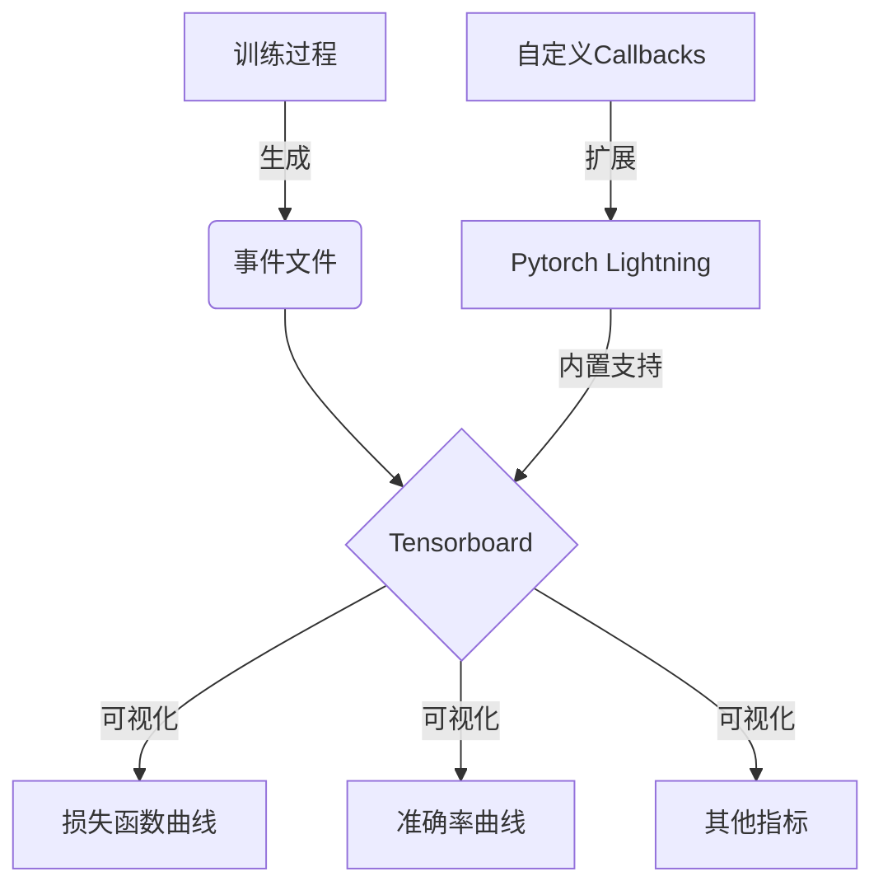

# 训练过程监控：实时掌握模型状态

## 1.背景介绍

在深度学习模型的训练过程中,监控和可视化训练状态对于理解模型行为、诊断问题以及优化性能至关重要。传统的方法通常是在训练结束后查看日志文件或可视化工具,但这种离线分析方式无法实时反映模型的动态变化,也难以及时发现和解决训练过程中可能出现的异常情况。

实时监控训练过程不仅可以帮助我们更好地了解模型在训练时的表现,还可以及时发现并解决训练过程中可能出现的问题,从而提高模型的收敛速度和泛化性能。通过实时监控,我们可以动态调整超参数、优化策略等,从而优化模型训练过程。

## 2.核心概念与联系

实时监控训练过程涉及以下几个核心概念:

### 2.1 Tensorboard

Tensorboard是Google开源的一款用于可视化机器学习模型的工具,它可以实时显示训练过程中的各种指标,如损失函数值、准确率等。Tensorboard通过读取训练过程中生成的事件文件(event files),将这些数据可视化为直观的图表和曲线,方便我们分析和理解模型的训练状态。

### 2.2 Pytorch Lightning

Pytorch Lightning是一个基于PyTorch的高级深度学习库,它提供了一种简洁、可扩展的方式来组织机器学习代码。Pytorch Lightning内置了对Tensorboard的支持,可以自动记录和可视化训练过程中的各种指标,极大地简化了监控和可视化的过程。

### 2.3 Callbacks

Callbacks是Pytorch Lightning中的一种机制,它允许我们在训练过程的特定时间点执行自定义操作。通过编写自定义的Callback,我们可以实现各种高级功能,如自动调整学习率、提前停止训练等。在实时监控训练过程时,我们也可以利用Callbacks来实现自定义的监控和可视化逻辑。

### 2.4 Mermaid流程图



上图展示了实时监控训练过程的核心概念及其关系。训练过程会生成事件文件,Tensorboard读取这些文件并将各种指标可视化为曲线图表。Pytorch Lightning内置了对Tensorboard的支持,可以自动记录和可视化训练指标。我们还可以编写自定义的Callbacks来扩展Pytorch Lightning,实现更高级的监控和可视化功能。

## 3.核心算法原理具体操作步骤

实时监控训练过程的核心算法原理可以概括为以下几个步骤:

1. **记录训练指标**:在模型训练的每一个epoch或batch结束时,记录当前的损失函数值、准确率等指标。这些指标将被存储在事件文件中,供后续可视化使用。

2. **启动Tensorboard服务**:在训练开始前,启动Tensorboard服务,并指定事件文件的存储路径。Tensorboard将持续监视这个路径,一旦有新的事件文件被写入,就会自动更新可视化界面。

3. **可视化训练指标**:Tensorboard会根据事件文件中记录的指标数据,实时绘制出损失函数曲线、准确率曲线等图表,供我们实时监控模型的训练状态。

4. **自定义监控逻辑(可选)**:如果内置的监控功能无法满足需求,我们可以编写自定义的Callbacks,在训练过程的特定时间点执行自定义的监控和可视化逻辑。

以下是一个使用Pytorch Lightning实现实时监控的示例代码:

```python
import pytorch_lightning as pl
from pytorch_lightning.callbacks import TQDMProgressBar

class LitModel(pl.LightningModule):
    def __init__(self, model):
        super().__init__()
        self.model = model

    def training_step(self, batch, batch_idx):
        loss, acc = self.model(batch)
        self.log('train_loss', loss)
        self.log('train_acc', acc)
        return loss

    def configure_callbacks(self):
        return [TQDMProgressBar()]

model = LitModel(your_model)
trainer = pl.Trainer(max_epochs=100, callbacks=[TQDMProgressBar()], logger=True)
trainer.fit(model)
```

在这个示例中,我们定义了一个`LitModel`类,它继承自`pl.LightningModule`。在`training_step`方法中,我们记录了当前batch的损失函数值和准确率,并使用`self.log`方法将它们写入事件文件。

我们还使用了`TQDMProgressBar`这个内置的Callback,它可以在命令行中显示训练进度条。通过设置`logger=True`,Pytorch Lightning会自动启动Tensorboard服务,并将事件文件写入默认路径。

最后,我们创建了一个`Trainer`对象,并调用它的`fit`方法开始训练。在训练过程中,Tensorboard会实时显示损失函数曲线和准确率曲线,供我们监控模型的训练状态。

## 4.数学模型和公式详细讲解举例说明

在深度学习模型的训练过程中,我们通常会使用损失函数(Loss Function)来衡量模型的预测结果与真实标签之间的差距。损失函数的值越小,说明模型的预测结果越接近真实标签。因此,在实时监控训练过程时,我们需要特别关注损失函数曲线的变化趋势。

常见的损失函数包括均方误差(Mean Squared Error, MSE)、交叉熵损失(Cross Entropy Loss)等。以下是它们的数学公式:

1. **均方误差(MSE)**

$$MSE = \frac{1}{n}\sum_{i=1}^{n}(y_i - \hat{y}_i)^2$$

其中,$y_i$表示第$i$个样本的真实标签,$\hat{y}_i$表示模型对第$i$个样本的预测值,$n$表示样本数量。

均方误差常用于回归问题,它衡量了预测值与真实值之间的平方差的均值。均方误差越小,说明模型的预测结果越接近真实值。

2. **交叉熵损失(Cross Entropy Loss)**

对于二分类问题,交叉熵损失的公式为:

$$\text{CrossEntropy}(y, \hat{y}) = -y\log(\hat{y}) - (1-y)\log(1-\hat{y})$$

其中,$y$表示真实标签(0或1),$\hat{y}$表示模型预测的概率值。

对于多分类问题,交叉熵损失的公式为:

$$\text{CrossEntropy}(Y, \hat{Y}) = -\sum_{i=1}^{C}y_i\log(\hat{y}_i)$$

其中,$C$表示类别数量,$y_i$表示第$i$类的真实标签(0或1),$\hat{y}_i$表示模型预测的第$i$类的概率值。

交叉熵损失常用于分类问题,它衡量了模型预测概率分布与真实标签分布之间的差异。交叉熵损失越小,说明模型的预测结果越接近真实标签。

在实时监控训练过程时,我们需要关注损失函数曲线的变化趋势。一般来说,损失函数曲线应该呈现出平滑下降的趋势,这说明模型正在逐步学习,预测结果越来越接近真实标签。但如果损失函数曲线出现震荡或上升的情况,可能意味着模型出现了过拟合或梯度爆炸等问题,需要及时调整超参数或优化策略。

## 5.项目实践:代码实例和详细解释说明

为了更好地理解如何实现实时监控训练过程,我们将通过一个具体的项目实践来演示。在这个项目中,我们将使用Pytorch Lightning训练一个简单的图像分类模型,并利用Tensorboard实时监控训练过程。

### 5.1 准备数据集

首先,我们需要准备一个图像数据集。在这个示例中,我们将使用CIFAR10数据集,它包含10个类别的彩色图像,每个类别有6000张图像。

```python
from torchvision import datasets, transforms

# 定义数据预处理转换
transform = transforms.Compose([
    transforms.ToTensor(),
    transforms.Normalize((0.5, 0.5, 0.5), (0.5, 0.5, 0.5))
])

# 加载训练集和测试集
train_dataset = datasets.CIFAR10('data', train=True, download=True, transform=transform)
test_dataset = datasets.CIFAR10('data', train=False, download=True, transform=transform)
```

### 5.2 定义模型

接下来,我们定义一个简单的卷积神经网络模型,用于图像分类任务。

```python
import torch.nn as nn

class Net(nn.Module):
    def __init__(self):
        super(Net, self).__init__()
        self.conv1 = nn.Conv2d(3, 6, 5)
        self.pool = nn.MaxPool2d(2, 2)
        self.conv2 = nn.Conv2d(6, 16, 5)
        self.fc1 = nn.Linear(16 * 5 * 5, 120)
        self.fc2 = nn.Linear(120, 84)
        self.fc3 = nn.Linear(84, 10)

    def forward(self, x):
        x = self.pool(nn.functional.relu(self.conv1(x)))
        x = self.pool(nn.functional.relu(self.conv2(x)))
        x = x.view(-1, 16 * 5 * 5)
        x = nn.functional.relu(self.fc1(x))
        x = nn.functional.relu(self.fc2(x))
        x = self.fc3(x)
        return x
```

### 5.3 定义Pytorch Lightning模块

接下来,我们需要定义一个Pytorch Lightning模块,用于封装模型、数据加载器和训练逻辑。

```python
import pytorch_lightning as pl
from torch.utils.data import DataLoader

class LitModel(pl.LightningModule):
    def __init__(self, model):
        super().__init__()
        self.model = model

    def forward(self, x):
        return self.model(x)

    def training_step(self, batch, batch_idx):
        x, y = batch
        logits = self(x)
        loss = nn.functional.cross_entropy(logits, y)
        acc = (logits.argmax(dim=-1) == y).float().mean()
        self.log('train_loss', loss)
        self.log('train_acc', acc)
        return loss

    def validation_step(self, batch, batch_idx):
        x, y = batch
        logits = self(x)
        loss = nn.functional.cross_entropy(logits, y)
        acc = (logits.argmax(dim=-1) == y).float().mean()
        self.log('val_loss', loss)
        self.log('val_acc', acc)

    def configure_optimizers(self):
        return torch.optim.Adam(self.parameters(), lr=0.001)

    def train_dataloader(self):
        return DataLoader(train_dataset, batch_size=64, shuffle=True)

    def val_dataloader(self):
        return DataLoader(test_dataset, batch_size=64)
```

在这个模块中,我们定义了`training_step`和`validation_step`方法,分别用于计算训练集和验证集的损失函数值和准确率。我们使用`self.log`方法将这些指标记录到Tensorboard中。

我们还定义了`configure_optimizers`方法,用于创建优化器。在这个示例中,我们使用Adam优化器。

最后,我们定义了`train_dataloader`和`val_dataloader`方法,用于创建训练集和验证集的数据加载器。

### 5.4 启动训练并监控

现在,我们可以创建一个Trainer对象,并启动训练过程。在训练过程中,Tensorboard会自动启动并实时监控训练指标。

```python
import pytorch_lightning as pl

model = Net()
lit_model = LitModel(model)

trainer = pl.Trainer(max_epochs=10, logger=True)
trainer.fit(lit_model)
```

在这个示例中,我们创建了一个`Net`模型实例和一个`LitModel`实例。然后,我们创建了一个`Trainer`对象,并调用它的`fit`方法开始训练。由于我们设置了`logger=True`,Pytorch Lightning会自动启动Tensorboard服务,并将训练指标记录到事件文件中。

在训练过程中,我们可以在Tensorboard的界面中实时查看损失函数曲线和准确率曲线的变化趋势。如果发现异常情况,我们可以及时调整超参数或优化策略,以优化模型的训练过程。

## 6.实际应用场景

实时监控训练过程在各种深度学习应用场景中都有着广泛的应用,包括但不限于以下几个方面: