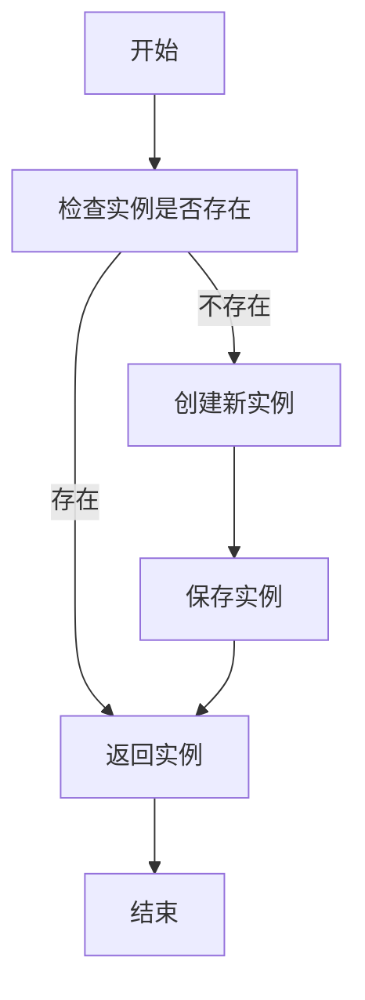
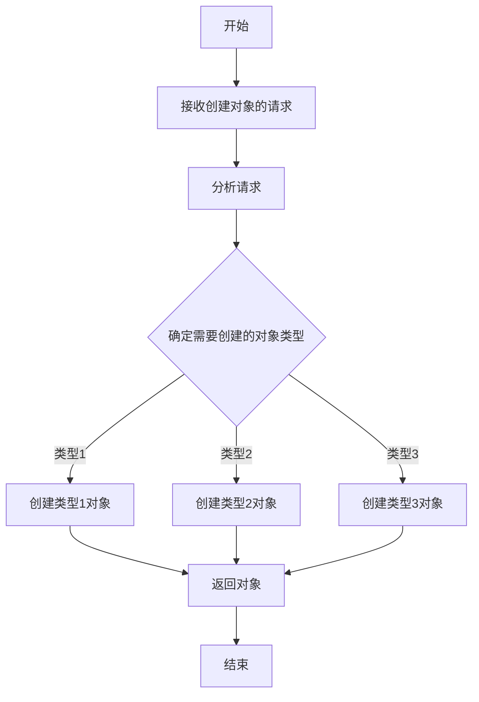
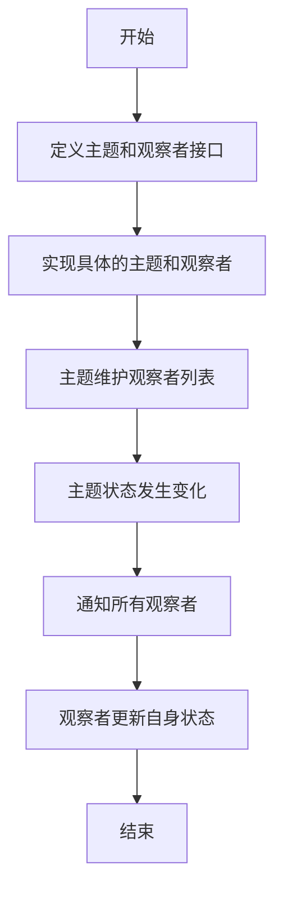

# 设计模式与软件架构原理与代码实战案例讲解

## 1. 背景介绍

软件设计模式和架构原理是现代软件开发中不可或缺的重要组成部分。它们为我们提供了一种通用的、可重用的解决方案,帮助我们构建可扩展、可维护和高效的软件系统。随着软件复杂度的不断增加,设计模式和架构原理变得越来越重要,因为它们可以帮助我们管理复杂性,提高代码质量,并促进团队协作。

### 1.1 设计模式的重要性

设计模式是软件设计中常见问题的典型解决方案。它们是经过实践检验的最佳实践,可以帮助我们编写更加清晰、灵活和可维护的代码。通过使用设计模式,我们可以避免重复发明轮子,并且可以更好地理解和沟通设计决策。

### 1.2 软件架构原理的作用

软件架构原理为我们提供了一种结构化的方式来设计和构建软件系统。它定义了系统的整体结构、组件之间的关系以及它们如何协同工作。良好的架构设计可以确保系统具有高度的可扩展性、可维护性和性能。

## 2. 核心概念与联系

### 2.1 设计模式的分类

设计模式通常被分为三大类:创建型模式、结构型模式和行为型模式。

1. **创建型模式**:关注对象的创建过程,旨在将对象的创建与使用解耦。常见的创建型模式包括单例模式、工厂模式、建造者模式和原型模式等。

2. **结构型模式**:关注类和对象的组合,使它们可以更好地协作。常见的结构型模式包括适配器模式、桥接模式、组合模式、装饰器模式和代理模式等。

3. **行为型模式**:关注对象之间的通信和职责分配,旨在提高代码的灵活性和可维护性。常见的行为型模式包括观察者模式、策略模式、模板方法模式、命令模式和迭代器模式等。

### 2.2 软件架构原理

软件架构原理为我们提供了一种结构化的方式来设计和构建软件系统。常见的架构原理包括:

1. **分层架构**:将系统划分为多个层次,每一层只与相邻层进行交互,提高了系统的可维护性和可扩展性。

2. **事件驱动架构**:系统通过生产和消费事件来进行通信,提高了系统的灵活性和可伸缩性。

3. **微服务架构**:将系统划分为多个小型、独立的服务,每个服务都专注于一个特定的业务功能,提高了系统的可维护性和可扩展性。

4. **六边形架构**:将系统划分为多个层次,每一层都有明确的职责,并且可以独立于其他层进行测试和部署,提高了系统的可测试性和可维护性。

### 2.3 设计模式与架构原理的关系

设计模式和架构原理是密切相关的。设计模式为我们提供了解决特定问题的通用解决方案,而架构原理则为我们提供了一种结构化的方式来组织和构建整个系统。在实际的软件开发中,我们通常会结合使用设计模式和架构原理,以构建高质量、可扩展和可维护的软件系统。

## 3. 核心算法原理具体操作步骤

在本节中,我们将探讨一些常见设计模式的核心算法原理和具体操作步骤。

### 3.1 单例模式

单例模式是一种创建型模式,它确保一个类只有一个实例,并提供一个全局访问点。单例模式的核心算法原理如下:



1. 定义一个私有的静态变量来保存单例实例。
2. 定义一个私有的构造函数,防止从外部实例化对象。
3. 定义一个公共的静态方法,用于获取单例实例。
4. 在获取单例实例的方法中,首先检查实例是否存在。
5. 如果实例不存在,则创建一个新的实例并保存。
6. 返回单例实例。

### 3.2 工厂模式

工厂模式是一种创建型模式,它提供了一种创建对象的最佳方式。工厂模式的核心算法原理如下:



1. 定义一个工厂类,它包含一个用于创建对象的工厂方法。
2. 在工厂方法中,根据传入的参数或配置,确定需要创建的对象类型。
3. 根据确定的对象类型,调用相应的构造函数或静态方法创建对象。
4. 返回创建的对象。

### 3.3 观察者模式

观察者模式是一种行为型模式,它定义了对象之间的一种一对多的依赖关系,当一个对象的状态发生改变时,所有依赖于它的对象都会得到通知并自动更新。观察者模式的核心算法原理如下:



1. 定义一个主题(Subject)接口,声明添加、删除和通知观察者的方法。
2. 定义一个观察者(Observer)接口,声明更新状态的方法。
3. 实现具体的主题和观察者类。
4. 在具体的主题类中,维护一个观察者列表。
5. 当主题状态发生变化时,遍历观察者列表,调用每个观察者的更新方法。
6. 在具体的观察者类中,实现更新状态的方法。

## 4. 数学模型和公式详细讲解举例说明

在软件设计和架构中,我们经常需要使用一些数学模型和公式来分析和优化系统的性能和可扩展性。在本节中,我们将探讨一些常见的数学模型和公式,并通过实际案例进行详细讲解。

### 4.1 小世界网络模型

小世界网络模型是一种描述复杂网络结构的数学模型,它可以用来分析和优化分布式系统的通信效率和可扩展性。小世界网络模型的核心思想是,在一个网络中,任意两个节点之间的平均路径长度都很短,并且网络具有高度的聚类特性。

小世界网络模型可以用以下公式来描述:

$$
L = \frac{1}{N(N-1)}\sum_{i\neq j}d_{ij}
$$

其中,$$L$$表示网络的平均路径长度,$$N$$表示网络中节点的数量,$$d_{ij}$$表示节点$$i$$和节点$$j$$之间的最短路径长度。

我们可以使用小世界网络模型来优化分布式系统的通信效率。例如,在设计一个基于P2P的文件共享系统时,我们可以利用小世界网络模型来构建一个高效的节点路由表,从而减少文件传输的延迟和网络负载。

### 4.2 队列理论

队列理论是一种用于分析和优化系统性能的数学模型,它可以帮助我们预测系统的响应时间、吞吐量和资源利用率。队列理论中的一个核心概念是小批量流动规则(Little's Law),它描述了在一个稳定的队列系统中,长期平均等待时间、长期平均系统中的客户数量和长期平均到达率之间的关系。

小批量流动规则可以用以下公式来表示:

$$
L = \lambda W
$$

其中,$$L$$表示长期平均系统中的客户数量,$$\lambda$$表示长期平均到达率,$$W$$表示长期平均等待时间。

我们可以利用队列理论来优化系统的性能和资源利用率。例如,在设计一个Web服务器集群时,我们可以使用队列理论来预测不同负载下的响应时间和吞吐量,从而确定所需的服务器数量和负载均衡策略。

## 5. 项目实践:代码实例和详细解释说明

在本节中,我们将通过实际的代码示例来演示如何应用设计模式和架构原理。这些示例将帮助您更好地理解和掌握这些概念。

### 5.1 单例模式示例

单例模式确保一个类只有一个实例,并提供一个全局访问点。下面是一个使用单例模式的示例:

```java
public class Singleton {
    private static volatile Singleton instance;

    private Singleton() {
        // 私有构造函数,防止从外部实例化
    }

    public static Singleton getInstance() {
        if (instance == null) {
            synchronized (Singleton.class) {
                if (instance == null) {
                    instance = new Singleton();
                }
            }
        }
        return instance;
    }

    // 其他方法和属性...
}
```

在这个示例中,我们定义了一个私有的静态变量`instance`来保存单例实例。构造函数被设置为私有,防止从外部实例化对象。`getInstance()`方法是一个公共的静态方法,用于获取单例实例。在这个方法中,我们首先检查实例是否存在,如果不存在,则在同步块中创建一个新的实例并保存。这种实现方式被称为"双重检查锁定",它可以确保线程安全并提高性能。

### 5.2 工厂模式示例

工厂模式提供了一种创建对象的最佳方式。下面是一个使用工厂模式的示例:

```java
// 产品接口
interface Product {
    void operation();
}

// 具体产品实现
class ConcreteProductA implements Product {
    public void operation() {
        System.out.println("ConcreteProductA operation");
    }
}

class ConcreteProductB implements Product {
    public void operation() {
        System.out.println("ConcreteProductB operation");
    }
}

// 工厂类
class Factory {
    public static Product createProduct(String type) {
        if (type.equals("A")) {
            return new ConcreteProductA();
        } else if (type.equals("B")) {
            return new ConcreteProductB();
        } else {
            throw new IllegalArgumentException("Invalid product type");
        }
    }
}

// 客户端代码
public class FactoryPatternExample {
    public static void main(String[] args) {
        Product productA = Factory.createProduct("A");
        productA.operation(); // 输出: ConcreteProductA operation

        Product productB = Factory.createProduct("B");
        productB.operation(); // 输出: ConcreteProductB operation
    }
}
```

在这个示例中,我们定义了一个`Product`接口和两个具体的产品实现类`ConcreteProductA`和`ConcreteProductB`。`Factory`类是一个工厂类,它包含一个静态方法`createProduct()`用于创建产品对象。在`createProduct()`方法中,我们根据传入的参数确定需要创建的对象类型,然后调用相应的构造函数创建对象并返回。

在客户端代码中,我们通过调用`Factory.createProduct()`方法并传入不同的参数来创建不同类型的产品对象。这种实现方式使得客户端代码与具体的产品实现解耦,从而提高了代码的可维护性和灵活性。

### 5.3 观察者模式示例

观察者模式定义了对象之间的一种一对多的依赖关系,当一个对象的状态发生改变时,所有依赖于它的对象都会得到通知并自动更新。下面是一个使用观察者模式的示例:

```java
// 观察者接口
interface Observer {
    void update(String message);
}

// 具体观察者实现
class ConcreteObserver implements Observer {
    private String name;

    public ConcreteObserver(String name) {
        this.name = name;
    }

    public void update(String message) {
        System.out.println("Observer " + name + " received message: " + message