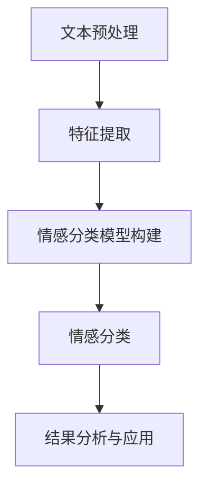

# 语义分析和文本挖掘在情感分析中的应用

## 1.背景介绍

### 1.1 情感分析的重要性

在当今信息时代,人们通过各种在线平台(如社交媒体、电子商务网站、论坛等)表达自己的观点和情绪。这些大量的非结构化文本数据蕴含着宝贵的情感信息,对企业、政府和研究机构等具有重要的战略价值。情感分析(Sentiment Analysis)就是从这些文本数据中自动识别和提取主观信息的技术,能够帮助我们了解公众对于特定产品、服务、政策等的情绪态度,从而为决策提供重要依据。

### 1.2 情感分析的挑战

尽管情感分析具有广阔的应用前景,但要实现准确的情感检测并非易事。主要的挑战包括:

1. 语言的多义性和复杂性
2. 上下文依赖性
3. 主观性和模糊性
4. 数据量大且质量参差不齐

传统的基于规则或词典的方法很难有效解决上述问题。幸运的是,随着自然语言处理(NLP)和机器学习技术的不断发展,语义分析和文本挖掘为情感分析提供了新的解决方案。

## 2.核心概念与联系 

### 2.1 语义分析

语义分析(Semantic Analysis)是自然语言处理的一个重要环节,旨在理解语句的实际含义。它通过分析词语、短语和句子之间的语义关系,捕捉语言的逻辑结构和内在含义。常用的语义分析技术包括词义消歧、命名实体识别、关系提取等。

在情感分析中,语义分析可以帮助我们更好地理解文本的情感倾向。例如,通过分析否定词、强调词、修饰词等与情感相关的语义信息,可以提高情感分类的准确性。

### 2.2 文本挖掘

文本挖掘(Text Mining)是一种从非结构化或半结构化文本数据中发现有价值信息的过程。它融合了多种技术,包括信息检索、自然语言处理、机器学习、统计分析等。

在情感分析中,文本挖掘可以从海量文本数据中自动提取情感特征,并构建情感分类模型。常用的文本挖掘技术包括主题模型、关键词提取、文本聚类等。

### 2.3 语义分析与文本挖掘的关系

语义分析和文本挖掘是相辅相成的技术。语义分析为文本挖掘提供了更深层次的语义理解能力,而文本挖掘则为语义分析提供了大规模文本数据处理的能力。二者的有机结合,能够更好地挖掘文本数据中蕴含的情感信息,提高情感分析的性能。

## 3.核心算法原理具体操作步骤

情感分析的核心算法主要包括以下几个步骤:

### 3.1 文本预处理

文本预处理是情感分析的基础步骤,主要包括以下操作:

1. **分词(Tokenization)**: 将文本拆分为单词、词组或其他有意义的标记。
2. **去除停用词(Stop Words Removal)**: 移除无意义的常用词,如"的"、"了"等。
3. **词形还原(Lemmatization)**: 将单词转换为其基本形式,如"loved"转为"love"。
4. **标准化(Normalization)**: 统一文本的大小写、缩略语等格式。

这些预处理操作可以消除文本中的噪音,提高后续处理的效率和质量。

### 3.2 特征提取

特征提取是将原始文本转换为适合机器学习模型的数值向量表示。常用的特征提取方法包括:

1. **词袋模型(Bag-of-Words)**: 将文本表示为词频向量。
2. **TF-IDF(Term Frequency-Inverse Document Frequency)**: 根据词频和逆文档频率对词赋予不同的权重。
3. **Word Embedding**: 将单词映射到低维连续向量空间,保留语义和语法信息。
4. **情感词典(Sentiment Lexicon)**: 构建情感词典,将单词与其情感极性相关联。

除了传统的统计特征,近年来基于深度学习的语义表示也被广泛应用于情感分析。

### 3.3 情感分类模型构建

基于提取的特征,我们可以训练各种机器学习模型进行情感分类。常用的模型包括:

1. **逻辑回归(Logistic Regression)**
2. **支持向量机(Support Vector Machines, SVM)** 
3. **朴素贝叶斯(Naive Bayes)**
4. **决策树(Decision Trees)**
5. **神经网络(Neural Networks)**
6. **长短期记忆网络(Long Short-Term Memory, LSTM)**
7. **卷积神经网络(Convolutional Neural Networks, CNN)**
8. **注意力机制(Attention Mechanism)**
9. **基于迁移学习的预训练语言模型(Transfer Learning & Pre-trained Language Models)**

模型的选择取决于数据量、计算资源以及所需的准确性和解释性。

### 3.4 情感分类

利用训练好的模型,我们可以对新的文本数据进行情感分类,得到每个文本实例的情感极性(正面、负面或中性)。根据具体应用场景,情感分类可以是二元分类(正面或负面)、三元分类(正面、负面或中性)或多元分类(如包含幸福、愤怒、悲伤等多种情感类别)。

### 3.5 结果分析与应用

情感分类的结果可以用于多种下游应用,如:

1. **舆情监测**: 跟踪公众对某个事件或产品的情绪反应。
2. **用户体验分析**: 从在线评论中挖掘用户对产品或服务的反馈。
3. **社交媒体营销**: 根据用户情绪制定营销策略。
4. **智能客服**: 自动识别客户的情绪状态,提供个性化服务。

同时,我们还需要对分类结果进行深入分析,发现情感变化的趋势和原因,为决策提供参考。

## 4.数学模型和公式详细讲解举例说明

在情感分析中,数学模型和公式扮演着重要角色。以下是一些常用的模型和公式:

### 4.1 词袋模型(Bag-of-Words)

词袋模型是一种将文本表示为词频向量的简单而有效的方法。对于一个文本$d$,我们可以将其表示为一个$V$维向量:

$$\vec{x}_d = (x_{d1}, x_{d2}, \dots, x_{dV})$$

其中$V$是词汇表的大小,$x_{di}$表示第$i$个词在文本$d$中出现的次数。

虽然词袋模型简单直观,但它忽略了词序信息,无法捕捉语义和语法结构。为了解决这个问题,我们可以使用更高级的特征表示方法,如TF-IDF和Word Embedding。

### 4.2 TF-IDF(Term Frequency-Inverse Document Frequency)

TF-IDF是一种常用的特征加权方法,它通过惩罚在整个语料库中频繁出现的词,从而提高了重要词的权重。对于一个词$t$在文本$d$中的TF-IDF权重可以计算为:

$$\text{tfidf}(t, d) = \text{tf}(t, d) \times \text{idf}(t)$$

其中$\text{tf}(t, d)$表示词$t$在文本$d$中的词频,$\text{idf}(t)$表示词$t$的逆文档频率,定义为:

$$\text{idf}(t) = \log \frac{N}{\text{df}(t)}$$

这里$N$是语料库中文本的总数,$\text{df}(t)$是包含词$t$的文本数量。

TF-IDF可以有效地突出重要词,但它仍然无法捕捉词与词之间的语义关系。

### 4.3 Word Embedding

Word Embedding是一种将单词映射到低维连续向量空间的技术,它能够捕捉单词之间的语义和语法关系。常用的Word Embedding模型包括Word2Vec、GloVe等。

以Word2Vec的Skip-gram模型为例,它的目标是最大化给定上下文词$c$时,预测目标词$w$的条件概率:

$$\max_{\theta} \prod_{(w, c) \in D} P(w | c; \theta)$$

其中$D$是语料库中的(目标词,上下文词)对,$\theta$是需要学习的embedding参数。

具体来说,对于每个目标词$w$和上下文词$c$,我们有:

$$P(w | c; \theta) = \frac{\exp(\vec{v}_w^\top \vec{v}_c)}{\sum_{w' \in V} \exp(\vec{v}_{w'}^\top \vec{v}_c)}$$

这里$\vec{v}_w$和$\vec{v}_c$分别是目标词$w$和上下文词$c$的embedding向量,通过模型训练得到。

Word Embedding可以很好地捕捉词与词之间的语义关系,是当前情感分析中广泛使用的特征表示方法。

### 4.4 逻辑回归(Logistic Regression)

逻辑回归是一种常用的机器学习分类模型。在情感分析中,我们可以将其用于二元情感分类(正面或负面)。

设$\vec{x}$是一个文本实例的特征向量,我们希望学习一个分类函数$f(\vec{x})$,使得:

$$f(\vec{x}) = \begin{cases}
1, & \text{if the sentiment is positive} \\
0, & \text{if the sentiment is negative}
\end{cases}$$

逻辑回归模型定义$f(\vec{x})$为:

$$f(\vec{x}) = \sigma(\vec{w}^\top \vec{x} + b)$$

其中$\sigma(z) = \frac{1}{1 + e^{-z}}$是sigmoid函数,$\vec{w}$和$b$是需要学习的模型参数。

我们可以通过最大化训练数据的对数似然函数来学习参数$\vec{w}$和$b$:

$$\max_{\vec{w}, b} \sum_{i=1}^N \Big[ y^{(i)} \log f(\vec{x}^{(i)}) + (1 - y^{(i)}) \log (1 - f(\vec{x}^{(i)})) \Big]$$

这里$\{(\vec{x}^{(i)}, y^{(i)})\}_{i=1}^N$是训练数据集,其中$y^{(i)} \in \{0, 1\}$是第$i$个实例的情感标签。

逻辑回归模型简单且具有良好的解释性,但对于更复杂的情感分类任务,我们可能需要使用更强大的模型,如神经网络。

### 4.5 长短期记忆网络(LSTM)

长短期记忆网络(LSTM)是一种常用的循环神经网络(RNN)变体,它能够有效地捕捉序列数据中的长期依赖关系,在情感分析中表现出色。

对于一个长度为$T$的文本序列$\{x_1, x_2, \dots, x_T\}$,LSTM在每个时间步$t$计算一个隐藏状态$h_t$,其计算公式为:

$$\begin{aligned}
f_t &= \sigma(W_f \cdot [h_{t-1}, x_t] + b_f) \\
i_t &= \sigma(W_i \cdot [h_{t-1}, x_t] + b_i) \\
\tilde{C}_t &= \tanh(W_C \cdot [h_{t-1}, x_t] + b_C) \\
C_t &= f_t \odot C_{t-1} + i_t \odot \tilde{C}_t \\
o_t &= \sigma(W_o \cdot [h_{t-1}, x_t] + b_o) \\
h_t &= o_t \odot \tanh(C_t)
\end{aligned}$$

其中$f_t$、$i_t$和$o_t$分别是遗忘门、输入门和输出门,控制着信息的流动;$C_t$是细胞状态,用于捕捉长期依赖关系;$\sigma$是sigmoid函数,$\odot$表示元素wise乘积;$W$和$b$是需要学习的参数。

通过在LSTM的顶层添加一个softmax分类器,我们可以将其应用于情感分类任务。LSTM能够很好地处理长序列数据,但对于短文本,我们也可以使用其他神经