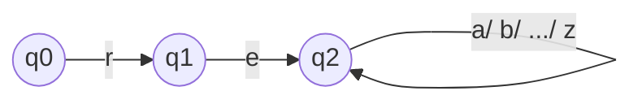

以下是《语音合成项目实战：C++代码解读》的技术博客文章正文内容：

# 语音合成项目实战：C++代码解读

## 1. 背景介绍

随着人工智能和语音技术的飞速发展，语音合成已经广泛应用于各个领域,如虚拟助手、无人驾驶、智能家居等。语音合成技术可以将文本转换为自然语音输出,为人机交互提供了全新的体验。在本文中,我们将深入探讨一个基于C++的语音合成项目,剖析其核心算法和实现细节。

### 1.1 语音合成概述

语音合成是一种将文本转换为语音的过程,包括以下三个主要步骤:

1. **文本分析**: 对输入文本进行预处理,如分词、词性标注等,为后续步骤做准备。
2. **语音建模**: 根据文本特征选择合适的语音单元(如音素、词等),并确定相应的语音参数(如音高、音长等)。
3. **波形合成**: 根据语音参数,合成出最终的语音波形。

### 1.2 项目意义

本项目旨在提供一个高效、可扩展的语音合成框架,支持多种语言和多种合成算法。通过深入研究其核心原理和实现细节,我们可以更好地理解语音合成的工作机制,为未来的技术创新奠定基础。

## 2. 核心概念与联系

在深入探讨算法细节之前,我们先介绍一些核心概念及其相互关系。

### 2.1 文本分析

文本分析是语音合成的第一步,主要包括以下几个步骤:

1. **分词**: 将文本按照一定规则分割成单词序列。
2. **词性标注**: 为每个单词赋予相应的词性标记,如名词、动词等。
3. **语音标注**: 根据单词及其词性,确定其发音形式(如音素序列)。

这些步骤的输出将为后续的语音建模提供基础数据。

### 2.2 语音建模

语音建模的主要任务是根据文本特征,选择合适的语音单元,并确定相应的语音参数。常用的语音单元包括:

- **音素**: 构成语音的最小发音单位。
- **半语音**: 由几个相邻音素构成的较大发音单位。
- **词**: 以单词为发音单位。

语音参数则描述了每个语音单元的发音特征,如音高、音长、能量等。不同的语音建模算法会采用不同的语音单元和参数表示方式。

### 2.3 波形合成

波形合成的目标是根据语音参数,生成最终的语音波形。常用的合成方法包括:

- **连接式合成**: 将预先录制的语音单元(如音素、半语音等)连接起来。
- **统计参数合成**: 基于语音参数,使用统计模型(如隐马尔可夫模型)生成语音波形。
- **神经网络合成**: 利用深度学习模型直接从语音参数生成语音波形。

不同的合成方法在自然度、效率等方面有所差异,需要根据具体应用场景进行权衡选择。

### 2.4 核心模块关系

上述三个步骤相互依赖,构成了语音合成系统的核心模块,如下图所示:


其中,文本分析模块的输出将作为语音建模的输入;语音建模则为波形合成提供必要的语音参数;最终,波形合成模块生成的语音波形即为系统的最终输出。

## 3. 核心算法原理具体操作步骤

接下来,我们将详细介绍本项目中采用的核心算法原理及其具体操作步骤。

### 3.1 文本分析算法

本项目采用了基于有限状态机的文本分析算法,具体步骤如下:

1. **构建词典**: 将所有单词及其发音形式(音素序列)存储在词典中。
2. **构建状态机**: 根据词典,构建一个确定性有限状态自动机(DFA),用于识别文本中的单词。
3. **文本扫描**: 使用构建好的DFA扫描输入文本,识别出单词序列及其对应的音素序列。
4. **词性标注**: 基于规则或统计模型,为每个单词赋予相应的词性标记。

该算法的优点是高效、可扩展,缺点是需要预先构建词典,对新词支持不佳。

### 3.2 语音建模算法

本项目采用了基于半语音的语音建模算法,具体步骤如下:

1. **构建语音库**: 预先录制一组覆盖全部发音的半语音单元,并存储在语音库中。
2. **半语音选择**: 根据输入的音素序列,从语音库中选择最佳的半语音序列。
3. **语音参数生成**: 为每个半语音单元生成相应的语音参数,如音高、音长等。

该算法的优点是合成质量较高,缺点是需要预先录制大量语音单元,库的构建成本较高。

### 3.3 波形合成算法

本项目采用了基于PSOLA(Pitch Synchronous Overlap and Add)的波形合成算法,具体步骤如下:

1. **语音单元切分**: 将语音库中的半语音单元切分成若干个周期,每个周期对应一个基本周期信号。
2. **时间尺度修改**: 根据目标音长,对每个基本周期信号进行时间尺度修改。
3. **重叠相加**: 将修改后的基本周期信号按照指定的音高和能量参数进行重叠相加,合成出最终的语音波形。

该算法的优点是合成质量较高、计算效率较好,缺点是对语音单元的切分和修改可能引入一些失真。

## 4. 数学模型和公式详细讲解举例说明

在上述算法中,涉及到了一些重要的数学模型和公式,我们将对其进行详细讲解和举例说明。

### 4.1 有限状态自动机

有限状态自动机(Finite State Automaton, FSA)是一种广泛应用于文本处理的数学模型。在本项目的文本分析算法中,我们使用确定性有限状态自动机(Deterministic Finite Automaton, DFA)来识别文本中的单词。

DFA可以形式化地定义为一个五元组 $(Q, \Sigma, \delta, q_0, F)$,其中:

- $Q$ 是一个有限的状态集合
- $\Sigma$ 是一个有限的输入符号集合
- $\delta: Q \times \Sigma \rightarrow Q$ 是一个状态转移函数
- $q_0 \in Q$ 是初始状态
- $F \subseteq Q$ 是一个终止状态集合

DFA的工作过程如下:给定一个输入字符串 $s = s_1s_2...s_n$,其中 $s_i \in \Sigma$,从初始状态 $q_0$ 开始,根据状态转移函数 $\delta$ 进行状态转移,直到到达某个终止状态或无法继续转移为止。如果最终到达了终止状态,则认为该字符串被接受;否则,被拒绝。

例如,假设我们要构建一个DFA来识别所有以"re"开头的单词。那么,相应的DFA可以定义为:

- $Q = \{q_0, q_1, q_2\}$
- $\Sigma = \{a, b, ..., z\}$
- $\delta(q_0, r) = q_1, \delta(q_1, e) = q_2, \delta(q_2, a) = q_2, \delta(q_2, b) = q_2, ..., \delta(q_2, z) = q_2$
- $q_0$ 是初始状态
- $F = \{q_2\}$

该DFA的状态转移图如下:



可以看出,对于输入字符串"re..."或"red"等,该DFA将最终到达终止状态 $q_2$,因此被接受;而对于"ab..."或"abc"等字符串,则被拒绝。

在实际实现中,我们可以使用矩阵或哈希表等数据结构来高效存储和查找状态转移函数 $\delta$,从而提高文本分析的效率。

### 4.2 时间尺度修改

在PSOLA波形合成算法中,需要对语音单元进行时间尺度修改,以满足目标音长要求。常用的时间尺度修改方法是基于周期性信号的周期重采样(Periodic Resampling)。

假设原始语音单元的采样率为 $f_s$,基本周期为 $T_0$,目标音长对应的周期为 $T_d$。那么,周期重采样的核心思想是:在每个基本周期内,等距离地取 $\lceil T_d / T_0 \rceil$ 个采样点,并使用这些采样点来重构新的周期信号。

设原始周期信号为 $x(n)$,其中 $n = 0, 1, ..., N-1$,重构后的周期信号为 $y(m)$,其中 $m = 0, 1, ..., M-1$。那么,周期重采样的数学表达式为:

$$
y(m) = x\left(\left\lfloor \frac{mN}{M} \right\rfloor\right), \quad m = 0, 1, ..., M-1
$$

其中,函数 $\lfloor \cdot \rfloor$ 表示向下取整。

例如,假设原始周期信号为 $x(n) = \sin(2\pi n / 10)$,其中 $n = 0, 1, ..., 9$,采样率为 $f_s = 10$ kHz。现在,我们需要将其音长延长1.5倍,即 $T_d = 1.5T_0$。那么,重构后的周期信号将为:

$$
y(m) = \sin\left(2\pi \left\lfloor \frac{6m}{10} \right\rfloor / 10\right), \quad m = 0, 1, ..., 14
$$

通过这种方式,我们可以在保持基本周期形状的同时,调整语音单元的音长,从而满足目标音长要求。

## 5. 项目实践:代码实例和详细解释说明

为了更好地理解上述算法的实现细节,我们将提供一些核心代码实例,并进行详细的解释说明。

### 5.1 文本分析模块

以下是文本分析模块的核心代码片段,实现了基于DFA的单词识别功能:

```cpp
// 定义状态转移函数
unordered_map<int, unordered_map<char, int>> delta;

// 构建DFA
void build_dfa(const vector<string>& words) {
    int state = 0;
    for (const string& word : words) {
        int prev = 0;
        for (char c : word) {
            if (!delta[prev].count(c)) {
                delta[prev][c] = ++state;
            }
            prev = delta[prev][c];
        }
        delta[prev]['\0'] = 0; // 添加单词结束标记
    }
}

// 文本扫描
vector<string> scan_text(const string& text) {
    vector<string> words;
    int state = 0;
    string word;
    for (char c : text) {
        if (delta[state].count(c)) {
            word += c;
            state = delta[state][c];
        } else {
            if (delta[state].count('\0')) {
                words.push_back(word);
                word.clear();
            } else {
                word.clear();
            }
            state = 0;
        }
    }
    if (!word.empty() && delta[state].count('\0')) {
        words.push_back(word);
    }
    return words;
}
```

在上述代码中,我们使用一个哈希表 `delta` 来存储状态转移函数。`build_dfa` 函数根据输入的单词列表构建DFA,而 `scan_text` 函数则使用构建好的DFA对输入文本进行扫描,识别出单词序列。

该实现的优点是简洁高效,缺点是需要预先构建词典,对新词支持不佳。在实际应用中,我们可以考虑引入更加复杂的分词算法,如基于统计模型的分词等。

### 5.2 语音建模模块

以下是语音建模模块的核心代码片段,实现了基于半语音的语音参数生成功能:

```cpp
// 语音库
vector<HalfPhone> phone_lib;

// 半语音选择
vector<HalfPhone> select_half