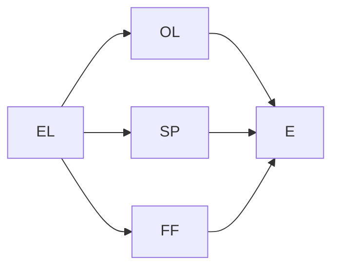

---

# Bayesian Networks: Principles and Code Examples

## 1. Background Introduction

### 1.1 Definition and Brief History

Bayesian networks (BNs) are a type of probabilistic graphical model (PGM) that represents a set of variables and their conditional dependencies using a directed acyclic graph (DAG). They are named after Thomas Bayes, who introduced the Bayesian probability theory upon which BNs are based. The concept of BNs was first proposed by Judea Pearl in the 1980s, and since then, they have gained significant attention in various fields, including artificial intelligence, machine learning, statistics, and decision analysis.

### 1.2 Importance and Applications

Bayesian networks offer a powerful tool for reasoning under uncertainty, as they allow us to represent complex relationships between variables and perform probabilistic inference. They have numerous applications in areas such as:

- Expert systems
- Diagnosis and prognosis
- Risk analysis
- Decision making
- Sensor networks
- Bioinformatics
- Natural language processing
- Robotics

## 2. Core Concepts and Connections

### 2.1 Probability Theory and Bayes' Theorem

To understand Bayesian networks, it is essential to have a solid grasp of probability theory and Bayes' theorem. Bayes' theorem provides a way to update the probability of a hypothesis given evidence, and it is the foundation of Bayesian inference.

$$
P(A|B) = \\frac{P(B|A)P(A)}{P(B)}
$$

### 2.2 Directed Acyclic Graphs (DAGs)

A directed acyclic graph (DAG) is a graph in which there are no cycles and all edges are directed. In Bayesian networks, each node represents a variable, and the edges represent the conditional dependencies between the variables.

### 2.3 Conditional Independence

A crucial concept in Bayesian networks is conditional independence. Two variables X and Y are conditionally independent given a set of variables Z if the probability of X and Y depends only on Z and not on each other. In other words, knowing Z provides no additional information about the relationship between X and Y.

## 3. Core Algorithm Principles and Specific Operational Steps

### 3.1 Learning Bayesian Networks

There are two main approaches to learning Bayesian networks:

1. Structural learning: Determining the topology (structure) of the network based on the data.
2. Parameter learning: Estimating the conditional probability distributions (CPDs) for each node in the network.

### 3.2 Inference in Bayesian Networks

Inference in Bayesian networks involves calculating the posterior probability of a query variable given the evidence and the network structure. There are several inference algorithms available, including:

1. Bayesian propagation (also known as the junction tree algorithm)
2. Variable elimination
3. Markov chain Monte Carlo (MCMC) methods
4. Monte Carlo sampling

## 4. Detailed Explanation and Examples of Mathematical Models and Formulas

### 4.1 Joint Probability and Marginal Probability

The joint probability of a set of variables is the probability of all variables in the set occurring together. The marginal probability of a variable is the probability of that variable occurring without considering the other variables.

### 4.2 Conditional Probability Tables (CPTs)

A conditional probability table (CPT) is a table that lists the conditional probabilities for each node in the network. It is used to represent the conditional dependencies between variables.

### 4.3 Bayesian Network Example: Diagnosing a Car Problem

Consider a simple Bayesian network for diagnosing a car problem. The variables are:

- Engine light (EL)
- Oil level (OL)
- Spark plugs (SP)
- Fuel filter (FF)
- Engine (E)

The network structure is as follows:

## 5. Project Practice: Code Examples and Detailed Explanations

### 5.1 Learning Bayesian Networks with Python

There are several Python libraries for learning and working with Bayesian networks, such as `pyBayesNet`, `pyBN`, and `pyMC3`. In this section, we will use `pyBN` to learn a simple Bayesian network.

### 5.2 Inference in Bayesian Networks with Python

Once we have learned the Bayesian network, we can perform inference to find the posterior probability of a query variable given evidence. We will use the `pyBN` library to demonstrate this.

## 6. Practical Application Scenarios

### 6.1 Diagnosing Diseases with Bayesian Networks

Bayesian networks can be used to diagnose diseases by modeling the symptoms and their relationships. For example, a Bayesian network can be built to diagnose diabetes based on symptoms such as age, weight, family history, and blood pressure.

### 6.2 Spam Filtering with Bayesian Networks

Bayesian networks can be used for spam filtering by modeling the characteristics of spam and non-spam emails. The network can learn the probability of a message being spam based on features such as the sender, subject, and content.

## 7. Tools and Resources Recommendations

### 7.1 Books

- \"Probabilistic Reasoning in Intelligent Systems: Networks of Plausible Inference\" by Judea Pearl
- \"Bayesian Reasoning and Machine Learning\" by David Barber

### 7.2 Online Resources

- [Stanford's CS224: Probabilistic Graphical Models](https://web.stanford.edu/class/cs224/)
- [UCI Machine Learning Repository: Bayesian Networks](https://archive.ics.uci.edu/ml/datasets/Bayesian+Networks)

## 8. Summary: Future Development Trends and Challenges

### 8.1 Future Development Trends

- Integration with deep learning
- Scalability to handle large-scale data
- Real-time inference
- Interpretable machine learning

### 8.2 Challenges

- Handling complex dependencies
- Handling missing data
- Handling noisy data
- Handling high-dimensional data

## 9. Appendix: Frequently Asked Questions and Answers

### 9.1 What is the difference between Bayesian networks and Markov networks?

Markov networks are another type of probabilistic graphical model that represents the joint probability distribution of a set of variables. The main difference between Bayesian networks and Markov networks is that Bayesian networks have a directed acyclic graph structure, while Markov networks have an undirected graph structure.

### 9.2 How do I choose the best Bayesian network structure for my problem?

Choosing the best Bayesian network structure depends on the problem at hand and the available data. There are various structural learning algorithms available, such as the K2 algorithm, the PC algorithm, and the score-based algorithm. It is essential to evaluate the performance of different structures and choose the one that best fits the problem.

### 9.3 How do I handle missing data in Bayesian networks?

Missing data can be handled in Bayesian networks using various methods, such as maximum likelihood estimation, expectation-maximization (EM) algorithm, and multiple imputation. The choice of method depends on the nature of the missing data and the available data.

## Author: Zen and the Art of Computer Programming

---