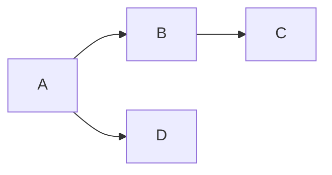
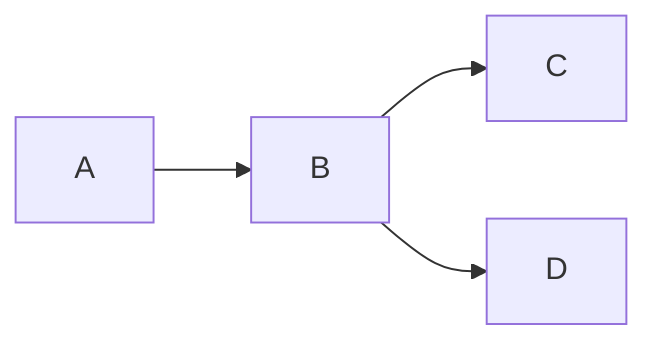
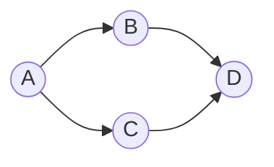
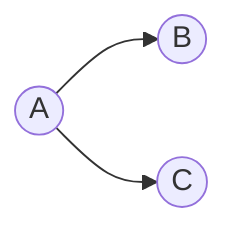
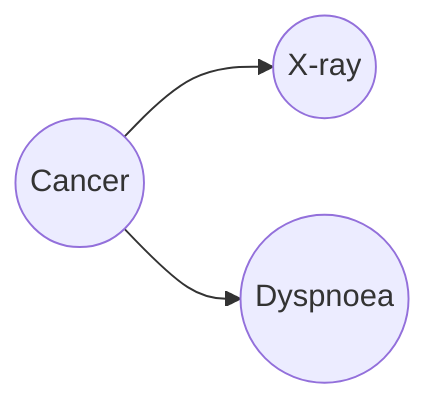

# 贝叶斯网络 原理与代码实例讲解

## 1. 背景介绍

### 1.1 什么是贝叶斯网络?

贝叶斯网络(Bayesian Network)是一种基于概率论的图形模型,用于表示多个随机变量之间的条件独立性关系。它由一组节点(表示随机变量)和连接这些节点的有向边(表示变量之间的依赖关系)组成。贝叶斯网络通过图形结构直观地展示了变量之间的因果关系,并利用贝叶斯定理对这些关系进行推理和预测。

### 1.2 贝叶斯网络的应用

贝叶斯网络在许多领域都有广泛的应用,例如:

- 医疗诊断系统:根据症状和检查结果推断疾病概率
- 风险评估:评估金融风险、信用风险等
- 故障诊断:诊断系统故障原因
- 自然语言处理:文本分类、情感分析等
- 生物信息学:基因调控网络分析
- 机器学习:结构化数据挖掘

贝叶斯网络的优势在于能够处理不确定性和缺失数据,并且具有很强的解释能力。

## 2. 核心概念与联系

### 2.1 有向无环图(DAG)

贝叶斯网络的基础结构是一个有向无环图(Directed Acyclic Graph, DAG)。DAG由节点和有向边组成,每个节点表示一个随机变量,有向边表示变量之间的依赖关系。无环性质保证了图中不存在循环依赖。



### 2.2 条件独立性

DAG结构能够通过d-separation(d分离)概念来表示条件独立性关系。如果给定条件X,使得Y和Z在DAG中被X"d分离",那么Y和Z在给定X的条件下就是条件独立的。这种条件独立性关系能够大大简化联合概率分布的计算。



在上图中,给定B的情况下,A和C、D是条件独立的。

### 2.3 贝叶斯定理

贝叶斯定理是贝叶斯网络的核心,它提供了在给定证据的情况下,对事件概率进行修正的方法:

$$P(A|B) = \frac{P(B|A)P(A)}{P(B)}$$

其中,P(A|B)是在给定B的证据下,A事件发生的后验概率;P(A)是A的先验概率;P(B|A)是A发生的情况下,B发生的概率;P(B)是B的边缘概率。

通过贝叶斯定理,我们可以在获得新证据时,对事件的概率进行动态更新。

## 3. 核心算法原理具体操作步骤  

### 3.1 构建贝叶斯网络模型

构建贝叶斯网络模型的主要步骤包括:

1. **确定变量**:确定需要建模的随机变量集合。
2. **构建DAG结构**:根据专家知识或数据,确定变量之间的依赖关系,构建DAG结构。
3. **定义条件概率表(CPT)**:为每个节点及其父节点确定条件概率分布。



上图是一个简单的贝叶斯网络示例,其中A、B、C、D是随机变量节点,有向边表示依赖关系。我们需要为每个节点定义条件概率表CPT(A)、CPT(B|A)、CPT(C|A)和CPT(D|B,C)。

### 3.2 概率推理

在构建好贝叶斯网络模型后,我们可以进行概率推理,包括:

1. **预测推理(prediction)**:利用观测到的证据,计算查询变量的后验概率分布。
2. **诊断推理(diagnosis)**:利用查询变量的状态,推断出观测变量的最可能取值。
3. **intercausal推理**:推断出两个或多个因变量之间的关系。
4. **联合概率计算**:计算多个变量同时发生的联合概率。

常用的概率推理算法包括:

- **枚举法**:通过枚举所有可能的情况,计算联合概率分布。
- **变量消元法**:利用条件独立性,化简计算联合概率分布的过程。
- **信念传播算法**:在贝叶斯网络上传递信息,高效计算后验概率分布。

### 3.3 参数学习

在构建贝叶斯网络时,我们需要为每个节点的条件概率表CPT指定参数值。如果有足够的训练数据,我们可以通过**参数学习**从数据中估计这些参数值。常用的参数学习算法包括:

- **最大似然估计(MLE)**:通过最大化观测数据的似然函数,估计CPT参数。
- **贝叶斯估计**:在MLE的基础上,引入先验分布,结合先验知识和数据进行参数估计。

### 3.4 结构学习

在某些情况下,我们可能无法确定贝叶斯网络的结构(即DAG)。这时我们可以通过**结构学习**算法,从数据中自动学习网络结构。常用的结构学习算法有:

- **基于约束的学习**:利用条件独立性测试,识别满足d-separation的DAG结构。
- **基于评分的学习**:通过评分函数(如BIC、MDL等)对不同结构进行评分,选择最优结构。
- **混合算法**:结合约束和评分的优点,提高学习效率。

结构学习是一个NP难问题,需要付出大量计算代价。在实践中,我们通常结合先验知识和数据,交互式地构建贝叶斯网络模型。

## 4. 数学模型和公式详细讲解举例说明

### 4.1 贝叶斯网络的数学模型

设X是一组随机变量,X = {X1, X2, ..., Xn},它们的联合概率分布可以表示为:

$$P(X_1,X_2,...,X_n) = \prod_{i=1}^n P(X_i|Pa(X_i))$$

其中,Pa(Xi)表示Xi的父节点集合。

在贝叶斯网络中,由于条件独立性假设,联合概率分布可以被分解为各个节点条件概率分布的乘积。这种分解大大简化了计算复杂度。

例如,对于下面这个简单的贝叶斯网络:



其联合概率分布可以表示为:

$$P(A,B,C) = P(A)P(B|A)P(C|A)$$

### 4.2 贝叶斯定理和概率推理

贝叶斯定理为我们提供了在获得新证据时,对事件概率进行修正的方法:

$$P(X|e) = \frac{P(e|X)P(X)}{P(e)}$$

其中,P(X|e)是在给定证据e的情况下,X发生的后验概率;P(X)是X的先验概率;P(e|X)是X发生时,e发生的概率;P(e)是证据e的边缘概率。

通过贝叶斯定理,我们可以在贝叶斯网络中进行概率推理,计算查询变量的后验概率分布。例如,在下面这个简单的医学诊断网络中:



我们可以计算在观测到X-ray结果为阳性(X=x)的情况下,患者患癌症(C=c)的后验概率:

$$P(C=c|X=x) = \frac{P(X=x|C=c)P(C=c)}{P(X=x)}$$

其中,P(X=x|C=c)和P(C=c)可以从网络参数中获得,P(X=x)则需要通过边缘化计算得到。

### 4.3 参数学习

在贝叶斯网络中,我们需要为每个节点的条件概率表CPT估计参数值。假设节点X有k个离散值{x1, x2, ..., xk},它有n个父节点Y1, Y2, ..., Yn,每个父节点Yi有ri个离散值。那么CPT(X|Y1, Y2, ..., Yn)需要估计的参数数量为:

$$\prod_{i=1}^n r_i \times (k-1)$$

如果我们有一个完整的数据集D,包含m个样本,其中第j个样本为(x[j], y1[j], y2[j], ..., yn[j]),那么我们可以使用**最大似然估计(MLE)**来估计CPT参数:

$$\hat{\theta}_{x_l|y_1,y_2,...,y_n} = \frac{\sum_{j=1}^m I(x[j]=x_l, y_1[j]=y_1, ..., y_n[j]=y_n)}{\sum_{j=1}^m I(y_1[j]=y_1, ..., y_n[j]=y_n)}$$

其中,I(·)是示性函数,当条件成立时取值1,否则取值0。分子是在给定父节点值的情况下,X取值xl的样本数;分母是父节点取该值的样本数。

通过MLE,我们可以从数据中学习出CPT参数的最大似然估计值。在数据较少的情况下,我们还可以使用**贝叶斯估计**,引入先验分布,结合先验知识和数据进行参数估计。

## 5. 项目实践:代码实例和详细解释说明

下面我们将使用Python中的Pomegranate库,构建一个简单的贝叶斯网络模型,并进行概率推理。

### 5.1 安装Pomegranate库

Pomegranate是一个面向对象的Python概率模型包,支持贝叶斯网络、隐马尔可夫模型、naive bayes等模型。我们可以使用pip安装:

```bash
pip install pomegranate
```

### 5.2 构建贝叶斯网络模型

我们将构建一个简单的学生考试成绩预测模型。假设有以下几个影响因素:

- 学习努力程度(Effort)
- 教师教学水平(Teaching)
- 学生智力(Intelligence)
- 家庭环境(Environment)

我们用这些因素来预测学生的考试成绩(Score)。首先定义状态值:

```python
from pomegranate import *

# 定义状态值
effort_states = ['low', 'high']
teaching_states = ['poor', 'good']
intelligence_states = ['low', 'high'] 
environment_states = ['poor', 'good']
score_states = ['low', 'medium', 'high']
```

然后构建节点:

```python
# 构建节点
Effort = Node(effort_states, name="Effort")
Teaching = Node(teaching_states, name="Teaching")
Intelligence = Node(intelligence_states, name="Intelligence")
Environment = Node(environment_states, name="Environment")
Score = Node(score_states, name="Score")
```

接下来定义网络结构和CPT:

```python
# 构建网络结构
model = BayesianNetwork("Student")
model.add_states(Effort, Teaching, Intelligence, Environment, Score)
model.add_edge(Effort, Score)
model.add_edge(Teaching, Score)
model.add_edge(Intelligence, Score)
model.add_edge(Environment, Score)

# 定义CPT
model.add_cpds(TabularCPD(Effort, 0.5, 0.5))
model.add_cpds(TabularCPD(Teaching, 0.7, 0.3))
model.add_cpds(TabularCPD(Intelligence, 0.6, 0.4))
model.add_cpds(TabularCPD(Environment, 0.4, 0.6))

# 定义Score的CPT
cpd = TabularCPD(Score, 
                 [0.1, 0.6, 0.3, 0.2, 0.5, 0.3, 0.7, 0.2, 0.1, 0.3, 0.4, 0.3],
                 evidence=['Effort', 'Teaching', 'Intelligence', 'Environment'],
                 evidence_card=[2, 2, 2, 2])
model.add_cpds(cpd)
```

这里我们使用TabularCPD来定义CPT,可以直接指定条件概率值。上面的代码定义了Score的CPT,它是一个12维向量,对应于4个父节点的所有可能取值组合。

例如,第一个值0.1表示:当Effort=low、Teaching=poor、Intelligence=low、Environment=poor时,Score=low的概率为0.1。

### 5.3 概率推理

构建好模型后,