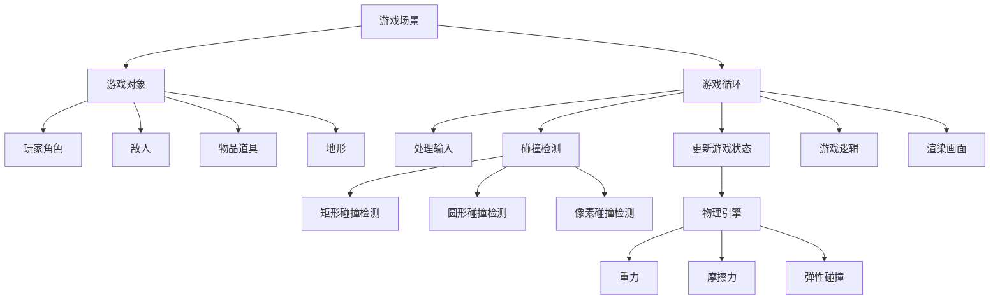

# 超级玛丽游戏的设计与实现

## 1. 背景介绍

### 1.1 超级玛丽游戏概述

超级玛丽(Super Mario)是由任天堂公司开发的一款经典平台跳跃类游戏。自1985年首次发布以来,超级玛丽系列游戏凭借其创新的游戏设计、丰富多彩的关卡、可爱的角色形象和优秀的可玩性,在全球范围内获得了巨大的成功,成为了电子游戏历史上的里程碑之作。

### 1.2 超级玛丽游戏的影响力

超级玛丽不仅为任天堂公司带来了巨大的商业成功,更重要的是它为后来的平台跳跃类游戏确立了游戏设计的标准和模式。无数的游戏开发者从超级玛丽的游戏设计中汲取灵感,诞生了众多优秀的游戏作品。可以说,如果没有超级玛丽,就不会有现在如此繁荣的平台跳跃游戏。

### 1.3 开发超级玛丽游戏的意义

对于游戏开发者而言,深入剖析超级玛丽的游戏设计,了解其背后的技术实现原理,对于提高自身的游戏开发水平和能力有着重要的意义。通过对超级玛丽游戏的学习和模仿,可以掌握平台跳跃类游戏的核心设计要素和实现技术,为开发出更加优秀的游戏作品打下坚实的基础。

## 2. 核心概念与联系

### 2.1 游戏对象

在超级玛丽游戏中,一切皆对象。玩家控制的角色马里奥、各种敌人、砖块、金币、道具等游戏元素都被抽象为不同的游戏对象,它们具有各自的属性和行为。理解并合理设计这些游戏对象是游戏开发的基础。

### 2.2 游戏场景

游戏场景是所有游戏对象的容器,它负责管理和更新所有的游戏对象,并处理它们之间的交互。一个典型的游戏场景包含了关卡地图、玩家角色、敌人、物品等游戏元素。

### 2.3 游戏循环

游戏循环是游戏的核心,它不断地更新游戏状态、渲染画面,处理用户输入和游戏逻辑,让游戏不断地运行下去。一个典型的游戏循环包括以下步骤:处理输入、更新游戏状态、碰撞检测、游戏逻辑、渲染画面等。

### 2.4 碰撞检测 

碰撞检测是平台跳跃类游戏的核心玩法,它决定了角色与场景中其他物体的交互方式。常见的碰撞检测方法有:矩形碰撞检测、圆形碰撞检测、像素碰撞检测等。选择合适的碰撞检测方法可以提高游戏的性能和玩法丰富度。

### 2.5 物理引擎

物理引擎为游戏提供了真实的物理效果,如重力、摩擦力、弹性碰撞等。引入物理引擎可以极大地提升游戏的真实感和趣味性,让玩家获得更加身临其境的游戏体验。常用的2D物理引擎有Box2D、Chipmunk等。

### 2.6 关系图

下面使用Mermaid绘制了超级玛丽游戏中核心概念之间的关系图:



从图中可以清晰地看出,游戏场景管理着所有的游戏对象和游戏循环;游戏对象包括玩家角色、敌人、物品道具和地形等;游戏循环负责处理输入、更新游戏状态、碰撞检测、游戏逻辑和渲染画面;碰撞检测和物理引擎为游戏提供真实的物理效果和交互玩法。理解这些核心概念之间的关系,是设计和开发超级玛丽游戏的关键。

## 3. 核心算法原理具体操作步骤

### 3.1 玩家角色控制

1. 监听键盘输入事件,根据输入更新角色的速度属性
2. 根据速度属性更新角色的位置坐标
3. 处理角色的跳跃、下落等状态切换
4. 根据角色状态播放相应的动画

### 3.2 敌人AI

1. 根据敌人类型设置不同的行为模式,如巡逻、追击、逃跑等
2. 更新敌人的位置坐标,实现移动行为
3. 根据玩家位置、自身状态等条件触发相应的行为逻辑
4. 播放敌人的动画效果

### 3.3 地图滚动

1. 根据玩家角色的位置,计算地图需要滚动的距离
2. 更新地图中所有游戏对象的位置坐标
3. 绘制可视区域内的地图元素
4. 动态加载和卸载地图资源,优化内存占用

### 3.4 碰撞检测

1. 遍历所有可碰撞的游戏对象,检测它们之间是否发生碰撞
2. 根据碰撞对象的类型(如角色、敌人、道具等)触发相应的游戏逻辑
3. 处理碰撞后的物理效果,如弹开、击飞、销毁等
4. 优化碰撞检测算法,提高检测效率和精度

### 3.5 游戏状态管理

1. 定义游戏的各种状态,如开始菜单、游戏中、游戏结束等
2. 根据用户输入和游戏逻辑切换不同的游戏状态
3. 在不同状态下执行相应的更新和渲染逻辑
4. 管理游戏的全局数据,如得分、生命值、关卡进度等

## 4. 数学模型和公式详细讲解举例说明

### 4.1 角色跳跃模型

角色的跳跃可以用一个简单的物理模型来描述。设角色的初始纵向速度为$v_0$,重力加速度为$g$,时间为$t$,则角色在$t$时刻的纵向位移$y$为:

$$y = v_0t - \frac{1}{2}gt^2$$

当角色的纵向速度为0时,达到跳跃的最高点。设最高点的位移为$y_{max}$,则有:

$$y_{max} = \frac{v_0^2}{2g}$$

根据这个公式,我们可以计算出角色跳跃的高度,从而控制跳跃的效果。例如,如果我们设定$v_0=20m/s$,$g=10m/s^2$,则角色的最大跳跃高度为:

$$y_{max} = \frac{20^2}{2 \times 10} = 20m$$

### 4.2 敌人的追击模型

当敌人进入追击状态时,我们可以用一个简单的向量模型来描述敌人的移动方向和速度。设敌人的位置为$P_e(x_e,y_e)$,玩家角色的位置为$P_p(x_p,y_p)$,敌人的速度为$v_e$,则敌人的移动方向向量$\vec{d}$为:

$$\vec{d} = \frac{\overrightarrow{P_eP_p}}{\left|\overrightarrow{P_eP_p}\right|} = \frac{(x_p-x_e,y_p-y_e)}{\sqrt{(x_p-x_e)^2+(y_p-y_e)^2}}$$

敌人的实际移动速度向量$\vec{v}$为:

$$\vec{v} = v_e \cdot \vec{d}$$

根据这个公式,我们可以实时计算出敌人的移动方向和速度,从而实现敌人的追击行为。

### 4.3 镜头跟随模型

为了让玩家角色始终处于屏幕中心,我们需要动态调整镜头的位置。设屏幕的宽度为$w$,高度为$h$,玩家角色的位置为$P_p(x_p,y_p)$,则镜头的位置$P_c(x_c,y_c)$为:

$$x_c = x_p - \frac{w}{2}$$
$$y_c = y_p - \frac{h}{2}$$

根据这个公式,我们可以实时计算出镜头的位置,从而实现镜头跟随玩家角色的效果。

## 5. 项目实践:代码实例和详细解释说明

下面以Python和Pygame库为例,展示超级玛丽游戏的核心代码实现。

### 5.1 游戏主循环

```python
import pygame

# 游戏初始化
pygame.init()
screen = pygame.display.set_mode((800, 600))
clock = pygame.time.Clock()

# 游戏主循环
while True:
    # 处理事件
    for event in pygame.event.get():
        if event.type == pygame.QUIT:
            pygame.quit()
            sys.exit()
    
    # 更新游戏状态
    update_game()
    
    # 绘制游戏画面  
    draw_game(screen)
    
    # 更新屏幕
    pygame.display.update()
    clock.tick(60)  # 设置帧率为60fps
```

这段代码展示了一个典型的Pygame游戏主循环结构。在每一帧中,我们依次处理事件、更新游戏状态、绘制游戏画面,并通过设置帧率来控制游戏速度。

### 5.2 玩家角色类

```python
class Player(pygame.sprite.Sprite):
    def __init__(self):
        super().__init__()
        self.image = pygame.Surface((40, 60))
        self.image.fill((255, 0, 0))
        self.rect = self.image.get_rect()
        self.speed = 5
        self.jump_force = 15
        self.gravity = 0.8
        self.vel_y = 0
    
    def update(self):
        keys = pygame.key.get_pressed()
        if keys[pygame.K_LEFT]:
            self.rect.x -= self.speed
        if keys[pygame.K_RIGHT]:
            self.rect.x += self.speed
        
        self.vel_y += self.gravity
        self.rect.y += self.vel_y
        
        if keys[pygame.K_SPACE] and self.rect.bottom == 500:
            self.vel_y = -self.jump_force
    
    def draw(self, screen):
        screen.blit(self.image, self.rect)
```

这段代码定义了一个玩家角色类`Player`,它继承自`pygame.sprite.Sprite`。在`__init__`方法中,我们初始化了角色的图像、位置、速度、跳跃力和重力等属性。在`update`方法中,我们根据键盘输入更新角色的位置,并处理跳跃逻辑。在`draw`方法中,我们将角色的图像绘制到屏幕上。

### 5.3 敌人类

```python
class Enemy(pygame.sprite.Sprite):
    def __init__(self):
        super().__init__() 
        self.image = pygame.Surface((40, 40))
        self.image.fill((0, 255, 0))
        self.rect = self.image.get_rect()
        self.speed = 3
        self.direction = 1
    
    def update(self):
        self.rect.x += self.speed * self.direction
        if self.rect.left < 0 or self.rect.right > 800:
            self.direction *= -1
    
    def draw(self, screen):
        screen.blit(self.image, self.rect)
```

这段代码定义了一个敌人类`Enemy`,它也继承自`pygame.sprite.Sprite`。在`__init__`方法中,我们初始化了敌人的图像、位置、速度和移动方向等属性。在`update`方法中,我们根据移动方向更新敌人的位置,并处理碰到屏幕边缘时的反向移动逻辑。在`draw`方法中,我们将敌人的图像绘制到屏幕上。

### 5.4 碰撞检测

```python
def update_game():
    player.update()
    enemy.update()
    
    if pygame.sprite.collide_rect(player,