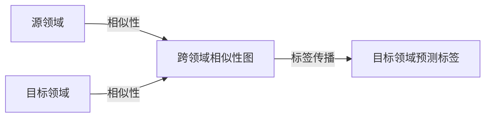

# 迁移学习与标签传播：跨领域标签传播算法研究

## 1. 背景介绍

### 1.1 迁移学习的兴起
随着人工智能和机器学习的快速发展,传统的机器学习方法在实际应用中面临着标注数据稀缺、训练数据与测试数据分布不一致等挑战。迁移学习作为一种新兴的机器学习范式,通过利用已有领域(源领域)的知识来辅助目标领域的学习任务,为解决上述问题提供了新的思路和方法。

### 1.2 标签传播算法概述
标签传播(Label Propagation)是一类重要的半监督学习算法,通过利用已标注样本和未标注样本之间的相似性,将已知标签信息传播到未标注样本,从而实现对未标注样本的标签预测。标签传播算法具有计算复杂度低、易于实现等优点,在图像分类、社交网络分析等领域得到了广泛应用。

### 1.3 跨领域标签传播的挑战与机遇
将标签传播算法应用于跨领域学习任务时,面临着源领域和目标领域数据分布差异大、特征空间不一致等挑战。如何有效利用源领域的标注信息,同时适应目标领域的数据特点,是跨领域标签传播算法需要解决的关键问题。这也为迁移学习与标签传播算法的结合提供了新的研究机遇。

## 2. 核心概念与联系

### 2.1 迁移学习的定义与分类
迁移学习是指利用已学习过的知识来辅助不同但相关领域的学习任务。根据源领域和目标领域的标注情况,可将迁移学习分为监督迁移、半监督迁移和无监督迁移等类型。

### 2.2 标签传播算法的数学基础
标签传播算法基于图论和矩阵分析,通过构建数据点之间的相似性图,利用图的拉普拉斯矩阵和标签矩阵进行迭代更新,最终实现对未标注样本的标签预测。其核心是基于平滑性假设,即在数据空间中相似的样本应具有相似的标签。

### 2.3 跨领域标签传播的思想
跨领域标签传播的基本思想是,利用源领域中的标注样本和目标领域中的未标注样本,通过构建跨领域的相似性图,在保持源领域标签信息的同时,利用领域之间的共享信息对目标领域样本进行标签传播和预测。

## 3. 核心算法原理与操作步骤

### 3.1 问题定义与符号说明
设源领域数据集为 $D_s=\{(x_i^s,y_i^s)\}_{i=1}^{n_s}$,目标领域数据集为 $D_t=\{x_j^t\}_{j=1}^{n_t}$,其中 $x_i^s, x_j^t$ 分别表示源领域和目标领域的样本, $y_i^s$ 表示源领域样本的标签, $n_s$ 和 $n_t$ 分别为源领域和目标领域的样本数量。

### 3.2 构建跨领域相似性图
将源领域和目标领域的样本集合在一起,构建一个包含 $n_s+n_t$ 个节点的无向图 $G=(V,E)$。节点集合 $V$ 由所有样本组成,边集合 $E$ 由样本之间的相似性关系决定。可选用高斯核函数计算样本之间的相似性权重:

$$
w_{ij} = \exp(-\frac{\|x_i-x_j\|^2}{2\sigma^2})
$$

其中 $\sigma$ 为核函数的带宽参数。

### 3.3 迭代传播标签信息 
定义标签矩阵 $F\in \mathbb{R}^{(n_s+n_t)\times c}$,其中 $c$ 为标签类别数。初始化时,源领域样本的标签行对应已知的one-hot编码,目标领域样本的标签行初始化为0。

标签传播的迭代公式为:

$$
F^{(t+1)} = \alpha SF^{(t)} + (1-\alpha)Y
$$

其中 $S=D^{-1}W$ 为归一化的相似性矩阵, $D$ 为图的度矩阵, $Y$ 为初始标签矩阵, $\alpha \in (0,1)$ 为平滑因子,控制标签传播的强度。

### 3.4 收敛性分析与停止条件
理论上,当迭代次数趋于无穷大时,标签传播算法会收敛到一个平稳状态。实际操作中,可设置最大迭代次数或标签变化的阈值作为停止条件。

### 3.5 目标领域样本标签预测
迭代结束后,目标领域样本的标签可根据标签矩阵 $F$ 的对应行进行预测:

$$
\hat{y}_j^t = \arg\max_{k} F_{jk}, \quad j=n_s+1,\dots,n_s+n_t
$$

其中 $\hat{y}_j^t$ 表示第 $j$ 个目标领域样本的预测标签。

## 4. 数学模型与公式详解

### 4.1 图拉普拉斯矩阵的性质
图的拉普拉斯矩阵 $L$ 定义为 $L=D-W$,其中 $D$ 为图的度矩阵, $W$ 为相似性矩阵。拉普拉斯矩阵是一个半正定矩阵,反映了图的平滑性和连通性。

### 4.2 标签传播算法的矩阵形式
标签传播算法可写成矩阵形式:

$$
F^{(t+1)} = \alpha D^{-1}WF^{(t)} + (1-\alpha)Y
$$

展开递推关系,可得到闭式解:

$$
F^{*} = (1-\alpha)(I-\alpha D^{-1}W)^{-1}Y
$$

其中 $I$ 为单位矩阵。闭式解揭示了标签传播算法的收敛性和稳定性。

### 4.3 谱聚类与标签传播的联系
标签传播算法与谱聚类有着密切的联系。谱聚类利用拉普拉斯矩阵的特征值和特征向量进行聚类,而标签传播算法可看作是在已知部分标签信息的基础上,利用图的平滑性进行标签传播和聚类的过程。

## 5. 项目实践:代码实例与详解

下面给出一个简单的Python代码实例,演示跨领域标签传播算法的实现:

```python
import numpy as np
from sklearn.metrics.pairwise import rbf_kernel

def label_propagation(X_s, y_s, X_t, alpha=0.9, max_iter=1000, tol=1e-3):
    """
    跨领域标签传播算法
    
    参数:
    X_s: 源领域特征矩阵, shape: (n_s, d)
    y_s: 源领域标签, shape: (n_s,)
    X_t: 目标领域特征矩阵, shape: (n_t, d)
    alpha: 平滑因子, 取值范围(0,1)
    max_iter: 最大迭代次数
    tol: 收敛阈值
    
    返回:
    y_t_pred: 目标领域预测标签
    """
    n_s, n_t = len(X_s), len(X_t)
    X = np.vstack([X_s, X_t])
    W = rbf_kernel(X)  # 计算相似性矩阵
    D = np.diag(np.sum(W, axis=1))  # 计算度矩阵
    
    F = np.zeros((n_s+n_t, y_s.max()+1))
    F[:n_s] = np.eye(y_s.max()+1)[y_s]  # 初始化标签矩阵
    
    for _ in range(max_iter):
        F_prev = F.copy()
        F = alpha * np.linalg.inv(D).dot(W).dot(F) + (1-alpha) * F
        if np.linalg.norm(F - F_prev) < tol:
            break
    
    y_t_pred = np.argmax(F[n_s:], axis=1)
    return y_t_pred
```

代码说明:
1. 首先将源领域和目标领域的特征矩阵合并,计算样本之间的相似性矩阵 $W$ 和度矩阵 $D$。
2. 初始化标签矩阵 $F$,源领域样本的标签用one-hot编码填充。
3. 迭代更新标签矩阵,直到达到最大迭代次数或满足收敛条件。
4. 根据收敛后的标签矩阵,对目标领域样本进行标签预测。

## 6. 实际应用场景

### 6.1 跨语言文本分类
利用资源丰富的语言(如英语)的标注数据,通过跨领域标签传播算法,实现对资源匮乏语言(如小语种)的文本分类。

### 6.2 跨模态图像分类
利用已标注的图像数据和未标注的文本描述,通过构建跨模态的相似性图,实现对未标注图像的分类。

### 6.3 社交网络用户属性推断
利用部分已知用户属性(如年龄、性别等)的社交网络数据,通过跨领域标签传播算法,推断未知用户的属性信息。

## 7. 工具与资源推荐

- scikit-learn: Python机器学习库,提供了标签传播算法的实现。
- TensorFlow/PyTorch: 深度学习框架,可用于实现基于神经网络的迁移学习方法。
- 数据集: Amazon Reviews, Office-31, Multilingual Reuters Collection等跨领域学习常用数据集。

## 8. 总结:未来发展趋势与挑战

### 8.1 基于深度学习的跨领域标签传播
利用深度神经网络学习领域不变的特征表示,结合标签传播算法,可进一步提升跨领域学习的性能。

### 8.2 多源领域标签传播
探索利用多个源领域的标注信息,通过设计合适的标签融合策略,实现更加鲁棒的跨领域标签传播。

### 8.3 主动学习与标签传播的结合
利用主动学习策略选择最有价值的样本进行标注,再通过标签传播算法扩大标注信息,可显著降低标注成本。

### 8.4 理论分析与收敛性保证
从理论角度分析跨领域标签传播算法的收敛性和泛化性能,为算法的改进和实际应用提供指导。

## 9. 附录:常见问题与解答

### Q1: 标签传播算法的时间复杂度如何?
A1: 标准标签传播算法的时间复杂度为 $O(n^3)$,其中 $n$ 为样本数量。通过近似计算和稀疏化优化,可将复杂度降低到 $O(n^2)$ 量级。

### Q2: 如何选择标签传播算法的平滑因子 $\alpha$?
A2: 平滑因子 $\alpha$ 控制标签传播的强度,需要根据任务特点和经验进行调节。通常取值在0.5到0.9之间。可通过交叉验证等方式选取最优值。

### Q3: 跨领域标签传播算法对源领域和目标领域的相似性有何要求?
A3: 跨领域标签传播算法假设源领域和目标领域存在一定的相似性,即它们共享某些潜在的特征表示。若两个领域差异过大,标签传播的效果可能会受到影响。需要针对具体任务设计合适的特征表示和相似性度量。

---

作者: 禅与计算机程序设计艺术 / Zen and the Art of Computer Programming

