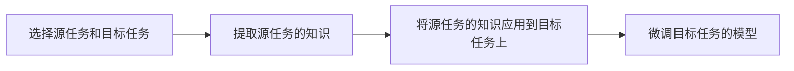

## 1.背景介绍

在当前的人工智能领域，深度学习已经在各个领域取得了显著的成果。然而，深度学习模型需要大量的标注数据进行训练，这在很多实际情况下是不现实的。为了解决这个问题，迁移学习应运而生。迁移学习的目标是将已经在一个任务上学到的知识，应用到另一个任务上，从而减少训练数据的需求。

## 2.核心概念与联系

在迁移学习中，我们通常将源任务（source task）的知识应用到目标任务（target task）上。这个过程通常分为以下几个步骤：

- 选择源任务和目标任务
- 提取源任务的知识
- 将源任务的知识应用到目标任务上
- 微调目标任务的模型

这四个步骤构成了迁移学习的基本流程。



## 3.核心算法原理具体操作步骤

迁移学习的核心是将源任务的知识应用到目标任务上。这通常可以通过以下几种方式实现：

- 特征迁移：这是最常见的迁移方式，即将源任务的特征提取器（通常是深度学习模型的前几层）应用到目标任务上，然后在目标任务上训练一个新的分类器。

- 模型微调：在特征迁移的基础上，我们还可以进一步微调模型的参数，使其更好地适应目标任务。

- 参数迁移：这种方式是直接将源任务的模型参数作为目标任务的初始参数，然后在目标任务上进行训练。

## 4.数学模型和公式详细讲解举例说明

在迁移学习中，我们通常需要度量源任务和目标任务之间的相似性。这可以通过计算源任务和目标任务之间的距离来实现。假设我们有源任务的特征空间$X_s$和目标任务的特征空间$X_t$，则它们之间的距离可以通过以下公式计算：

$$
d(X_s, X_t) = \sqrt{\sum_{i=1}^{n}(x_{si} - x_{ti})^2}
$$

其中，$n$是特征空间的维度，$x_{si}$和$x_{ti}$分别是$X_s$和$X_t$在第$i$维的特征值。

## 5.项目实践：代码实例和详细解释说明

下面我们来看一个具体的例子，我们将使用PyTorch框架进行实战。我们的源任务是ImageNet分类任务，目标任务是CIFAR-10分类任务。我们将使用预训练的ResNet模型作为特征提取器，并在其上训练一个新的分类器。

```python
# 导入所需的库
import torch
from torchvision import datasets, models, transforms

# 加载预训练的ResNet模型
model = models.resnet50(pretrained=True)

# 冻结模型的参数
for param in model.parameters():
    param.requires_grad = False

# 替换模型的最后一层，以适应新的任务
num_ftrs = model.fc.in_features
model.fc = torch.nn.Linear(num_ftrs, 10)

# 加载CIFAR-10数据集
transform = transforms.Compose([
    transforms.Resize(256),
    transforms.CenterCrop(224),
    transforms.ToTensor(),
    transforms.Normalize(mean=[0.485, 0.456, 0.406], std=[0.229, 0.224, 0.225]),
])
trainset = datasets.CIFAR10(root='./data', train=True, download=True, transform=transform)
trainloader = torch.utils.data.DataLoader(trainset, batch_size=64, shuffle=True)

# 训练模型
criterion = torch.nn.CrossEntropyLoss()
optimizer = torch.optim.SGD(model.fc.parameters(), lr=0.001)
for epoch in range(10):  # loop over the dataset multiple times
    running_loss = 0.0
    for i, data in enumerate(trainloader, 0):
        inputs, labels = data
        optimizer.zero_grad()
        outputs = model(inputs)
        loss = criterion(outputs, labels)
        loss.backward()
        optimizer.step()
        running_loss += loss.item()
    print('Epoch %d loss: %.3f' % (epoch + 1, running_loss / len(trainloader)))
```

## 6.实际应用场景

迁移学习在许多实际应用中都有广泛的应用，例如：

- 图像识别：在图像识别任务中，我们通常使用在大规模数据集（如ImageNet）上预训练的模型作为特征提取器，然后在目标任务上训练一个新的分类器。

- 自然语言处理：在自然语言处理任务中，我们通常使用在大规模文本数据上预训练的模型（如BERT）作为特征提取器，然后在目标任务上训练一个新的模型。

- 语音识别：在语音识别任务中，我们通常使用在大规模语音数据上预训练的模型作为特征提取器，然后在目标任务上训练一个新的模型。

## 7.工具和资源推荐

- PyTorch：一个开源的深度学习框架，提供了丰富的预训练模型和易用的API。

- TensorFlow：一个开源的深度学习框架，提供了丰富的预训练模型和强大的分布式计算能力。

- Hugging Face Transformers：一个开源的自然语言处理库，提供了丰富的预训练模型，如BERT、GPT-2等。

## 8.总结：未来发展趋势与挑战

迁移学习作为一种有效的学习策略，已经在许多任务中取得了显著的成果。然而，迁移学习仍然面临许多挑战，例如如何选择合适的源任务，如何度量任务之间的相似性，如何更好地迁移知识等。在未来，我们期待看到更多的研究来解决这些问题，并将迁移学习应用到更多的任务中。

## 9.附录：常见问题与解答

Q: 迁移学习和多任务学习有什么区别？

A: 迁移学习和多任务学习都是试图利用多个任务之间的相关性来提高学习效果。然而，它们的关注点不同。多任务学习是同时学习多个任务，而迁移学习是将一个任务的知识应用到另一个任务上。

Q: 迁移学习适用于所有的任务吗？

A: 并非所有的任务都适合使用迁移学习。如果源任务和目标任务之间的相关性很小，那么迁移学习可能不会带来好的效果。

Q: 迁移学习的效果总是比单任务学习好吗？

A: 这取决于具体的任务和数据。在一些情况下，迁移学习可以显著提高学习效果。然而，在其他情况下，迁移学习可能不会带来明显的改善，甚至可能导致性能下降。

作者：禅与计算机程序设计艺术 / Zen and the Art of Computer Programming