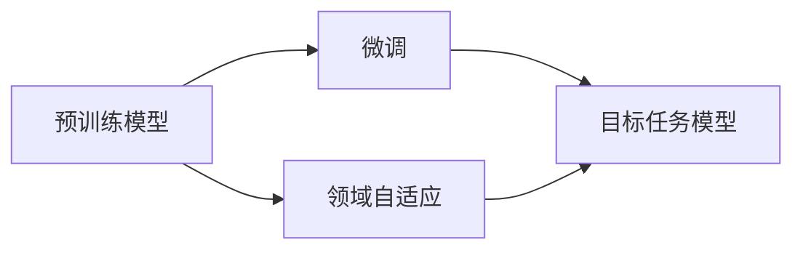

# 迁移学习在神经网络中的应用:预训练、微调与领域自适应

## 1. 背景介绍
### 1.1 迁移学习的定义与意义
迁移学习(Transfer Learning)是一种机器学习方法,它利用已有的知识来解决新的但相关的问题,避免了从头开始训练模型的巨大开销。在深度学习领域,迁移学习已成为一种常用技术,尤其在数据量不足或计算资源有限的情况下。

### 1.2 迁移学习在神经网络中的应用现状
近年来,迁移学习在计算机视觉、自然语言处理等领域取得了显著成果。例如,在图像分类任务中,通过在ImageNet上预训练的模型进行迁移学习,可以大幅提升小样本数据集上的性能。同样,在自然语言处理中,基于预训练语言模型如BERT、GPT的迁移学习也取得了瞩目的效果。

## 2. 核心概念与联系
### 2.1 预训练(Pre-training)
预训练是迁移学习的关键步骤之一。其思想是在大规模数据集上训练一个通用的模型,学习到底层的特征表示。这个预训练模型可以作为其他任务的初始化参数,加速收敛并提高性能。常见的预训练模型有ImageNet上训练的ResNet、BERT等。

### 2.2 微调(Fine-tuning) 
微调是在预训练模型的基础上,针对新任务进行参数调整的过程。通常只需训练模型的最后几层,甚至只替换输出层,就可以快速适应新任务。微调可显著减少所需的数据量和训练时间。

### 2.3 领域自适应(Domain Adaptation)
领域自适应处理源域(source domain)和目标域(target domain)数据分布不一致的问题。其目标是将源域上训练的模型应用到目标域,而无需重新标注大量目标域数据。常用的方法包括对抗训练、样本权重调整等。

### 2.4 概念之间的关系
下图展示了预训练、微调、领域自适应三个概念在迁移学习中的关系:



预训练模型是基础,微调和领域自适应在此基础上进行,最终得到适用于目标任务的模型。

## 3. 核心算法原理与具体操作步骤
### 3.1 预训练算法
#### 3.1.1 无监督预训练
无监督预训练不需要人工标注数据,而是利用数据本身的结构信息。例如,BERT使用了Masked Language Model和Next Sentence Prediction两个任务进行预训练。

具体步骤如下:
1. 构建大规模无标注数据集 
2. 定义预训练任务(如MLM、NSP)
3. 设计适合任务的神经网络结构
4. 在数据集上训练模型,直至收敛

#### 3.1.2 有监督预训练
有监督预训练利用人工标注数据训练模型。如ImageNet分类预训练。

步骤如下:
1. 获取大规模人工标注数据集
2. 设计分类模型结构(如ResNet) 
3. 使用交叉熵损失函数等训练模型
4. 评估模型性能,调整超参数

### 3.2 微调算法
微调分为两类:特定层微调和全部层微调。前者只训练模型最后几层,后者则训练所有参数。

具体步骤:
1. 加载预训练模型参数
2. 根据任务调整模型结构(如改变输出层)
3. 选择微调的层数
4. 使用新任务的数据集进行训练
5. 评估性能,进行超参数调优

### 3.3 领域自适应算法
#### 3.3.1 对抗式领域自适应
对抗式方法通过最小化源域和目标域特征的分布差异来实现自适应。代表算法有DANN、ADDA等。

以DANN为例,步骤如下:
1. 分别用源域和目标域数据训练特征提取器
2. 引入领域判别器,判断特征来自哪个域
3. 训练特征提取器最大化领域判别器损失
4. 训练领域判别器最小化自身损失
5. 重复3-4步骤,直至两个域的特征分布相近

#### 3.3.2 样本权重自适应
样本权重自适应通过调整源域样本权重,使其分布接近目标域。代表算法有KMM、KLIEP等。

以KMM为例,步骤如下:
1. 计算源域和目标域样本的核矩阵
2. 最小化核均值匹配(KMM)目标函数求解样本权重
3. 用求得的样本权重对源域数据进行加权
4. 用加权后的源域数据训练模型

## 4. 数学模型与公式详解
### 4.1 预训练的数学模型
以BERT的MLM任务为例,其数学模型可表示为:

$$\mathcal{L}_{MLM}(\theta) = -\sum_{i=1}^{N} m_i \log p(w_i|w_{/i})$$

其中$\theta$为模型参数,$N$为序列长度,$m_i$为掩码,$w_i$为被掩码词,$w_{/i}$为上下文词。目标是最大化被掩码词的条件概率。

### 4.2 微调的数学模型
假设预训练参数为$\theta_p$,微调参数为$\theta_f$,则微调的目标函数可写为:

$$\mathcal{L}(\theta_f) = \mathcal{L}_{task}(\theta_p, \theta_f) + \lambda \mathcal{R}(\theta_f)$$

其中$\mathcal{L}_{task}$为任务相关损失,$\mathcal{R}$为正则项(如L2正则),$\lambda$为平衡系数。通过最小化该目标函数求解微调参数$\theta_f$。

### 4.3 领域自适应的数学模型
以DANN为例,其数学模型可表示为联合优化两个目标:

$$\mathcal{L}(\theta_f, \theta_d) = \mathcal{L}_{task}(\theta_f) - \lambda \mathcal{L}_{domain}(\theta_f, \theta_d)$$

其中$\theta_f$为特征提取器参数,$\theta_d$为领域判别器参数,$\mathcal{L}_{task}$为任务损失,$\mathcal{L}_{domain}$为领域对抗损失:

$$\mathcal{L}_{domain} = -\mathbb{E}_{x \sim D_s} \log[D(F(x))] - \mathbb{E}_{x \sim D_t} \log[1-D(F(x))]$$

$D_s$和$D_t$分别为源域和目标域数据分布,$F$为特征提取器,$D$为领域判别器。通过最小化总损失求解参数。

## 5. 项目实践:代码实例与详解
下面以PyTorch为例,展示如何用迁移学习进行图像分类。

### 5.1 加载预训练模型
```python
import torchvision.models as models

model = models.resnet50(pretrained=True) 
for param in model.parameters():
    param.requires_grad = False
```

这里使用PyTorch提供的ResNet50预训练模型,并冻结其参数。

### 5.2 微调模型
```python
num_classes = 10 
model.fc = nn.Linear(model.fc.in_features, num_classes)

optimizer = optim.SGD(model.fc.parameters(), lr=1e-3)
criterion = nn.CrossEntropyLoss()
```

将ResNet最后一层替换为新的全连接层,并只优化该层参数。损失函数使用交叉熵。

### 5.3 训练与评估
```python
for epoch in range(num_epochs):
    for images, labels in train_loader:
        optimizer.zero_grad()
        outputs = model(images) 
        loss = criterion(outputs, labels)
        loss.backward()
        optimizer.step()
        
    with torch.no_grad():
        correct = 0
        total = 0
        for images, labels in test_loader:
            outputs = model(images)
            _, predicted = torch.max(outputs, 1)
            correct += (predicted == labels).sum()
            total += labels.size(0)
        print(f'Epoch [{epoch+1}/{num_epochs}], Acc: {100*correct/total:.2f}%')
```

使用标准的训练循环对模型进行微调,并在每个epoch结束后在测试集上评估性能。

## 6. 实际应用场景
迁移学习在众多领域得到了广泛应用,典型场景包括:

- 计算机视觉:物体检测、语义分割、行为识别等
- 自然语言处理:文本分类、命名实体识别、机器翻译等  
- 语音识别:说话人识别、情感识别、关键词检测等
- 推荐系统:跨域推荐、冷启动问题等

此外,迁移学习在医疗影像分析、工业故障诊断、金融风控等领域也有着巨大的应用潜力。

## 7. 工具与资源推荐
- PyTorch Transfer Learning Tutorial: https://pytorch.org/tutorials/beginner/transfer_learning_tutorial.html
- Hugging Face Transformers: https://huggingface.co/transformers/
- 迁移学习相关论文列表: https://github.com/jindongwang/transferlearning/tree/master/doc/awesome_paper.md
- 中文迁移学习导引: https://github.com/jindongwang/transferlearning-tutorial

## 8. 总结:未来发展趋势与挑战
### 8.1 发展趋势 
- 更大规模的预训练模型(如GPT-3)将不断涌现,并应用到更多任务
- 跨模态迁移学习(如视觉-语言)将成为研究热点
- 元学习与迁移学习的结合有望进一步提升小样本学习能力
- 联邦迁移学习将解决数据隐私与安全问题

### 8.2 面临的挑战
- 负迁移问题:源域与目标域差异过大时,迁移学习反而会引入负面影响
- 可解释性:迁移学习模型的决策过程仍然难以解释,阻碍其在某些领域的应用
- 计算开销:大规模预训练模型需要消耗大量算力,提高训练效率是一大挑战

## 9. 附录:常见问题解答
### Q1: 什么情况下应该使用迁移学习?
A: 当目标任务训练数据不足,但存在相关领域的大规模数据时,使用迁移学习可以显著提升模型性能,加速训练过程。

### Q2: 预训练模型是否一定要在大规模数据集上训练?
A: 并非如此。预训练数据集的质量与任务相关性也很重要。在小规模但高质量的数据集上预训练,有时可以达到更好的效果。

### Q3: 微调时需要训练多少层?
A: 这取决于预训练模型与目标任务的相关程度。相关性高时,只训练最后一层即可;相关性低时,需要训练更多层。通常可以通过实验比较不同的微调策略。

### Q4: 对抗式领域自适应方法的优缺点是什么?
A: 优点是可以显著缩小源域与目标域的分布差异,提高模型泛化性。缺点是训练不够稳定,对超参数较为敏感。此外,还需要足够多的目标域无标注数据。

作者: 禅与计算机程序设计艺术 / Zen and the Art of Computer Programming