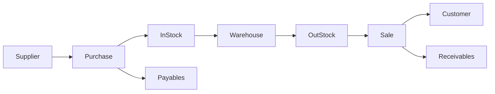

# 进销存财务管理系统详细设计与具体代码实现

## 1. 背景介绍
### 1.1 进销存财务管理系统的重要性
在现代企业管理中,进销存财务管理系统扮演着至关重要的角色。它能够有效地管理企业的采购、销售、库存和财务等核心业务流程,提高企业运营效率,降低成本,为企业决策提供数据支持。一个优秀的进销存财务管理系统可以帮助企业实现精细化管理,增强市场竞争力。

### 1.2 进销存财务管理系统的主要功能
一个完整的进销存财务管理系统通常包括以下主要功能模块:

- 采购管理:包括采购计划、采购订单、采购入库等
- 销售管理:包括销售订单、销售出库、客户管理等  
- 库存管理:包括仓库管理、库存盘点、库存调拨等
- 财务管理:包括应收应付、现金银行、财务报表等
- 基础信息管理:包括供应商管理、商品管理等

### 1.3 进销存财务管理系统的技术架构
当前主流的进销存财务管理系统大多采用Browser/Server(B/S)架构,即使用浏览器作为客户端,服务器端采用Java、.NET等技术。系统的数据库一般选用Oracle、MySQL、SQL Server等关系型数据库。同时,系统会使用Redis等缓存技术来提升性能,使用RabbitMQ等消息队列来实现异步解耦。

## 2. 核心概念与关联
要设计和开发一个进销存财务管理系统,首先需要理解其中的一些核心概念,以及它们之间的关联关系。

### 2.1 核心概念
- 商品(Product):企业采购、销售、库存管理的对象
- 供应商(Supplier):向企业供应商品的单位
- 客户(Customer):向企业采购商品的单位
- 仓库(Warehouse):存储商品的场所
- 采购(Purchase):企业从供应商处采买商品的行为  
- 销售(Sale):企业向客户销售商品的行为
- 入库(InStock):采购的商品进入仓库
- 出库(OutStock):销售或领用的商品从仓库出去
- 应收账款(Receivables):企业应向客户收取的款项
- 应付账款(Payables):企业应向供应商支付的款项

### 2.2 概念之间的关联


从上图可以看出,供应商与采购相关联,采购完成后商品入库进入仓库。而销售会通过出库来从仓库获取商品,然后销售给客户,产生应收账款。采购则会产生应付账款。这些概念环环相扣,构成了进销存财务管理的基本业务流程。

## 3. 核心算法原理与具体操作步骤
在进销存财务管理系统中,有一些核心算法值得关注,比如需求预测、库存控制等。下面以经济订货批量(EOQ)模型为例进行讲解。

### 3.1 经济订货批量(EOQ)模型原理
经济订货批量(Economic Order Quantity,EOQ)模型是一种确定最佳订货批量以最小化总库存成本的方法。它基于以下假设:

1. 需求是已知且恒定的
2. 不允许缺货
3. 补货无时间延迟
4. 订货成本和持有成本是恒定的

在这些假设下,总库存成本可以表示为:
$$TC = \frac{D}{Q}S + \frac{Q}{2}H$$

其中:
- TC:总库存成本
- Q:订货批量  
- D:年需求量
- S:单次订货成本
- H:单位商品的年持有成本

通过求解上式的极小值,可以得到经济订货批量:

$$EOQ = \sqrt{\frac{2DS}{H}}$$

### 3.2 EOQ模型的具体操作步骤
1. 确定年需求量D、单次订货成本S和单位商品年持有成本H
2. 套用EOQ公式计算最佳订货批量
3. 根据EOQ和需求量,制定采购计划

例如,某商品的年需求量为1000件,单次订货成本为100元,单位商品的年持有成本为2元。则其EOQ为:

$$EOQ=\sqrt{\frac{2\times1000\times100}{2}}=500$$

这表明每次采购500件是最经济的,可以使总库存成本最小化。

## 4. 数学模型和公式详细讲解举例说明
除了EOQ模型,进销存财务管理中还有一些其他常用的数学模型和公式,例如:

### 4.1 安全库存(Safety Stock)
安全库存是为了防止因需求波动或供应延迟导致缺货而准备的额外库存。它的计算公式为:

$$SS=Z\times\sigma\times\sqrt{LT}$$

其中:
- SS:安全库存
- Z:服务水平因子,取决于期望的服务水平
- $\sigma$:需求标准差
- LT:提前期(单位:天)

举例:假设某商品的日需求量服从均值为100,标准差为20的正态分布,提前期为5天,期望的服务水平为95%(对应的Z值为1.65)。则其安全库存为:

$$SS=1.65\times20\times\sqrt{5}=73.48$$

这表明需要准备73件的安全库存,才能在95%的概率下避免缺货。

### 4.2 再订货点(Reorder Point)
再订货点是指当库存降至某一水平时,需要发出补货订单以避免缺货。它的计算公式为:

$$ROP=\overline{D}\times LT+SS$$

其中:
- ROP:再订货点
- $\overline{D}$:日均需求量
- LT:提前期
- SS:安全库存

举例:承接上例,假设日均需求量为100,则再订货点为:

$$ROP=100\times 5+73.48=573.48$$

这表明当现有库存降到573件时,就需要发出新的采购订单了。

## 5. 项目实践:代码实例和详细解释说明
下面我们通过一个简单的Python代码实例,来演示如何实现进销存财务管理系统的部分功能。

### 5.1 建立数据库连接
首先,我们需要建立与数据库的连接。这里使用Python的pymysql库连接MySQL数据库。

```python
import pymysql

# 建立数据库连接
def get_connection():
    conn = pymysql.connect(
        host='localhost',
        user='root',  
        password='123456',
        database='inventory_db',
        charset='utf8mb4'
    )
    return conn
```

### 5.2 商品入库
当采购的商品到货后,需要执行入库操作,将商品录入库存。

```python
def instock(product_id, quantity, warehouse_id):
    conn = get_connection()
    try:
        with conn.cursor() as cursor:
            # 新增库存记录
            sql = "INSERT INTO inventory (product_id, quantity, warehouse_id) VALUES (%s, %s, %s)"
            cursor.execute(sql, (product_id, quantity, warehouse_id))
        conn.commit()
    finally:
        conn.close()
```

在上面的`instock`函数中,我们先建立了数据库连接,然后执行了一条INSERT语句,将入库的商品id、数量和仓库id插入到库存表中,完成入库操作。

### 5.3 商品出库
当发生销售或领用时,需要执行出库操作,从库存中扣减相应的商品数量。

```python
def outstock(product_id, quantity, warehouse_id):
    conn = get_connection()
    try:
        with conn.cursor() as cursor:
            # 检查库存是否充足
            sql = "SELECT quantity FROM inventory WHERE product_id=%s AND warehouse_id=%s"
            cursor.execute(sql, (product_id, warehouse_id))
            result = cursor.fetchone()
            if result[0] < quantity:
                raise Exception("库存不足")
            
            # 更新库存记录
            sql = "UPDATE inventory SET quantity=quantity-%s WHERE product_id=%s AND warehouse_id=%s"
            cursor.execute(sql, (quantity, product_id, warehouse_id))
        conn.commit()
    finally:
        conn.close()
```

在`outstock`函数中,我们先检查要出库的商品是否有足够的库存,如果库存不足则抛出异常。否则,执行一条UPDATE语句,将库存表中对应商品的数量减去出库数量。

### 5.4 处理销售订单
销售订单的处理涉及到多个步骤,包括生成订单、出库、生成应收账款等。

```python
from datetime import datetime

def process_sales_order(order):
    # 生成销售订单
    order_id = generate_order(order)
    
    # 循环处理订单中的每个商品
    for item in order['items']:
        # 执行出库操作
        outstock(item['product_id'], item['quantity'], item['warehouse_id']) 
    
    # 生成应收账款
    generate_receivable(order_id, order['total_amount'])

def generate_order(order):
    conn = get_connection()
    try:
        with conn.cursor() as cursor:
            # 插入订单记录
            sql = "INSERT INTO sales_order (customer_id, total_amount, status, created_at) VALUES (%s, %s, %s, %s)"
            cursor.execute(sql, (order['customer_id'], order['total_amount'], 'PENDING', datetime.now()))
            order_id = cursor.lastrowid
            
            # 插入订单明细记录
            sql = "INSERT INTO sales_order_item (order_id, product_id, quantity, price) VALUES (%s, %s, %s, %s)"
            for item in order['items']:
                cursor.execute(sql, (order_id, item['product_id'], item['quantity'], item['price']))
                
        conn.commit()
        return order_id
    finally:
        conn.close()

def generate_receivable(order_id, total_amount):
    conn = get_connection()
    try:
        with conn.cursor() as cursor:
            # 插入应收账款记录
            sql = "INSERT INTO receivable (order_id, amount, status, created_at) VALUES (%s, %s, %s, %s)"
            cursor.execute(sql, (order_id, total_amount, 'PENDING', datetime.now()))
        conn.commit()
    finally:
        conn.close()
```

`process_sales_order`函数演示了处理销售订单的完整流程。它首先调用`generate_order`生成销售订单和明细记录,然后循环调用`outstock`执行出库操作,最后调用`generate_receivable`生成相应的应收账款记录。

通过上面的代码示例,我们可以看到进销存财务管理系统的一些典型操作是如何实现的。实际的系统会更加复杂,还需要考虑异常处理、事务管理、并发控制等因素,但基本原理是一致的。

## 6. 实际应用场景
进销存财务管理系统在各行各业中都有广泛的应用,下面列举几个典型场景:

### 6.1 制造业
对于制造企业而言,原材料的采购、产品的生产和销售是其主要业务。通过使用进销存系统,可以实现:

- 根据生产计划和原材料库存情况,自动生成采购申请
- 管理原材料和产成品的出入库
- 监控产品的生产进度和库存水平
- 处理销售订单和发货流程
- 核算产品成本

### 6.2 批发零售业
批发零售企业通常需要维护大量的商品和客户信息,进销存系统可以帮助其:

- 管理商品的采购、定价和促销活动
- 优化仓储布局和库存分配
- 处理销售订单和退换货
- 分析销售数据,预测未来需求
- 评估供应商和客户的业绩

### 6.3 餐饮业
餐饮企业的原材料采购和菜品销售也可以通过进销存系统来管理:

- 根据菜品销售情况,确定原材料采购计划
- 管理原材料的验收、储存和领用
- 记录菜品的制作和销售数据
- 分析菜品的成本和毛利
- 优化菜品的定价和搭配

总之,只要涉及到采购、销售、库存和财务核算,进销存系统都能发挥其作用,帮助企业提高管理水平和运营效率。

## 7. 工具和资源推荐
### 7.1 开发工具
- IntelliJ IDEA:功能强大的Java IDE
- Visual Studio:微软出品的IDE,支持多种语言
- PyCharm:专为Python打造的IDE
- Eclipse:免费开源的IDE,支持多种语言
- MySQL Workbench:MySQL数据库的可视化设计工具

### 7.2 开发框架
- Spring Boot:简化了基于Spring的应用开发
- Django:高效的Python Web框架
- Express:基于Node.js的Web框架