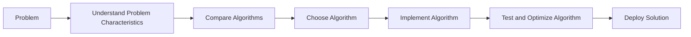

## 1. Background Introduction

In the ever-evolving world of computer science, the selection of appropriate algorithms plays a crucial role in the success of software projects. This article aims to provide a comprehensive guide to choosing the best algorithm for specific problems, focusing on the principles, mathematical models, and practical applications.

### 1.1 Importance of Algorithm Selection

The choice of algorithm can significantly impact the efficiency, accuracy, and scalability of a software solution. A well-chosen algorithm can lead to faster processing times, reduced memory usage, and improved problem-solving capabilities. Conversely, an inappropriate algorithm can result in slow performance, excessive resource consumption, and inaccurate results.

### 1.2 Scope and Objectives

This article will delve into the core concepts of algorithm selection, providing practical examples, mathematical models, and code examples to help readers make informed decisions. By the end of this article, readers will have a solid understanding of the principles, tools, and resources necessary for selecting the best algorithm for their specific problems.

## 2. Core Concepts and Connections

### 2.1 Algorithm Complexity

Algorithm complexity is a measure of the computational resources required to solve a problem. It is typically expressed in terms of time complexity (O-notation) and space complexity (Ω-notation). Understanding algorithm complexity is essential for making informed decisions about algorithm selection.

### 2.2 Big O Notation

Big O notation (O-notation) is a mathematical notation that describes the upper bound of the time complexity of an algorithm. It provides an upper limit on the number of operations an algorithm will perform as the input size increases.

### 2.3 Big Omega Notation

Big Omega notation (Ω-notation) is a mathematical notation that describes the lower bound of the time complexity of an algorithm. It provides a lower limit on the number of operations an algorithm will perform as the input size increases.

### 2.4 Big Theta Notation

Big Theta notation (Θ-notation) is a mathematical notation that describes the tight bound of the time complexity of an algorithm. It provides both an upper and lower bound on the number of operations an algorithm will perform as the input size increases.

### 2.5 Space Complexity

Space complexity is a measure of the memory required by an algorithm to solve a problem. It is typically expressed in terms of the amount of memory used by the algorithm as a function of the input size.

## 3. Core Algorithm Principles and Specific Operational Steps

### 3.1 Divide and Conquer

Divide and conquer is a fundamental algorithmic paradigm that involves breaking a problem into smaller subproblems, solving each subproblem recursively, and combining the solutions to obtain the final solution. Examples of divide and conquer algorithms include QuickSort, MergeSort, and Binary Search.

### 3.2 Greedy Algorithms

Greedy algorithms make the locally optimal choice at each stage with the hope of finding a global optimum. These algorithms work by iteratively making the choice that seems best at the moment, without looking ahead. Examples of greedy algorithms include Dijkstra's Algorithm, Kruskal's Algorithm, and Huffman Coding.

### 3.3 Dynamic Programming

Dynamic programming is an algorithmic technique that solves complex problems by breaking them down into simpler subproblems, storing the solutions to these subproblems, and reusing them when necessary. This approach can significantly reduce the time complexity of a solution. Examples of dynamic programming algorithms include the Knapsack Problem, Longest Common Subsequence, and Fibonacci Sequence.

### 3.4 Backtracking

Backtracking is an algorithmic technique used to find all solutions to a problem recursively. It involves exploring all possible solutions, pruning unpromising branches, and backtracking when a dead end is reached. Examples of backtracking algorithms include the Eight Queens Problem, Sudoku Solver, and Traveling Salesman Problem.

## 4. Detailed Explanation and Examples of Mathematical Models and Formulas

### 4.1 Time Complexity Analysis

Time complexity analysis is the process of determining the upper bound, lower bound, and tight bound of the time complexity of an algorithm. This analysis is crucial for understanding the efficiency of an algorithm and for comparing different algorithms for the same problem.

### 4.2 Space Complexity Analysis

Space complexity analysis is the process of determining the amount of memory required by an algorithm as a function of the input size. This analysis is essential for understanding the scalability of an algorithm and for ensuring that it can handle large input sizes.

### 4.3 Mathematical Models and Formulas

This section will provide detailed explanations and examples of mathematical models and formulas used in algorithm analysis, including Big O notation, Big Omega notation, Big Theta notation, and recurrence relations.

## 5. Project Practice: Code Examples and Detailed Explanations

### 5.1 Sorting Algorithms

This section will provide code examples and detailed explanations of various sorting algorithms, including QuickSort, MergeSort, BubbleSort, and SelectionSort.

### 5.2 Search Algorithms

This section will provide code examples and detailed explanations of various search algorithms, including Linear Search, Binary Search, and Interpolation Search.

### 5.3 Graph Algorithms

This section will provide code examples and detailed explanations of various graph algorithms, including Dijkstra's Algorithm, Breadth-First Search, and Depth-First Search.

## 6. Practical Application Scenarios

### 6.1 Sorting Large Datasets

This section will discuss practical application scenarios for sorting large datasets, such as in data analysis, machine learning, and database management.

### 6.2 Optimizing Search Algorithms

This section will discuss practical application scenarios for optimizing search algorithms, such as in web search engines, databases, and operating systems.

### 6.3 Solving Combinatorial Problems

This section will discuss practical application scenarios for solving combinatorial problems, such as in scheduling, resource allocation, and network design.

## 7. Tools and Resources Recommendations

### 7.1 Online Algorithm Libraries

This section will recommend online algorithm libraries, such as GeeksforGeeks, LeetCode, and HackerRank, that provide problem statements, code examples, and performance analysis for various algorithms.

### 7.2 Algorithm Textbooks

This section will recommend algorithm textbooks, such as \"Introduction to Algorithms\" by Thomas H. Cormen and \"Algorithms Unlocked\" by Robert Sedgewick, that provide in-depth explanations of various algorithms, their complexity analysis, and practical applications.

### 7.3 Online Courses and Tutorials

This section will recommend online courses and tutorials, such as those offered by Coursera, edX, and Khan Academy, that provide comprehensive instruction on various algorithms, their implementation, and practical applications.

## 8. Summary: Future Development Trends and Challenges

### 8.1 Emerging Algorithmic Techniques

This section will discuss emerging algorithmic techniques, such as machine learning algorithms, genetic algorithms, and swarm intelligence algorithms, and their potential impact on the field of computer science.

### 8.2 Challenges and Limitations

This section will discuss the challenges and limitations of current algorithms, such as their inability to handle complex, real-world problems, their reliance on large amounts of data, and their susceptibility to errors and biases.

## 9. Appendix: Frequently Asked Questions and Answers

### 9.1 What is the difference between Big O notation, Big Omega notation, and Big Theta notation?

Big O notation describes the upper bound of the time complexity of an algorithm, Big Omega notation describes the lower bound, and Big Theta notation describes the tight bound.

### 9.2 How do I choose the best algorithm for a specific problem?

To choose the best algorithm for a specific problem, consider the problem's characteristics, such as its input size, data structure, and constraints. Then, compare the time and space complexity, efficiency, and practicality of various algorithms for the problem.

### 9.3 What are some common mistakes to avoid when implementing algorithms?

Common mistakes to avoid when implementing algorithms include ignoring edge cases, not optimizing for performance, and not thoroughly testing the algorithm.

## Conclusion

In conclusion, the selection of the best algorithm for a specific problem is a critical aspect of software development. By understanding the core concepts, principles, and mathematical models of algorithms, developers can make informed decisions and create efficient, scalable, and accurate software solutions. With the help of online resources, textbooks, and courses, developers can continue to expand their knowledge and skills in this essential area of computer science.

## Mermaid Flowchart

## Author: Zen and the Art of Computer Programming