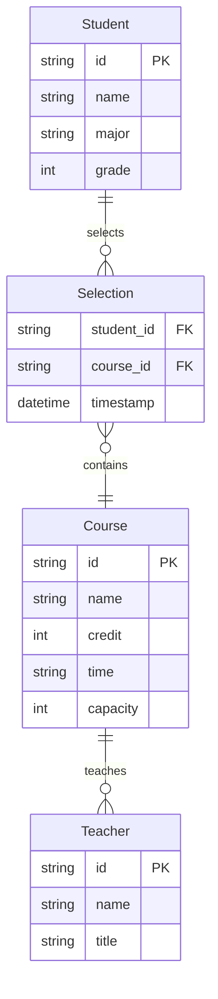
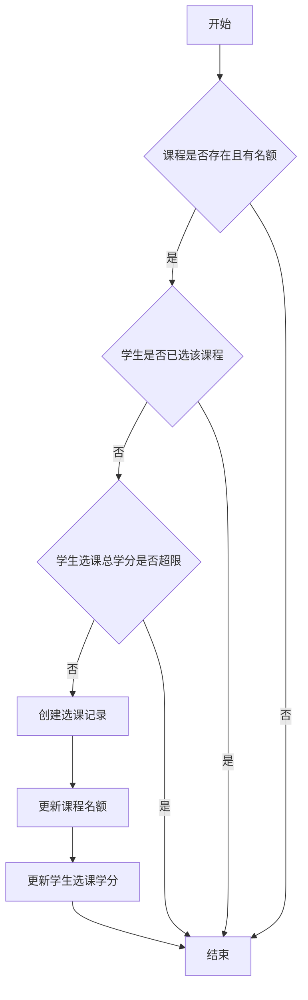
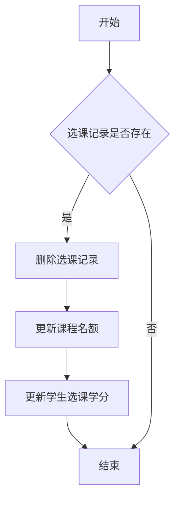

# 选课系统详细设计与具体代码实现

## 1. 背景介绍
### 1.1 选课系统的重要性
在现代化的教育管理中,选课系统扮演着至关重要的角色。它为学生提供了灵活选择课程的机会,同时也方便了教务管理人员对课程资源进行统筹规划。一个设计良好、功能完备的选课系统能够显著提升教学质量和管理效率。

### 1.2 选课系统面临的挑战  
构建一个优秀的选课系统并非易事。它需要综合考虑学生、教师、教务管理等多方面的需求,平衡系统的易用性与功能的完备性,并且要具备良好的性能和可扩展性。同时,还要重视数据安全与隐私保护。这些都对选课系统的设计和实现提出了较高的要求。

### 1.3 本文的目标
本文旨在探讨如何设计和实现一个优秀的选课系统。我们将从需求分析入手,梳理出系统的核心功能和架构;然后讨论系统设计中的关键技术和算法;接着给出具体的代码实现示例;最后,展望选课系统的未来发展方向。

## 2. 核心概念与联系
### 2.1 学生 Student
学生是选课系统的主要参与者和服务对象。每个学生都有自己的基本信息(如学号、姓名等)和已选课程。学生可以浏览课程列表,选择心仪的课程,也可以退选已选的课程。

### 2.2 课程 Course
课程是选课系统的核心实体。每门课程都有其基本属性(如课程号、课程名、学分、授课教师等)和选课学生名单。课程的可选名额、开课时间等信息会影响学生的选课行为。

### 2.3 教师 Teacher
教师承担着授课的任务。每位教师都有其基本信息(如工号、姓名等)和所授课程。教师可以查看自己所授课程的选课学生名单,也可以设置课程的相关参数。

### 2.4 选课记录 Selection Record 
选课记录表示学生与课程的多对多关系。一个选课记录包含学生、课程以及选课时间等信息。学生的选课行为会在选课记录中体现。

### 2.5 实体关系图
下面是学生、课程、教师、选课记录四个核心概念的实体关系图(ER图):



从ER图可以清晰地看出:
- 学生与课程是多对多的关系,由选课记录连接。  
- 一门课程可以由多名教师授课,一名教师也可以授多门课程。

## 3. 核心算法原理与具体操作步骤
### 3.1 学生选课算法
学生选课是选课系统最核心的功能。当学生提交选课请求时,系统需要执行以下步骤:

1. 检查课程是否存在且有剩余名额
2. 检查学生是否已经选过该课程  
3. 检查学生选课总学分是否超出上限
4. 创建新的选课记录
5. 更新课程的剩余名额
6. 更新学生的已选课程学分

具体的算法流程如下:



### 3.2 学生退课算法
学生退课的基本步骤如下:

1. 检查选课记录是否存在
2. 删除对应的选课记录
3. 更新课程的剩余名额 
4. 更新学生的已选课程学分

具体的算法流程如下:



### 3.3 课程筛选算法
为了方便学生快速找到心仪的课程,系统需要提供灵活的课程筛选功能。常见的筛选条件包括:

- 课程类型(必修、选修等)
- 授课教师
- 上课时间
- 学分区间
- 关键词(课程名、教师名等)

筛选算法的基本步骤如下:

1. 获取用户输入的筛选条件
2. 构造相应的数据库查询语句
3. 执行查询并返回结果

## 4. 数学模型和公式详细讲解与举例说明
在选课系统中,我们可以利用数学模型来刻画一些复杂的业务逻辑,例如课程推荐、学分统计等。下面我们以课程推荐为例进行讨论。

### 4.1 协同过滤推荐模型
协同过滤是一种常用的推荐算法。其基本思想是:找到与目标用户选课偏好相似的其他用户,然后将这些用户喜欢的课程推荐给目标用户。

假设我们有 $m$ 个用户和 $n$ 门课程,用矩阵 $R$ 表示用户-课程评分矩阵:

$$
R = 
\begin{bmatrix}
r_{11} & r_{12} & \cdots & r_{1n} \\
r_{21} & r_{22} & \cdots & r_{2n} \\
\vdots & \vdots & \ddots & \vdots \\
r_{m1} & r_{m2} & \cdots & r_{mn} 
\end{bmatrix}
$$

其中 $r_{ij}$ 表示用户 $i$ 对课程 $j$ 的评分。如果用户 $i$ 没有选修课程 $j$,则 $r_{ij}=0$。

我们可以用余弦相似度来衡量两个用户 $u$ 和 $v$ 的相似程度:

$$
\text{sim}(u,v) = \frac{\sum_{i=1}^n r_{ui}r_{vi}}{\sqrt{\sum_{i=1}^n r_{ui}^2}\sqrt{\sum_{i=1}^n r_{vi}^2}}
$$

然后,我们可以计算用户 $u$ 对课程 $i$ 的预测评分:

$$
\hat{r}_{ui} = \frac{\sum_{v \in S_u} \text{sim}(u,v)r_{vi}}{\sum_{v \in S_u} |\text{sim}(u,v)|}
$$

其中 $S_u$ 表示与用户 $u$ 最相似的 $k$ 个用户(即 $u$ 的"邻居")。

### 4.2 基于协同过滤的课程推荐示例
假设我们有5个学生和4门课程,他们的选课记录如下:

|   | C1 | C2 | C3 | C4 |
|---|---|---|---|---|
| S1 | 1 | 0 | 1 | 1 |
| S2 | 1 | 1 | 0 | 1 |
| S3 | 1 | 1 | 1 | 0 |
| S4 | 0 | 1 | 1 | 1 |
| S5 | 1 | 0 | 1 | 0 |

我们想要给学生S1推荐课程。首先计算S1与其他学生的相似度:

$$
\text{sim}(S1,S2) = \frac{1 \times 1 + 0 \times 1 + 1 \times 0 + 1 \times 1}{\sqrt{1^2+0^2+1^2+1^2} \sqrt{1^2+1^2+0^2+1^2}} \approx 0.67
$$

同理可得:

$$
\text{sim}(S1,S3) \approx 0.5, \quad
\text{sim}(S1,S4) \approx 0.33, \quad
\text{sim}(S1,S5) \approx 0.82
$$

假设我们取 $k=2$,即选取与S1最相似的2个学生。那么S1的"邻居"为S5和S2。

接下来,我们可以预测S1对C2的评分(S1还没选C2):

$$
\hat{r}_{S1,C2} = \frac{0.82 \times 0 + 0.67 \times 1}{0.82 + 0.67} \approx 0.45
$$

同理,我们还可以预测S1对其他未选课程的评分。评分最高的课程就可以作为推荐给S1的课程。

## 5. 项目实践:代码实例与详细解释说明
下面我们给出选课系统的部分核心代码实现。为了简洁起见,我们使用Python的Flask框架和SQLite数据库。

### 5.1 数据模型定义
首先定义学生、课程、教师和选课记录四个数据模型:

```python
from flask_sqlalchemy import SQLAlchemy

db = SQLAlchemy()

class Student(db.Model):
    id = db.Column(db.String(20), primary_key=True)
    name = db.Column(db.String(20), nullable=False)
    major = db.Column(db.String(20), nullable=False)
    grade = db.Column(db.Integer, nullable=False)

class Course(db.Model):
    id = db.Column(db.String(20), primary_key=True)
    name = db.Column(db.String(50), nullable=False)
    credit = db.Column(db.Integer, nullable=False)
    time = db.Column(db.String(50), nullable=False)
    capacity = db.Column(db.Integer, nullable=False)
    teacher_id = db.Column(db.String(20), db.ForeignKey('teacher.id'))

class Teacher(db.Model):
    id = db.Column(db.String(20), primary_key=True)
    name = db.Column(db.String(20), nullable=False)
    title = db.Column(db.String(20))
    courses = db.relationship('Course', backref='teacher')

class Selection(db.Model):
    student_id = db.Column(db.String(20), db.ForeignKey('student.id'), primary_key=True)
    course_id = db.Column(db.String(20), db.ForeignKey('course.id'), primary_key=True)
    timestamp = db.Column(db.DateTime, nullable=False, default=datetime.utcnow)
```

这些模型定义与我们前面讨论的ER图是一致的。值得注意的是,我们用`db.relationship`定义了课程与教师之间的一对多关系。

### 5.2 选课API实现
接下来我们实现选课相关的API。

#### 5.2.1 学生选课
```python
@app.route('/api/select', methods=['POST'])
def select_course():
    student_id = request.json['student_id'] 
    course_id = request.json['course_id']

    student = Student.query.get(student_id)
    course = Course.query.get(course_id)

    if not student or not course:
        return jsonify({'message': 'Student or course not found'}), 404

    if course.capacity <= 0:
        return jsonify({'message': 'Course is full'}), 400

    if Selection.query.filter_by(student_id=student_id, course_id=course_id).first():
        return jsonify({'message': 'Already selected'}), 400
    
    if sum(c.credit for c in student.courses) + course.credit > MAX_CREDIT:
        return jsonify({'message': 'Exceed max credit'}), 400

    selection = Selection(student_id=student_id, course_id=course_id)
    db.session.add(selection)
    course.capacity -= 1
    db.session.commit()

    return jsonify({'message': 'Select success'})
```

这段代码实现了学生选课的API。它首先检查课程是否存在且有剩余名额,学生是否已经选过该课程,以及学生选课总学分是否超出上限。如果一切正常,就创建新的选课记录,并更新课程的剩余名额。

#### 5.2.2 学生退课
```python
@app.route('/api/drop', methods=['POST'])
def drop_course():
    student_id = request.json['student_id']
    course_id = request.json['course_id']

    selection = Selection.query.filter_by(student_id=student_id, course_id=course_id).first()

    if not selection:
        return jsonify({'message': 'Selection not found'}), 404

    db.session.delete(selection)
    course = Course.query.get(course_id)
    course.capacity += 1
    db.session.commit()

    return jsonify({'message': 'Drop success'})
```

这段代码实现了学生退课的API。它首先检查选课记