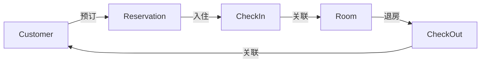

# 酒店客房管理系统详细设计与具体代码实现

## 1. 背景介绍

随着酒店行业的不断发展,传统的人工管理模式已经无法满足现代化酒店的需求。为了提高酒店的管理效率,降低人力成本,开发一套功能完善、易于操作的酒店客房管理系统势在必行。本文将详细介绍酒店客房管理系统的设计思路和具体实现过程,为酒店信息化管理提供参考。

### 1.1 酒店客房管理的现状与问题

目前,许多中小型酒店仍然采用人工登记、手工统计的方式进行客房管理,存在以下问题:

- 信息登记繁琐,容易出错
- 客房状态难以实时掌握
- 数据统计效率低下
- 缺乏系统化的管理手段

### 1.2 开发酒店客房管理系统的意义

开发一套功能完善的酒店客房管理系统,可以带来以下好处:

- 提高客房管理效率,减少人工操作失误
- 实时掌握客房状态,优化房间分配
- 方便数据统计分析,为决策提供支持
- 提升酒店形象,增强竞争力

## 2. 核心概念与关联

在设计酒店客房管理系统之前,我们需要明确几个核心概念:

### 2.1 客房(Room)

酒店的基本组成单元,包含房间号、房型、楼层、状态等属性。

### 2.2 客户(Customer)

入住酒店的顾客,包含姓名、证件号、联系方式等信息。

### 2.3 预订(Reservation)

客户预定房间的记录,包含预订时间、入住日期、离店日期、房型要求等。

### 2.4 入住(CheckIn)

客户办理入住手续的过程,需要登记客户信息,分配房间,生成消费记录。

### 2.5 退房(CheckOut)

客户办理退房手续的过程,需要结算消费金额,更新房间状态。

以下是这些概念之间的关联:



## 3. 核心算法原理与具体操作步骤

在酒店客房管理系统中,我们需要实现几个核心算法:

### 3.1 客房分配算法

当客户办理入住时,系统需要根据客户的要求(如房型、楼层)和当前客房的状态,自动分配一个最合适的房间。具体步骤如下:

1. 根据客户要求,筛选出符合条件的空闲房间列表
2. 按照楼层、房号等优先级排序
3. 选择排序后的第一个房间,更新其状态为已占用
4. 将该房间分配给客户,生成入住记录

### 3.2 房价计算算法

根据客户的入住时间和房型,计算出应付的房费金额。具体步骤如下:

1. 计算入住天数(退房日期 - 入住日期)
2. 根据房型和季节,确定每日房价
3. 房费总额 = 入住天数 × 每日房价
4. 考虑优惠折扣,计算最终金额

### 3.3 统计报表算法

生成各类统计报表,如客房入住率、营收等。以计算入住率为例:

1. 设定统计时间段(如最近30天)
2. 统计该时间段内的总客房数和入住客房数
3. 入住率 = 入住客房数 / 总客房数 × 100%

## 4. 数学模型与公式详解

在酒店客房管理系统中,我们用到了一些数学模型和公式,下面举例说明。

### 4.1 入住天数计算

假设客户的入住日期为 $d_1$,退房日期为 $d_2$,则入住天数 $n$ 可以表示为:

$$n = d_2 - d_1$$

例如,客户在2023年5月1日入住,5月5日退房,则入住天数为:

$$n = 2023-05-05 - 2023-05-01 = 4 \text{(天)}$$

### 4.2 房费计算

设客户入住 $n$ 天,房型的每日房价为 $p$,优惠折扣为 $d$ (取值范围0到1),则最终房费 $f$ 为:

$$f = n \times p \times d$$

例如,客户入住4天,每日房价为500元,享受9折优惠,则最终房费为:

$$f = 4 \times 500 \times 0.9 = 1800 \text{(元)}$$

### 4.3 入住率计算

设统计周期内总客房数为 $N$,入住客房数为 $m$,则入住率 $r$ 为:

$$r = \frac{m}{N} \times 100\%$$

例如,酒店共有100间客房,在30天内有2400间次的入住记录,则月平均入住率为:

$$r = \frac{2400}{100 \times 30} \times 100\% = 80\%$$

## 5. 项目实践:代码实例与详解

下面我们使用Java语言,实现酒店客房管理系统的部分功能。

### 5.1 客房类(Room)

```java
public class Room {
    private String number;  // 房间号
    private String type;    // 房型
    private int floor;      // 楼层
    private String status;  // 状态
    
    // 构造函数、getter和setter方法略
}
```

### 5.2 客户类(Customer)

```java
public class Customer {
    private String name;        // 姓名
    private String idNumber;    // 证件号
    private String phoneNumber; // 手机号
    
    // 构造函数、getter和setter方法略
}
```

### 5.3 预订类(Reservation)

```java
public class Reservation {
    private Customer customer;   // 客户
    private Date reserveDate;    // 预订日期 
    private Date checkInDate;    // 入住日期
    private Date checkOutDate;   // 退房日期
    private String roomType;     // 房型
    
    // 构造函数、getter和setter方法略
}
```

### 5.4 入住类(CheckIn)

```java
public class CheckIn {
    private Customer customer;    // 客户
    private Room room;            // 房间
    private Date checkInDate;     // 入住日期
    private Date estimatedCheckOutDate; // 预计退房日期
    
    public void assignRoom(Room room) {
        this.room = room;
        room.setStatus("OCCUPIED");  
    }
    
    // 构造函数、getter和setter方法略
}
```

### 5.5 退房类(CheckOut)

```java
public class CheckOut {
    private CheckIn checkIn;    // 关联的入住记录
    private Date actualCheckOutDate; // 实际退房日期
    private double payment;     // 支付金额
    
    public void execute() {
        checkIn.getRoom().setStatus("AVAILABLE");
        // 计算房费
        long days = checkIn.getEstimatedCheckOutDate().toEpochDay() 
                  - actualCheckOutDate.toEpochDay();
        double price = checkIn.getRoom().getPrice();
        payment = days * price;
    }
    
    // 构造函数、getter和setter方法略  
}
```

以上代码展示了酒店客房管理系统的核心类的设计与实现。在实际开发中,还需要编写控制器、持久层等代码,并进行充分的测试,以确保系统的正确性和可靠性。

## 6. 实际应用场景

酒店客房管理系统可以应用于各种类型和规模的酒店,如:

- 星级酒店:提升高星级酒店的管理水平和服务质量
- 连锁酒店:实现多店数据共享,方便总部管理
- 公寓式酒店:适应长租客户的特点,灵活调整房价策略
- 民宿:简化操作流程,降低管理难度

下面以某五星级酒店为例,说明系统的应用效果:

- 通过系统的预订管理功能,酒店可以清晰掌握未来一个月的房间预订情况,提前做好人员安排和物料准备。
- 入住办理时,系统自动为VIP客户匹配他们喜好的房型和楼层,体现了酒店的贴心服务。
- 退房时系统即时生成详细的消费清单,并支持多种支付方式,提高了客户的满意度。
- 通过系统生成的统计报表,酒店管理层可以及时了解营收、入住率等关键指标,为调整经营策略提供数据支持。

总之,酒店客房管理系统在提高管理效率、优化客户体验、支持决策分析等方面发挥了重要作用,已成为现代酒店不可或缺的管理工具。

## 7. 工具与资源推荐

在开发酒店客房管理系统时,我们可以利用一些工具和资源来提高效率和质量,例如:

- IDE:IntelliJ IDEA、Eclipse等,提供智能代码提示和调试功能
- 构建工具:Maven、Gradle等,方便管理项目依赖和编译部署
- 版本控制:Git、SVN等,便于团队协作和代码追踪
- 数据库:MySQL、Oracle等,用于持久化存储数据
- Web框架:Spring Boot、Django等,加速Web应用开发
- 前端框架:Vue.js、React等,构建交互友好的用户界面
- 测试工具:JUnit、Selenium等,实现自动化测试,保障系统质量

除了工具,我们还可以参考一些优秀的开源项目和学习资源,如:

- GitHub上的酒店管理系统项目:如 HotelSystem、HotelManagement 等
- 慕课网、Coursera等在线教育平台的相关课程
- 《阿里巴巴Java开发手册》等业界最佳实践文档

充分利用这些工具和资源,可以帮助我们高效、高质量地完成酒店客房管理系统的开发工作。

## 8. 总结:未来发展趋势与挑战

随着信息技术的不断发展,酒店客房管理系统也面临着新的机遇和挑战。未来的发展趋势可能包括:

- 移动化:通过手机App实现客房预订、入住、退房等操作,方便客户的同时也减轻了前台工作量。
- 智能化:利用物联网、人工智能等技术,实现客房设备的远程控制、客户偏好的智能识别等功能,提供更加个性化的服务。
- 数据化:通过大数据分析,挖掘客户行为模式,优化房价策略,提高营销效果。
- 生态化:与OTA(在线旅行社)、支付平台等第三方系统对接,构建完整的酒店服务生态圈。

同时,我们也要认识到酒店客房管理系统开发过程中可能遇到的一些挑战:

- 系统复杂度高,涉及多个业务模块,需要有严谨的设计和架构能力。
- 需要兼顾多种类型酒店的差异化需求,具备一定的灵活性和可配置性。
- 要保证系统的安全性和稳定性,避免敏感数据泄露、系统宕机等问题。
- 前后端分离、微服务化等新技术给传统开发模式带来冲击,需要不断学习和适应。

因此,酒店客房管理系统的开发是一项复杂而又充满挑战的工作。只有与时俱进,不断创新,才能开发出满足时代需求、引领行业发展的优秀系统。

## 9. 附录:常见问题与解答

### 9.1 酒店客房管理系统需要哪些基本功能?

一般来说,酒店客房管理系统需要包含以下基本功能:

- 客房管理:房态查询、房型设置、房价调整等
- 预订管理:预订登记、修改、取消等
- 入住管理:办理入住、更换房间、查看入住记录等
- 退房管理:办理退房、结算账目、查看消费记录等
- 报表统计:生成各类统计报表,如营收、入住率等

### 9.2 如何保证酒店客房管理系统的数据安全?

可以采取以下措施来保证系统的数据安全:

- 使用HTTPS协议,对传输数据进行加密
- 对用户密码进行加盐哈希存储,防止彩虹表攻击
- 定期备份数据,避免数据丢失
- 严格控制数据访问权限,实现最小权限原则
- 对系统进行安全审计,及时发现和修复漏洞

### 9.3 酒店客房管理系统如何与其他系统集成?

酒店客房管理系统可以通过以下方式与