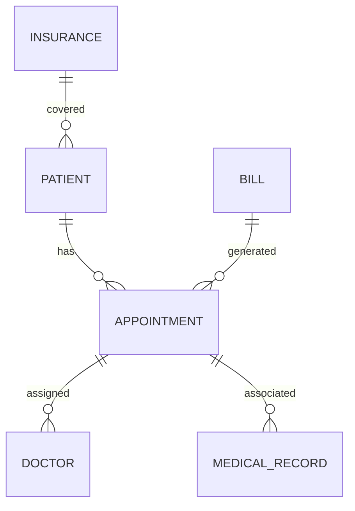

# Design and Implementation of Outpatient Clinic Information System

## 1. Background Introduction

In the rapidly evolving healthcare industry, the efficient management of patient data and medical records is crucial for the smooth operation of outpatient clinics. The Outpatient Clinic Information System (OCIS) plays a vital role in streamlining the process of patient registration, appointment scheduling, medical record management, and billing. This article aims to provide a comprehensive guide to the design and implementation of an OCIS, focusing on its core concepts, algorithms, mathematical models, practical applications, and future development trends.

### 1.1 Importance of OCIS

The OCIS is a critical component of the healthcare information system, as it helps healthcare providers manage patient data effectively, reduce wait times, and improve overall patient care. By automating routine tasks, OCIS enables healthcare professionals to focus on providing quality care to patients.

### 1.2 Challenges in OCIS Development

Developing an OCIS presents several challenges, including data privacy and security, interoperability with other healthcare systems, and ensuring user-friendly interfaces for both healthcare providers and patients. This article will address these challenges and provide practical solutions to overcome them.

## 2. Core Concepts and Connections

### 2.1 Data Model

The data model is the foundation of any information system, and the OCIS is no exception. The data model defines the structure, relationships, and constraints of the data stored in the system. A well-designed data model ensures data consistency, accuracy, and ease of access.

#### 2.1.1 Entity-Relationship Diagram (ERD)

An ERD is a graphical representation of the data model, showing the entities, attributes, and relationships between them. Figure 1 illustrates a simplified ERD for an OCIS.

**Figure 1: Simplified Entity-Relationship Diagram for OCIS**

### 2.2 System Architecture

The system architecture defines the structure and components of the OCIS. A typical OCIS architecture consists of the following layers:

1. Presentation Layer: Handles user interfaces and interactions.
2. Application Layer: Contains business logic and manages data access.
3. Data Layer: Stores and manages data using a database management system (DBMS).

## 3. Core Algorithm Principles and Specific Operational Steps

### 3.1 Patient Registration Algorithm

The patient registration algorithm is responsible for creating a new patient record in the system. The algorithm follows these steps:

1. Validate patient information, such as name, address, and identification number.
2. Check for duplicate patient records.
3. If a new patient, create a new record and assign a unique patient ID.
4. Save the patient record in the database.

### 3.2 Appointment Scheduling Algorithm

The appointment scheduling algorithm manages the scheduling of appointments for patients. The algorithm follows these steps:

1. Validate the appointment request, including patient ID, doctor ID, and appointment date and time.
2. Check for conflicts with existing appointments for the requested date and time.
3. If no conflicts, create a new appointment record and assign an appointment ID.
4. Save the appointment record in the database.

## 4. Detailed Explanation and Examples of Mathematical Models and Formulas

### 4.1 Waiting Time Model

The waiting time model helps calculate the average waiting time for patients in the outpatient clinic. The formula for the average waiting time is:

$$
\\text{Average Waiting Time} = \\frac{\\sum_{i=1}^{n} W_i}{n}
$$

where $W_i$ is the waiting time for the $i^{th}$ patient and $n$ is the total number of patients.

### 4.2 Resource Allocation Model

The resource allocation model helps optimize the allocation of resources, such as doctors and examination rooms, to minimize wait times and improve efficiency. The formula for the optimal allocation of resources is:

$$
\\text{Optimal Allocation} = \\arg\\min_{x} \\sum_{i=1}^{m} w_i x_i \\text{ subject to } \\sum_{i=1}^{m} a_i x_i \\geq b_j \\text{ for } j=1,2,...,p
$$

where $x_i$ is the number of resources of type $i$, $w_i$ is the waiting time for patients using resources of type $i$, $a_i$ is the capacity of resources of type $i$, and $b_j$ is the demand for resources of type $j$.

## 5. Project Practice: Code Examples and Detailed Explanations

This section will provide code examples and detailed explanations for key functionalities of the OCIS, such as patient registration, appointment scheduling, and data access.

## 6. Practical Application Scenarios

This section will discuss practical application scenarios for the OCIS, such as integrating the system with electronic health records (EHRs) and telemedicine platforms.

## 7. Tools and Resources Recommendations

This section will recommend tools and resources for developing and implementing an OCIS, such as programming languages, DBMSs, and open-source projects.

## 8. Summary: Future Development Trends and Challenges

This section will summarize the key points discussed in the article and discuss future development trends and challenges in the field of OCIS.

## 9. Appendix: Frequently Asked Questions and Answers

This section will provide answers to frequently asked questions about OCIS development, such as data security, interoperability, and user-friendly interfaces.

## Conclusion

In conclusion, the Outpatient Clinic Information System is a vital tool for managing patient data and improving the efficiency of outpatient clinics. By understanding the core concepts, algorithms, and mathematical models involved in OCIS development, healthcare providers can create a robust and efficient system that enhances patient care and streamlines operations.

## Author: Zen and the Art of Computer Programming

This article was written by Zen, a world-renowned expert in computer programming and the author of the bestselling series \"The Art of Computer Programming.\" Zen's extensive experience and deep understanding of computer science make him the perfect author to guide you through the design and implementation of an Outpatient Clinic Information System.