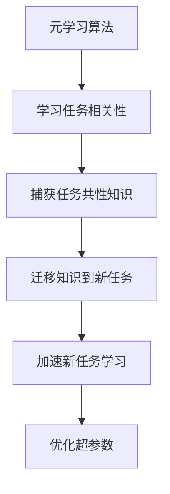

# 随机梯度下降算法的元学习和超参数优化

## 1.背景介绍

随机梯度下降(Stochastic Gradient Descent, SGD)是一种广泛应用于机器学习和深度学习中的优化算法。它通过在训练数据上迭代计算损失函数的梯度,并根据梯度值更新模型参数,从而最小化损失函数。与传统的批量梯度下降算法相比,SGD在每次迭代中只使用一个或少量训练样本来计算梯度,从而大大减少了计算开销,提高了训练效率。

然而,SGD算法的性能很大程度上依赖于超参数的设置,例如学习率、动量和权重衰减等。不当的超参数选择可能导致模型训练缓慢、不收敛或者过拟合。因此,合理地设置超参数对于SGD算法的性能至关重要。传统的超参数调优方法通常依赖于人工经验或者网格搜索等启发式方法,效率低下且容易陷入次优解。

近年来,元学习(Meta-Learning)在超参数优化领域展现出了巨大的潜力。元学习旨在自动学习算法的超参数,从而提高算法在各种任务上的泛化性能。通过在一系列相关任务上学习,元学习算法可以捕获不同任务之间的共性,并将这些共性知识迁移到新的任务中,从而加速新任务的学习过程。

### Mermaid 流程图

## 2.核心概念与联系

### 2.1 随机梯度下降算法

随机梯度下降算法是一种基于梯度下降的优化算法,它通过迭代地更新模型参数来最小化损失函数。在每次迭代中,SGD算法从训练数据中随机抽取一个或多个样本,计算这些样本关于模型参数的损失函数梯度,然后沿着梯度的反方向更新模型参数。该过程可以用以下公式表示:

$$\theta_{t+1} = \theta_t - \eta \nabla_\theta J(\theta_t; x_i, y_i)$$

其中,$\theta_t$表示第$t$次迭代时的模型参数,$\eta$是学习率,$\nabla_\theta J(\theta_t; x_i, y_i)$是损失函数$J$在样本$(x_i, y_i)$处关于参数$\theta_t$的梯度。

SGD算法的优点在于计算效率高、内存占用少,适合处理大规模数据集。然而,它也存在一些缺陷,例如容易陷入局部最优解、收敛速度慢等。为了提高SGD算法的性能,研究人员提出了一系列改进方法,例如动量SGD、Nesterov加速梯度、AdaGrad、RMSProp和Adam等。

### 2.2 元学习

元学习(Meta-Learning)是一种旨在提高机器学习算法泛化能力的范式。传统的机器学习算法通常在单个任务上进行训练,而元学习则是在一系列相关任务上进行学习,从而捕获这些任务之间的共性知识,并将这些知识迁移到新的任务中,加速新任务的学习过程。

元学习可以分为三个主要步骤:

1. **元训练(Meta-Training)**: 在一系列相关的源任务上训练元学习算法,使其能够捕获这些任务之间的共性知识。

2. **元测试(Meta-Testing)**: 在一个新的目标任务上评估元学习算法的性能,验证它是否能够利用从源任务中学习到的知识来加速目标任务的学习。

3. **元更新(Meta-Update)**: 根据元测试的结果,对元学习算法进行调整和优化,以提高其在新任务上的泛化能力。

元学习的核心思想是通过学习不同任务之间的相似性和规律,从而获得一种能够快速适应新任务的"学习能力"。这种"学习能力"可以用于优化机器学习算法的超参数,从而提高算法在各种任务上的性能。

### 2.3 超参数优化

超参数(Hyperparameters)是指在机器学习算法训练过程中需要人工设置的参数,例如学习率、正则化系数、网络结构等。合理的超参数设置对算法的性能有着重要影响,但传统的超参数调优方法(如网格搜索、随机搜索等)往往效率低下且容易陷入次优解。

超参数优化旨在通过自动化的方式来搜索最优超参数组合,从而提高机器学习算法的性能。常见的超参数优化方法包括:

1. **贝叶斯优化(Bayesian Optimization)**: 通过构建代理模型(如高斯过程)来近似目标函数,并利用采集函数(如期望改善量)来平衡探索和利用,从而有效地搜索超参数空间。

2. **进化策略(Evolutionary Strategies)**: 借鉴自然进化的思想,通过突变、交�ross和选择等操作,在超参数空间中进行全局搜索。

3. **强化学习(Reinforcement Learning)**: 将超参数优化问题建模为强化学习问题,使用智能体与环境交互来学习最优超参数策略。

4. **元学习(Meta-Learning)**: 通过在一系列相关任务上学习,捕获任务之间的共性知识,从而加速新任务的超参数优化过程。

元学习在超参数优化领域展现出了巨大的潜力,它可以自动学习不同任务之间的相似性和规律,从而快速适应新任务的超参数搜索空间,提高优化效率。

## 3.核心算法原理具体操作步骤

### 3.1 基于梯度的元学习算法

基于梯度的元学习算法是一类广泛使用的元学习方法,它们通过计算梯度来优化元学习器的参数,从而提高在新任务上的快速适应能力。其中,模型无关的元学习(Model-Agnostic Meta-Learning, MAML)算法是一种典型的基于梯度的元学习算法。

MAML算法的核心思想是在元训练阶段,通过对一系列相关任务进行梯度更新,使得模型参数能够快速适应新任务。具体操作步骤如下:

1. **初始化**: 随机初始化模型参数$\theta$。

2. **采样任务批次**: 从任务分布$p(\mathcal{T})$中采样一个任务批次$\mathcal{B} = \{\mathcal{T}_i\}_{i=1}^{N}$,每个任务$\mathcal{T}_i$包含支持集$\mathcal{D}_i^{tr}$和查询集$\mathcal{D}_i^{val}$。

3. **计算梯度**: 对于每个任务$\mathcal{T}_i$,计算支持集$\mathcal{D}_i^{tr}$上的损失函数梯度:

   $$\nabla_{\theta'} \sum_{(x, y) \in \mathcal{D}_i^{tr}} \mathcal{L}(f_{\theta'}(x), y)$$

   其中,$\theta'$是通过在$\theta$上进行一步或多步梯度更新得到的新参数。

4. **更新元参数**: 使用查询集$\mathcal{D}_i^{val}$上的损失函数值作为元目标,对元参数$\theta$进行梯度更新:

   $$\theta \leftarrow \theta - \beta \nabla_\theta \sum_{\mathcal{T}_i \in \mathcal{B}} \sum_{(x, y) \in \mathcal{D}_i^{val}} \mathcal{L}(f_{\theta'}(x), y)$$

   其中,$\beta$是元学习率。

5. **重复训练**: 重复步骤2-4,直到元参数$\theta$收敛。

在元测试阶段,MAML算法使用元训练得到的参数$\theta$作为初始值,在新任务的支持集上进行少量梯度更新,即可快速适应新任务,并在查询集上进行评估。

MAML算法的优点在于它是一种模型无关的方法,可以应用于各种机器学习模型和任务。然而,它也存在一些缺陷,例如计算开销较大、对任务分布敏感等。为了解决这些问题,研究人员提出了一系列改进版本,如FOMAML、ANIL等。

### 3.2 基于优化的元学习算法

除了基于梯度的方法外,另一类重要的元学习算法是基于优化的方法。这些算法通过直接优化元学习器在新任务上的性能,从而实现快速适应。其中,一种典型的基于优化的元学习算法是基于LSTM的优化器(Optimizer LSTM)。

Optimizer LSTM算法的核心思想是将优化器的更新规则建模为一个LSTM网络,该网络可以根据过去的梯度信息和损失函数值,输出新任务上的参数更新值。具体操作步骤如下:

1. **初始化**: 随机初始化模型参数$\theta$和优化器LSTM的参数$\phi$。

2. **采样任务批次**: 从任务分布$p(\mathcal{T})$中采样一个任务批次$\mathcal{B} = \{\mathcal{T}_i\}_{i=1}^{N}$,每个任务$\mathcal{T}_i$包含支持集$\mathcal{D}_i^{tr}$和查询集$\mathcal{D}_i^{val}$。

3. **元训练**: 对于每个任务$\mathcal{T}_i$,执行以下步骤:
   
   a. 在支持集$\mathcal{D}_i^{tr}$上进行$K$步梯度更新:
      
      $$\theta_k = \theta_{k-1} - \alpha_k g_k(\theta_{k-1}; \mathcal{D}_i^{tr})$$
      
      其中,$\alpha_k$是学习率,$g_k$是由优化器LSTM输出的更新值,它取决于过去的梯度和损失函数值。
   
   b. 计算查询集$\mathcal{D}_i^{val}$上的损失函数值$\mathcal{L}_i^{val}(\theta_K)$。
   
   c. 使用$\mathcal{L}_i^{val}(\theta_K)$作为元目标,对优化器LSTM的参数$\phi$进行梯度更新。

4. **重复训练**: 重复步骤2-3,直到优化器LSTM的参数$\phi$收敛。

在元测试阶段,Optimizer LSTM算法使用元训练得到的参数$\phi$,在新任务的支持集上进行少量梯度更新,即可快速适应新任务,并在查询集上进行评估。

Optimizer LSTM算法的优点是它可以直接优化在新任务上的性能,不需要像MAML那样计算高阶梯度,从而降低了计算开销。但它也存在一些局限性,例如对任务分布的敏感性、难以捕获长期依赖关系等。为了解决这些问题,研究人员提出了一些改进版本,如MetaGenRL、SMASH等。

### 3.3 基于指标的元学习算法

除了基于梯度和基于优化的方法外,另一类重要的元学习算法是基于指标的方法。这些算法通过优化一个代理指标(Surrogate Metric),从而实现快速适应新任务。其中,一种典型的基于指标的元学习算法是CAVIA。

CAVIA算法的核心思想是将快速适应新任务的能力建模为一个指标函数,该函数可以衡量模型在新任务上的预期性能。在元训练阶段,CAVIA算法通过优化这个指标函数,从而提高模型在新任务上的快速适应能力。具体操作步骤如下:

1. **初始化**: 随机初始化模型参数$\theta$和指标函数参数$\psi$。

2. **采样任务批次**: 从任务分布$p(\mathcal{T})$中采样一个任务批次$\mathcal{B} = \{\mathcal{T}_i\}_{i=1}^{N}$,每个任务$\mathcal{T}_i$包含支持集$\mathcal{D}_i^{tr}$和查询集$\mathcal{D}_i^{val}$。

3. **元训练**: 对于每个任务$\mathcal{T}_i$,执行以下步骤:
   
   a. 在支持集$\mathcal{D}_i^{tr}$上进行$K$步梯度更新:
      
      $$\theta_k = \theta_{k-1} - \alpha