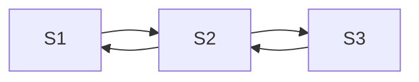
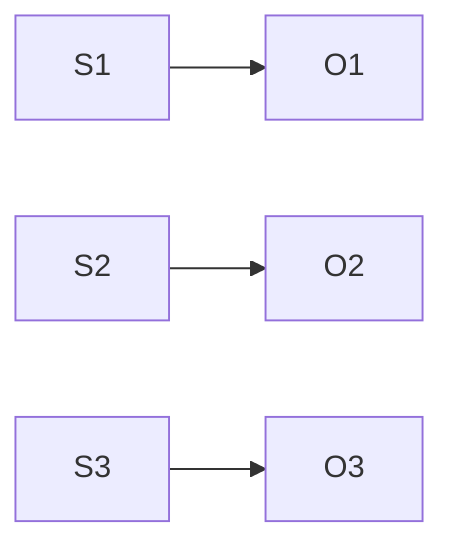

# 隐马尔可夫模型(HMM)原理与代码实战案例讲解

## 1.背景介绍

### 1.1 什么是隐马尔可夫模型?

隐马尔可夫模型(Hidden Markov Model, HMM)是一种统计学习模型,广泛应用于语音识别、生物信息学、金融预测等领域。HMM由两个随机过程组成:一个是隐藏的随机过程,它是不可观测的;另一个是可观测的随机过程,它依赖于隐藏的随机过程。

### 1.2 HMM的应用场景

HMM可以用于分析序列数据,如语音信号、基因序列、手写识别等。它在语音识别、生物信息学分析、模式识别、机器人运动规划等领域有着广泛的应用。

## 2.核心概念与联系  

### 2.1 马尔可夫链

马尔可夫链是HMM的基础。它是一个随机过程,满足"无后效性",即下一状态只与当前状态有关,与过去状态无关。

$$
P(X_n=x_n|X_{n-1}=x_{n-1},X_{n-2}=x_{n-2},...,X_1=x_1)=P(X_n=x_n|X_{n-1}=x_{n-1})
$$

### 2.2 隐藏的马尔可夫链

隐藏的马尔可夫链是一个不可观测的随机过程,它描述了系统内部的状态转移。每个状态都有一定的概率转移到其他状态。



### 2.3 观测序列

观测序列是一个可观测的随机过程,它依赖于隐藏的马尔可夫链的状态。每个状态都有一定的概率发射出特定的观测值。



### 2.4 HMM的三个基本问题

1. **概率计算问题**:给定HMM模型和观测序列,计算观测序列的概率。
2. **学习问题**:给定观测序列,估计HMM模型的参数。
3. **解码问题**:给定HMM模型和观测序列,找出最可能的隐藏状态序列。

## 3.核心算法原理具体操作步骤

### 3.1 前向算法

前向算法用于解决HMM的概率计算问题。它计算出给定观测序列和HMM模型参数时,观测序列的概率。

算法步骤:

1. 初始化:$\alpha_1(i)=\pi_iP(O_1|S_i),\quad i=1,2,...,N$
2. 递推:$\alpha_{t+1}(j)=\sum_{i=1}^N\alpha_t(i)a_{ij}P(O_{t+1}|S_j),\quad t=1,2,...,T-1,\quad j=1,2,...,N$
3. 终止:$P(O|\lambda)=\sum_{i=1}^N\alpha_T(i)$

其中:
- $\alpha_t(i)$表示在时刻t处于状态i的概率
- $\pi_i$是初始状态概率
- $a_{ij}$是状态转移概率
- $P(O_t|S_i)$是发射概率

### 3.2 后向算法

后向算法也用于解决HMM的概率计算问题,它从序列末尾开始递推计算概率。

算法步骤:

1. 初始化:$\beta_T(i)=1,\quad i=1,2,...,N$  
2. 递推:$\beta_t(i)=\sum_{j=1}^Na_{ij}P(O_{t+1}|S_j)\beta_{t+1}(j),\quad t=T-1,T-2,...,1,\quad i=1,2,...,N$
3. 终止:$P(O|\lambda)=\sum_{i=1}^N\pi_iP(O_1|S_i)\beta_1(i)$

### 3.3 Baum-Welch算法

Baum-Welch算法用于解决HMM的学习问题,即给定观测序列,估计HMM模型的参数。它是一种期望最大化(EM)算法。

算法步骤:

1. 初始化HMM模型参数$\lambda=(A,B,\pi)$
2. 计算前向概率$\alpha_t(i)$和后向概率$\beta_t(i)$
3. 计算期望值:
   - $\gamma_t(i)=P(q_t=S_i|O,\lambda)$
   - $\xi_t(i,j)=P(q_t=S_i,q_{t+1}=S_j|O,\lambda)$
4. 重新估计参数:
   - $\pi_i=\gamma_1(i)$
   - $a_{ij}=\frac{\sum_{t=1}^{T-1}\xi_t(i,j)}{\sum_{t=1}^{T-1}\gamma_t(i)}$
   - $b_j(k)=\frac{\sum_{t=1,O_t=v_k}^T\gamma_t(j)}{\sum_{t=1}^T\gamma_t(j)}$
5. 重复步骤2-4,直到收敛

### 3.4 Viterbi算法

Viterbi算法用于解决HMM的解码问题,即给定HMM模型和观测序列,找出最可能的隐藏状态序列。

算法步骤:

1. 初始化:$\delta_1(i)=\pi_iP(O_1|S_i),\quad \psi_1(i)=0$
2. 递推:
   - $\delta_t(j)=\max_{1\leq i\leq N}[\delta_{t-1}(i)a_{ij}]P(O_t|S_j)$
   - $\psi_t(j)=\arg\max_{1\leq i\leq N}[\delta_{t-1}(i)a_{ij}]$
3. 终止:
   - $P^*=\max_{1\leq i\leq N}\delta_T(i)$
   - $q_T^*=\arg\max_{1\leq i\leq N}\delta_T(i)$
4. 状态序列回溯:
   - $q_t^*=\psi_{t+1}(q_{t+1}^*),\quad t=T-1,T-2,...,1$

## 4.数学模型和公式详细讲解举例说明

### 4.1 HMM的数学表示

HMM可以用一个三元组$\lambda=(A,B,\pi)$来表示:

- $A$是状态转移概率矩阵,其中$a_{ij}=P(q_{t+1}=S_j|q_t=S_i)$
- $B$是观测概率矩阵,其中$b_j(k)=P(O_t=v_k|q_t=S_j)$
- $\pi$是初始状态概率向量,其中$\pi_i=P(q_1=S_i)$

例如,一个三状态HMM可以表示为:

$$
\lambda=\left(\begin{array}{ccc}
0.5 & 0.3 & 0.2\\
0.4 & 0.4 & 0.2\\
0.2 & 0.5 & 0.3
\end{array}\right),\left(\begin{array}{ccc}
0.3 & 0.4 & 0.3\\
0.2 & 0.5 & 0.3\\
0.4 & 0.2 & 0.4
\end{array}\right),\left(\begin{array}{c}
0.3\\
0.4\\
0.3
\end{array}\right)
$$

### 4.2 前向概率和后向概率

前向概率$\alpha_t(i)$表示在时刻t处于状态i的概率,可以通过递推计算:

$$
\alpha_t(j)=\sum_{i=1}^N\alpha_{t-1}(i)a_{ij}P(O_t|S_j)
$$

后向概率$\beta_t(i)$表示在时刻t处于状态i之后,观测到剩余序列的概率,可以通过递推计算:

$$
\beta_t(i)=\sum_{j=1}^Na_{ij}P(O_{t+1}|S_j)\beta_{t+1}(j)
$$

### 4.3 期望值计算

在Baum-Welch算法中,需要计算两个期望值:

1. $\gamma_t(i)=P(q_t=S_i|O,\lambda)$,表示在时刻t处于状态i的概率。
2. $\xi_t(i,j)=P(q_t=S_i,q_{t+1}=S_j|O,\lambda)$,表示在时刻t处于状态i,在时刻t+1处于状态j的概率。

它们可以通过前向概率和后向概率计算:

$$
\gamma_t(i)=\frac{\alpha_t(i)\beta_t(i)}{\sum_{j=1}^N\alpha_t(j)\beta_t(j)}
$$

$$
\xi_t(i,j)=\frac{\alpha_t(i)a_{ij}P(O_{t+1}|S_j)\beta_{t+1}(j)}{\sum_{r=1}^N\sum_{s=1}^N\alpha_t(r)a_{rs}P(O_{t+1}|S_s)\beta_{t+1}(s)}
$$

### 4.4 参数重新估计

在Baum-Welch算法中,需要根据计算出的期望值重新估计HMM模型参数:

$$
\pi_i=\gamma_1(i)
$$

$$
a_{ij}=\frac{\sum_{t=1}^{T-1}\xi_t(i,j)}{\sum_{t=1}^{T-1}\gamma_t(i)}
$$

$$
b_j(k)=\frac{\sum_{t=1,O_t=v_k}^T\gamma_t(j)}{\sum_{t=1}^T\gamma_t(j)}
$$

## 5.项目实践：代码实例和详细解释说明

下面是一个使用Python实现HMM的示例代码,包括前向算法、后向算法、Baum-Welch算法和Viterbi算法。

```python
import numpy as np

class HMM:
    def __init__(self, A, B, pi):
        self.A = A  # 状态转移概率矩阵
        self.B = B  # 观测概率矩阵
        self.pi = pi  # 初始状态概率向量
        self.N = A.shape[0]  # 状态数量

    def forward(self, O):
        """前向算法"""
        T = len(O)
        alpha = np.zeros((T, self.N))
        alpha[0] = self.pi * self.B[:, O[0]]

        for t in range(1, T):
            for j in range(self.N):
                alpha[t, j] = np.sum(alpha[t - 1] * self.A[:, j]) * self.B[j, O[t]]

        return np.sum(alpha[-1])

    def backward(self, O):
        """后向算法"""
        T = len(O)
        beta = np.zeros((T, self.N))
        beta[-1] = 1

        for t in range(T - 2, -1, -1):
            for i in range(self.N):
                beta[t, i] = np.sum(self.A[i, :] * self.B[:, O[t + 1]] * beta[t + 1])

        return np.sum(self.pi * self.B[:, O[0]] * beta[0])

    def baum_welch(self, O, max_iter=100):
        """Baum-Welch算法"""
        T = len(O)
        alpha = np.zeros((T, self.N))
        beta = np.zeros((T, self.N))
        gamma = np.zeros((T, self.N))
        xi = np.zeros((T - 1, self.N, self.N))

        # 初始化
        self.pi = np.random.rand(self.N)
        self.pi /= np.sum(self.pi)
        self.A = np.random.rand(self.N, self.N)
        self.A /= np.sum(self.A, axis=1, keepdims=True)
        self.B = np.random.rand(self.N, self.N)
        self.B /= np.sum(self.B, axis=1, keepdims=True)

        for _ in range(max_iter):
            # 计算前向概率和后向概率
            alpha[0] = self.pi * self.B[:, O[0]]
            for t in range(1, T):
                for j in range(self.N):
                    alpha[t, j] = np.sum(alpha[t - 1] * self.A[:, j]) * self.B[j, O[t]]

            beta[-1] = 1
            for t in range(T - 2, -1, -1):
                for i in range(self.N):
                    beta[t, i] = np.sum(self.A[i, :] * self.B[:, O[t + 1]] * beta[t + 1])

            # 计算期望值
            for t in range(T):
                gamma[t] = alpha[t] * beta[t] / np.sum(alpha[t] * beta[t])

            for t in range(T - 1):
                denominator = np.sum(alpha[t] * self.A * self.B[:, O[t + 1]] * beta[t + 1])
                for i in range(self.N):
                    for j in range(self.N):
                        xi[t, i, j] = alpha[t, i] * self.A[i, j] *