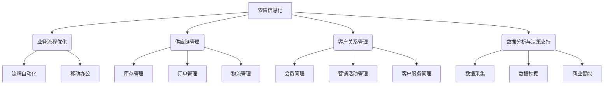

# 零售行业信息化建设方案

## 1. 背景介绍

### 1.1 零售行业现状与挑战

零售行业是国民经济的重要组成部分,在促进商品流通、满足人民生活需求方面发挥着重要作用。然而,在当前数字化转型的大潮中,传统零售企业面临着诸多挑战:

1. **线上线下融合**:消费者购物习惯的改变,要求零售企业构建无缝衔接的线上线下购物体验。
2. **供应链优化**:传统供应链效率低下,缺乏实时库存管理和智能化补货机制。
3. **客户洞察不足**:无法深入挖掘消费者行为数据,难以实现个性化营销和精准营销。
4. **业务流程低效**:传统业务流程存在诸多手工环节,效率低下且容易出错。

因此,零售企业亟需通过信息化建设,实现数字化转型,提升运营效率和竞争力。

### 1.2 信息化建设的意义

零售行业信息化建设旨在利用现代信息技术,全面优化零售企业的业务流程、供应链管理、客户关系管理等各个环节,实现以下目标:

1. **提高运营效率**:自动化业务流程,降低人工成本,提高响应速度。
2. **优化供应链管理**:实现库存实时可视化,智能补货,降低库存成本。
3. **增强客户体验**:构建线上线下一体化购物体验,实现个性化营销。
4. **促进数据驱动决策**:挖掘消费者行为数据,支持精准营销和商品优化。

通过信息化建设,零售企业可以提升运营效率、降低成本、增强竞争力,实现长期可持续发展。

## 2. 核心概念与联系

零售行业信息化建设涉及多个核心概念,它们相互关联、相互作用,构成了一个完整的信息化体系。



### 2.1 业务流程优化

业务流程优化是零售信息化建设的核心,旨在通过流程自动化和移动办公等手段,提高业务执行效率,降低人工成本。

### 2.2 供应链管理

高效的供应链管理对零售企业至关重要。信息化建设可实现库存实时可视化、智能补货、订单管理和物流管理等功能,提高供应链效率。

### 2.3 客户关系管理

客户关系管理是零售企业获取竞争优势的关键。信息化建设可实现会员管理、营销活动管理和客户服务管理等功能,增强客户体验。

### 2.4 数据分析与决策支持

数据分析与决策支持系统可通过数据采集、数据挖掘和商业智能等手段,帮助零售企业实现数据驱动决策,优化商品结构和营销策略。

## 3. 核心算法原理具体操作步骤

零售信息化建设涉及多种算法和技术,其中一些核心算法原理及操作步骤如下:

### 3.1 协同过滤算法

协同过滤算法广泛应用于个性化推荐系统,通过分析用户历史行为数据,发现具有相似兴趣爱好的用户群体,从而为目标用户推荐合适的商品或服务。

1. 收集用户行为数据,如浏览记录、购买记录等。
2. 构建用户-物品评分矩阵。
3. 计算用户间相似度,可使用皮尔逊相关系数或余弦相似度等方法。
4. 对目标用户,基于其最相似的 K 个邻居用户的评分,预测目标用户对其他物品的兴趣程度。
5. 根据预测结果,为目标用户推荐感兴趣的物品。

### 3.2 关联规则挖掘算法

关联规则挖掘算法用于发现数据集中隐藏的有趣关联模式,在零售领域可应用于购物篮分析、交叉销售等场景。

1. 从交易数据集中提取所有项集。
2. 计算每个项集的支持度,过滤掉低于最小支持度阈值的项集。
3. 对剩余项集生成候选规则。
4. 计算每条规则的置信度,过滤掉低于最小置信度阈值的规则。
5. 输出满足支持度和置信度要求的强关联规则。

### 3.3 时间序列预测算法

时间序列预测算法用于预测未来时间点的数值,在零售领域可应用于销量预测、库存管理等场景。常用算法包括移动平均、指数平滑、ARIMA 模型等。

以 ARIMA 模型为例,步骤如下:

1. 对原始时间序列进行平稳性检验。
2. 对非平稳序列进行差分运算,使之达到平稳。
3. 识别 ARIMA 模型的 p、d、q 参数阶数。
4. 基于确定的 p、d、q 值,构建 ARIMA 模型并估计参数。
5. 利用构建的 ARIMA 模型对未来时间点进行预测。

## 4. 数学模型和公式详细讲解举例说明

零售信息化建设中涉及多种数学模型和公式,下面对其中几个典型模型进行详细讲解。

### 4.1 协同过滤算法中的相似度计算

协同过滤算法需要计算用户间或物品间的相似度,常用的相似度计算方法有皮尔逊相关系数和余弦相似度。

#### 4.1.1 皮尔逊相关系数

皮尔逊相关系数用于计算两个变量之间的线性相关程度,取值范围为 [-1, 1]。在协同过滤算法中,可用于计算两个用户之间的相似度。

设有 n 个共同评分的物品,用户 u 和 v 对物品 i 的评分分别为 $r_{ui}$ 和 $r_{vi}$,则两个用户的皮尔逊相关系数为:

$$w_{uv} = \frac{\sum_{i=1}^{n}(r_{ui} - \overline{r_u})(r_{vi} - \overline{r_v})}{\sqrt{\sum_{i=1}^{n}(r_{ui} - \overline{r_u})^2}\sqrt{\sum_{i=1}^{n}(r_{vi} - \overline{r_v})^2}}$$

其中 $\overline{r_u}$ 和 $\overline{r_v}$ 分别表示用户 u 和 v 的平均评分。

#### 4.1.2 余弦相似度

余弦相似度用于计算两个向量之间的夹角余弦值,取值范围为 [0, 1]。在协同过滤算法中,可用于计算两个物品之间的相似度。

设有 n 个共同评分的用户,物品 i 和 j 的评分向量分别为 $\vec{r_i}$ 和 $\vec{r_j}$,则两个物品的余弦相似度为:

$$\text{sim}(i, j) = \cos(\vec{r_i}, \vec{r_j}) = \frac{\vec{r_i} \cdot \vec{r_j}}{|\vec{r_i}||\vec{r_j}|} = \frac{\sum_{u=1}^{n}r_{ui}r_{uj}}{\sqrt{\sum_{u=1}^{n}r_{ui}^2}\sqrt{\sum_{u=1}^{n}r_{uj}^2}}$$

余弦相似度越接近 1,表示两个物品越相似。

### 4.2 关联规则挖掘中的支持度和置信度

关联规则挖掘算法中,支持度和置信度是衡量规则重要性的两个关键指标。

#### 4.2.1 支持度

支持度表示包含规则前件和后件的交易占所有交易的比例,用于衡量规则的普遍程度。

设 $I = \{i_1, i_2, \cdots, i_m\}$ 为项集,规则为 $X \Rightarrow Y$,其中 $X \subseteq I$, $Y \subseteq I$ 且 $X \cap Y = \emptyset$,交易数据集 $D$ 中包含 $X \cup Y$ 的交易数为 $\sigma(X \cup Y)$,则规则的支持度为:

$$\text{support}(X \Rightarrow Y) = \frac{\sigma(X \cup Y)}{|D|}$$

#### 4.2.2 置信度

置信度表示包含规则前件的交易中,同时也包含规则后件的比例,用于衡量规则的可信程度。

置信度的计算公式为:

$$\text{confidence}(X \Rightarrow Y) = \frac{\sigma(X \cup Y)}{\sigma(X)}$$

通常,我们会设置最小支持度和置信度阈值,只保留满足要求的强关联规则。

### 4.3 时间序列预测中的 ARIMA 模型

ARIMA (Auto-Regressive Integrated Moving Average) 模型是一种广泛应用于时间序列预测的统计模型,由 AR(自回归)、I(差分)和 MA(移动平均)三部分组成。

#### 4.3.1 ARIMA 模型表示

ARIMA(p, d, q) 模型可表示为:

$$y_t = \phi_1y_{t-1} + \phi_2y_{t-2} + \cdots + \phi_py_{t-p} + \theta_1\epsilon_{t-1} + \theta_2\epsilon_{t-2} + \cdots + \theta_q\epsilon_{t-q} + \epsilon_t$$

其中:
- $y_t$ 为时间 t 时的观测值
- $\phi_i$ 为自回归系数
- $\theta_j$ 为移动平均系数
- $\epsilon_t$ 为时间 t 时的残差项,服从均值为 0 的白噪声过程

#### 4.3.2 ARIMA 模型构建步骤

构建 ARIMA 模型的一般步骤如下:

1. 对原始时间序列进行平稳性检验,如单位根检验。
2. 对非平稳序列进行 d 阶差分,使之达到平稳。
3. 通过自相关函数 (ACF) 和偏自相关函数 (PACF) 图,确定 AR 阶数 p 和 MA 阶数 q。
4. 基于确定的 p、d、q 值,构建 ARIMA(p, d, q) 模型并估计参数。
5. 对模型残差进行诊断,检验其是否为白噪声过程。
6. 利用构建的 ARIMA 模型对未来时间点进行预测。

以上公式和模型在零售信息化建设中有广泛应用,如个性化推荐、购物篮分析、销量预测等,是数据分析的重要理论基础。

## 5. 项目实践: 代码实例和详细解释说明

为了更好地理解上述算法和模型的实现,下面给出了基于 Python 的代码实例,并对关键步骤进行了详细解释。

### 5.1 协同过滤算法实例

以电影评分数据为例,实现基于用户的协同过滤算法,为目标用户推荐感兴趣的电影。

```python
import pandas as pd
from math import sqrt

# 加载电影评分数据
ratings = pd.read_csv('ratings.csv')

# 将数据转换为 user-item 矩阵
matrix = ratings.pivot_table(index='user_id', columns='movie_id', values='rating')

# 计算用户间的皮尔逊相关系数
def pearson_sim(user1, user2):
    common_items = matrix[matrix[user1].notnull() & matrix[user2].notnull()][user1]
    if len(common_items) == 0:
        return 0
    
    user1_mean = matrix[user1].mean()
    user2_mean = matrix[user2].mean()
    
    sum_num = sum((matrix.loc[common_items.index, user1] - user1_mean) * 
                  (matrix.loc[common_items.index, user2] - user2_mean))
    sum_denom1 = sum((matrix.loc[common_items.index, user1] - user1_mean) ** 2)
    sum_denom2 = sum((matrix.loc[common_items.index, user2] - user2_mean) ** 