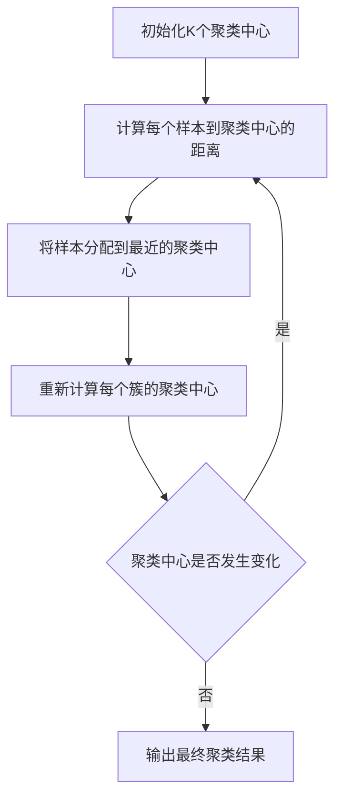
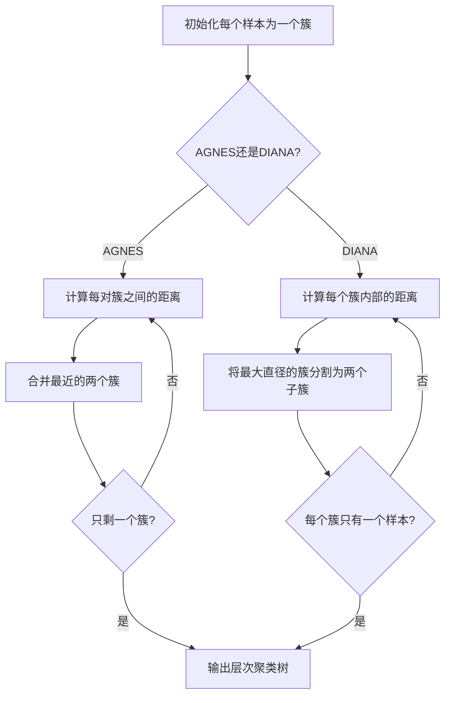
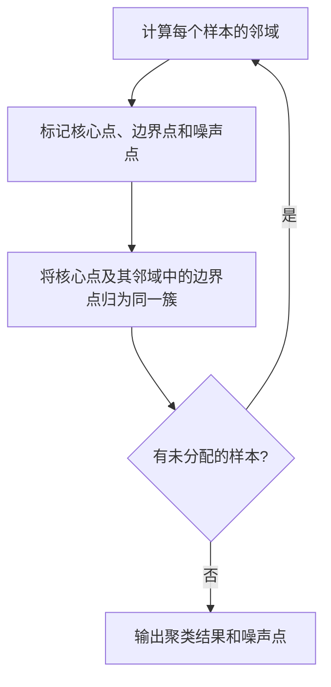
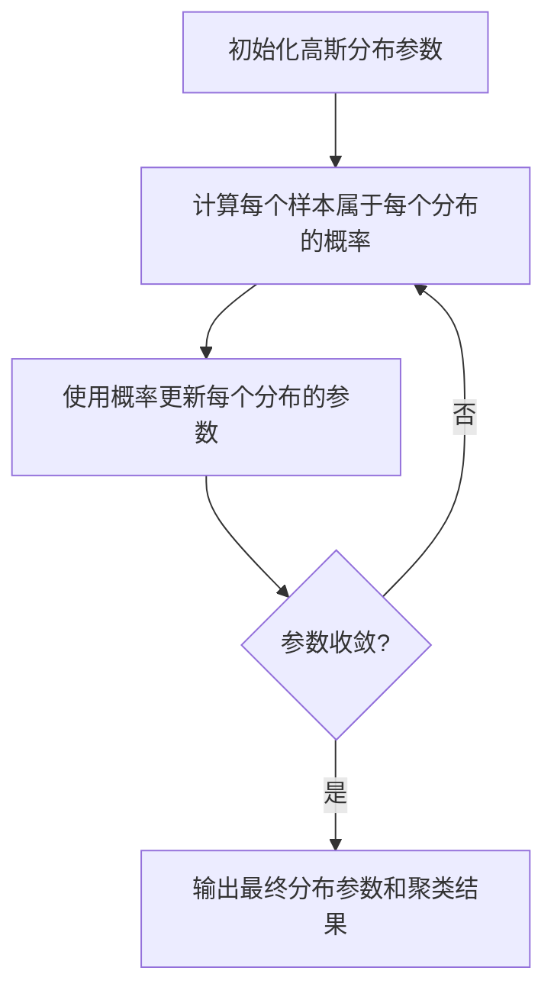
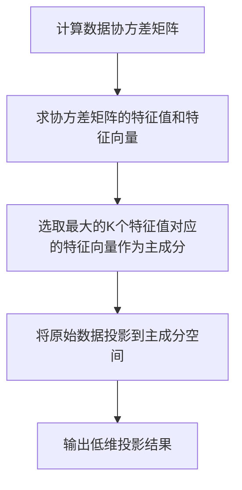
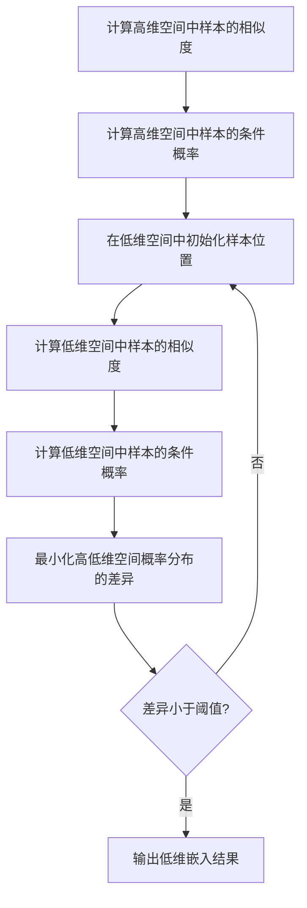
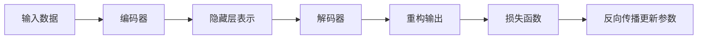
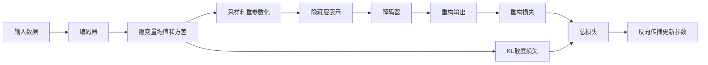
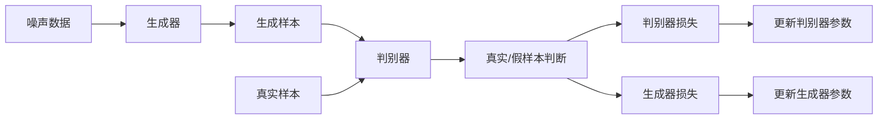

# 非监督学习 原理与代码实例讲解

## 1. 背景介绍

### 1.1 什么是非监督学习?

在机器学习领域中,根据训练数据是否包含标签,可以将算法分为监督学习和非监督学习两大类。监督学习算法需要使用带有标签的训练数据集,通过学习输入数据与标签之间的映射关系来构建模型。而非监督学习则不需要任何标签数据,算法直接从原始数据中自动发现数据的内在结构、模式和关联性。

非监督学习是一种从数据中发现隐藏模式或内在结构的机器学习技术,它不需要人工标注的训练数据。相比于监督学习,非监督学习具有以下优势:

1. 无需人工标注数据,节省了大量的人力和时间成本。
2. 可以发现人类难以察觉的数据模式和规律。
3. 适用于探索性数据分析,为后续的监督学习提供有价值的输入。

### 1.2 非监督学习的应用场景

非监督学习在现实世界中有着广泛的应用,包括但不限于:

- **聚类分析**: 根据数据之间的相似性自动将数据划分为多个簇,用于客户细分、基因表达分析等。
- **异常检测**: 发现数据中的异常点或离群点,应用于欺诈检测、故障诊断等领域。
- **关联规则挖掘**: 发现数据集中存在的频繁模式,用于商品关联分析、网页聚类等。
- **降维**: 将高维数据映射到低维空间,以提高数据的可解释性和可视化效果。
- **生成模型**: 从训练数据中学习数据分布,用于数据增强、图像/音频/文本生成等。

## 2. 核心概念与联系

### 2.1 聚类分析

聚类分析是将相似的对象归为同一簇,而将不相似的对象归为不同簇的过程。常见的聚类算法包括K-Means、层次聚类、DBSCAN、高斯混合模型等。

#### 2.1.1 K-Means聚类

K-Means是一种简单而经典的聚类算法,其基本思想是通过迭代最小化样本到最近聚类中心的距离平方和,从而将样本数据划分为K个簇。算法步骤如下:

1. 随机选择K个初始聚类中心
2. 将每个样本点分配到最近的聚类中心
3. 重新计算每个簇的聚类中心
4. 重复步骤2和3,直至聚类中心不再发生变化



#### 2.1.2 层次聚类

层次聚类算法通过不断合并或分割簇来构建层次聚类树。常见的算法包括AGNES(agglomerative nesting)和DIANA(divisive analysis)。

- AGNES自底向上地合并最相似的两个簇,直至所有样本归为一个簇。
- DIANA自顶向下地将一个大簇分割为较小的簇,直至每个簇只包含一个样本。



#### 2.1.3 DBSCAN聚类

DBSCAN(Density-Based Spatial Clustering of Applications with Noise)是一种基于密度的聚类算法,它将高密度区域中的样本划分为同一个簇,并将离群点识别为噪声。算法步骤:

1. 计算每个样本点的邻域,确定核心点、边界点和噪声点
2. 将核心点及其邻域中的边界点归为同一簇
3. 对未分配的样本重复步骤1和2



#### 2.1.4 高斯混合模型

高斯混合模型(GMM)假设数据由多个高斯分布的混合而成,每个高斯分布对应一个簇。GMM使用期望最大化(EM)算法迭代估计每个分布的参数,并计算样本属于每个分布的概率。



### 2.2 降维

高维数据存在"维数灾难"问题,如数据稀疏、计算复杂度高等。降维技术可以将高维数据映射到低维空间,从而简化数据结构、提高可解释性和可视化效果。常见的降维算法有主成分分析(PCA)、t-SNE、LLE、Isomap等。

#### 2.2.1 主成分分析(PCA)

PCA通过线性变换将数据投影到一组正交基向量上,使投影数据的方差最大化。这些基向量就是数据的主成分,可以用于降维。



#### 2.2.2 t-SNE

t-SNE(t-Distributed Stochastic Neighbor Embedding)是一种流行的非线性降维技术,它最小化高维空间和低维空间中相似样本邻域概率的差异,从而保留数据的局部和全局结构。



### 2.3 生成模型

生成模型通过从训练数据中学习数据分布,可以用于生成新的样本数据。常见的生成模型包括自编码器、变分自编码器(VAE)、生成对抗网络(GAN)等。

#### 2.3.1 自编码器

自编码器由编码器和解码器两部分组成,编码器将输入数据映射到隐藏层表示,解码器则将隐藏层表示重构为原始输入。通过最小化输入与重构结果的差异,自编码器可以学习数据的有效表示。



#### 2.3.2 变分自编码器(VAE)

VAE在自编码器的基础上,引入了隐变量的概率分布,通过采样和重参数化技巧,使得隐藏层表示可以被采样。这使得VAE可以生成新的样本。



#### 2.3.3 生成对抗网络(GAN)

GAN由生成器和判别器两个网络组成,生成器从噪声中生成假样本,判别器则判断样本是真实数据还是生成数据。两个网络相互对抗训练,最终生成器可以生成逼真的样本。



## 3. 核心算法原理具体操作步骤

### 3.1 K-Means聚类算法

K-Means聚类算法的核心思想是将数据划分为K个簇,使得每个样本到所属簇的聚类中心的距离平方和最小。算法步骤如下:

1. **初始化K个聚类中心**。可以从数据集中随机选择K个样本作为初始聚类中心。

2. **计算每个样本到聚类中心的距离**。常用的距离度量包括欧氏距离、曼哈顿距离等。

3. **将每个样本分配到最近的聚类中心**。遍历所有样本,将其分配到距离最近的聚类中心所对应的簇。

4. **重新计算每个簇的聚类中心**。对于每个簇,计算所有样本的均值作为新的聚类中心。

5. **重复步骤2-4**,直至聚类中心不再发生变化或达到最大迭代次数。

算法伪代码如下:

```python
import numpy as np

def k_means(X, k, max_iter=100):
    # 初始化聚类中心
    centroids = X[np.random.choice(X.shape[0], k, replace=False)]
    
    for _ in range(max_iter):
        # 计算每个样本到聚类中心的距离
        distances = np.sqrt(((X - centroids[:, np.newaxis])**2).sum(axis=2))
        # 将每个样本分配到最近的聚类中心
        cluster_assignments = np.argmin(distances, axis=0)
        
        # 重新计算每个簇的聚类中心
        new_centroids = np.array([X[cluster_assignments == i].mean(axis=0) for i in range(k)])
        
        # 检查聚类中心是否发生变化
        if np.all(centroids == new_centroids):
            break
        
        centroids = new_centroids
    
    return centroids, cluster_assignments
```

### 3.2 DBSCAN聚类算法

DBSCAN是一种基于密度的聚类算法,它将高密度区域中的样本划分为同一个簇,并将离群点识别为噪声。算法步骤如下:

1. **计算每个样本点的邻域**。给定半径`eps`和最小样本数`min_samples`,对于每个样本点,统计其`eps`邻域内的样本数量。

2. **标记核心点、边界点和噪声点**。如果一个样本点的邻域样本数量大于等于`min_samples`,则将其标记为核心点。如果一个样本点本身不是核心点,但位于某个核心点的邻域内,则将其标记为边界点。其余样本点标记为噪声点。

3. **将核心点及其邻域中的边界点归为同一簇**。从一个未访问的核心点开始,将其邻域内的所有核心点和边界点归为同一个簇。

4. **对未分配的样本重复步骤1-3**,直至所有样本都被分配或标记为噪声点。

算法伪代码如下:

```python
import numpy as np

def dbscan(X, eps, min_samples):
    n_samples = X.shape[0]
    cluster