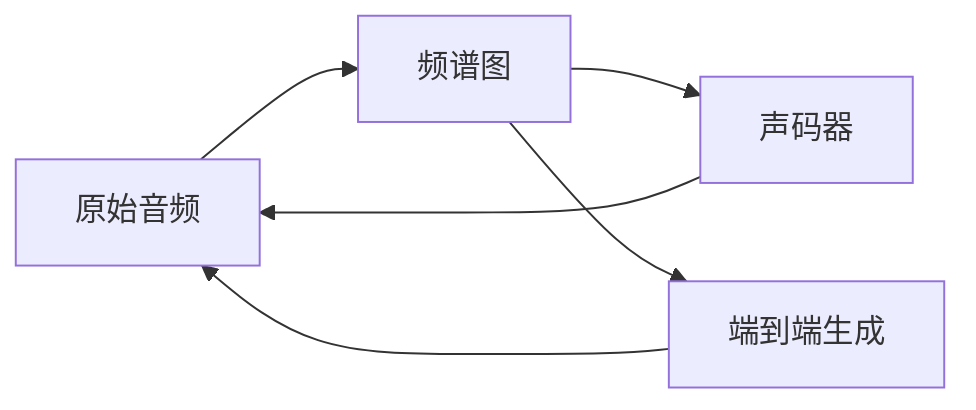

# 音频生成(Audio Generation) - 原理与代码实例讲解

## 1. 背景介绍
### 1.1 音频生成的定义与意义
音频生成(Audio Generation)是指利用人工智能技术,特别是深度学习和机器学习算法,自动生成逼真、自然的音频内容的技术。它涵盖了语音合成、音乐生成、声音效果合成等多个领域。音频生成技术的发展,为内容创作、游戏开发、虚拟助手等诸多领域带来了革命性的变化,极大地提升了人机交互体验。

### 1.2 音频生成技术的发展历程
早期的音频生成主要依赖于基于规则的合成技术,如拼接合成和参数合成。21世纪以来,随着深度学习的兴起,基于神经网络的端到端音频生成模型不断涌现,如WaveNet、SampleRNN、Tacotron等,使得合成音频的自然度和表现力大幅提升。近年来,Transformer等注意力机制也被引入音频生成领域,进一步增强了模型性能。

### 1.3 音频生成的应用场景
音频生成技术在实际应用中大放异彩。在语音合成领域,它被用于构建逼真的语音助手、有声读物和教育工具。音乐生成方面,AI作曲系统可辅助音乐人进行创作。游戏、VR/AR、电影等领域也大量使用程序合成的音效,极大地丰富了声音场景。此外,个性化语音定制、歌声合成等新兴方向也备受关注。

## 2. 核心概念与联系
### 2.1 原始音频 Raw Audio
原始音频是指未经压缩编码的音频数据,通常以PCM(脉冲编码调制)的形式存储。它记录了连续的声音信号在离散时间点上的振幅值。原始音频是音频生成模型的训练数据和输出目标。

### 2.2 频谱图 Spectrogram
频谱图是音频信号的一种视觉表示,展现了信号在不同时间点上的频率分布情况。常见的频谱图包括短时傅里叶变换(STFT)谱图和Mel频谱图。频谱图作为音频的中间表示,在许多音频生成模型中扮演重要角色。

### 2.3 声码器 Vocoder 
声码器指将特征表示(如频谱图)转换为可听音频的模块。传统声码器如Griffin-Lim算法基于信号处理原理,而基于神经网络的声码器(如WaveNet)则可生成更自然的波形。声码器是端到端音频生成管道的重要组成。

### 2.4 端到端生成 End-to-End Generation
端到端音频生成指的是仅用单个神经网络模型,直接将输入特征映射到原始音频波形的方法。与传统的声学模型+声码器的流水线方式相比,端到端方法简化了流程,避免了信息损失,合成音质更佳。

### 2.5 概念联系图
以下是音频生成核心概念的联系示意图(Mermaid格式):


## 3. 核心算法原理与步骤
### 3.1 WaveNet原理解析
WaveNet是一种基于卷积神经网络(CNN)的原始音频波形建模方法。其核心思想是将音频看作一个自回归模型:当前时刻的采样点可由其之前的若干采样点预测得到。WaveNet的关键创新包括:
1. 因果卷积(Causal Convolution):保证模型不能看到未来信息,符合因果律
2. 扩张卷积(Dilated Convolution):指数级增加感受野,捕捉长距离依赖
3. 门控激活单元(Gated Activation Units):增强模型表达能力
4. 软最大输出(Softmax Output):生成多种可能的采样点概率分布

WaveNet的生成步骤如下:
1. 输入音频片段馈入因果卷积层,提取局部特征
2. 特征通过一系列扩张卷积层,捕捉长距离语境信息
3. 门控激活函数调节特征表示 
4. Softmax输出当前时刻采样点的概率分布
5. 根据概率分布采样得到当前采样点,并反馈作为下一时刻的输入
6. 重复步骤1-5,逐点生成整个音频序列

### 3.2 Tacotron原理解析
Tacotron是一种端到端的语音合成模型,可直接将文本序列转换为频谱图。其编码器-解码器(Encoder-Decoder)结构借鉴了序列到序列模型的思路:
1. 编码器(Encoder):通常采用卷积或循环神经网络提取文本序列的语义表示
2. 注意力机制(Attention):在解码时关注输入文本的不同部分
3. 解码器(Decoder):根据语义表示和注意力权重,自回归地生成频谱图帧
4. Post-Net:卷积后处理网络,提升频谱图细节

Tacotron的语音合成步骤如下:
1. 将输入文本序列馈入编码器,提取语义特征
2. 解码器根据语义特征,预测频谱图的第一帧
3. 通过注意力机制,计算当前解码步的注意力权重
4. 加权平均编码器输出,得到当前解码步的语义表示
5. 将语义表示和上一帧频谱馈入解码器,预测下一帧频谱
6. 重复步骤3-5,生成完整频谱图
7. 频谱图通过Post-Net优化
8. 将最终频谱图送入声码器,合成原始音频波形

## 4. 数学模型与公式详解
### 4.1 扩张卷积的数学描述
扩张卷积在WaveNet等模型中扮演关键角色。相比普通卷积,它在卷积核内引入了扩张率(dilation rate)的概念。设输入序列为$\mathbf{x}$,卷积核为$\mathbf{w}$,扩张率为$d$,则扩张卷积的数学定义为:

$$(\mathbf{x}*_d\mathbf{w})[n]=\sum_{k=0}^{K-1}\mathbf{x}[n-d\cdot k]\cdot\mathbf{w}[k]$$

其中$*_d$表示扩张卷积操作,$K$为卷积核大小。可见,扩张率$d$控制了卷积核内相邻元素之间的间隔,从而扩大了感受野。当$d=1$时,扩张卷积退化为普通卷积。

### 4.2 Mel频谱图的计算过程
Mel频谱图是语音识别和合成中常用的声学特征。它模拟了人耳的听觉特性,在低频区分辨率高,高频区分辨率低。Mel频谱图的计算步骤如下:
1. 对原始音频进行短时傅里叶变换(STFT),得到线性频谱图$S$
2. 将线性频率$f$映射到Mel频率$m$:
$$m=2595\log_{10}(1+\frac{f}{700})$$
3. 定义一组三角形滤波器$H_k(m)$,其中心频率在Mel频率轴上均匀分布
4. 对线性频谱图$S$应用Mel滤波器组,得到Mel频谱图$\hat{S}$:
$$\hat{S}_k=\sum_{m=0}^{M-1}|S(m)|^2H_k(m)$$
其中$M$为频谱图频率轴上的采样点数。

### 4.3 注意力机制的数学描述
注意力机制使Tacotron等模型能够在解码时有选择地关注输入序列的不同部分。常见的注意力计算方式包括:
1. 点积注意力(Dot-Product Attention):
$$\alpha_{ij}=\frac{\exp(\mathbf{s}_{i-1}^\top\mathbf{h}_j)}{\sum_{k=1}^{T}\exp(\mathbf{s}_{i-1}^\top\mathbf{h}_k)}$$
其中$\alpha_{ij}$为第$i$个解码步对第$j$个编码步的注意力权重,$\mathbf{s}_{i-1}$为上一解码步的隐状态,$\mathbf{h}_j$为第$j$个编码步的隐状态,$T$为编码序列长度。

2. 加性注意力(Additive Attention):
$$e_{ij}=\mathbf{v}^\top\tanh(\mathbf{W}_1\mathbf{s}_{i-1}+\mathbf{W}_2\mathbf{h}_j)$$
$$\alpha_{ij}=\frac{\exp(e_{ij})}{\sum_{k=1}^{T}\exp(e_{ik})}$$
其中$\mathbf{W}_1,\mathbf{W}_2,\mathbf{v}$为可学习的参数矩阵和向量。相比点积注意力,加性注意力引入了非线性变换,增强了表达能力。

## 5. 项目实践:代码实例详解
下面我们以PyTorch为例,实现一个简单的因果卷积层和扩张卷积层。

### 5.1 因果卷积层
```python
import torch
import torch.nn as nn

class CausalConv1d(nn.Module):
    def __init__(self, in_channels, out_channels, kernel_size, dilation=1):
        super(CausalConv1d, self).__init__()
        self.padding = (kernel_size - 1) * dilation
        self.conv = nn.Conv1d(in_channels, out_channels, kernel_size, 
                              padding=self.padding, dilation=dilation)
        
    def forward(self, x):
        x = self.conv(x)
        return x[:, :, :-self.padding]
```
因果卷积层的关键是在卷积前对输入进行恰当的padding,以确保输出序列与输入对齐,且不包含未来信息。

### 5.2 扩张卷积层
```python
class DilatedConv1d(nn.Module):
    def __init__(self, in_channels, out_channels, kernel_size, dilation):
        super(DilatedConv1d, self).__init__()
        self.conv = nn.Conv1d(in_channels, out_channels, kernel_size, 
                              dilation=dilation)
        
    def forward(self, x):
        return self.conv(x)
```
扩张卷积的实现很简单,只需在普通卷积的基础上引入扩张率(dilation)参数即可。PyTorch会自动进行扩张卷积的计算。

### 5.3 使用示例
```python
# 输入序列: batch_size=16, channels=32, length=1024
x = torch.randn(16, 32, 1024) 

# 因果卷积层
causal_conv = CausalConv1d(32, 64, 3)
out1 = causal_conv(x) 
print(out1.shape) # torch.Size([16, 64, 1024])

# 扩张卷积层
dilated_conv = DilatedConv1d(32, 64, 3, dilation=2)
out2 = dilated_conv(x)
print(out2.shape) # torch.Size([16, 64, 1024])
```
可见,因果卷积层的输出序列长度与输入严格对齐,而扩张卷积层的感受野大小取决于扩张率。

## 6. 实际应用场景
音频生成技术在诸多领域得到广泛应用,下面列举几个有代表性的场景:

### 6.1 智能语音助手
Apple Siri、Google Assistant、Amazon Alexa等智能语音助手都采用了先进的语音合成技术,以提供自然流畅的语音交互体验。其中,WaveNet等生成模型在合成音质方面取得了突破性进展。

### 6.2 有声内容创作
利用音频生成技术,内容创作者可以批量生成有声读物、广播剧等音频内容,大大提高制作效率。同时,定制化的声音也能满足不同场景的需求。

### 6.3 游戏与影视后期
游戏和电影后期制作中,需要大量的音效和配音素材。传统的人工录制方式成本高昂,而音频生成技术可实现高度逼真的程序合成,灵活性和效率大幅提升。

### 6.4 无障碍辅助
语音合成技术是无障碍辅助领域的重要工具。例如,将文本实时转换为语音,可帮助视障人士获取信息;而将语音转换为手语动画,则可辅助听障人士的沟通。

## 7. 工具与资源推荐
### 7.1 开源实现
- [r9y9/wavenet_vocoder](https://github.com/r9y9/wavenet_voc