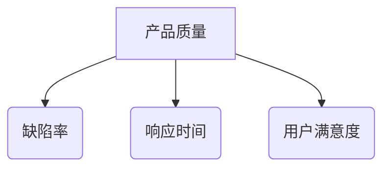

# 领域自适应的评价指标：如何衡量成效

## 1. 背景介绍

### 1.1 评价指标的重要性

在当今快节奏的商业环境中,企业需要快速适应不断变化的市场需求和技术发展趋势。为了保持竞争力,公司必须持续评估和优化其产品、服务和运营流程。这就需要建立一套全面、灵活且自适应的评价指标体系,帮助企业准确衡量其在特定领域的表现和成效。

评价指标不仅可以揭示企业的强项和弱项,还能指导管理层制定明智的决策,优化资源配置,提高效率和盈利能力。然而,制定恰当的评价指标并非易事,需要深入了解行业动态、客户需求以及公司的战略目标。

### 1.2 传统评价指标的局限性

许多企业仍然依赖于传统的财务指标,如收入、利润和市场份额等。虽然这些指标能够反映企业的整体财务状况,但往往缺乏对特定领域表现的深入洞察。

此外,传统指标通常是滞后指标,反映的是过去的业绩,而不能预测未来的趋势。在瞬息万变的商业环境中,企业需要前瞻性的指标来主动应对变化,而不是被动地跟随。

### 1.3 领域自适应评价指标的优势

为了克服传统评价指标的局限性,企业需要采用领域自适应的评价指标。这种指标体系能够根据特定的业务领域、产品线或服务类型进行定制,从而更准确地反映企业在该领域的表现。

领域自适应评价指标不仅关注财务数据,还会考虑客户满意度、市场份额、创新能力、运营效率等多个维度。通过综合分析这些指标,企业可以全面了解自身的竞争力,并制定相应的战略规划。

此外,领域自适应评价指标具有前瞻性,能够捕捉行业趋势和客户需求的变化,帮助企业提前做出调整,保持领先地位。

## 2. 核心概念与联系

### 2.1 关键绩效指标 (Key Performance Indicators, KPIs)

关键绩效指标是衡量企业在特定领域表现的核心指标。它们通常与企业的战略目标密切相关,反映了企业实现这些目标的进展情况。

KPI可以是财务指标,如收入增长率、利润率等;也可以是非财务指标,如客户满意度、产品缺陷率、员工流失率等。良好的KPI应该是可衡量、可实现、相关且具有时间限制的(SMART:Specific,Measurable,Achievable,Relevant,Time-bound)。

### 2.2 平衡记分卡 (Balanced Scorecard, BSC)

平衡记分卡是一种将企业战略与日常运营相结合的管理工具。它从四个维度(财务、客户、内部流程、学习与成长)来评估企业的绩效,确保企业在追求财务目标的同时,也关注其他关键因素。

BSC不仅可以用于整体战略管理,也可以应用于特定的业务领域或产品线。通过定制化的KPI,企业可以全面评估该领域的表现,并据此制定改进措施。

### 2.3 绩效管理生命周期

绩效管理是一个持续的过程,包括规划、监控、评估和改进四个阶段。领域自适应的评价指标贯穿于整个生命周期中:

1. **规划阶段**:确定领域目标,选择相关的KPI作为评价指标。
2. **监控阶段**:持续收集数据,跟踪KPI的变化情况。
3. **评估阶段**:分析KPI数据,评估目标实现情况。
4. **改进阶段**:根据评估结果,调整战略或优化流程。

这种循环过程确保评价指标能够与企业的实际情况保持同步,并持续优化。

### 2.4 数据驱动决策

领域自适应的评价指标需要大量的数据支持。企业应当建立健全的数据采集和分析系统,从各个渠道(如销售系统、客户反馈、运营日志等)收集相关数据。

通过大数据分析和数据挖掘技术,企业可以发现数据中隐藏的模式和趋势,从而制定更加精准的评价指标。同时,数据分析结果也可以为决策提供依据,帮助管理层做出明智的选择。

## 3. 核心算法原理具体操作步骤

构建领域自适应的评价指标体系需要遵循一定的原理和步骤,以确保指标的有效性和实用性。下面将详细介绍其核心算法原理和具体操作步骤。

### 3.1 确定评价目标

首先,企业需要明确评价的目标。这可能是一个特定的业务领域、产品线或服务类型。评价目标应该与企业的整体战略目标保持一致,并具有可衡量性。

### 3.2 确定关键绩效领域

根据评价目标,识别与之相关的关键绩效领域。这些领域通常包括财务、客户、内部流程、创新等方面。每个领域都对实现评价目标至关重要。

### 3.3 选择适当的指标

对于每个关键绩效领域,选择一组适当的指标作为评价依据。这些指标应该能够准确反映该领域的表现,并与评价目标密切相关。

指标的选择需要考虑以下因素:

- **相关性**:指标与评价目标的相关程度。
- **可衡量性**:指标是否可以被客观地测量和量化。
- **数据可用性**:是否有足够的数据来支持指标的计算和分析。
- **可控性**:企业是否能够通过自身的努力来影响该指标。

### 3.4 确定指标权重

不同的指标对评价目标的重要性可能不同,因此需要为每个指标分配适当的权重。权重的确定可以采用以下方法:

1. **专家评估法**:邀请领域专家根据经验对指标的重要性进行评分。
2. **层次分析法**:构建指标层次结构,通过数学模型计算每个指标的权重。
3. **数据驱动法**:利用历史数据,通过回归分析或机器学习算法确定指标权重。

### 3.5 建立综合评价模型

综合评价模型将各个指标的表现综合起来,得到一个总体评分。常用的综合评价模型包括:

1. **加权求和模型**:将每个指标的得分乘以其权重,然后求和。
2. **效用函数模型**:根据指标的实际值,通过效用函数计算其得分。
3. **模糊综合评价模型**:利用模糊数学理论,处理指标之间的模糊关系。

不同的模型适用于不同的场景,需要根据具体情况进行选择。

### 3.6 持续监控和优化

评价指标体系并非一成不变的,需要根据企业的实际情况和市场变化进行持续的监控和优化。可以采取以下措施:

1. **定期审查指标**:评估指标的相关性和有效性,根据需要进行调整或替换。
2. **优化权重分配**:根据新的数据和专家意见,重新调整指标权重。
3. **引入新指标**:当出现新的关键绩效领域时,及时引入相应的新指标。
4. **改进数据采集**:优化数据采集渠道和方式,确保数据的准确性和完整性。

通过不断的优化,评价指标体系可以与企业的发展保持同步,为决策提供持续的支持。

## 4. 数学模型和公式详细讲解举例说明

在构建领域自适应的评价指标体系时,数学模型和公式扮演着重要的角色。它们为指标的选择、权重确定和综合评价提供了理论基础和计算方法。本节将详细介绍几种常用的数学模型和公式,并给出具体的例子说明。

### 4.1 层次分析法 (Analytic Hierarchy Process, AHP)

层次分析法是一种确定指标权重的有效方法。它将评价目标和相关指标构建成一个层次结构模型,然后通过专家评判的方式,计算每个指标在该层次中的权重。

假设我们要评估一家软件公司的产品质量,相关指标包括缺陷率、响应时间、用户满意度等。可以构建如下层次结构:

接下来,专家需要通过两两比较的方式,判断每个指标相对于目标的重要性。比较结果可以用一个矩阵表示:

$$
A = \begin{bmatrix}
1 & 3 & 5\\
1/3 & 1 & 3\\
1/5 & 1/3 & 1
\end{bmatrix}
$$

其中,矩阵元素 $a_{ij}$ 表示第 i 个指标相对于第 j 个指标的重要程度。通过特征值计算,可以得到每个指标的权重向量:

$$
w = \begin{bmatrix}
0.6\\
0.3\\
0.1
\end{bmatrix}
$$

这就是缺陷率、响应时间和用户满意度三个指标的权重。

### 4.2 效用函数模型

效用函数模型将指标的实际值映射到一个效用分数,用于综合评价。常用的效用函数包括线性函数、对数函数和 S 型函数等。

假设我们要评估一个电子商务网站的用户体验,其中页面加载时间是一个重要指标。我们可以定义如下效用函数:

$$
u(t) = \begin{cases}
1, & t \leq 1\\
\frac{5-t}{4}, & 1 < t \leq 5\\
0, & t > 5
\end{cases}
$$

其中,t 表示页面加载时间(单位为秒),$u(t)$ 表示该指标的效用分数。当加载时间小于 1 秒时,效用分数为满分 1 分;当加载时间在 1 到 5 秒之间时,效用分数线性递减;当加载时间超过 5 秒时,效用分数为 0 分。

通过这种方式,我们可以将一个连续的指标值映射到一个离散的分数,便于后续的综合评价。

### 4.3 模糊综合评价模型

在实际应用中,评价指标之间可能存在一定的模糊关系,难以用精确的数值来描述。这时,我们可以借助模糊数学理论,构建模糊综合评价模型。

假设我们要评估一家餐厅的服务质量,相关指标包括食物质量、环境卫生、服务态度等。由于这些指标难以用精确的数值来衡量,我们可以使用语言值来描述,如"非常好"、"好"、"一般"、"差"等。

首先,我们需要为每个语言值赋予一个模糊隶属度,构建模糊评价矩阵:

$$
R = \begin{bmatrix}
0.8 & 0.2 & 0 & 0\\
0.1 & 0.7 & 0.2 & 0\\
0 & 0.3 & 0.6 & 0.1
\end{bmatrix}
$$

其中,每一行表示一个指标对应的模糊隶属度向量。

接下来,我们需要确定每个指标的权重向量 $W$。假设权重向量为 $W = (0.4, 0.3, 0.3)^T$,表示食物质量的权重最高。

最后,我们可以计算综合评价向量 $B$:

$$
B = W \cdot R = (0.4, 0.3, 0.3) \cdot \begin{bmatrix}
0.8 & 0.2 & 0 & 0\\
0.1 & 0.7 & 0.2 & 0\\
0 & 0.3 & 0.6 & 0.1
\end{bmatrix} = (0.34, 0.42, 0.24, 0)
$$

综合评价向量 $B$ 表示该餐厅的服务质量属于"好"的可能性为 0.42,属于"一般"的可能性为 0.24,属于"非常好"的可能性为 0.34。根据这个结果,我们可以对餐厅的服务质量做出综合评价。

通过上述例子,我们可以看到数学模型和公式