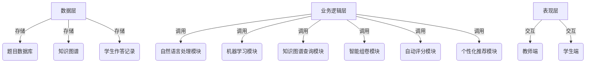

# 题库专家系统详细设计与具体代码实现

## 1. 背景介绍

在当今教育领域,随着在线教育和远程学习的兴起,构建高质量的题库系统成为了一个迫切的需求。题库专家系统旨在为教师和学生提供一个智能化的题库管理和练习平台,通过整合先进的人工智能技术,实现题目的自动组卷、智能评分和个性化学习路径推荐等功能。

传统的题库系统存在诸多不足,例如题目质量参差不齐、组卷缺乏灵活性、评分过程缓慢且容易出现主观偏差等。而题库专家系统通过引入自然语言处理、知识图谱、机器学习等技术,旨在解决这些痛点,为教育工作者和学习者带来全新的体验。

## 2. 核心概念与联系

### 2.1 知识图谱

知识图谱是题库专家系统的核心支撑,它以结构化的形式表示知识领域中的概念、实体及其相互关系。在题库场景中,知识图谱可以用于表示课程大纲、知识点、考点等,并捕捉它们之间的依赖和层级关系。

基于知识图谱,系统可以更好地理解题目内容,进而实现智能组卷、知识点推理和难度评估等功能。同时,知识图谱也为个性化学习路径规划和知识漏洞发现提供了坚实的理论基础。

### 2.2 自然语言处理

自然语言处理(NLP)技术在题库专家系统中扮演着重要角色。系统需要理解题目的语义,才能准确判断其考查的知识点、难度级别等属性。此外,NLP还可以支持自动阅卷和评分,通过分析学生的答案与标准答案的语义相似性,给出客观公正的评分结果。

在实现上,常用的NLP技术包括词向量表示、序列标注、文本分类等。通过预训练语言模型(如BERT)和迁移学习,可以显著提升NLP模型在特定领域(如教育题库)的性能表现。

### 2.3 机器学习

机器学习算法在题库专家系统中有着广泛的应用场景。例如,可以利用监督学习算法(如逻辑回归、决策树等)对题目进行自动难度评估,或者基于学生的历史作答数据,构建个性化的知识状态模型,为适应性学习提供支持。

此外,无监督学习算法(如聚类分析)也可以用于发现题目之间的相似性模式,从而实现自动题型分类和知识点挖掘。通过将机器学习与其他技术(如NLP、知识图谱)相结合,可以充分发挥人工智能在教育领域的优势。

### 2.4 系统架构概览

题库专家系统通常采用分布式架构,包括数据层、业务逻辑层和表现层等多个模块。其中,数据层负责存储题目数据、知识图谱和学生作答记录等;业务逻辑层则集成了各种AI算法模型,实现智能组卷、自动评分、个性化推荐等核心功能;表现层则提供了用户友好的Web界面,供教师和学生进行交互操作。

该架构设计保证了系统的高可扩展性和可维护性,各个模块可以相对独立地进行开发和部署,从而提高了系统的灵活性和健壮性。

## 3. 核心算法原理具体操作步骤

### 3.1 知识图谱构建

知识图谱是题库专家系统的知识基础,因此构建高质量的知识图谱是系统实现的关键前提。知识图谱构建通常包括以下几个步骤:

1. **知识获取**: 从教材、课程大纲、考纲等结构化和非结构化数据源中提取相关知识。
2. **实体识别与关系抽取**: 利用NLP技术(如命名实体识别、关系抽取等)从文本数据中自动识别出知识概念(实体)及其关系。
3. **本体构建**: 根据提取的实体和关系,构建形式化的本体(ontology),定义知识领域的概念层次和语义关联。
4. **知识融合**: 将来自不同数据源的知识进行清洗、去重和融合,构建统一且连贯的知识图谱。
5. **知识存储**: 将构建好的知识图谱持久化存储,以支持高效的查询和推理操作。

在实践中,可以利用开源知识图谱工具(如Apache Jena、Neo4j等)来辅助知识图谱的构建和管理。同时,也可以考虑引入领域专家的人工审核,以提高知识图谱的准确性和完整性。

### 3.2 智能组卷算法

智能组卷是题库专家系统的一项核心功能,其目标是根据预设的组卷策略(如知识点覆盖率、难度分布等),自动生成高质量的试卷。常见的智能组卷算法包括:

1. **基于约束优化的组卷算法**: 将组卷问题建模为约束优化问题(Constraint Satisfaction Problem, CSP),根据预设的约束条件(如知识点覆盖、题型分布等)和优化目标(如最大熵覆盖),利用启发式搜索算法(如模拟退火、遗传算法等)求解最优解。

2. **基于图论的组卷算法**: 将知识点和题目抽象为图的节点和边,根据知识点之间的先修关系构建有向无环图(Directed Acyclic Graph, DAG)。然后利用图遍历算法(如深度优先搜索、广度优先搜索等)在图上寻找满足约束条件的最优路径,作为试卷的知识点组合。

3. **基于机器学习的组卷算法**: 将组卷过程建模为序列生成问题,利用序列生成模型(如循环神经网络、Transformer等)从历史试卷数据中学习组卷策略,并生成新的试卷方案。

无论采用何种算法,都需要结合知识图谱和NLP技术,对题目进行语义理解和知识点标注,从而保证组卷结果的质量和合理性。

### 3.3 自动评分算法

自动评分是题库专家系统的另一个关键功能,它能够极大地提高评分效率,并避免人工评分过程中的主观偏差。常见的自动评分算法包括:

1. **基于文本相似度的评分算法**: 计算学生答案与标准答案之间的文本相似度,作为评分的依据。相似度计算可以基于字符串编辑距离、词袋模型(Bag-of-Words)、词向量等方法。

2. **基于语义匹配的评分算法**: 利用NLP技术(如词义消歧、语义角色标注等)深入分析答案的语义结构,判断学生答案是否涵盖了题目所要求的关键信息和语义要素。

3. **基于知识图谱的评分算法**: 将标准答案和学生答案映射到知识图谱上,比较两者在知识图谱中的覆盖范围和语义距离,从而给出评分结果。

4. **基于深度学习的评分算法**: 将评分问题建模为机器阅读理解(Machine Reading Comprehension, MRC)任务,利用预训练语言模型(如BERT)及其在下游任务上的迁移能力,对答案进行自动评分。

在实际应用中,可以综合运用上述多种算法,形成混合评分策略,以提高评分的准确性和鲁棒性。同时,也需要引入人工评审环节,对自动评分结果进行审核和反馈,持续优化评分模型的性能。

### 3.4 个性化学习路径推荐算法

个性化学习是题库专家系统的一大亮点,它能够根据学生的知识状态和学习偏好,推荐最合适的学习路径和内容。常见的个性化推荐算法包括:

1. **基于知识空间理论的推荐算法**: 根据知识图谱中知识点之间的prerequisite关系,构建知识空间(Knowledge Space),并基于学生的作答历史,估计其当前所掌握的知识状态(Knowledge State)。然后,根据知识空间中的拓扑结构,为学生推荐最优的学习路径。

2. **基于协同过滤的推荐算法**: 利用协同过滤技术,发现具有相似知识状态和学习偏好的学生群体,并根据该群体的历史学习记录,为目标学生推荐合适的学习资源和路径。

3. **基于知识追踪的推荐算法**: 构建学生知识状态的动态模型(如贝叶斯知识追踪模型、深度知识追踪模型等),实时跟踪学生的知识掌握情况。根据模型预测的知识状态,为学生推荐相应的练习内容和学习策略。

4. **基于强化学习的推荐算法**: 将个性化学习路径推荐建模为马尔可夫决策过程(Markov Decision Process, MDP),利用强化学习算法(如Q-Learning、Policy Gradient等)学习最优的推荐策略,从而最大化学生的长期学习收益。

上述算法均需要结合学生的历史学习数据、知识图谱和课程内容信息,才能发挥出最佳的推荐效果。在实际应用中,可以根据具体场景选择合适的算法,或者将多种算法进行融合,以提高推荐的准确性和个性化程度。

## 4. 数学模型和公式详细讲解举例说明

在题库专家系统中,数学模型和公式扮演着重要角色,为各项核心算法提供了理论基础和计算支撑。下面将详细介绍几种常见的数学模型及其在系统中的应用场景。

### 4.1 文本相似度计算模型

文本相似度计算模型广泛应用于自动评分、知识点标注等任务中,用于量化两段文本之间的语义相似程度。常见的文本相似度计算模型包括:

1. **编辑距离模型**

编辑距离模型基于字符级别的操作(插入、删除、替换),计算两个字符串之间的最小编辑距离。其中,Levenshtein距离是最典型的编辑距离度量,定义如下:

$$
lev_{a,b}(i,j) = \begin{cases}
\max(i,j) & \text{if } \min(i,j)=0 \\
\min\begin{cases}
lev_{a,b}(i-1,j)+1 \\
lev_{a,b}(i,j-1)+1 \\
lev_{a,b}(i-1,j-1)+1_{(a_i \neq b_j)}
\end{cases} & \text{otherwise}
\end{cases}
$$

其中 $a$、$b$ 分别表示两个字符串,下标 $i$、$j$ 表示字符在字符串中的位置。

2. **词袋模型**

词袋模型将文本表示为词频向量,然后计算两个向量之间的余弦相似度作为文本相似度的度量。设 $\vec{V}(D_1)$ 和 $\vec{V}(D_2)$ 分别表示两段文本的词频向量,则它们的余弦相似度为:

$$
\text{sim}_{\cos}(D_1, D_2) = \cos(\vec{V}(D_1), \vec{V}(D_2)) = \frac{\vec{V}(D_1) \cdot \vec{V}(D_2)}{|\vec{V}(D_1)| \times |\vec{V}(D_2)|}
$$

3. **词向量模型**

与词袋模型不同,词向量模型将每个词映射到一个连续的语义向量空间中,并基于向量之间的距离(如欧几里得距离或余弦距离)来计算相似度。常见的词向量模型包括Word2Vec、GloVe等。

上述模型各有优缺点,在实际应用中可以根