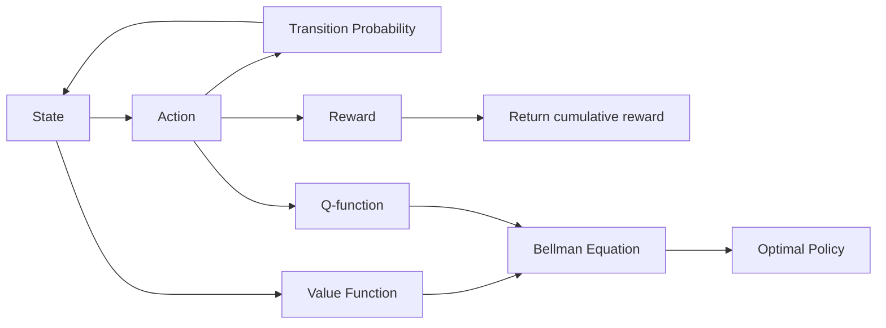

# 马尔可夫决策过程 原理与代码实例讲解

## 1.背景介绍
### 1.1 马尔可夫决策过程的起源与发展
马尔可夫决策过程(Markov Decision Process, MDP)是一种数学框架,用于对随机动态系统中的决策过程进行建模。它起源于20世纪50年代,由Richard Bellman等人提出,是运筹学、概率论和最优控制理论相结合的产物。MDP在人工智能、运筹优化、自动控制等领域有广泛应用。

### 1.2 马尔可夫决策过程的基本思想
MDP的基本思想是,在一个随机环境中,智能体(Agent)通过观察当前状态(State),选择合适的动作(Action),从而到达下一个状态,同时获得一定的即时奖励(Reward)。智能体的目标是找到一个最优策略(Optimal Policy),使得在整个决策过程中获得的累积奖励最大化。

### 1.3 马尔可夫决策过程在人工智能领域的应用
MDP是强化学习(Reinforcement Learning)的理论基础。在强化学习中,智能体通过与环境的交互,不断尝试、学习和优化自己的决策策略,以适应复杂多变的现实世界。MDP为强化学习提供了一个通用的数学模型和求解框架。除了强化学习,MDP还被广泛应用于机器人控制、自动驾驶、智能调度、对话系统等人工智能领域。

## 2.核心概念与联系
### 2.1 状态(State)
状态是对系统在某一时刻的完整描述。在MDP中,状态通常用一个状态集合$S$来表示。状态可以是离散的,也可以是连续的。例如,在机器人导航问题中,状态可以表示为机器人在地图中的位置坐标。

### 2.2 动作(Action)  
动作是智能体在某一状态下可以采取的行为选择。与状态类似,动作也可以用一个动作集合$A$来表示。在给定状态下,智能体根据当前的策略选择一个动作来执行。例如,在机器人导航中,动作可以是向前走、向左转、向右转等。

### 2.3 转移概率(Transition Probability)
转移概率定义了在某一状态下采取某一动作后,系统转移到下一个状态的概率。形式化地,转移概率可以用条件概率$P(s'|s,a)$来表示,即在状态$s$下选择动作$a$,转移到状态$s'$的概率。转移概率体现了MDP中的随机性和不确定性。

### 2.4 即时奖励(Reward)
即时奖励是指智能体在某一状态下采取某一动作后,立即获得的反馈。奖励函数$R(s,a)$定义了在状态$s$下采取动作$a$所获得的即时奖励值。奖励可以是正值,表示获得收益;也可以是负值,表示受到惩罚。智能体的目标就是最大化累积奖励。

### 2.5 策略(Policy)
策略是指智能体在每一个状态下采取动作的规则。形式化地,策略可以表示为从状态到动作的映射函数$\pi: S \rightarrow A$。最优策略$\pi^*$是使得累积奖励最大化的策略。寻找最优策略是MDP问题的核心目标。

### 2.6 状态值函数(Value Function) 
状态值函数$V^\pi(s)$表示从状态$s$开始,遵循策略$\pi$所能获得的期望累积奖励。它反映了每一个状态的长期价值,是评估策略优劣的重要指标。最优状态值函数$V^*(s)$对应着最优策略$\pi^*$。

### 2.7 动作值函数(Q-function)
动作值函数$Q^\pi(s,a)$表示在状态$s$下采取动作$a$,然后遵循策略$\pi$所能获得的期望累积奖励。它将状态和动作结合起来考虑,是值函数的扩展。最优动作值函数$Q^*(s,a)$对应最优策略$\pi^*$。

### 2.8 贝尔曼方程(Bellman Equation)
贝尔曼方程是MDP的核心方程,揭示了状态值函数和动作值函数的递归关系。对于任意策略$\pi$,贝尔曼方程可以写作:
$$V^\pi(s) = \sum_{a \in A} \pi(a|s) \sum_{s' \in S} P(s'|s,a) [R(s,a) + \gamma V^\pi(s')]$$
其中,$\gamma$是折扣因子,用于平衡即时奖励和未来奖励。

### 2.9 MDP核心概念之间的关系
下图展示了MDP中核心概念之间的关系:

## 3.核心算法原理具体操作步骤
### 3.1 动态规划(Dynamic Programming)
动态规划是一类通过状态值函数来寻找最优策略的算法,主要包括策略评估(Policy Evaluation)、策略改进(Policy Improvement)、策略迭代(Policy Iteration)和值迭代(Value Iteration)。

#### 3.1.1 策略评估
给定MDP和一个策略$\pi$,策略评估就是计算该策略下的状态值函数$V^\pi$。
1. 初始化每个状态的值函数估计$V_0(s)$
2. 重复直到值函数收敛:
   1. 对每个状态$s \in S$,更新值函数:
   $$V_{k+1}(s) = \sum_{a \in A} \pi(a|s) \sum_{s' \in S} P(s'|s,a) [R(s,a) + \gamma V_k(s')]$$

#### 3.1.2 策略改进
在策略评估的基础上,策略改进尝试找到一个更优的策略$\pi'$。
1. 对每个状态$s \in S$,计算新的策略:
$$\pi'(s) = \arg\max_{a \in A} \sum_{s' \in S} P(s'|s,a) [R(s,a) + \gamma V^\pi(s')]$$

#### 3.1.3 策略迭代
策略迭代通过交替执行策略评估和策略改进,不断更新策略,直到找到最优策略。
1. 初始化策略$\pi_0$
2. 重复直到策略收敛:
   1. 策略评估:计算当前策略$\pi_k$下的值函数$V^{\pi_k}$
   2. 策略改进:基于$V^{\pi_k}$得到新的策略$\pi_{k+1}$

#### 3.1.4 值迭代
值迭代直接对最优状态值函数$V^*$进行迭代更新,简化了策略迭代的过程。
1. 初始化最优值函数估计$V_0(s)$
2. 重复直到值函数收敛:
   1. 对每个状态$s \in S$,更新值函数:
   $$V_{k+1}(s) = \max_{a \in A} \sum_{s' \in S} P(s'|s,a) [R(s,a) + \gamma V_k(s')]$$
3. 提取最优策略:
$$\pi^*(s) = \arg\max_{a \in A} \sum_{s' \in S} P(s'|s,a) [R(s,a) + \gamma V^*(s')]$$

### 3.2 蒙特卡洛方法(Monte Carlo Methods)
蒙特卡洛方法通过采样的方式来估计值函数和寻找最优策略,不需要知道MDP的转移概率。

#### 3.2.1 蒙特卡洛策略评估
1. 初始化状态-动作对$(s,a)$的返回值和计数器
2. 重复多个回合:
   1. 使用策略$\pi$生成一条完整的轨迹$\{s_0,a_0,r_1,s_1,a_1,\dots,s_T\}$
   2. 对每个状态-动作对$(s_t,a_t)$:
      1. 计算从$t$时刻开始的累积折扣回报$G_t$
      2. 更新$(s_t,a_t)$的返回值和计数器
3. 计算每个状态-动作对的平均回报作为$Q^\pi(s,a)$的估计

#### 3.2.2 蒙特卡洛控制
1. 初始化状态-动作对$(s,a)$的Q值估计$Q(s,a)$和计数器
2. 重复多个回合:
   1. 根据$Q(s,a)$使用 $\epsilon$-贪心策略生成一条轨迹
   2. 对每个状态-动作对$(s_t,a_t)$:
      1. 计算从$t$时刻开始的累积折扣回报$G_t$
      2. 更新$(s_t,a_t)$的Q值估计和计数器
3. 最终的$Q(s,a)$对应最优动作值函数$Q^*(s,a)$的估计

### 3.3 时序差分学习(Temporal Difference Learning)
时序差分学习结合了动态规划和蒙特卡洛方法的思想,通过引导的方式来更新值函数估计。

#### 3.3.1 Sarsa算法
1. 初始化Q值估计$Q(s,a)$
2. 重复多个回合:
   1. 初始化状态$s$
   2. 基于$Q(s,a)$使用 $\epsilon$-贪心策略选择动作$a$
   3. 重复直到回合结束:
      1. 执行动作$a$,观察奖励$r$和下一状态$s'$
      2. 基于$Q(s',a')$使用 $\epsilon$-贪心策略选择下一动作$a'$
      3. 更新Q值估计:
      $$Q(s,a) \leftarrow Q(s,a) + \alpha [r + \gamma Q(s',a') - Q(s,a)]$$
      4. $s \leftarrow s', a \leftarrow a'$

#### 3.3.2 Q-learning算法
1. 初始化Q值估计$Q(s,a)$
2. 重复多个回合:
   1. 初始化状态$s$
   2. 重复直到回合结束:
      1. 基于$Q(s,a)$使用 $\epsilon$-贪心策略选择动作$a$
      2. 执行动作$a$,观察奖励$r$和下一状态$s'$
      3. 更新Q值估计:
      $$Q(s,a) \leftarrow Q(s,a) + \alpha [r + \gamma \max_{a'} Q(s',a') - Q(s,a)]$$
      4. $s \leftarrow s'$

## 4.数学模型和公式详细讲解举例说明
### 4.1 MDP的数学定义
一个马尔可夫决策过程可以形式化地定义为一个五元组 $\langle S, A, P, R, \gamma \rangle$:
- $S$是有限的状态集合
- $A$是有限的动作集合
- $P$是状态转移概率函数,$P(s'|s,a)$表示在状态$s$下执行动作$a$后转移到状态$s'$的概率
- $R$是奖励函数,$R(s,a)$表示在状态$s$下执行动作$a$后获得的即时奖励
- $\gamma \in [0,1]$是折扣因子,用于折扣未来的奖励

### 4.2 贝尔曼方程详解
贝尔曼方程是MDP的核心,描述了值函数的递归关系。对于任意策略$\pi$,状态值函数$V^\pi(s)$满足:
$$V^\pi(s) = \sum_{a \in A} \pi(a|s) \sum_{s' \in S} P(s'|s,a) [R(s,a) + \gamma V^\pi(s')]$$

动作值函数$Q^\pi(s,a)$满足:
$$Q^\pi(s,a) = \sum_{s' \in S} P(s'|s,a) [R(s,a) + \gamma \sum_{a' \in A} \pi(a'|s') Q^\pi(s',a')]$$

最优值函数$V^*(s)$和$Q^*(s,a)$满足:
$$V^*(s) = \max_{a \in A} \sum_{s' \in S} P(s'|s,a) [R(s,a) + \gamma V^*(s')]$$
$$Q^*(s,a) = \sum_{s' \in S} P(s'|s,a) [R(s,a) + \gamma \max_{a' \in A} Q^*(s',a')]$$

### 4.3 值迭代算法的数学推导
值迭代