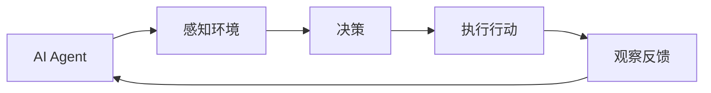

## 1.背景介绍

在过去的几十年里，人工智能(AI)已经从科幻小说的概念发展成为我们日常生活和工作中不可或缺的一部分。AI的起源和进化是一个长期的过程，涉及到许多不同的领域和技术。而AI Agent，即人工智能代理，是AI的一个重要分支，它代表了AI的下一个发展风口。

## 2.核心概念与联系

AI Agent是一种能够在环境中自主行动以达成目标的实体。它能够感知环境，进行决策，并执行行动。AI Agent与环境的交互可以被建模为一个马尔可夫决策过程(MDP)。在这个过程中，AI Agent根据当前的环境状态和可能的动作选择一个最优的动作，然后执行这个动作并观察环境的反馈。



## 3.核心算法原理具体操作步骤

AI Agent的核心算法通常包含以下几个步骤：

1. **初始化**：AI Agent初始化其状态和环境。
2. **感知**：AI Agent感知当前环境的状态。
3. **决策**：AI Agent根据当前的状态和可能的动作，使用决策算法选择一个最优的动作。
4. **执行**：AI Agent执行选择的动作。
5. **反馈**：AI Agent观察环境的反馈，并更新其状态。

这个过程会不断重复，直到AI Agent达成其目标或满足某些停止条件。

## 4.数学模型和公式详细讲解举例说明

AI Agent的决策过程可以被建模为一个马尔可夫决策过程(MDP)。MDP是一个元组$(S, A, P, R)$，其中：

- $S$是状态空间，包含所有可能的环境状态。
- $A$是动作空间，包含所有可能的动作。
- $P$是状态转移概率，$P(s'|s, a)$表示在状态$s$下执行动作$a$后转移到状态$s'$的概率。
- $R$是奖励函数，$R(s, a, s')$表示在状态$s$下执行动作$a$并转移到状态$s'$后获得的奖励。

AI Agent的目标是找到一个策略$\pi$，使得从任何状态$s$开始，按照策略$\pi$执行动作后获得的累计奖励最大。这可以被表示为以下的优化问题：

$$
\pi^* = \arg\max_\pi E\left[\sum_{t=0}^\infty \gamma^t R(s_t, a_t, s_{t+1})\right]
$$

其中，$\gamma$是一个折扣因子，$0 \leq \gamma < 1$，用于调节即时奖励和未来奖励的权重。

## 5.项目实践：代码实例和详细解释说明

下面是一个使用Python和OpenAI Gym库实现的简单AI Agent示例。这个AI Agent的任务是在CartPole环境中尽可能长时间地保持杆子垂直。

```python
import gym
import numpy as np

# 创建环境
env = gym.make('CartPole-v1')

# 初始化AI Agent的状态
state = env.reset()

for t in range(1000):
    # AI Agent选择动作
    action = env.action_space.sample()
    
    # AI Agent执行动作并观察反馈
    next_state, reward, done, info = env.step(action)
    
    # 更新AI Agent的状态
    state = next_state
    
    if done:
        break

env.close()
```

在这个示例中，AI Agent随机选择动作，没有使用任何决策算法。在实际应用中，AI Agent通常会使用一些更复杂的决策算法，如Q-learning或深度强化学习等。

## 6.实际应用场景

AI Agent已经被广泛应用在许多领域，如自动驾驶、游戏、推荐系统、金融交易等。例如，AlphaGo就是一个著名的AI Agent，它使用深度强化学习算法在围棋游戏中击败了世界冠军。

## 7.工具和资源推荐

以下是一些推荐的工具和资源，可以帮助你更深入地理解和使用AI Agent：

- **OpenAI Gym**：一个用于开发和比较强化学习算法的工具库。
- **TensorFlow**：一个强大的机器学习框架，可以用于实现各种AI Agent的决策算法。
- **PyTorch**：另一个强大的机器学习框架，同样可以用于实现各种AI Agent的决策算法。
- **Reinforcement Learning: An Introduction**：一本经典的强化学习教材，详细介绍了AI Agent的理论和算法。

## 8.总结：未来发展趋势与挑战

AI Agent是AI的下一个风口，它将在未来的人工智能发展中扮演重要角色。然而，AI Agent也面临着许多挑战，如如何处理复杂的环境、如何提高决策的效率和质量、如何保证AI Agent的行为符合人类的价值观和道德规范等。这些都是我们需要进一步研究和解决的问题。

## 9.附录：常见问题与解答

1. **什么是AI Agent？**  
AI Agent是一种能够在环境中自主行动以达成目标的实体。它能够感知环境，进行决策，并执行行动。

2. **AI Agent如何做决策？**  
AI Agent的决策过程可以被建模为一个马尔可夫决策过程(MDP)。在这个过程中，AI Agent根据当前的环境状态和可能的动作选择一个最优的动作，然后执行这个动作并观察环境的反馈。

3. **AI Agent有哪些应用？**  
AI Agent已经被广泛应用在许多领域，如自动驾驶、游戏、推荐系统、金融交易等。

作者：禅与计算机程序设计艺术 / Zen and the Art of Computer Programming