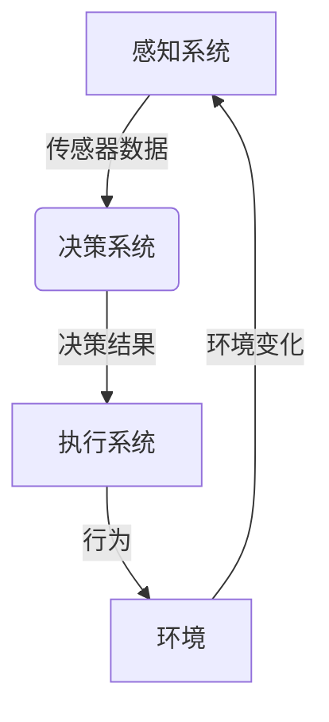

# AI Agent: AI的下一个风口 从感知到行动的过程

## 1.背景介绍

### 1.1 人工智能的发展历程

人工智能(Artificial Intelligence, AI)是现代科技发展的重要组成部分,自20世纪50年代诞生以来,已经经历了多个发展阶段。早期的人工智能系统主要集中在特定领域的专家系统,如医疗诊断、金融分析等。随着机器学习和深度学习技术的不断发展,人工智能逐渐能够处理更加复杂的问题,如计算机视觉、自然语言处理等。

### 1.2 AI Agent的兴起

近年来,AI Agent(智能代理)的概念开始受到广泛关注。AI Agent是指能够感知环境、做出决策并采取行动的智能系统。与传统的人工智能系统相比,AI Agent不仅能够处理特定任务,还能根据环境的变化做出响应,具有更强的自主性和适应性。AI Agent的出现标志着人工智能从感知走向行动的重要转折点。

### 1.3 AI Agent的应用前景

AI Agent在诸多领域展现出巨大的应用潜力,如智能家居、自动驾驶、智能机器人等。通过整合多种人工智能技术,AI Agent能够感知复杂环境、做出决策并执行相应的动作,大幅提高系统的智能化水平。随着5G、物联网等技术的发展,AI Agent有望成为推动智能化进程的重要力量。

## 2.核心概念与联系  

### 2.1 AI Agent的定义

AI Agent是一种能够感知环境、处理信息、做出决策并采取行动的智能系统。它由感知系统、决策系统和执行系统三个核心部分组成:

- 感知系统负责获取环境信息,如视觉、语音等传感器数据。
- 决策系统根据感知数据和内部知识库,运行决策算法做出判断和选择。
- 执行系统则根据决策结果控制执行器(如机械臂、车辆等)采取相应行动。

### 2.2 AI Agent与传统AI的区别

传统的人工智能系统通常专注于解决特定领域的问题,如图像识别、语音识别等。而AI Agent则是一种更加通用的智能系统,它能够感知环境、做出决策并执行动作,在不同场景下发挥作用。

另一个重要区别是,传统AI系统的输入输出都是离散的,而AI Agent则是一个连续的闭环系统。它能够根据环境的变化做出实时响应,并通过自身行为影响环境,形成感知-决策-行动的循环。

### 2.3 AI Agent的关键技术

构建AI Agent需要整合多种人工智能技术,包括:

- 计算机视觉: 用于识别和理解视觉信息
- 自然语言处理: 用于理解和生成自然语言
- 知识表示与推理: 构建内部知识库并进行推理决策
- 机器学习: 从数据中学习模型,提高感知和决策能力
- 规划与控制: 制定行动计划并控制执行器完成动作
- 多智能体系统: 支持多个Agent之间的协作

只有将这些技术有机结合,才能构建出真正的AI Agent系统。

## 3.核心算法原理具体操作步骤

AI Agent的核心算法主要包括感知、决策和规划三个部分,下面将分别介绍它们的原理和具体操作步骤。

### 3.1 感知算法

感知算法的主要任务是从环境数据(如图像、声音等)中提取有用的信息,为决策系统提供输入。常用的感知算法包括:

1. **计算机视觉算法**
   - 步骤1:图像预处理(降噪、增强等)
   - 步骤2:特征提取(边缘、角点、纹理等)
   - 步骤3:目标检测(如物体、人脸等)
   - 步骤4:语义分割(像素级别的目标识别)

2. **语音识别算法**
   - 步骤1:语音信号预处理(降噪、端点检测等)
   - 步骤2:特征提取(MFCC、PLP等语音特征)
   - 步骤3:声学模型(GMM、DNN等)
   - 步骤4:语言模型(N-gram、RNN等)
   - 步骤5:解码(Viterbi、束搜索等)

这些算法通常采用机器学习的方法,利用大量标注数据训练模型,从而获得良好的感知能力。

### 3.2 决策算法

决策算法的任务是根据感知数据和内部知识库,选择合适的行为方案。常见的决策算法有:

1. **规则引擎**
   - 步骤1:构建知识库(规则、事实等)
   - 步骤2:推理引擎前向链推理
   - 步骤3:根据推理结果做出决策

2. **机器学习算法**
   - 步骤1:构建训练数据集(状态、行为对应关系)
   - 步骤2:选择模型(如决策树、深度学习等)
   - 步骤3:模型训练
   - 步骤4:将新状态输入模型,输出行为决策

3. **多智能体决策**
   - 步骤1:建模多Agent环境(Agent属性、状态转移等)
   - 步骤2:选择合适的算法(如蒙特卡罗树搜索等)
   - 步骤3:计算各Agent的最优策略
   - 步骤4:根据策略做出决策

决策算法需要综合考虑环境状态、知识库、任务目标等多方面信息,并权衡各种可能的行为方案,选择最优决策。

### 3.3 规划与控制算法

规划与控制算法的作用是根据决策结果,为执行器(如机械臂、车辆等)生成精确的控制指令,以完成具体的行为动作。主要算法包括:

1. **运动规划算法**
   - 步骤1:构建环境模型和约束条件 
   - 步骤2:设定起点和终点
   - 步骤3:选择合适的算法(RRT、A*等)
   - 步骤4:计算无碰撞的最优运动路径

2. **轨迹规划算法**
   - 步骤1:建立运动学和动力学模型
   - 步骤2:设定路径约束(如最大速度、加速度等)
   - 步骤3:选择算法(如三次多项式、五次多项式等)
   - 步骤4:生成满足约束的平滑轨迹

3. **控制算法**
   - 步骤1:获取当前状态反馈
   - 步骤2:与期望轨迹对比,计算偏差
   - 步骤3:设计控制器(PID、模糊逻辑等)
   - 步骤4:计算控制量,输出到执行器

规划与控制是将决策转化为精确动作的关键环节,直接影响系统的行为表现。

## 4.数学模型和公式详细讲解举例说明

在AI Agent系统中,数学模型和公式扮演着重要角色,为算法提供理论基础和求解方法。本节将重点介绍一些核心的数学模型和公式。

### 4.1 概率模型

概率模型广泛应用于感知和决策领域,用于描述不确定事件的发生概率。常见的概率模型包括:

1. **贝叶斯模型**

贝叶斯模型根据贝叶斯定理描述事件发生的条件概率:

$$P(A|B) = \frac{P(B|A)P(A)}{P(B)}$$

其中$P(A|B)$表示已知$B$发生的情况下,$A$发生的概率。

在目标检测任务中,可以将$A$看作是目标出现的事件,$B$是观测到的图像特征,那么$P(A|B)$就是在给定特征的情况下,目标存在的概率。

2. **马尔可夫模型**

马尔可夫模型认为系统的未来状态只与当前状态有关,而与过去无关,即满足马尔可夫性质:

$$P(X_t|X_0,X_1,...,X_{t-1}) = P(X_t|X_{t-1})$$

隐马尔可夫模型(HMM)是一种典型的马尔可夫模型,广泛应用于语音识别、手写识别等领域。

3. **高斯混合模型(GMM)**

GMM假设数据由多个高斯分布的混合构成,可以较好地拟合任意复杂的分布形状:

$$p(x) = \sum_{k=1}^K \pi_k N(x|\mu_k,\Sigma_k)$$

其中$\pi_k$是第$k$个高斯分量的权重,$N(x|\mu_k,\Sigma_k)$是均值为$\mu_k$、协方差为$\Sigma_k$的高斯分布密度函数。

GMM常用于语音信号建模、图像分割等任务。

### 4.2 优化模型

优化模型在AI Agent的决策和规划中发挥着关键作用,用于求解最优解。常见的优化模型有:

1. **线性规划**

线性规划旨在在一系列线性约束条件下,求解一个线性目标函数的最优解:

$$\begin{array}{ll}
\mathop{\text{minimize}}\limits_x & c^Tx\\
\text{subject to} & Ax \leq b\\
                  & x \geq 0
\end{array}$$

其中$c$是目标函数的系数向量,$A$和$b$分别是约束条件的系数矩阵和常数向量。线性规划可用于资源分配、运动规划等问题。

2. **二次规划**

二次规划在目标函数中引入了二次项,形式为:

$$\begin{array}{ll}
\mathop{\text{minimize}}\limits_x & \frac{1}{2}x^THx + f^Tx\\
\text{subject to} & Ax = b\\
                  & x \geq 0
\end{array}$$

其中$H$是一个对称矩阵,$f$是线性项的系数向量。二次规划常用于轨迹优化、控制等领域。

3. **非线性规划**

非线性规划是一种更加通用的优化模型,目标函数和约束条件都可以是任意的非线性形式:

$$\begin{array}{ll}
\mathop{\text{minimize}}\limits_x & f(x)\\
\text{subject to} & g_i(x) \leq 0, i=1,2,...,m\\
                  & h_j(x) = 0, j=1,2,...,p
\end{array}$$

其中$f(x)$是目标函数,$g_i(x)$和$h_j(x)$分别是不等式和等式约束条件。非线性规划可以用于解决更加复杂的优化问题。

这些优化模型为AI Agent提供了有力的数学工具,可以在满足各种约束条件的前提下,寻找最优的决策和控制方案。

### 4.3 机器学习模型

机器学习模型是AI Agent系统中不可或缺的重要组成部分,用于从数据中自动学习知识。下面介绍几种常见的机器学习模型:

1. **支持向量机(SVM)** 

SVM是一种有监督学习模型,其基本思想是在高维特征空间中找到一个超平面,将不同类别的数据分开,且分类间隔最大化。对于线性可分数据,SVM的分类超平面可表示为:

$$w^Tx + b = 0$$

其中$w$是超平面的法向量,$b$是偏置项。SVM通过求解凸二次规划问题得到$w$和$b$的最优解。

2. **决策树**

决策树是一种常用的监督学习模型,通过构建决策树的形式来进行分类或回归。决策树的构建过程可以用信息熵或基尼指数来度量不确定性,选择最优特征进行分裂:

$$\text{Gain}(D, a) = \text{Ent}(D) - \sum_{v=1}^V \frac{|D^v|}{|D|} \text{Ent}(D^v)$$

其中$\text{Gain}(D, a)$表示使用特征$a$分裂后,信息熵的减少量。$D$是当前数据集,$D^v$是根据特征$a$的取值$v$分裂后的子数据集。

3. **深度神经网络(DNN)**

DNN是一种强大的机器学习模型,通过构建多层神经网络来