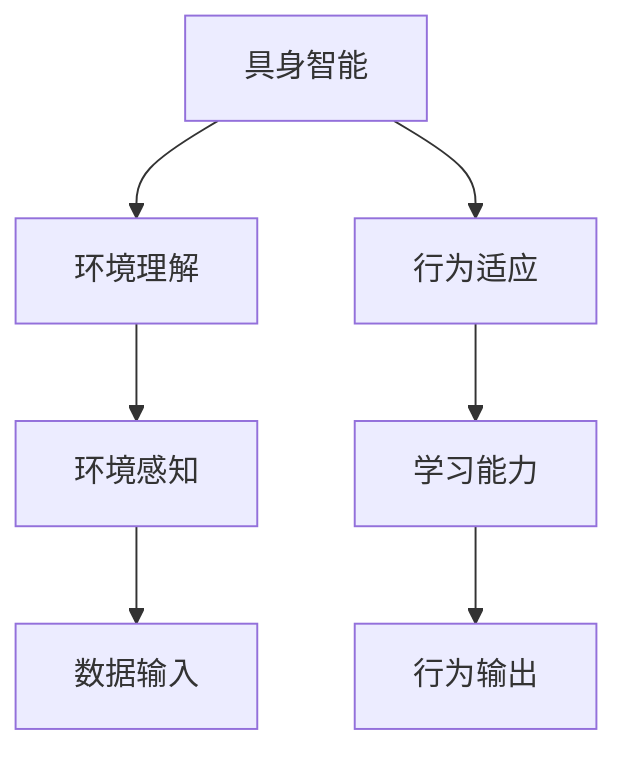

## 1.背景介绍

在过去的几年中，人工智能(AI)已经从科幻小说的概念发展为可以解决实际问题的技术。然而，我们正处于AI的下一个风口，即具身智能(AI Agent)，这是一种新的AI形式，它可以理解并与其环境互动。这种AI形式的出现，将为我们带来无数的机会和挑战。

## 2.核心概念与联系

具身智能(AI Agent)是一种新的AI形式，它不仅可以理解自己所处的环境，还可以通过学习和适应来改变自己的行为。在这个概念中，AI被视为一个能够与环境互动的实体，而不仅仅是一个被动的工具。这种新形式的AI需要理解其所处的环境，并根据环境的变化做出相应的反应。



## 3.核心算法原理具体操作步骤

具身智能的实现主要依赖于深度学习和强化学习的技术。深度学习使AI能够理解复杂的模式和关系，而强化学习则使AI能够通过试错来改进其行为。

1. 数据输入：首先，AI需要收集关于其环境的信息。这些信息通常来自传感器，例如摄像头、麦克风等。

2. 环境理解：然后，AI需要理解这些信息。这通常通过深度学习算法实现，这些算法可以处理大量的数据，并从中学习模式和关系。

3. 行为决策：接下来，AI需要根据其对环境的理解来做出决策。这通常通过强化学习实现，这是一种让AI通过试错来学习的方法。

4. 行为执行：最后，AI需要执行其决定的行为。这可能涉及到物理世界的交互，例如移动一个机器人，或者在虚拟环境中执行某个任务。

## 4.数学模型和公式详细讲解举例说明

深度学习和强化学习的核心是神经网络，神经网络的基本单元是神经元。神经元的输出是其输入的加权和，然后通过一个激活函数。这可以表示为：

$$ y = f(\sum_{i}w_ix_i + b) $$

其中，$x_i$ 是输入，$w_i$ 是权重，$b$ 是偏置，$f$ 是激活函数，例如ReLU函数。

强化学习的目标是找到一个策略，使得累积奖励最大。这通常通过Q学习算法实现，该算法定义了一个Q函数，表示在给定状态和行为下的预期奖励。Q函数的更新规则为：

$$ Q(s,a) \leftarrow Q(s,a) + \alpha (r + \gamma \max_{a'}Q(s',a') - Q(s,a)) $$

其中，$s$ 是当前状态，$a$ 是行为，$r$ 是奖励，$s'$ 是新状态，$a'$ 是新行为，$\alpha$ 是学习率，$\gamma$ 是折扣因子。

## 5.项目实践：代码实例和详细解释说明

这里我们以一个简单的具身智能项目为例，该项目的目标是训练一个AI Agent玩游戏。我们使用Python和OpenAI的Gym库来实现这个项目。

```python
import gym
import numpy as np

# 创建环境
env = gym.make('CartPole-v1')

# 初始化Q表
Q = np.zeros([env.observation_space.n, env.action_space.n])

# 设置参数
alpha = 0.5
gamma = 0.95
epsilon = 0.1

# 训练过程
for episode in range(10000):
    state = env.reset()
    done = False

    while not done:
        # 选择行为
        if np.random.uniform(0, 1) < epsilon:
            action = env.action_space.sample()
        else:
            action = np.argmax(Q[state, :])

        # 执行行为
        next_state, reward, done, info = env.step(action)

        # 更新Q表
        Q[state, action] = Q[state, action] + alpha * (reward + gamma * np.max(Q[next_state, :]) - Q[state, action])

        # 更新状态
        state = next_state
```

这个代码首先创建了一个游戏环境，然后初始化了一个Q表。在每个训练周期中，AI Agent选择并执行一个行为，然后根据奖励和新状态更新Q表。这个过程反复进行，直到AI Agent能够成功地玩游戏。

## 6.实际应用场景

具身智能的应用场景广泛，包括但不限于：

- 无人驾驶：AI Agent需要理解其环境，并做出决策，例如改变速度或方向。
- 机器人：AI Agent需要理解环境，并与环境互动，例如移动或操纵物体。
- 游戏：AI Agent需要理解游戏环境，并做出决策，例如移动或攻击。

## 7.工具和资源推荐

- Python：这是一种广泛用于AI和机器学习的编程语言。
- TensorFlow：这是一个用于深度学习的开源库。
- OpenAI Gym：这是一个用于开发和比较强化学习算法的工具包。

## 8.总结：未来发展趋势与挑战

具身智能是AI的下一个风口，它将为我们带来无数的机会和挑战。然而，要实现具身智能，我们需要解决许多问题，例如如何让AI理解其环境，如何让AI适应环境的变化，以及如何让AI与环境互动。这些问题需要我们进行深入的研究和创新。

## 9.附录：常见问题与解答

- 什么是具身智能？
  具身智能是一种新的AI形式，它可以理解并与其环境互动。

- 具身智能如何工作？
  具身智能主要依赖于深度学习和强化学习的技术。深度学习使AI能够理解复杂的模式和关系，而强化学习则使AI能够通过试错来改进其行为。

- 具身智能有哪些应用？
  具身智能的应用场景广泛，包括无人驾驶、机器人、游戏等。

- 如何学习具身智能？
  你可以通过学习Python、TensorFlow和OpenAI Gym来开始学习具身智能。

作者：禅与计算机程序设计艺术 / Zen and the Art of Computer Programming