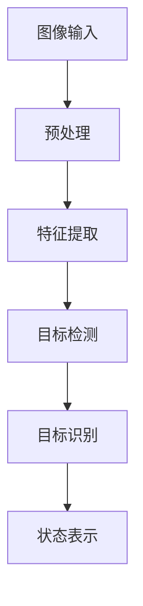
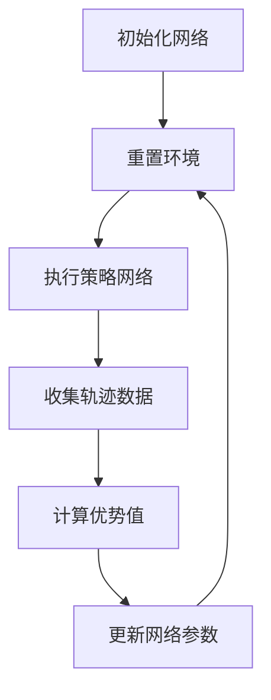

# AI Agent: AI的下一个风口 智能体在元宇宙里的应用

## 1. 背景介绍

### 1.1 元宇宙的兴起

近年来,元宇宙(Metaverse)的概念如火如荼,引起了全球科技巨头和创业公司的浓厚兴趣。元宇宙被视为继移动互联网之后的下一代计算平台,它将现实世界与虚拟世界融合,打造一个全新的沉浸式数字体验。

元宇宙的核心理念是构建一个永不停歇的虚拟在线世界,用户可以通过数字化身在其中工作、社交、娱乐和学习。这个虚拟世界将拥有自己的经济体系、社会结构和文化,为人类提供一个全新的虚拟生活空间。

### 1.2 智能体(AI Agent)的重要性

智能体(AI Agent)是元宇宙不可或缺的关键技术。在这个虚拟世界中,智能体将扮演着各种角色,如虚拟助手、数字人物、智能机器人等,为用户提供智能化的服务和交互体验。

智能体需要具备强大的感知、推理、决策和行为能力,以便在复杂的虚拟环境中自主运行并与用户自然交互。它们需要理解用户的需求、情境和意图,并作出合理的响应。同时,智能体还需要持续学习和进化,以适应不断变化的环境和任务。

## 2. 核心概念与联系  

### 2.1 智能体的定义

智能体(AI Agent)是一种具有自主性的软件实体,能够感知环境、处理信息、作出决策并采取行动以实现预定目标。智能体通常由以下几个核心组件组成:

- 感知器(Sensors):用于获取环境信息
- 状态表示(State Representation):描述智能体当前状态
- 策略函数(Policy Function):根据状态选择行为
- 执行器(Actuators):执行选择的行为

### 2.2 智能体与传统软件的区别

相比传统的软件系统,智能体具有以下独特特点:

1. 自主性(Autonomy):智能体能够在没有人工干预的情况下自主运行
2. 反应性(Reactivity):智能体能够及时感知环境变化并作出响应
3. 主动性(Pro-activeness):智能体能够根据目标制定计划并采取行动
4. 社会能力(Social Ability):智能体能够与其他智能体协作、协调和谈判

### 2.3 智能体与元宇宙的关系

在元宇宙中,智能体扮演着至关重要的角色。它们可以作为虚拟助手、数字人物、智能机器人等存在,为用户提供各种智能化服务,如导航、问答、协作等。同时,智能体也是元宇宙中的"居民",它们可以拥有自己的身份、角色和社会关系,构建一个虚拟社会。

智能体的发展水平直接影响着元宇宙的智能化程度和沉浸式体验。只有拥有高度智能的智能体,元宇宙才能真正实现人机自然交互、情境感知和智能决策,为用户带来无缝的虚实融合体验。

## 3. 核心算法原理具体操作步骤

智能体的核心算法主要包括感知、决策和学习三个方面,下面将详细介绍它们的原理和具体操作步骤。

### 3.1 感知算法

感知算法的目的是从环境中获取有用的信息,并将其转化为智能体可以理解的状态表示。常见的感知算法包括计算机视觉、自然语言处理和信号处理等。

以计算机视觉为例,感知算法的步骤如下:

1. 图像预处理:去噪、增强对比度等,提高图像质量
2. 特征提取:提取图像的边缘、角点、纹理等低级特征
3. 目标检测:利用卷积神经网络等算法检测图像中的目标
4. 目标识别:将检测到的目标分类,确定其类别
5. 状态表示:将检测和识别结果编码为智能体可以理解的状态



### 3.2 决策算法

决策算法的目的是根据当前状态和目标,选择最优的行为。常见的决策算法包括规划算法、强化学习算法和多智能体决策算法等。

以Q-Learning(一种强化学习算法)为例,决策步骤如下:

1. 初始化Q表格,表示在每个状态下采取每个行为的价值
2. 对于每个时间步:
    - 观察当前状态s
    - 根据Q表格,选择在s状态下价值最大的行为a
    - 执行行为a,获得奖励r,转移到新状态s'
    - 更新Q(s,a)的值:Q(s,a) = Q(s,a) + α[r + γ* max(Q(s',a')) - Q(s,a)]
3. 重复步骤2,直到Q表格收敛

```mermaid
graph TD
    A[初始化Q表格] --> B[观察状态s]
    B --> C[选择行为a]
    C --> D[执行行为a]
    D --> E[获得奖励r,新状态s']
    E --> F[更新Q(s,a)]
    F --> B
```

### 3.3 学习算法

学习算法的目的是使智能体通过与环境的交互来提高自身的决策能力。常见的学习算法包括监督学习、非监督学习、强化学习和迁移学习等。

以深度强化学习为例,学习步骤如下:

1. 初始化智能体的策略网络(Policy Network)和价值网络(Value Network)
2. 对于每个训练episode:
    - 重置环境
    - 执行策略网络输出的行为序列,收集轨迹数据
    - 利用价值网络计算每个时间步的优势值(Advantage)
    - 根据优势值更新策略网络和价值网络的参数
3. 重复步骤2,直到策略收敛



通过上述算法,智能体可以逐步提高感知、决策和学习的能力,从而在复杂的元宇宙环境中自主运行并与用户自然交互。

## 4. 数学模型和公式详细讲解举例说明

在智能体的算法中,涉及了大量的数学模型和公式,下面将详细介绍其中的一些核心模型和公式。

### 4.1 马尔可夫决策过程(MDP)

马尔可夫决策过程(Markov Decision Process, MDP)是强化学习和决策理论中的一个基本框架。它用于描述一个智能体在一个完全可观测的环境中进行决策的过程。

一个MDP可以用一个五元组来表示:

$$MDP = \langle S, A, P, R, \gamma \rangle$$

其中:

- $S$是有限的状态集合
- $A$是有限的行为集合
- $P(s' \mid s, a)$是状态转移概率,表示在状态$s$执行行为$a$后转移到状态$s'$的概率
- $R(s, a, s')$是奖励函数,表示在状态$s$执行行为$a$后转移到状态$s'$所获得的奖励
- $\gamma \in [0, 1)$是折现因子,用于权衡即时奖励和长期奖励的重要性

在MDP中,智能体的目标是找到一个最优策略$\pi^*(s)$,使得在任意状态$s$下执行该策略可以获得最大的期望累积奖励:

$$\pi^*(s) = \arg\max_\pi \mathbb{E}\left[ \sum_{t=0}^\infty \gamma^t R(s_t, a_t, s_{t+1}) \mid s_0 = s, \pi \right]$$

### 4.2 Q-Learning算法

Q-Learning是一种基于MDP的强化学习算法,它可以在线学习最优策略,而无需事先知道环境的状态转移概率和奖励函数。

Q-Learning算法维护一个Q表格,表示在每个状态下采取每个行为的价值。Q表格的更新规则如下:

$$Q(s_t, a_t) \leftarrow Q(s_t, a_t) + \alpha \left[ r_{t+1} + \gamma \max_{a'} Q(s_{t+1}, a') - Q(s_t, a_t) \right]$$

其中:

- $\alpha$是学习率,控制学习的速度
- $r_{t+1}$是执行行为$a_t$后获得的即时奖励
- $\gamma$是折现因子,与MDP中的定义相同
- $\max_{a'} Q(s_{t+1}, a')$是在下一状态$s_{t+1}$下采取最优行为所获得的最大价值

通过不断更新Q表格,Q-Learning算法可以逐渐收敛到最优策略。

### 4.3 深度Q网络(DQN)

传统的Q-Learning算法存在一个主要缺陷,即需要维护一个巨大的Q表格,当状态空间和行为空间都很大时,这种方法就变得不切实际。

深度Q网络(Deep Q-Network, DQN)是一种结合深度学习和Q-Learning的算法,它使用神经网络来近似Q函数,从而避免了维护Q表格的需求。

DQN的核心思想是使用一个卷积神经网络(CNN)或全连接神经网络(FNN)来拟合Q函数:

$$Q(s, a; \theta) \approx \max_\pi \mathbb{E}\left[ \sum_{t=0}^\infty \gamma^t R(s_t, a_t, s_{t+1}) \mid s_0 = s, \pi \right]$$

其中$\theta$是神经网络的参数。

在训练过程中,DQN会不断更新神经网络的参数$\theta$,使得$Q(s, a; \theta)$逼近真实的Q函数。更新规则如下:

$$\theta \leftarrow \theta + \alpha \left[ r + \gamma \max_{a'} Q(s', a'; \theta^-) - Q(s, a; \theta) \right] \nabla_\theta Q(s, a; \theta)$$

其中$\theta^-$是目标网络的参数,用于稳定训练过程。

通过DQN算法,智能体可以在高维状态空间和行为空间中高效地学习最优策略,并应用于复杂的决策任务。

## 5. 项目实践:代码实例和详细解释说明

为了更好地理解智能体的算法原理,我们将通过一个简单的网格世界(Gridworld)示例来实现Q-Learning算法。

### 5.1 问题描述

在一个4x4的网格世界中,智能体(Agent)的目标是从起点(0,0)到达终点(3,3)。智能体可以执行四种行为:上(U)、下(D)、左(L)、右(R)。

网格中存在两个障碍物(1,1)和(2,2),智能体不能穿过障碍物。到达终点会获得+10的奖励,撞到障碍物会获得-10的惩罚,其他情况下奖励为0。

我们将使用Q-Learning算法来训练智能体,使其学会从起点到达终点的最优路径。

### 5.2 代码实现

```python
import numpy as np

# 定义网格世界
GRID_SIZE = 4
OBSTACLES = [(1, 1), (2, 2)]
START = (0, 0)
GOAL = (3, 3)

# 定义行为
ACTIONS = ['U', 'D', 'L', 'R']

# 定义奖励函数
def get_reward(state, action, next_state):
    if next_state == GOAL:
        return 10
    elif next_state in OBSTACLES:
        return -10
    else:
        return 0

# 定义状态转移函数
def get_next_state(state, action):
    row, col = state
    if action == 'U':
        next_state = (max(row - 1, 0), col)
    elif action == 'D':
        next_state = (min(row + 1, GRID_SIZE - 1), col)
    elif action == 'L':
        next_state = (row, max(col - 1, 0))
    else:
        next_state = (row, min(col + 1, GRID_SIZE - 1))
    return next_state

# 初始化Q表格
Q = np.zeros((GRID_SIZE, GRID_SIZE, len(ACTIONS)))

# 设置超参数