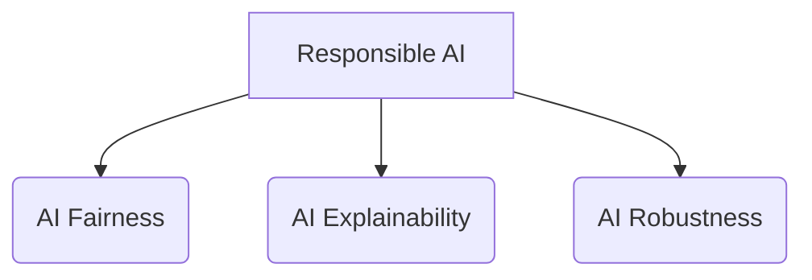
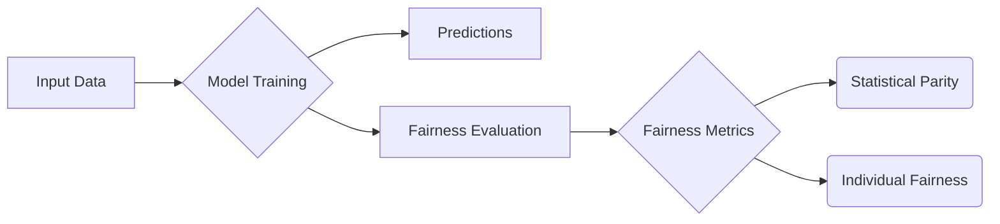

# AI Fairness原理与代码实例讲解

## 1. 背景介绍
### 1.1 AI公平性的重要性
### 1.2 AI公平性面临的挑战
### 1.3 AI公平性的研究现状

## 2. 核心概念与联系
### 2.1 AI公平性的定义
### 2.2 AI偏差的类型
#### 2.2.1 数据偏差
#### 2.2.2 算法偏差 
#### 2.2.3 模型偏差
### 2.3 AI公平性评估指标
#### 2.3.1 统计学评估指标
#### 2.3.2 因果推断评估指标
#### 2.3.3 个体公平性评估指标
### 2.4 AI Fairness与AI Explainability、AI Robustness的关系

## 3. 核心算法原理具体操作步骤
### 3.1 预处理阶段的去偏方法
#### 3.1.1 数据重采样
#### 3.1.2 数据增强
#### 3.1.3 特征选择与特征工程
### 3.2 训练阶段的去偏方法 
#### 3.2.1 正则化约束
#### 3.2.2 对抗学习
#### 3.2.3 因果推断
### 3.3 后处理阶段的去偏方法
#### 3.3.1 阈值移动
#### 3.3.2 结果再校准
#### 3.3.3 集成学习

## 4. 数学模型和公式详细讲解举例说明
### 4.1 统计学评估指标的数学定义
#### 4.1.1 Demographic Parity
#### 4.1.2 Equalized Odds
#### 4.1.3 Equal Opportunity
### 4.2 个体公平性指标的数学定义
#### 4.2.1 Counterfactual Fairness 
#### 4.2.2 Meritocratic Fairness
### 4.3 因果推断公平性模型
#### 4.3.1 Causal Directed Acyclic Graph
#### 4.3.2 Counterfactual Effect

## 5. 项目实践：代码实例和详细解释说明
### 5.1 利用AIF360工具包评估模型公平性
#### 5.1.1 加载数据集并划分
#### 5.1.2 模型训练与预测
#### 5.1.3 计算模型的统计学公平性指标
### 5.2 利用FairLearn工具包进行模型去偏
#### 5.2.1 数据预处理去偏
#### 5.2.2 模型正则化约束去偏
#### 5.2.3 后处理阈值移动去偏

## 6. 实际应用场景
### 6.1 信用评分模型的公平性优化
### 6.2 人脸识别模型的公平性评估
### 6.3 机器翻译模型的性别偏差消除

## 7. 工具和资源推荐
### 7.1 开源工具包
#### 7.1.1 AIF360
#### 7.1.2 Fairlearn
#### 7.1.3 Aequitas
### 7.2 相关论文与书籍
### 7.3 在线课程与教程

## 8. 总结：未来发展趋势与挑战
### 8.1 AI公平性研究的发展趋势
### 8.2 AI公平性在垂直领域的应用前景 
### 8.3 AI公平性面临的技术挑战和局限性

## 9. 附录：常见问题与解答
### 9.1 如何权衡模型性能与公平性？
### 9.2 AI公平性如何在实际系统中落地？ 
### 9.3 AI公平性的法律与伦理考量有哪些？

---

AI Fairness是机器学习和人工智能领域一个日益重要且充满挑战的课题。随着AI系统在教育、就业、司法、金融等关键领域的广泛应用，如何确保其决策的公平性,消除有害的歧视和偏见,已成为学术界和产业界的重点关注对象。

从概念上讲,AI Fairness旨在研究如何度量和消除机器学习模型在敏感属性(如性别、种族等)上的系统性差异,使得所有群体都能得到平等对待。其核心在于找到模型预测性能和预测公平性之间的平衡。AI Fairness与AI Explainability、AI Robustness一起构成了负责任、可信的AI的三大支柱。

从技术上讲,实现AI Fairness需要从数据、算法、评估等多个层面系统地优化。在数据层面,需要关注数据集的代表性和平衡性,采用数据重采样、数据增强等方法消除数据中的偏差。在算法层面,可以通过添加正则化约束、引入对抗学习、因果推断等机制,使得模型对敏感属性不敏感。在评估层面,需要引入统计学平等(如人口均等)和个体公平(如反事实公平)等多维度指标,全面考察模型预测的公平性。

举例来说,对于一个信用评分模型,我们首先要评估其在不同人口统计学群体(如男性和女性)上的预测差异,计算统计学平等指标。如果发现模型对女性的信用评分系统性偏低,则需要进一步分析偏差的来源。通过平衡数据集、去除无关特征等方式消除数据偏差；在训练过程中,加入性别属性的对抗约束,使得模型无法根据性别进行区分；在后处理阶段,可以通过单独调整女性群体的阈值来矫正预测偏差。再次在测试集上全面评估模型的预测性能和公平性,形成可供参考的评测报告。

AI Fairness作为一个新兴的交叉领域,涉及机器学习、因果推断、博弈论等多个学科,在理论和实践上都有许多待探索的问题。未来随着算法的进步和计算力的发展,AI Fairness有望在更多领域得到广泛应用,成为构建负责任AI不可或缺的一环。同时我们也要看到,由于现实世界的复杂性和人类固有偏见的客观存在,实现绝对的机器公平仍面临诸多技术和伦理挑战,需要多方持续努力和审慎对待。

## 附录：常见问题解答

### 9.1 如何权衡模型性能与公平性？
在实践中,提高模型的公平性往往以牺牲一定的预测准确率为代价。我们需要根据具体任务需求,合理设置公平性约束的强度。通过绘制准确率-公平性曲线,可以直观地评估二者的trade-off,进而选择最优的折中点。

### 9.2 AI公平性如何在实际系统中落地？
将AI Fairness方法应用到实际系统需要考虑多方面因素,如可解释性、鲁棒性、数据隐私等。可以遵循以下步骤:1)明确系统的公平性需求,设定量化指标；2)评估数据集的代表性和平衡性,消除数据偏差；3)在模型训练中加入公平性约束,并进行充分的超参调优；4)利用可解释性技术(如SHAP值)分析模型关注的特征,排查潜在的偏见；5)在测试集上全面评估模型性能和公平性,形成评测报告；6)建立持续监控和再训练机制,应对数据分布的变化。

### 9.3 AI公平性的法律与伦理考量有哪些？ 
AI系统的潜在歧视和偏见已引起法律和伦理方面的广泛关注。欧盟GDPR法案明确禁止AI系统基于个人敏感属性的"自动化决策",而美国的《算法问责法案》等法律也对企业的AI系统提出了公平性要求。另一方面,即使在技术上消除了偏见,AI系统的决策是否真的"公平"仍是一个有待探讨的伦理问题。这需要技术人员与政策制定者的通力合作,在伦理价值观的指引下,制定切实可行的AI Fairness标准和规范。

---

作者：禅与计算机程序设计艺术 / Zen and the Art of Computer Programming