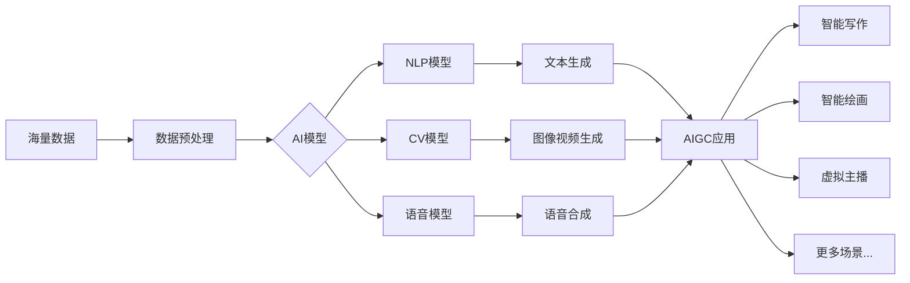

# AIGC从入门到实战：AIGC 相关资源推荐

## 1. 背景介绍
### 1.1 AIGC 的兴起
近年来,人工智能生成内容(Artificial Intelligence Generated Content, AIGC)技术迅速发展,在文本、图像、音频、视频等领域展现出巨大的应用潜力。AIGC利用深度学习算法,通过训练海量数据,可以自动生成高质量、个性化的内容,极大提升了内容生产效率。

### 1.2 AIGC 的应用前景
AIGC 技术正在深刻影响着各行各业。在新闻媒体领域,AIGC可以自动撰写新闻报道和财经分析;在营销领域,AIGC可以生成个性化的广告文案和创意;在娱乐领域,AIGC 可以创作音乐、绘画和影视剧本;在教育领域,AIGC可以生成教学资源和试题;在客服领域,AIGC 可以提供智能客服对话服务。可以预见,AIGC 将成为驱动数字经济发展的核心技术之一。

### 1.3 AIGC 学习的必要性
对于有志于从事人工智能、内容创作等相关工作的人员来说,学习和掌握 AIGC 技术已经成为一项必备技能。无论是提升工作效率,还是把握行业发展机遇,深入理解 AIGC 的原理和应用都至关重要。本文将系统介绍 AIGC 的核心概念、关键技术、学习资源,帮助读者全面了解 AIGC,并为后续的实践应用打下坚实基础。

## 2. 核心概念与联系
### 2.1 AIGC 的定义
AIGC是利用人工智能技术,特别是深度学习算法,通过学习和理解海量数据,进而自动生成各类内容(如文本、图像、音频、视频等)的技术。其核心在于让机器学会人类创作内容的思维和技巧,从而部分替代人工进行内容生产。

### 2.2 AIGC 与 NLP、CV、语音识别的关系
AIGC 是一个综合性的技术领域,涉及自然语言处理(NLP)、计算机视觉(CV)、语音识别等多个人工智能分支。
- NLP 侧重于让机器理解、生成自然语言文本,是 AIGC 生成文本内容的基础;
- CV 侧重于让机器理解、生成图像和视频,是 AIGC 生成图像、视频内容的基础;
- 语音识别让机器能理解、转录人类语音,进而结合 NLP 技术,是 AIGC 生成音频内容的基础。

AIGC 需要将 NLP、CV、语音识别等技术高度集成,形成端到端的内容生成系统和应用。

### 2.3 AIGC 的关键技术
AIGC 主要依赖以下几类关键技术:
- 大规模语言模型:如 GPT-3、BERT、ERNIE 等,让机器掌握语言知识,能理解和生成自然语言;
- 生成式对抗网络(GAN):通过生成器和判别器的博弈训练,让机器能生成逼真的图像和视频;  
- 文本到图像生成:如 DALL-E、Stable Diffusion 等,根据文本描述生成匹配的图像;
- 文本到语音合成(TTS):根据输入的文本,合成对应的语音音频;
- 音频到文本转换(ASR):将输入的语音音频,转换为对应的文本。

以上技术相互配合,构成了 AIGC 的技术架构和能力基础。

### 2.4 AIGC 技术架构
下面是一个典型的 AIGC 技术架构示意图:



从左到右依次为:输入海量数据,经过预处理后喂给 AI 模型进行训练,AI 模型包括 NLP、CV、语音等不同类型,分别负责文本、图像视频、语音等内容的理解和生成。各类 AI 模型生成的内容汇聚到 AIGC 应用层,支撑智能写作、智能绘画、虚拟主播等丰富的应用场景。

## 3. 核心算法原理与操作步骤
### 3.1 大规模语言模型原理
大规模语言模型如 GPT-3 的核心原理是自回归生成。具体来说:
1. 将海量文本数据进行预处理,切分成若干个词元(token);
2. 使用 self-attention 机制建模词元之间的关系,学习其上下文语义信息;
3. 在给定若干词元的前提下,预测下一个最可能出现的词元,不断迭代直到生成完整句子;
4. 使用海量数据进行训练,让模型掌握词元之间的概率分布,从而生成合理连贯的文本。

### 3.2 GAN 原理
GAN 由生成器(Generator)和判别器(Discriminator)组成,两者互为对抗,最终让生成器能够生成以假乱真的内容。其训练步骤为:
1. 生成器从随机噪声中生成假样本;
2. 判别器同时接收真实样本和生成的假样本,二分类判断其真假;
3. 根据判别器的反馈,调整生成器的参数,让其生成的假样本更逼真;
4. 同时调整判别器的参数,提升其判别真假的能力;
5. 两个网络不断博弈,最终生成器可生成高质量的仿真内容。

### 3.3 文本到图像生成原理
以 Stable Diffusion 为例,其结合了 CLIP 对图像-文本对进行编码,以及扩散模型(Diffusion Model)逐步去噪生成图像的思路。主要步骤为:
1. 使用 CLIP 对大量图像-文本对进行对比学习,建立图像和文本特征的联系;
2. 训练一个 VAE 模型,将图像压缩到隐空间,并能从隐空间重建出图像;
3. 训练扩散模型,学习图像的噪声分布,并逐步去噪将随机噪声还原为图像;
4. 推理时,用 CLIP 对文本提示进行编码,在隐空间进行条件采样并去噪,生成与文本匹配的图像。

### 3.4 TTS 原理
TTS 的主要步骤包括:
1. 对输入的文本进行分析,转换为音素序列;
2. 使用声学模型将音素序列转换为声学参数(如梅尔频谱);
3. 使用声码器(Vocoder)将声学参数转换为语音波形;
4. 合成出连续自然的语音音频。

其中声学模型可以使用 Tacotron2、FastSpeech 等端到端神经网络模型,声码器可以使用 WaveNet、WaveRNN 等自回归模型或 GAN 模型。

### 3.5 ASR 原理  
ASR 的主要步骤包括:
1. 对语音进行预处理,提取声学特征(如 MFCC、Fbank 等);
2. 使用声学模型(如 CNN、LSTM、Transformer 等)将声学特征转换为音素或字符的概率分布;
3. 使用语言模型估算不同词句的先验概率;
4. 结合声学模型和语言模型,使用 Beam Search 等解码算法获得概率最大的文本输出。

端到端的 ASR 模型如 DeepSpeech2、Conformer 可以将声学模型和语言模型合二为一,直接从语音到文本进行建模。

## 4. 数学模型与公式详解
### 4.1 Transformer 中的 Self-Attention
Transformer 是大规模语言模型的核心组件,其中使用 self-attention 机制建模词元之间的依赖关系。设词元的输入向量为 $X \in \mathbb{R}^{n \times d}$,其中 $n$ 为序列长度,$d$ 为特征维度。Self-attention 的计算过程为:

$$
\begin{aligned}
Q &= X W_Q \\
K &= X W_K \\
V &= X W_V \\
\text{Attention}(Q,K,V) &= \text{softmax}(\frac{QK^T}{\sqrt{d_k}})V
\end{aligned}
$$

其中 $W_Q, W_K, W_V \in \mathbb{R}^{d \times d_k}$ 为可学习的投影矩阵,$Q,K,V$ 分别为 query、key、value 向量。将 query 与 key 进行点积并归一化,得到注意力分布,再与 value 加权求和,得到 self-attention 的输出。这一过程能够让每个词元与其他所有词元建立全局依赖。

### 4.2 GAN 的损失函数
GAN 中生成器 $G$ 和判别器 $D$ 的博弈过程可以用如下的损失函数表示:

$$
\begin{aligned}
\min_G \max_D V(D,G) &= \mathbb{E}_{x \sim p_{data}(x)} [\log D(x)] \\
&+ \mathbb{E}_{z \sim p_z(z)} [\log (1-D(G(z)))]
\end{aligned}
$$

其中 $x$ 为真实样本,$z$ 为随机噪声,$p_{data}$ 和 $p_z$ 分别为真实数据和噪声的分布。生成器 $G$ 试图最小化目标函数,而判别器 $D$ 试图最大化目标函数。通过不断迭代,最终达到纳什均衡,生成器可以生成与真实数据分布接近的样本。

### 4.3 扩散模型的前向和反向过程
扩散模型通过迭代加噪和去噪的过程来生成数据。其前向过程为:

$$
q(x_t|x_{t-1}) = \mathcal{N}(x_t; \sqrt{1-\beta_t} x_{t-1}, \beta_t \mathbf{I})
$$

其中 $x_t$ 为 $t$ 时刻的噪声样本,$\beta_t$ 为噪声强度,通过逐步增加 $\beta_t$ 将数据 $x_0$ 转换为高斯噪声 $x_T$。

反向去噪过程为:

$$
p_\theta(x_{t-1}|x_t) = \mathcal{N}(x_{t-1}; \mu_\theta(x_t,t), \sigma_\theta(x_t,t)^2\mathbf{I})
$$

其中 $\mu_\theta$ 和 $\sigma_\theta$ 为可学习的均值和方差函数,通过逐步去噪将 $x_T$ 还原为原始数据 $x_0$。

## 5. 项目实践
### 5.1 使用 GPT-2 生成文本
可以使用 Hugging Face 的 Transformers 库快速调用 GPT-2 模型生成文本。示例代码如下:

```python
from transformers import GPT2LMHeadModel, GPT2Tokenizer

# 加载预训练的GPT-2模型和tokenizer
model = GPT2LMHeadModel.from_pretrained('gpt2')
tokenizer = GPT2Tokenizer.from_pretrained('gpt2')

# 设置生成参数
input_text = "The quick brown fox"
max_length = 50
num_return_sequences = 3

# 对输入文本进行编码
input_ids = tokenizer.encode(input_text, return_tensors='pt')

# 生成文本
output = model.generate(
    input_ids, 
    max_length=max_length, 
    num_return_sequences=num_return_sequences,
    no_repeat_ngram_size=2,
    early_stopping=True
)

# 解码并打印生成的文本
for i in range(num_return_sequences):
    print(f"Generated text {i+1}: {tokenizer.decode(output[i], skip_special_tokens=True)}")
```

以上代码首先加载了预训练的 GPT-2 模型和 tokenizer,然后设置了生成参数,包括输入文本、最大长度、生成的序列数等。接着对输入文本进行编码,然后调用 `model.generate()` 方法生成文本。最后对生成的结果进行解码并打印出来。

通过调整生成参数,如 `max_length`、`num_return_sequences`、`no_repeat_ngram_size`、`early_stopping` 等,可以控制生成文本的长度、数量、重复度等属性,从而得