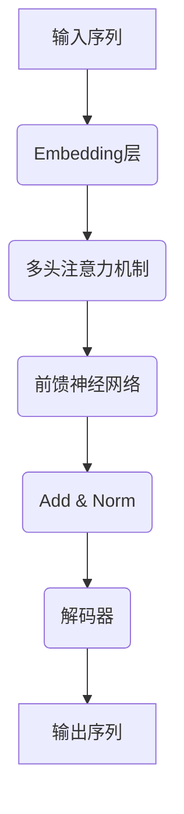
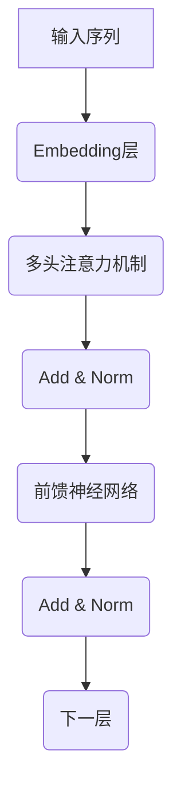
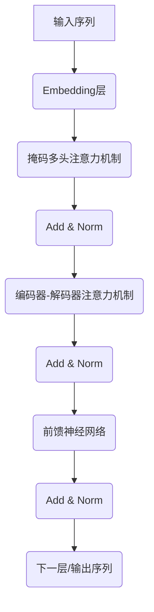

# AIGC从入门到实战：ChatGPT 简介：从 GPT-1 到 GPT-4 的发展历程和应用领域

## 1. 背景介绍

### 1.1 人工智能的发展历程

人工智能(Artificial Intelligence, AI)是一门研究如何使机器模拟人类智能行为的学科。自20世纪50年代问世以来,人工智能经历了几个重要的发展阶段。

- 1950年代,人工智能理论奠基时期,提出了人工智能的基本概念和符号主义方法。
- 1960-1970年代,规则专家系统时期,专家系统在一些特定领域展现出了人工智能的威力。
- 1980-1990年代,神经网络和机器学习时期,神经网络和机器学习算法开始被广泛应用。
- 2000年代后,深度学习时期,受益于大数据、算力增强和新算法,深度学习取得了突破性进展。

### 1.2 大语言模型的兴起

在深度学习时期,自然语言处理(Natural Language Processing, NLP)成为人工智能的一个重要分支。传统的NLP方法主要基于规则和统计模型,存在一些局限性。大规模预训练语言模型(Large Pre-trained Language Model, LPLM)的出现,为NLP带来了新的发展机遇。

LPLM通过在大规模语料库上进行无监督预训练,学习到丰富的语言知识和上下文信息,从而能够生成更加自然流畅的文本。GPT(Generative Pre-trained Transformer)系列模型是LPLM的典型代表,由OpenAI公司研发,在自然语言生成任务中表现出色,推动了人工智能生成内容(AIGC)的发展。

## 2. 核心概念与联系

### 2.1 GPT系列模型概述

GPT系列模型包括GPT-1、GPT-2、GPT-3和GPT-4,每一代模型在规模、性能和能力上都有所提升。

- GPT-1(2018年)是第一代大规模预训练语言模型,具有1.5亿个参数。
- GPT-2(2019年)在GPT-1的基础上扩大了模型规模,达到16亿个参数,生成质量有所提高。
- GPT-3(2020年)是里程碑式的突破,拥有1750亿个参数,展现出强大的文本生成能力。
- GPT-4(2023年)是目前最新的版本,在模型规模、训练数据、安全性和多模态能力等方面都有重大升级。

### 2.2 GPT模型的核心架构

GPT系列模型的核心架构是Transformer,由注意力机制(Attention Mechanism)和前馈神经网络(Feed-Forward Neural Network)组成。



1. Embedding层将输入序列转换为向量表示。
2. 多头注意力机制捕捉输入序列中元素之间的关系。
3. 前馈神经网络对注意力输出进行非线性变换。
4. Add & Norm层进行残差连接和层归一化。
5. 解码器生成最终的输出序列。

### 2.3 GPT模型的预训练和微调

GPT模型采用两阶段训练策略:

1. **预训练(Pre-training)**: 在大规模无标注语料库上进行自监督学习,捕捉语言的通用知识。
2. **微调(Fine-tuning)**: 在特定任务的标注数据上进行有监督训练,将预训练模型适应特定任务。

预训练阶段采用的是自回归语言模型(Autoregressive Language Model)任务,即根据上文预测下一个词。微调阶段根据不同任务采用不同的目标函数和训练策略。

## 3. 核心算法原理具体操作步骤

### 3.1 Transformer架构

Transformer架构是GPT模型的核心,它主要由编码器(Encoder)和解码器(Decoder)组成。编码器负责处理输入序列,解码器负责生成输出序列。

#### 3.1.1 编码器(Encoder)

编码器由多个相同的层组成,每层包含两个子层:多头注意力机制(Multi-Head Attention)和前馈神经网络(Feed-Forward Neural Network)。

1. **多头注意力机制**:捕捉输入序列中元素之间的关系,生成注意力输出。
2. **前馈神经网络**:对注意力输出进行非线性变换,生成编码器输出。



#### 3.1.2 解码器(Decoder)

解码器的结构与编码器类似,也由多个相同的层组成,每层包含三个子层:

1. **掩码多头注意力机制**:捕捉已生成序列中元素之间的关系。
2. **编码器-解码器注意力机制**:将解码器状态与编码器输出进行关联。
3. **前馈神经网络**:对注意力输出进行非线性变换,生成解码器输出。



### 3.2 注意力机制(Attention Mechanism)

注意力机制是Transformer架构的核心,它能够捕捉序列中元素之间的长程依赖关系。

#### 3.2.1 缩放点积注意力(Scaled Dot-Product Attention)

缩放点积注意力是注意力机制的基本形式,计算过程如下:

1. 计算查询(Query)、键(Key)和值(Value)的点积:$\text{Attention}(Q, K, V) = \text{softmax}(\frac{QK^T}{\sqrt{d_k}})V$
2. 缩放因子$\sqrt{d_k}$用于防止点积结果过大导致softmax函数梯度较小。
3. softmax函数确保注意力权重和为1。

$$\text{Attention}(Q, K, V) = \text{softmax}(\frac{QK^T}{\sqrt{d_k}})V$$

其中,Q是查询向量,K是键向量,V是值向量,$d_k$是缩放因子。

#### 3.2.2 多头注意力机制(Multi-Head Attention)

多头注意力机制将注意力分成多个"头"进行并行计算,然后将结果拼接起来,捕捉不同的关系。

$$\text{MultiHead}(Q, K, V) = \text{Concat}(\text{head}_1, \dots, \text{head}_h)W^O$$
$$\text{where, head}_i = \text{Attention}(QW_i^Q, KW_i^K, VW_i^V)$$

其中,$W_i^Q$、$W_i^K$、$W_i^V$和$W^O$是可学习的线性变换矩阵。

### 3.3 位置编码(Positional Encoding)

由于Transformer没有递归或卷积结构,无法直接捕捉序列的位置信息。位置编码通过将位置信息注入到输入序列的嵌入向量中,解决了这个问题。

$$\text{PE}_{(pos, 2i)} = \sin(pos / 10000^{2i / d_\text{model}})$$
$$\text{PE}_{(pos, 2i+1)} = \cos(pos / 10000^{2i / d_\text{model}})$$

其中,pos是位置索引,i是维度索引,$d_\text{model}$是嵌入维度。

### 3.4 掩码机制(Masking)

在解码器的掩码多头注意力机制中,需要防止每个位置的词可以看到后续位置的词,否则会造成信息泄露。掩码机制通过将未来位置的注意力权重设置为0,解决了这个问题。

## 4. 数学模型和公式详细讲解举例说明

### 4.1 自回归语言模型(Autoregressive Language Model)

自回归语言模型是GPT模型预训练的核心任务,其目标是最大化下一个词的条件概率:

$$P(x_t|x_{<t}) = \text{Model}(x_{<t})$$

其中,$x_t$是第t个词,$x_{<t}$是前t-1个词的序列。

在训练过程中,模型会最小化下式的负对数似然损失函数:

$$\mathcal{L} = -\sum_{t=1}^T \log P(x_t|x_{<t})$$

通过最小化损失函数,模型可以学习到生成自然语言的能力。

### 4.2 注意力机制数学原理

注意力机制的数学原理可以用查询(Query)、键(Key)和值(Value)的点积运算来表示:

$$\text{Attention}(Q, K, V) = \text{softmax}(\frac{QK^T}{\sqrt{d_k}})V$$

其中:

- Q是查询向量,表示当前需要关注的信息。
- K是键向量,表示其他位置的信息。
- V是值向量,表示其他位置的值。
- $d_k$是缩放因子,用于防止点积结果过大导致softmax函数梯度较小。

softmax函数确保注意力权重和为1,从而实现对不同位置信息的加权求和。

以下是一个简单的注意力机制示例:

```python
import torch
import torch.nn as nn

# 定义查询、键和值向量
q = torch.randn(1, 3)  # 查询向量
k = torch.randn(5, 3)  # 键向量
v = torch.randn(5, 4)  # 值向量

# 计算注意力权重
attn_weights = torch.softmax(torch.bmm(q, k.transpose(1, 2)) / (k.size(-1) ** 0.5), dim=-1)

# 计算加权和
attn_output = torch.bmm(attn_weights, v)

print("查询向量: ", q)
print("键向量: ", k)
print("值向量: ", v)
print("注意力权重: ", attn_weights)
print("注意力输出: ", attn_output)
```

在这个示例中,我们定义了一个查询向量q、五个键向量k和五个值向量v。通过计算q与k的点积,然后应用softmax函数得到注意力权重attn_weights。最后,将注意力权重与值向量v进行加权求和,得到注意力输出attn_output。

### 4.3 Transformer模型参数

Transformer模型的参数包括:

- 嵌入维度($d_\text{model}$):输入和输出向量的维度。
- 注意力头数($h$):多头注意力机制中并行注意力头的数量。
- 前馈网络内部维度($d_\text{ff}$):前馈网络中的隐藏层维度。

这些参数决定了Transformer模型的容量和计算复杂度。通常,较大的参数值可以提高模型的表现能力,但也会增加计算开销。

以GPT-3为例,其参数设置如下:

- 嵌入维度($d_\text{model}$) = 12288
- 注意力头数($h$) = 96
- 前馈网络内部维度($d_\text{ff}$) = 49152

GPT-3拥有1750亿个参数,是目前最大的语言模型之一。

## 5. 项目实践:代码实例和详细解释说明

### 5.1 使用Hugging Face Transformers库

Hugging Face Transformers库是一个流行的开源NLP库,提供了预训练模型和用于微调的API。以下是使用GPT-2进行文本生成的代码示例:

```python
from transformers import GPT2LMHeadModel, GPT2Tokenizer

# 加载预训练模型和分词器
model = GPT2LMHeadModel.from_pretrained('gpt2')
tokenizer = GPT2Tokenizer.from_pretrained('gpt2')

# 输入文本
input_text = "今天的天气真不错,"

# 对输入文本进行编码
input_ids = tokenizer.encode(input_text, return_tensors='pt')

# 生成文本
output = model.generate(input_ids, max_length=100, do_sample=True, top_k=50, top_p=0.95, num_return_sequences=1)

# 对输出进行解码
generated_text = tokenizer.decode(output[0], skip_special_tokens=True)

print(generated_text)
```

在这个示例中,我们首先加载预训练的GPT-2模型和分词器