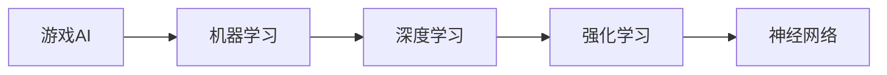

## 1.背景介绍

在当今这个数据驱动的时代，人工智能和游戏开发已经成为了计算机科学领域的两大热门话题。人工智能游戏编程（AIGC）就是将这两者结合起来，使用人工智能技术来创建更加智能、更加自然的游戏体验。然而，AIGC也带来了一系列的开发难题。本文将对这些问题进行深入的探讨和解答，希望能为广大开发者提供帮助。

## 2.核心概念与联系

AIGC是一种新的编程范式，它将人工智能的理论和技术应用于游戏开发中。其核心概念包括但不限于：游戏AI、机器学习、深度学习、强化学习、神经网络等。

Mermaid流程图如下：



## 3.核心算法原理具体操作步骤

### 3.1 游戏AI

游戏AI是AIGC的基础，它主要用于控制游戏中的非玩家角色（NPC）。常见的游戏AI算法有A*寻路算法、决策树、状态机等。

### 3.2 机器学习

机器学习是一种让机器通过学习数据来获取新的知识或技能，然后应用这些知识和技能来进行预测或决策的技术。在AIGC中，机器学习可以用于训练NPC的行为模式。

### 3.3 深度学习

深度学习是一种特殊的机器学习方法，它使用了深度神经网络来模拟人脑的工作机制。在AIGC中，深度学习可以用于处理复杂的游戏场景，如图像识别、语音识别等。

### 3.4 强化学习

强化学习是一种机器学习方法，它通过让机器与环境进行交互，然后根据环境给出的反馈（奖励或惩罚）来调整自己的行为，以达到某种目标。在AIGC中，强化学习可以用于训练NPC的决策能力。

### 3.5 神经网络

神经网络是一种模拟人脑神经元工作的计算模型，它是深度学习的基础。在AIGC中，神经网络可以用于处理复杂的输入输出映射关系，如图像到动作的映射。

## 4.数学模型和公式详细讲解举例说明

在AIGC中，我们常常需要用到一些数学模型和公式。例如，在使用强化学习时，我们会用到贝尔曼方程来计算状态值函数。贝尔曼方程的公式如下：

$$
V(s) = max_a(R(s,a) + \gamma \sum_{s'}P(s'|s,a)V(s'))
$$

其中，$V(s)$是状态$s$的值函数，$R(s,a)$是在状态$s$下执行动作$a$得到的即时奖励，$\gamma$是折扣因子，$P(s'|s,a)$是在状态$s$下执行动作$a$后转移到状态$s'$的概率。

## 5.项目实践：代码实例和详细解释说明

在AIGC的实践中，我们可以使用Python的强大库来实现我们的算法。例如，我们可以使用Pygame库来开发游戏，使用TensorFlow或PyTorch库来实现深度学习。

以下是一个使用Pygame和TensorFlow实现的简单AIGC项目的代码示例：

```python
import pygame
import tensorflow as tf

# 初始化pygame
pygame.init()

# 创建游戏窗口
screen = pygame.display.set_mode((800, 600))

# 创建一个NPC
npc = pygame.sprite.Sprite()
npc.image = pygame.image.load('npc.png')
npc.rect = npc.image.get_rect()

# 创建一个神经网络
model = tf.keras.models.Sequential([
  tf.keras.layers.Dense(128, activation='relu'),
  tf.keras.layers.Dense(128, activation='relu'),
  tf.keras.layers.Dense(4, activation='softmax')
])

# 训练神经网络
# 省略...

# 使用神经网络来控制NPC
action = model.predict(state)
npc.rect.move_ip(action)

# 游戏主循环
while True:
  for event in pygame.event.get():
    if event.type == pygame.QUIT:
      pygame.quit()

  screen.fill((0, 0, 0))
  screen.blit(npc.image, npc.rect)
  pygame.display.flip()
```

## 6.实际应用场景

AIGC在实际中有很多应用场景，例如：

- 在策略游戏中，我们可以使用AIGC来训练NPC的决策能力，使其能够根据游戏的状态做出合理的决策。
- 在角色扮演游戏中，我们可以使用AIGC来训练NPC的行为模式，使其能够更加自然地与玩家互动。
- 在射击游戏中，我们可以使用AIGC来训练NPC的射击技巧，使其能够更准确地命中目标。

## 7.工具和资源推荐

在AIGC的开发中，以下是一些我推荐的工具和资源：

- Python：一种广泛用于人工智能和游戏开发的编程语言。
- Pygame：一个用Python编写的开源游戏开发库。
- TensorFlow：一个开源的深度学习框架。
- PyTorch：一个开源的深度学习框架。
- OpenAI Gym：一个用于开发和比较强化学习算法的工具包。

## 8.总结：未来发展趋势与挑战

随着人工智能技术的不断发展，我相信AIGC的未来将会更加广阔。然而，AIGC也面临着一些挑战，例如如何训练出更加智能的NPC，如何处理更加复杂的游戏场景，如何提高游戏的真实感等。

## 9.附录：常见问题与解答

以下是一些关于AIGC的常见问题及其解答：

- 问题：AIGC需要什么样的硬件支持？
- 解答：AIGC的硬件需求取决于你的项目的复杂度。一般来说，你需要一台具有足够CPU和内存的计算机，如果你需要进行深度学习，你可能还需要一块支持CUDA的NVIDIA显卡。

- 问题：我需要学习哪些知识才能进行AIGC开发？
- 解答：你需要学习编程、人工智能、机器学习、深度学习、强化学习等知识。你也需要学习一些游戏开发的知识，如游戏设计、图形学、物理学等。

- 问题：我可以在哪里学习AIGC？
- 解答：你可以在网上找到很多关于AIGC的教程和课程，例如Coursera、Udemy、edX等网站。你也可以阅读一些相关的书籍，例如《深度学习》、《强化学习》等。

作者：禅与计算机程序设计艺术 / Zen and the Art of Computer Programming