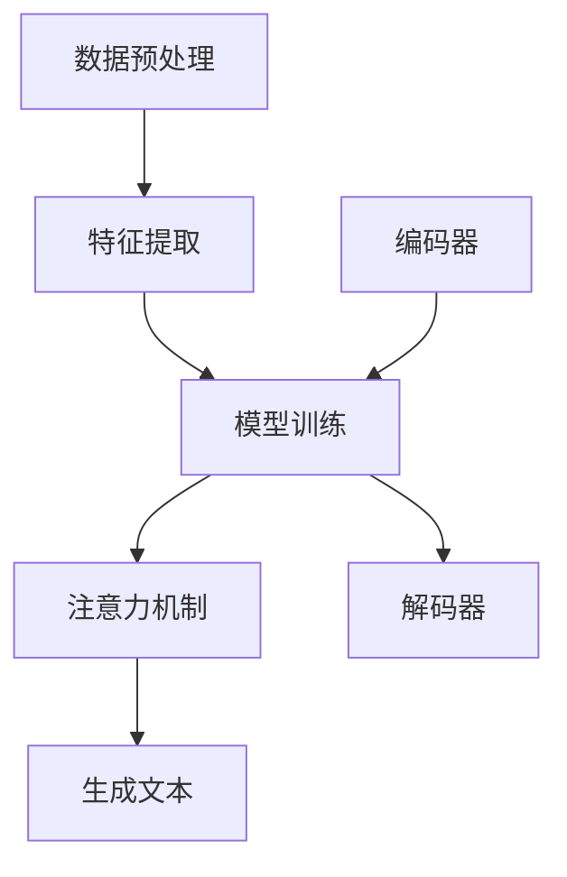
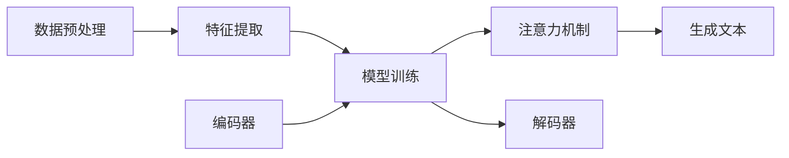

## 背景介绍

近年来，人工智能（AI）技术的飞速发展为各个领域带来了革命性的变革。其中，自然语言处理（NLP）技术的进步使得计算机能够更好地理解、生成和利用人类语言。这一能力在许多应用中发挥着重要作用，如智能客服、搜索引擎、翻译系统等。

文本生成是NLP的一个重要方向，它研究如何让计算机根据一定的规则或模型生成连贯、有意义的文本。这种技术可以用于各种场景，如新闻生成、邮件自动化、广告创作等。同时，文本生成技术也为深度学习和其他AI技术提供了丰富的数据来源。

## 核心概念与联系

文本生成技术涉及到多种核心概念，其中包括：

1. **自然语言处理（NLP）：** 是计算机科学、认知科学和语言学的交叉领域，它研究如何让计算机理解、生成和利用人类语言。
2. **深度学习：** 是一种基于神经网络的机器学习方法，可以通过训练大量数据来学习特征表示和模式，从而实现任务目标。
3. **序列到序列（Seq2Seq）模型：** 是一种常见的深度学习架构，用於將輸入序列（如句子）轉換為輸出序列（如翻譯後的句子）。
4. **注意力機制（Attention Mechanism）：** 是一個在深度學習中用來捕捉序列中的重要信息的技術，能幫助模型更好地理解和生成文本。

这些概念之间相互联系，共同构成了文本生成技术的理论基础。例如，深度学习可以用于学习文本表示，而Seq2Seq模型则可以将这些表示转换为生成文本。同时，注意力机制可以帮助模型更好地关注输入序列中的关键信息，从而提高生成质量。

## 核心算法原理具体操作步骤

文本生成技术的核心算法通常包括以下几个主要步骤：

1. **数据预处理：** 将原始文本数据进行清洗、分词、标记等处理，使其适合于模型训练。
2. **特征提取：** 利用自然语言处理技术对文本数据进行向量化，得到文本的特征表示。
3. **模型训练：** 使用深度学习方法（如Seq2Seq模型）训练模型，使其能够根据输入文本生成连贯、有意义的输出文本。
4. **注意力机制：** 在模型训练过程中，引入注意力机制使得模型能够更好地关注输入文本中的关键信息，从而提高生成质量。
5. **生成文本：** 使用训练好的模型，对新的输入文本进行生成，得到相应的输出文本。

## 数学模型和公式详细讲解举例说明

在本节中，我们将介绍一个典型的文本生成模型——序列到序列（Seq2Seq）模型。Seq2Seq模型通常由两个部分组成：编码器（Encoder）和解码器（Decoder）。

1. **编码器（Encoder）：** 负责将输入文本转换为固定长度的向量表示。常用的编码器有循环神经网络（RNN）、长短期记忆网络（LSTM）等。
2. **解码器（Decoder）：** 负责将编码器输出的向量表示转换为目标语言文本。解码器通常采用类似的神经网络结构，如RNN、LSTM等。

数学公式如下：

$$
h_t = f_{enc}(x_1, x_2,..., x_T; W_e, b_e) \\\\
y_t = f_{dec}(h_t, y_{<t}; W_d, b_d)
$$

其中，$h_t$ 表示编码器输出的隐藏状态，$y_t$ 表示解码器输出的概率分布；$W_e$, $b_e$ 和 $W_d$, $b_d$ 分别表示编码器和解码器的权重和偏置。

## 项目实践：代码实例和详细解释说明

在本节中，我们将通过一个简单的翻译任务来展示如何使用Seq2Seq模型进行文本生成。我们将使用Python和TensorFlow作为主要工具。

首先，我们需要准备数据集。假设我们已经获得了英文-中文句对数据集，格式如下：

```
English: Hello, how are you?
Chinese: 你好，你怎么样？
```

接下来，我们可以使用以下步骤构建并训练Seq2Seq模型：

1. **数据预处理：** 对英文和中文文本进行分词、标记等处理，并将其转换为索引序列。
2. **特征提取：** 使用嵌入层将索引序列转换为向量表示。
3. **模型构建：** 构建Seq2Seq模型，其中编码器采用LSTM，解码器也采用LSTM，并且在解码器中引入注意力机制。
4. **模型训练：** 使用训练数据对模型进行训练，优化目标为最小化翻译错误率或最大化翻译概率。

## 实际应用场景

文本生成技术在许多实际应用场景中发挥着重要作用。以下是一些典型的应用场景：

1. **新闻生成：** 利用文本生成技术自动产生新闻摘要或报道，减轻记者的负担。
2. **邮件自动化：** 根据用户需求生成个性化的邮件内容，提高邮件打开率和回复率。
3. **广告创作：** 自动生成广告文案，提高广告效果和效率。
4. **客服聊天机器人：** 提供实时响应客户问题的聊天机器人，降低人工客服成本。

## 工具和资源推荐

对于想要学习和使用文本生成技术的人员，我们推荐以下工具和资源：

1. **深度学习框架：** TensorFlow、PyTorch等。
2. **自然语言处理库：** NLTK、SpaCy等。
3. **预训练模型：** BERT、GPT-2、GPT-3等。
4. **教程和论文：** Coursera、Udacity、ArXiv等。

## 总结：未来发展趋势与挑战

文本生成技术在过去几年取得了显著进展，但仍面临许多挑战。未来，这一领域将继续发展，可能出现以下趋势和挑战：

1. **更高质量的文本生成：** 未来，人们希望通过改进模型结构和优化训练方法，生成更准确、连贯且具有人类般的文本。
2. **多模态交互：** 将文本生成与图像、音频等多种媒体结合，使得AI能够理解并生成不同类型的内容。
3. **个性化和私密性：** 未来，AI需要更加关注用户的需求和偏好，同时保护用户的隐私和数据安全。

## 附录：常见问题与解答

在本篇博客中，我们探讨了AIGC的应用于文本生成技术。然而，在学习过程中，您可能会遇到一些问题。以下是一些常见的问题及相应的解答：

1. **Q: 如何选择合适的深度学习框架？**
   A: 根据个人喜好和项目需求，可以选择TensorFlow或PyTorch等流行的深度学习框架。这些框架提供了丰富的API和工具，使得开发者可以更方便地构建和训练模型。
2. **Q: 如何评估文本生成模型的质量？**
   A: 可以使用BLEU（Bilingual Evaluation Understudy）分数、ROUGE（Recall-Oriented Understudy for Gisting Evaluation）分数等指标来评估文本生成模型的质量。这些指标可以帮助我们了解模型在翻译、摘要等任务中的表现。

以上就是我们关于AIGC的应用于文本生成技术的全部内容。在学习和实践过程中，如果您遇到任何问题，请随时联系我们，我们将竭诚为您提供帮助。同时，欢迎您在评论区分享您的想法和经验，让我们一起探讨AI领域的最新发展和挑战！

作者：禅与计算机程序设计艺术 / Zen and the Art of Computer Programming

---

**Mermaid 流程图**



**Mermaid 流程图**

