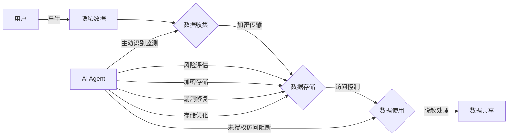

# AI人工智能 Agent：在保护隐私和数据安全中的应用

## 1. 背景介绍

### 1.1 人工智能的发展现状

人工智能(Artificial Intelligence, AI)技术的快速发展正在深刻影响和改变着我们的生活。从智能语音助手、自动驾驶汽车,到智能医疗诊断系统,AI 无处不在。然而,在享受 AI 带来的便利的同时,我们也面临着隐私泄露和数据安全的巨大风险。

### 1.2 隐私和数据安全面临的挑战

在大数据时代,海量的用户数据成为 AI 算法的"养料"。企业和机构在收集、存储和使用用户数据的过程中,可能会发生数据泄露、滥用等问题,严重威胁用户的隐私安全。同时,AI 系统如果被恶意攻击或操纵,后果不堪设想。因此,如何在发展 AI 的同时保护好隐私和数据安全,成为一个亟待解决的难题。

### 1.3 AI Agent 的作用

AI Agent 作为一种智能化的软件程序,能够主动感知环境,根据设定的目标自主地做出决策和行动。将 AI Agent 技术应用到隐私保护和数据安全领域,有望从机器智能的角度提供新的解决思路和方案。

## 2. 核心概念与联系

### 2.1 AI Agent 的定义与特点

- 定义:AI Agent 是一种基于人工智能技术,能够自主感知、决策和执行任务的智能化软件程序。
- 特点:
  - 自主性:根据环境和目标自主运行,无需人工干预
  - 社会性:能与其他 Agent、人类用户进行交互
  - 反应性:能对环境的变化做出及时反应
  - 主动性:主动地执行任务以实现既定目标
  - 连续性:持续运行,并随时间推移不断进化

### 2.2 隐私保护与数据安全

- 隐私保护:防止用户的隐私数据被非法收集、存储、使用和共享。
- 数据安全:防止数据被未经授权访问、篡改或破坏,保证数据的机密性、完整性和可用性。
- 二者关系:隐私保护是数据安全的重要内容,而数据安全是实现隐私保护的基础。

### 2.3 AI Agent 与隐私数据安全的关系

AI Agent 凭借其自主智能的特点,可以在多个方面强化隐私保护和数据安全:

- 主动识别和监测隐私数据的收集、传输和使用过程
- 自动评估数据使用的合规性风险 
- 对未授权的数据访问进行实时阻断和预警
- 加密隐私数据,防止数据泄露
- 主动修复数据安全漏洞,抵御外部攻击
- 优化数据存储和访问,提高系统可用性

下图展示了 AI Agent 在隐私数据安全防护中的作用:



## 3. 核心算法原理具体操作步骤

### 3.1 隐私数据识别算法

AI Agent 需要准确识别出哪些是隐私数据,常用的方法有:

1. 基于规则的识别:预先定义隐私数据的规则特征,如身份证号、手机号等,通过正则表达式或字典匹配发现隐私数据。
2. 基于机器学习的识别:通过有监督学习方法如决策树、支持向量机等,训练分类模型来自动识别隐私数据。步骤如下:
   - 准备已标注的隐私/非隐私数据样本
   - 提取数据特征(如字符类型、长度、上下文等)  
   - 训练分类模型并优化
   - 用训练好的模型预测新数据是否为隐私数据
3. 基于深度学习的识别:利用卷积神经网络(CNN)、循环神经网络(RNN)等深度学习模型,从数据的语义和上下文角度学习隐私特征。步骤如下:
   - 构建深度神经网络模型
   - 准备海量隐私/非隐私数据样本  
   - 训练模型学习高阶隐私特征,并调优
   - 用训练好的模型识别新数据中的隐私信息

### 3.2 数据安全风险评估算法

对识别出的隐私数据,AI Agent 还需评估其安全风险等级,主要方法有:

1. 基于专家规则的风险评估:由安全专家预先定义各种数据安全场景及其风险等级,AI Agent 根据规则进行匹配和评估。
2. 基于机器学习的风险评估:通过训练有监督机器学习模型,自动根据数据的内容、环境等因素预测安全风险。步骤如下:
   - 准备已标注风险等级的隐私数据样本
   - 提取数据特征(如数据类型、敏感度、访问环境等)
   - 训练回归或分类模型预测风险等级
   - 利用训练好的模型对新数据进行安全风险评分
3. 基于强化学习的风险评估:将风险评估看做一个连续决策过程,通过强化学习中的 Q-Learning、策略梯度等算法,使 AI Agent 学习最优的风险评估策略。

### 3.3 隐私数据加密算法

对于高风险的隐私数据,AI Agent 需对其进行加密处理,常用的加密算法有:

1. 对称加密算法:加密和解密使用相同的密钥,如 AES、DES 等。
2. 非对称加密算法:加密和解密使用不同的密钥,如 RSA、ECC 等。
3. 同态加密算法:允许直接对密文进行计算,如半同态加密和全同态加密。

AI Agent 在执行加密时,需要考虑密钥管理、加密粒度、加密效率等问题。通过密钥轮换、分层加密、并行计算等手段,提高隐私数据的安全性和可用性。

## 4. 数学模型和公式详细讲解举例说明

### 4.1 隐私数据识别的数学模型

以基于机器学习的隐私数据识别为例,假设隐私数据识别是一个二分类问题,我们可以使用逻辑回归(Logistic Regression)模型。

假设输入数据为 $X=(x_1,x_2,...,x_n)$,其中 $x_i$ 表示数据的特征向量。令 $y \in \{0,1\}$ 表示数据标签(0 为非隐私,1 为隐私)。逻辑回归模型通过学习一个线性函数,将输入数据映射到 0~1 之间的概率值:

$$
P(y=1|x) = \frac{1}{1+e^{-(\beta_0+\beta_1x_1+...+\beta_nx_n)}}
$$

其中,$\beta=(\beta_0,\beta_1,...,\beta_n)$ 为待学习的模型参数。通过极大似然估计,求解出最优参数:

$$
\hat{\beta} = \arg\max_{\beta} \sum_{i=1}^{m} [y_i \log P(y=1|x_i) + (1-y_i) \log (1-P(y=1|x_i))]
$$

求解出 $\hat{\beta}$ 后,对于新的输入数据 $x$,可根据 $P(y=1|x)$ 的值判断其是否为隐私数据(如 $P(y=1|x)>0.5$ 则认为是隐私数据)。

例如,假设我们提取了数据的 3 个特征:是否包含身份证号、是否包含银行卡号、数据来源是否可信,分别用 0/1 表示。我们有如下训练数据:

| 身份证号 | 银行卡号 | 数据来源可信 | 是否隐私 |
|:-------:|:-------:|:-----------:|:-------:|
| 1       | 0       | 0           | 1       |
| 0       | 1       | 0           | 1       |
| 0       | 0       | 1           | 0       |
| 1       | 1       | 0           | 1       |
| ...     | ...     | ...         | ...     |

使用逻辑回归训练后,得到模型参数 $\hat{\beta}=(1.2, 2.5, -3.4, 0.8)$。则对于新数据 $x=(1,0,1)$,模型预测概率为:

$$
P(y=1|x) = \frac{1}{1+e^{-(1.2*1+2.5*0-3.4*1+0.8)}} \approx 0.18 < 0.5
$$

因此判断该数据 $x$ 不是隐私数据。

### 4.2 同态加密的数学原理

同态加密允许对密文直接进行计算,得到的结果解密后与对明文进行同样计算的结果一致。设 $Enc$ 为加密算法,$Dec$ 为解密算法,$f$ 为任意计算,则同态加密满足:

$$
Dec(f(Enc(m_1), Enc(m_2),...)) = f(m_1, m_2,...)
$$

其中,$m_1, m_2,...$ 为明文数据。

以 Paillier 加密为例,介绍其数学原理:

1. 选择两个大质数 $p,q$,计算 $N=pq$, $\lambda=lcm(p-1,q-1)$。
2. 选择随机数 $g \in \mathbb{Z}_{N^2}^*$,使得 $gcd(L(g^\lambda \bmod N^2),N)=1$,其中 $L(x)=\frac{x-1}{N}$。
3. 公钥为 $(N,g)$,私钥为 $\lambda$。
4. 对明文 $m \in \mathbb{Z}_N$,选择随机数 $r \in \mathbb{Z}_N^*$,加密为:
$$
Enc(m) = g^m \cdot r^N \bmod N^2
$$
5. 对密文 $c \in \mathbb{Z}_{N^2}$,解密为:
$$
Dec(c) = L(c^\lambda \bmod N^2) \cdot \mu \bmod N
$$
其中 $\mu = (L(g^\lambda \bmod N^2))^{-1} \bmod N$。

Paillier 加密满足加法同态性:

$$
Dec(Enc(m_1) \cdot Enc(m_2) \bmod N^2) = (m_1 + m_2) \bmod N
$$

因此,AI Agent 可以直接对加密后的隐私数据进行求和等计算,无需解密。

## 5. 项目实践：代码实例和详细解释说明

下面以 Python 为例,展示 AI Agent 进行隐私数据识别、加密的代码实现。

### 5.1 基于机器学习的隐私数据识别

使用 scikit-learn 库实现逻辑回归模型:

```python
from sklearn.linear_model import LogisticRegression
from sklearn.model_selection import train_test_split

# 准备训练数据
X = [[1, 0, 0], [0, 1, 0], [0, 0, 1], [1, 1, 0], ...]  # 特征
y = [1, 1, 0, 1, ...]  # 标签

# 划分训练集和测试集 
X_train, X_test, y_train, y_test = train_test_split(X, y, test_size=0.2)

# 创建逻辑回归模型
model = LogisticRegression()

# 训练模型
model.fit(X_train, y_train)

# 评估模型
print(model.score(X_test, y_test))

# 预测新数据
new_data = [[1, 0, 1], [0, 1, 1]]
predictions = model.predict(new_data)
print(predictions)  # 输出 [0, 1]
```

其中,`X` 为数据特征,`y` 为隐私标签。先将数据划分为训练集和测试集,然后创建逻辑回归模型 `model`,调用 `fit` 函数训练模型。训练完成后,可以用 `score` 函数在测试集上评估模型性能,用 `predict` 函数预测新数据是否为隐私。

### 5.2 同态加密实现

使用 `python-paillier` 库实现 Paillier 加密:

```python
from phe import paillier

# 生成公私钥
public_key