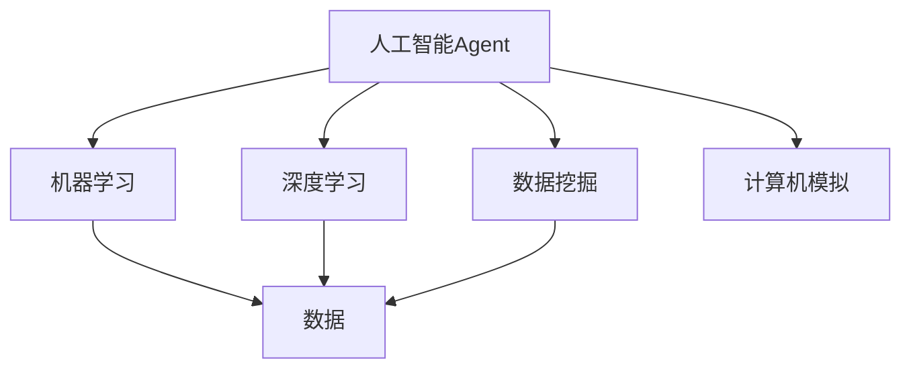

# AI人工智能 Agent：对科学研究方法的改变

## 1.背景介绍

在过去几十年中,人工智能(AI)技术取得了长足的进步,尤其是在机器学习和深度学习领域。AI系统已经渗透到我们生活的方方面面,从语音助手到自动驾驶汽车,无处不在。然而,AI不仅仅是一种应用技术,它也正在彻底改变我们进行科学研究的方式。

传统的科学研究方法主要依赖于人类研究人员提出假设、设计实验、收集数据、分析结果并得出结论。这种方法虽然行之有效,但也存在一些局限性。首先,人类的认知能力是有限的,难以处理大规模复杂数据。其次,人类容易受到偏见和主观性的影响,影响研究结果的客观性。再者,一些研究领域存在伦理道德等限制,难以通过实验进行研究。

AI技术的出现为科学研究带来了新的机遇和挑战。AI系统具有强大的数据处理能力,可以快速分析海量数据,发现人类难以察觉的模式和规律。AI算法也能够减少人类的主观偏见,提高研究结果的客观性。此外,AI系统可以通过模拟和虚拟实验的方式,绕过一些现实世界的限制,探索更广阔的研究领域。

## 2.核心概念与联系

要理解AI如何改变科学研究方法,我们需要了解几个核心概念及其联系:

1. **机器学习(Machine Learning)**:赋予计算机从数据中自主学习和建模的能力,是AI的核心驱动力。
2. **深度学习(Deep Learning)**:一种基于人工神经网络的机器学习技术,可以从大量数据中自动学习特征表示,在计算机视觉、自然语言处理等领域表现出色。
3. **数据挖掘(Data Mining)**:从大量数据中发现隐藏信息和模式的过程,是AI系统分析数据的重要手段。
4. **计算机模拟(Computer Simulation)**:利用计算机模型模拟现实世界系统的行为,为科学研究提供虚拟实验环境。
5. **人工智能Agent(AI Agent)**:具有一定自主性的软件实体,可以感知环境、学习知识、制定计划并采取行动,是AI系统与科学研究相结合的关键。

这些概念相互关联、环环相扣。AI Agent利用机器学习和深度学习技术从数据中获取知识,通过数据挖掘发现隐藏模式,并在计算机模拟环境中验证和优化策略,最终为科学研究提供新的见解和方法。



## 3.核心算法原理具体操作步骤

AI Agent在科学研究中发挥作用的核心算法原理可以概括为以下几个步骤:

1. **数据采集**:首先需要收集与研究问题相关的数据,可以来自实验观测、模拟仿真、文献资料等多种渠道。数据的质量和数量对后续分析结果至关重要。

2. **数据预处理**:由于原始数据可能存在噪声、缺失值、异常值等问题,需要进行清洗、标准化、降维等预处理,以提高数据质量,为机器学习算法的应用做好准备。

3. **特征工程**:从原始数据中提取或构造对问题有意义的特征,是机器学习算法取得好的性能的关键步骤。这需要对问题领域有深入的理解和丰富的经验。

4. **模型选择与训练**:根据问题的特点选择合适的机器学习算法,如监督学习、无监督学习或强化学习等,并使用训练数据对模型进行训练,得到能够很好地拟合数据的模型。

5. **模型评估与优化**:在测试数据上评估模型的性能,如果不理想则需要进行调参或选择其他算法,重复训练评估的过程,直至获得满意的模型。

6. **模型解释与知识提取**:对训练好的模型进行解释,从中提取隐含的知识,并与现有的理论知识相结合,形成新的科学见解和发现。

7. **模拟实验与验证**:在计算机模拟环境中,根据提取的知识设计虚拟实验,验证和完善所得到的结论,为进一步的实验研究提供理论指导。

8. **持续优化迭代**:将模拟实验的反馈结果应用到数据采集、特征工程、模型训练等环节,形成闭环,不断优化和完善AI Agent系统,为科研提供更有价值的支持。

这一系列步骤构成了AI Agent在科学研究中发挥作用的核心流程。需要指出的是,这并非一个线性过程,在实际应用中可能需要反复迭代,动态调整策略,以获得更好的结果。

## 4.数学模型和公式详细讲解举例说明

AI Agent在科学研究中的应用涉及到许多数学模型和公式,我们将举例介绍其中的几个核心概念:

### 4.1 线性回归

线性回归是一种常见的监督学习算法,用于建立自变量和因变量之间的线性关系模型。其数学表达式为:

$$y = w_0 + w_1x_1 + w_2x_2 + ... + w_nx_n + \epsilon$$

其中$y$为因变量,$x_1, x_2, ..., x_n$为自变量,$w_0, w_1, ..., w_n$为模型参数,$\epsilon$为误差项。通过最小化误差平方和,可以求解出最优参数值。

线性回归模型常用于科学研究中的数据拟合、趋势分析等任务。例如,在化学反应动力学研究中,可以使用线性回归建模描述反应物浓度与时间的关系。

### 4.2 逻辑回归

逻辑回归是一种用于分类问题的算法,它通过对线性回归的结果应用逻辑函数(如Sigmoid函数),将输出值映射到0到1之间,从而可以用于二分类任务。其数学表达式为:

$$P(y=1|x) = \sigma(w_0 + w_1x_1 + w_2x_2 + ... + w_nx_n) = \frac{1}{1 + e^{-(w_0 + w_1x_1 + w_2x_2 + ... + w_nx_n)}}$$

其中$\sigma$为Sigmoid函数。

在生物医学研究中,逻辑回归可用于构建疾病风险预测模型;在社会科学研究中,可用于分析影响某一现象发生的多个因素。

### 4.3 决策树

决策树是一种常用的分类和回归算法,它通过递归的方式将特征空间划分为若干个区域,每个区域对应一个输出值或类别标记。决策树的构建过程可以用信息增益或基尼系数等指标作为划分标准。

决策树模型直观易解,可解释性强,在科学研究中可用于探索影响因素、发现潜在规律。例如,在医学诊断中,可以构建一个决策树模型,根据病人的症状、体征等特征对疾病类型进行分类。

### 4.4 聚类算法

聚类是一种常见的无监督学习任务,其目标是根据数据点之间的相似性,将它们划分到不同的簇或组中。常用的聚类算法包括K-Means、层次聚类、DBSCAN等。

聚类算法在科学研究中有广泛应用,可用于发现数据的内在结构、识别异常值、对样本进行分组等。例如,在基因组学研究中,可以对基因表达数据进行聚类分析,发现具有相似表达模式的基因组,为进一步的功能研究提供线索。

### 4.5 主成分分析(PCA)

主成分分析是一种常用的降维技术,通过线性变换将原始高维数据投影到一个低维空间,使得投影后的数据尽可能保留原始数据的差异性。PCA的数学原理是求解数据的协方差矩阵的特征向量和特征值,将数据投影到由前$k$个主成分构成的空间中。

$$X' = X \times W$$

其中$X$为原始数据矩阵,$W$为投影矩阵,由主成分向量构成。

PCA常被用于科学数据的可视化、降噪、特征提取等预处理步骤,有助于简化复杂数据的结构,提高后续分析的效率。

以上是AI Agent在科学研究中常用到的一些核心数学模型和公式,实际应用中还有许多其他模型,如支持向量机、神经网络、贝叶斯模型等,在不同的场景下发挥着重要作用。

## 5.项目实践:代码实例和详细解释说明

为了更好地理解AI Agent在科学研究中的应用,我们将通过一个具体的项目实践来演示其中的关键步骤和代码实现。

假设我们需要研究一种新型催化剂对某化学反应的影响,已经收集了包含反应条件(温度、压力、浓度等)和产物浓度的一组实验数据。我们希望从中发现影响反应效率的关键因素,并建立预测模型。

### 5.1 数据预处理

```python
import pandas as pd
from sklearn.preprocessing import StandardScaler

# 加载数据
data = pd.read_csv('reaction_data.csv')

# 填充缺失值
data = data.fillna(data.mean())

# 标准化数据
scaler = StandardScaler()
data_scaled = scaler.fit_transform(data)
```

首先,我们使用Pandas库加载实验数据,并对缺失值进行填充,然后使用StandardScaler对数值特征进行标准化,这有助于后续的模型训练。

### 5.2 特征工程

```python
from sklearn.decomposition import PCA

# 使用PCA进行降维
pca = PCA(n_components=5)
data_pca = pca.fit_transform(data_scaled)

# 合并PCA特征与原始特征
data_features = pd.DataFrame(
    np.hstack((data_pca, data_scaled[:, -1].reshape(-1, 1))),
    columns=['pca_1', 'pca_2', 'pca_3', 'pca_4', 'pca_5', 'product_conc']
)
```

我们使用PCA对标准化后的数据进行降维,保留前5个主成分作为新的特征,并与原始的产物浓度特征合并,构建新的特征矩阵。

### 5.3 模型训练与评估

```python
from sklearn.model_selection import train_test_split
from sklearn.linear_model import LinearRegression
from sklearn.metrics import r2_score

# 划分训练集和测试集
X_train, X_test, y_train, y_test = train_test_split(
    data_features.drop('product_conc', axis=1),
    data_features['product_conc'],
    test_size=0.2,
    random_state=42
)

# 训练线性回归模型
model = LinearRegression()
model.fit(X_train, y_train)

# 评估模型性能
y_pred = model.predict(X_test)
score = r2_score(y_test, y_pred)
print(f'R-squared score: {score:.2f}')
```

我们将数据划分为训练集和测试集,使用线性回归模型对产物浓度进行拟合,并在测试集上评估模型的性能。R-squared分数可以反映模型的拟合程度。

### 5.4 模型解释与知识提取

```python
import matplotlib.pyplot as plt

# 可视化系数
coefs = pd.Series(model.coef_, index=X_train.columns)
coefs.plot(kind='bar', figsize=(8, 6))
plt.xlabel('Feature')
plt.ylabel('Coefficient')
plt.title('Linear Regression Coefficients')
plt.show()
```

通过可视化线性回归模型的系数,我们可以发现哪些特征对产物浓度的影响更大,从而提取出关键的影响因素。这些发现将为进一步的实验研究提供有价值的指导。

以上是一个简单的示例,展示了AI Agent在科学研究中的应用流程。在实际项目中,可能需要使用更复杂的算法模型,并结合领域知识进行深入分析和探索。

## 6.实际应用场景

AI Agent已经在诸多科学研究领域展现了它的魅力和潜力,为科研工作带来了全新的思路和方法。下面我们将介绍几个典型的应用场景:

### 6.1