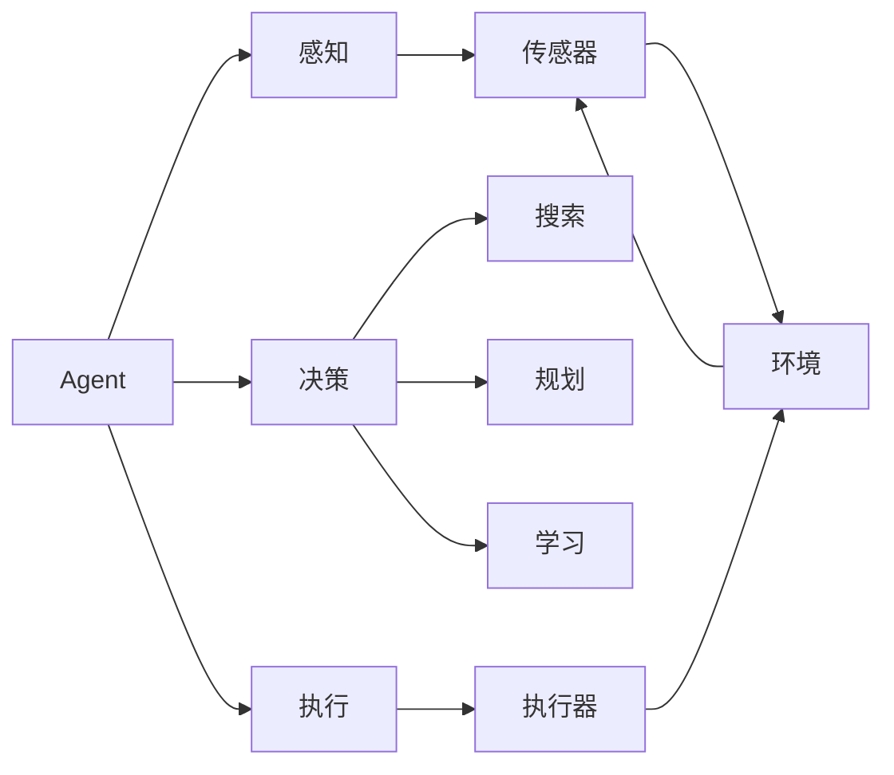

# AI人工智能 Agent：智能体的设计与实现

## 1. 背景介绍
### 1.1 人工智能发展历程
#### 1.1.1 人工智能的起源与发展
#### 1.1.2 人工智能的三次浪潮
#### 1.1.3 人工智能的现状与挑战

### 1.2 智能Agent的概念
#### 1.2.1 智能Agent的定义
#### 1.2.2 智能Agent的特点
#### 1.2.3 智能Agent的分类

### 1.3 智能Agent的应用领域
#### 1.3.1 游戏AI中的智能Agent
#### 1.3.2 自动驾驶中的智能Agent 
#### 1.3.3 智能客服中的智能Agent

## 2. 核心概念与联系
### 2.1 Agent与环境
#### 2.1.1 Agent的感知
#### 2.1.2 Agent的行动
#### 2.1.3 Agent与环境的交互

### 2.2 目标与效用
#### 2.2.1 目标的表示
#### 2.2.2 效用函数
#### 2.2.3 目标与效用的关系

### 2.3 状态空间与搜索
#### 2.3.1 状态空间的定义
#### 2.3.2 搜索算法概述
#### 2.3.3 搜索策略的选择

### 2.4 知识表示与推理
#### 2.4.1 知识的类型
#### 2.4.2 知识表示方法
#### 2.4.3 推理机制

### 2.5 学习与适应
#### 2.5.1 监督学习
#### 2.5.2 无监督学习  
#### 2.5.3 强化学习

## 3. 核心算法原理具体操作步骤
### 3.1 搜索算法
#### 3.1.1 宽度优先搜索(BFS)
#### 3.1.2 深度优先搜索(DFS)
#### 3.1.3 A*搜索算法

### 3.2 博弈树搜索
#### 3.2.1 极大极小值搜索 
#### 3.2.2 Alpha-Beta剪枝
#### 3.2.3 蒙特卡洛树搜索(MCTS)

### 3.3 马尔可夫决策过程(MDP)
#### 3.3.1 MDP的定义
#### 3.3.2 值迭代
#### 3.3.3 策略迭代

### 3.4 强化学习算法
#### 3.4.1 Q-Learning
#### 3.4.2 SARSA   
#### 3.4.3 Deep Q Network(DQN)

## 4. 数学模型和公式详细讲解举例说明
### 4.1 效用理论与效用函数
#### 4.1.1 期望效用理论 
#### 4.1.2 效用函数的性质
#### 4.1.3 效用函数的构建

### 4.2 概率图模型
#### 4.2.1 贝叶斯网络
#### 4.2.2 马尔可夫网络
#### 4.2.3 隐马尔可夫模型(HMM)

### 4.3 博弈论与纳什均衡
#### 4.3.1 博弈论基本概念
#### 4.3.2 纳什均衡的定义
#### 4.3.3 纳什均衡的求解

### 4.4 优化理论与凸优化
#### 4.4.1 优化问题的数学表述
#### 4.4.2 凸优化基本概念
#### 4.4.3 凸优化算法

## 5. 项目实践：代码实例和详细解释说明
### 5.1 基于搜索的迷宫寻路Agent
#### 5.1.1 问题描述与建模
#### 5.1.2 BFS与DFS实现
#### 5.1.3 A*搜索算法实现

### 5.2 基于强化学习的自动驾驶Agent
#### 5.2.1 问题描述与环境搭建
#### 5.2.2 DQN算法实现
#### 5.2.3 训练过程与结果分析

### 5.3 基于MCTS的五子棋AI
#### 5.3.1 问题描述与游戏规则
#### 5.3.2 MCTS算法实现
#### 5.3.3 AI对弈与性能评估

### 5.4 基于知识图谱的智能问答Agent
#### 5.4.1 知识图谱构建
#### 5.4.2 问题理解与语义解析
#### 5.4.3 查询与答案生成

## 6. 实际应用场景
### 6.1 智能游戏NPC
#### 6.1.1 游戏NPC的智能化需求
#### 6.1.2 基于有限状态机的NPC设计
#### 6.1.3 基于强化学习的NPC设计

### 6.2 智能客服系统
#### 6.2.1 智能客服的应用现状
#### 6.2.2 基于自然语言处理的智能客服
#### 6.2.3 基于知识图谱的智能客服

### 6.3 自动驾驶系统
#### 6.3.1 自动驾驶的发展现状
#### 6.3.2 自动驾驶系统的架构
#### 6.3.3 感知、规划与控制技术

### 6.4 智能推荐系统
#### 6.4.1 智能推荐的应用场景
#### 6.4.2 基于协同过滤的推荐
#### 6.4.3 基于深度学习的推荐

## 7. 工具和资源推荐
### 7.1 开发工具
#### 7.1.1 Python与主要库
#### 7.1.2 Java与主要框架
#### 7.1.3 C++与主要库

### 7.2 开源平台与框架
#### 7.2.1 OpenAI Gym
#### 7.2.2 DeepMind Lab
#### 7.2.3 Unity ML-Agents

### 7.3 数据集与竞赛
#### 7.3.1 Kaggle竞赛平台
#### 7.3.2 ImageNet数据集
#### 7.3.3 Atari游戏环境

### 7.4 在线课程与教程
#### 7.4.1 吴恩达机器学习课程
#### 7.4.2 CS188人工智能导论
#### 7.4.3 David Silver强化学习课程

## 8. 总结：未来发展趋势与挑战
### 8.1 智能Agent的研究热点
#### 8.1.1 多智能体协作与博弈
#### 8.1.2 面向实际应用的智能Agent
#### 8.1.3 人机混合增强智能

### 8.2 智能Agent面临的挑战
#### 8.2.1 鲁棒性与适应性
#### 8.2.2 可解释性与可信性
#### 8.2.3 伦理与安全问题

### 8.3 智能Agent的未来展望
#### 8.3.1 智能Agent的产业化应用
#### 8.3.2 智能Agent与人工通用智能
#### 8.3.3 智能Agent促进人机协作

## 9. 附录：常见问题与解答
### 9.1 如何选择适合的智能Agent架构？
### 9.2 如何评估智能Agent的性能？
### 9.3 智能Agent在实际应用中会面临哪些困难？
### 9.4 智能Agent的发展对社会和个人有何影响？
### 9.5 普通开发者如何学习和应用智能Agent技术？

智能Agent是人工智能领域的核心研究对象之一，它是一个能够感知环境、做出决策并采取行动的自主实体。设计和实现智能Agent需要综合运用人工智能的各个分支领域的理论和技术，包括搜索、规划、机器学习、博弈论、概率图模型等。

在实际应用中，智能Agent已经被广泛应用于游戏AI、自动驾驶、智能客服、推荐系统等领域，极大地提升了系统的智能化水平和用户体验。然而，智能Agent的研究和应用也面临着诸多挑战，如鲁棒性、可解释性、伦理安全等问题亟待解决。

未来，智能Agent技术将继续得到快速发展，并与其他前沿技术如大数据、云计算、物联网等深度融合，推动人工智能在各行各业的应用落地。同时，智能Agent也将在人机协作、通用人工智能等方向取得重要突破，为人类社会的发展做出更大贡献。

对于有志于从事智能Agent研究和应用的开发者而言，需要打好扎实的数学、计算机科学和人工智能基础，多学习前沿算法模型，积极动手实践，并密切关注学术界和工业界的最新进展。只有不断学习和实践，才能紧跟时代发展的步伐，在智能Agent领域有所建树。

作者：禅与计算机程序设计艺术 / Zen and the Art of Computer Programming