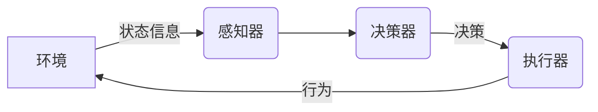

# AI人工智能 Agent：资源配置中智能体的应用

## 1.背景介绍

### 1.1 资源配置问题简介

在现实世界中,我们经常会遇到需要对有限资源进行合理分配的情况。无论是企业需要安排生产计划来满足客户需求,还是政府需要分配财政预算来支持不同的公共事业,抑或是个人需要合理安排时间来完成各项任务,资源配置都是一个不可回避的问题。传统的资源配置方法通常依赖人工经验和启发式算法,但这些方法往往效率低下,难以处理大规模、高维度、高复杂度的问题。

### 1.2 人工智能在资源配置中的应用

随着人工智能技术的不断发展,智能体(Agent)技术为资源配置问题提供了新的解决方案。智能体是具有一定自主性、可感知环境并作出决策的计算机系统。在资源配置问题中,我们可以将智能体视为一个决策者,它能够根据当前的资源状态和约束条件,选择最优的资源分配方案。

智能体技术在资源配置中的应用主要包括以下几个方面:

1. **建模和求解**:利用人工智能技术(如机器学习、规划算法等)建立资源配置问题的数学模型,并求解最优解。

2. **自适应决策**:智能体可以根据环境的动态变化自主调整资源分配策略,提高资源利用效率。

3. **多智能体协作**:在复杂的资源配置场景中,可以部署多个智能体进行协作决策,提高决策质量。

4. **人机混合智能**:将人的经验知识和人工智能技术相结合,实现人机协同的资源配置决策。

## 2.核心概念与联系

### 2.1 智能体(Agent)

智能体是人工智能系统中的一个核心概念,它是一个感知环境、作出决策并执行行为的自主实体。在资源配置问题中,智能体扮演着决策者的角色,它需要根据当前的资源状态和约束条件,选择最优的资源分配方案。

智能体的核心组成部分包括:

1. **感知器(Sensor)**:用于获取环境状态信息。
2. **决策器(Decision Maker)**:根据感知器获取的信息做出决策。
3. **执行器(Actuator)**:执行决策器做出的决策。

### 2.2 资源配置问题建模

将资源配置问题形式化为数学模型是解决该问题的关键步骤。常见的资源配置问题建模方法包括:

1. **线性规划(Linear Programming)**:当目标函数和约束条件都是线性的时候,可以使用线性规划模型。
2. **整数规划(Integer Programming)**:如果决策变量需要取整数值,可以使用整数规划模型。
3. **约束优化(Constraint Optimization)**:将资源配置问题表示为一系列约束条件和目标函数的优化问题。
4. **马尔可夫决策过程(Markov Decision Process)**:当资源配置问题涉及时序决策时,可以使用马尔可夫决策过程模型。

### 2.3 求解算法

对于资源配置问题的数学模型,我们需要使用适当的算法来求解最优解。常见的求解算法包括:

1. **精确算法**:如简单枚举、分支定界法、动态规划等,可以得到最优解,但计算复杂度较高。
2. **近似算法**:如启发式算法、元启发式算法等,可以在合理的时间内得到近似最优解。
3. **机器学习算法**:如强化学习、神经网络等,通过从数据中学习获得资源配置策略。

## 3.核心算法原理具体操作步骤

### 3.1 线性规划求解资源配置问题

线性规划是解决资源配置问题的一种常用方法。它的基本思想是将资源配置问题建模为一个线性目标函数和一系列线性约束条件的优化问题,然后使用算法求解该优化问题的最优解。

线性规划求解资源配置问题的具体步骤如下:

1. **确定决策变量**:根据问题的性质确定需要优化的决策变量,通常表示为 $x_1, x_2, \ldots, x_n$。

2. **建立目标函数**:目标函数是一个线性函数,表示我们希望最大化或最小化的目标,如最大化利润、最小化成本等。目标函数可表示为:

$$\max \text{ 或 } \min \quad z = c_1x_1 + c_2x_2 + \cdots + c_nx_n$$

其中 $c_1, c_2, \ldots, c_n$ 是决策变量的系数。

3. **列出约束条件**:约束条件是一系列线性不等式,表示决策变量需要满足的限制条件,如资源供给量、产能等。约束条件可表示为:

$$\begin{aligned}
a_{11}x_1 + a_{12}x_2 + \cdots + a_{1n}x_n &\leq b_1\\
a_{21}x_1 + a_{22}x_2 + \cdots + a_{2n}x_n &\leq b_2\\
&\vdots\\
a_{m1}x_1 + a_{m2}x_2 + \cdots + a_{mn}x_n &\leq b_m\\
x_1, x_2, \ldots, x_n &\geq 0
\end{aligned}$$

其中 $a_{ij}$ 是决策变量的系数,  $b_i$ 是资源供给量或其他限制条件。

4. **求解线性规划问题**:使用算法求解线性规划问题,得到最优解 $x_1^*, x_2^*, \ldots, x_n^*$。常用的求解算法包括单纯形法、内点法等。

5. **资源配置方案**:根据最优解 $x_1^*, x_2^*, \ldots, x_n^*$ 得到相应的资源配置方案。

### 3.2 整数规划求解资源配置问题

在某些情况下,资源配置问题的决策变量需要取整数值,这时我们需要使用整数规划模型。整数规划模型与线性规划模型类似,不同之处在于决策变量的取值范围是整数。

整数规划求解资源配置问题的具体步骤如下:

1. **确定决策变量**:根据问题的性质确定需要优化的决策变量,通常表示为 $x_1, x_2, \ldots, x_n$,且 $x_i$ 是整数。

2. **建立目标函数**:目标函数是一个线性函数,表示我们希望最大化或最小化的目标,如最大化利润、最小化成本等。目标函数可表示为:

$$\max \text{ 或 } \min \quad z = c_1x_1 + c_2x_2 + \cdots + c_nx_n$$

其中 $c_1, c_2, \ldots, c_n$ 是决策变量的系数。

3. **列出约束条件**:约束条件是一系列线性不等式,表示决策变量需要满足的限制条件,如资源供给量、产能等。约束条件可表示为:

$$\begin{aligned}
a_{11}x_1 + a_{12}x_2 + \cdots + a_{1n}x_n &\leq b_1\\
a_{21}x_1 + a_{22}x_2 + \cdots + a_{2n}x_n &\leq b_2\\
&\vdots\\
a_{m1}x_1 + a_{m2}x_2 + \cdots + a_{mn}x_n &\leq b_m\\
x_1, x_2, \ldots, x_n &\in \mathbb{Z}^+
\end{aligned}$$

其中 $a_{ij}$ 是决策变量的系数,  $b_i$ 是资源供给量或其他限制条件,  $\mathbb{Z}^+$ 表示正整数集合。

4. **求解整数规划问题**:使用算法求解整数规划问题,得到最优解 $x_1^*, x_2^*, \ldots, x_n^*$。常用的求解算法包括切割平面法、分支定界法等。

5. **资源配置方案**:根据最优解 $x_1^*, x_2^*, \ldots, x_n^*$ 得到相应的资源配置方案。

### 3.3 约束优化求解资源配置问题

约束优化是一种通用的资源配置问题建模和求解方法。它将资源配置问题表示为一个目标函数和一系列约束条件的优化问题,然后使用优化算法求解该问题。

约束优化求解资源配置问题的具体步骤如下:

1. **确定决策变量**:根据问题的性质确定需要优化的决策变量,通常表示为 $x_1, x_2, \ldots, x_n$。

2. **建立目标函数**:目标函数表示我们希望最大化或最小化的目标,如最大化利润、最小化成本等。目标函数可以是线性的或非线性的。

$$\max \text{ 或 } \min \quad f(x_1, x_2, \ldots, x_n)$$

3. **列出约束条件**:约束条件是一系列等式或不等式,表示决策变量需要满足的限制条件,如资源供给量、产能等。约束条件可以是线性的或非线性的。

$$\begin{aligned}
g_1(x_1, x_2, \ldots, x_n) &\leq 0\\
g_2(x_1, x_2, \ldots, x_n) &\leq 0\\
&\vdots\\
g_m(x_1, x_2, \ldots, x_n) &\leq 0
\end{aligned}$$

4. **求解约束优化问题**:使用优化算法求解约束优化问题,得到最优解 $x_1^*, x_2^*, \ldots, x_n^*$。常用的求解算法包括序列二次规划法、内点法、penalty 函数法等。

5. **资源配置方案**:根据最优解 $x_1^*, x_2^*, \ldots, x_n^*$ 得到相应的资源配置方案。

### 3.4 马尔可夫决策过程求解资源配置问题

马尔可夫决策过程(Markov Decision Process, MDP)是一种用于建模序贯决策问题的数学框架。在资源配置问题中,如果需要根据环境的动态变化不断调整资源分配策略,那么可以使用马尔可夫决策过程模型。

马尔可夫决策过程求解资源配置问题的具体步骤如下:

1. **定义马尔可夫决策过程**:一个马尔可夫决策过程由一个五元组 $(S, A, P, R, \gamma)$ 定义,其中:
   - $S$ 是状态集合,表示环境的所有可能状态。
   - $A$ 是行为集合,表示智能体可以执行的所有行为。
   - $P(s' \mid s, a)$ 是状态转移概率,表示在状态 $s$ 执行行为 $a$ 后,转移到状态 $s'$ 的概率。
   - $R(s, a)$ 是即时奖励函数,表示在状态 $s$ 执行行为 $a$ 后获得的即时奖励。
   - $\gamma \in [0, 1)$ 是折现因子,用于权衡即时奖励和未来奖励的重要性。

2. **建立马尔可夫决策过程模型**:根据资源配置问题的特点,定义状态集合 $S$、行为集合 $A$、状态转移概率 $P$ 和即时奖励函数 $R$,从而建立马尔可夫决策过程模型。

3. **求解最优策略**:使用算法求解马尔可夫决策过程的最优策略 $\pi^*$,即在任意状态 $s$ 下执行的最优行为 $a^*$。常用的求解算法包括价值迭代法、策略迭代法、Q-learning 等。

4. **资源配置策略**:根据最优策略 $\pi^*$,在每个状态 $s$ 下执行对应的最优行为 $a^*$,从而得到相应的资源配置策略。

## 4.数学模型和公式详细讲解举例说明

在上一节中,我们介绍了几种常见的资源配置问题建模方法,包括线性规划、整数规划、约束优化和马尔可夫决策过程。现在,我们将通过具体的例子来详细讲解这些数学模型和公式。

### 4.1 线性规