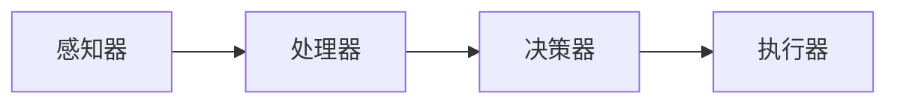

## 1.背景介绍

在当今的信息时代，人工智能 (AI) 已经成为了我们生活和工作中不可或缺的一部分。从搜索引擎的智能推荐，到自动驾驶汽车的路径规划，再到医疗领域的疾病诊断，AI的应用无处不在。AI 代理是 AI 技术的一种重要实现形式，它是一种能够在某个环境中独立行动，以实现预定目标的系统。AI 代理工作流是 AI 代理的核心组成部分，它定义了 AI 代理如何接收输入，处理数据，做出决策，并执行操作的过程。

## 2.核心概念与联系

AI 代理工作流主要包括以下几个核心概念：感知器 (Perceptors)、处理器 (Processors)、决策器 (Deciders) 和执行器 (Actuators)。感知器负责收集环境信息，处理器负责处理这些信息，决策器根据处理后的信息做出决策，执行器则负责执行决策。

这四个部分之间的联系可以用以下的 Mermaid 流程图来表示：



## 3.核心算法原理具体操作步骤

AI 代理工作流的核心算法原理可以分为以下几个步骤：

1. 数据收集：感知器从环境中收集数据，这些数据可以是图像、声音、文本等各种形式。
2. 数据处理：处理器对收集到的数据进行预处理，如数据清洗、特征提取等，以便于后续的决策。
3. 决策制定：决策器根据处理后的数据，通过一定的算法，如深度学习、强化学习等，做出决策。
4. 决策执行：执行器根据决策器的决策，执行相应的操作，如移动机器人、发送消息等。

## 4.数学模型和公式详细讲解举例说明

在 AI 代理工作流中，深度学习是一种常用的决策制定方法。深度学习模型可以用来处理各种类型的数据，如图像、文本等。下面，我们以卷积神经网络 (CNN) 为例，简单介绍一下深度学习的数学模型和公式。

CNN 是一种深度学习模型，主要用于处理图像数据。CNN 的基本结构包括输入层、卷积层、池化层和全连接层。其中，卷积层和池化层负责提取图像的特征，全连接层则负责将这些特征用于分类或回归。

卷积层的主要操作是卷积，其数学公式可以表示为：

$$
f_{ij} = \sum_{m=0}^{M-1} \sum_{n=0}^{N-1} h_{mn} g_{i+m,j+n}
$$

其中，$f_{ij}$ 是输出特征图的一个元素，$h_{mn}$ 是卷积核的一个元素，$g_{i+m,j+n}$ 是输入特征图的一个元素，$M$ 和 $N$ 是卷积核的尺寸。

池化层的主要操作是池化，其数学公式可以表示为：

$$
f_{ij} = \max_{m=0}^{M-1,n=0}^{N-1} g_{i+m,j+n}
$$

其中，$f_{ij}$ 是输出特征图的一个元素，$g_{i+m,j+n}$ 是输入特征图的一个元素，$M$ 和 $N$ 是池化窗口的尺寸。

## 5.项目实践：代码实例和详细解释说明

下面，我们以 Python 语言和 TensorFlow 框架为例，简单介绍一下如何实现一个简单的 CNN。

首先，我们需要导入所需的库：

```python
import tensorflow as tf
from tensorflow.keras import layers
```

然后，我们可以定义一个 CNN 模型：

```python
model = tf.keras.Sequential()
model.add(layers.Conv2D(32, (3, 3), activation='relu', input_shape=(32, 32, 3)))
model.add(layers.MaxPooling2D((2, 2)))
model.add(layers.Conv2D(64, (3, 3), activation='relu'))
model.add(layers.MaxPooling2D((2, 2)))
model.add(layers.Conv2D(64, (3, 3), activation='relu'))
model.add(layers.Flatten())
model.add(layers.Dense(64, activation='relu'))
model.add(layers.Dense(10))
```

最后，我们可以编译并训练这个模型：

```python
model.compile(optimizer='adam',
              loss=tf.keras.losses.SparseCategoricalCrossentropy(from_logits=True),
              metrics=['accuracy'])

history = model.fit(train_images, train_labels, epochs=10, 
                    validation_data=(test_images, test_labels))
```

这段代码中，我们首先定义了一个 CNN 模型，然后编译并训练这个模型。在训练过程中，模型会自动调整其参数，以最小化损失函数，从而提高模型的性能。

## 6.实际应用场景

AI 代理工作流在许多领域都有广泛的应用。例如，在自动驾驶汽车中，AI 代理需要收集路况信息，处理这些信息，做出驾驶决策，并执行驾驶操作。在医疗领域，AI 代理可以用于疾病诊断，它需要收集病人的医疗记录，处理这些记录，做出诊断决策，并给出治疗建议。在电子商务领域，AI 代理可以用于商品推荐，它需要收集用户的购物记录，处理这些记录，做出推荐决策，并给出推荐商品。

## 7.工具和资源推荐

在实现 AI 代理工作流时，有许多优秀的工具和资源可以使用。以下是我个人推荐的一些工具和资源：

1. TensorFlow：这是一个由 Google 开发的开源深度学习框架，它提供了许多预定义的函数和类，可以方便地实现各种深度学习模型。
2. PyTorch：这是一个由 Facebook 开发的开源深度学习框架，它的设计理念是“定义即执行”，让深度学习更像编程。
3. Keras：这是一个基于 TensorFlow 的高级深度学习框架，它的设计理念是“用户友好、模块化、易扩展”，让深度学习更简单。
4. scikit-learn：这是一个开源的机器学习库，提供了许多预处理、模型训练和模型评估的函数，适合于传统的机器学习任务。

## 8.总结：未来发展趋势与挑战

随着 AI 技术的发展，AI 代理工作流将会有更广泛的应用。但同时，也面临着一些挑战。例如，如何处理大量的数据，如何提高决策的准确性，如何保证决策的公正性等。这些都是我们需要进一步研究的问题。

## 9.附录：常见问题与解答

在这里，我收集了一些关于 AI 代理工作流的常见问题和解答，希望对你有所帮助。

Q: AI 代理工作流的主要组成部分是什么？

A: AI 代理工作流主要包括感知器、处理器、决策器和执行器四个部分。

Q: AI 代理工作流中的决策器是如何做出决策的？

A: 决策器通常使用一些算法，如深度学习、强化学习等，根据处理后的数据做出决策。

Q: AI 代理工作流有哪些应用？

A: AI 代理工作流在许多领域都有应用，如自动驾驶汽车、医疗诊断、商品推荐等。

Q: 实现 AI 代理工作流需要哪些工具？

A: 实现 AI 代理工作流可以使用一些深度学习框架，如 TensorFlow、PyTorch、Keras 等。

作者：禅与计算机程序设计艺术 / Zen and the Art of Computer Programming