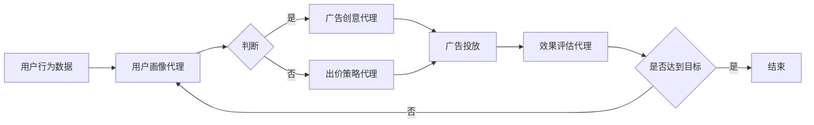

# AI人工智能代理工作流 AI Agent WorkFlow：在广告细分市场中的应用

## 1. 背景介绍

### 1.1 人工智能在广告领域的应用现状

人工智能技术的快速发展为广告行业带来了革命性的变革。越来越多的广告公司开始利用人工智能技术来优化广告投放策略、提高广告效果和投资回报率。AI可以帮助广告主更精准地锁定目标受众,优化广告创意,实时调整出价策略等。

### 1.2 广告细分市场面临的挑战

然而,广告细分市场的复杂性和动态性给广告优化带来了巨大挑战。不同的受众有着不同的偏好和行为特征,市场环境也在不断变化。传统的人工优化方式难以应对如此复杂的场景。因此,亟需一种更加智能、自动化的优化方案。

### 1.3 AI Agent工作流的提出

AI Agent工作流是一种将多个智能代理组合协作的工作流程,通过分工合作来解决复杂问题。本文将探讨如何将AI Agent工作流应用于广告细分市场,实现广告投放的全流程自动优化。

## 2. 核心概念与联系

### 2.1 AI Agent的定义与分类

AI Agent是一种能够感知环境、做出决策并采取行动的智能实体。根据应用场景和功能的不同,AI Agent可分为以下几类:

- 用户画像代理:负责分析用户特征,构建用户画像
- 广告创意代理:负责优化广告创意,提高广告吸引力  
- 出价策略代理:负责制定实时竞价策略,优化投放成本
- 效果评估代理:负责评估广告效果,优化投放策略

### 2.2 工作流的定义与组成

工作流是一系列有序的任务的集合,用于将复杂的业务流程分解为一系列可管理的子任务。一个典型的工作流由以下几个部分组成:

- 任务:工作流中的最小执行单元
- 顺序流:定义任务执行的先后顺序
- 网关:控制任务的执行路径
- 事件:触发任务执行的条件

### 2.3 AI Agent工作流的架构

AI Agent工作流将多个AI Agent组织在一个工作流中协同工作,解决复杂的优化问题。其基本架构如下:



## 3. 核心算法原理具体操作步骤

### 3.1 用户画像构建算法

用户画像代理采用聚类算法对用户进行分群,主要步骤如下:

1. 数据预处理:对原始用户行为数据进行清洗、集成、变换和规约 
2. 特征工程:提取用户人口统计学特征、行为特征、偏好特征等
3. 特征选择:去除冗余特征,选择最具区分度的特征子集
4. 聚类算法:采用K-Means、DBSCAN等算法对用户进行聚类
5. 聚类评估:采用轮廓系数、DBI等指标评估聚类效果,调优聚类参数

### 3.2 广告创意优化算法

广告创意代理采用强化学习算法来优化广告创意,主要步骤如下:

1. 状态空间定义:将用户特征和广告创意参数定义为状态空间
2. 动作空间定义:将广告创意的各种优化方式定义为动作空间
3. 奖励函数定义:将广告点击率、转化率等指标定义为奖励函数 
4. 价值函数逼近:采用值函数逼近的方法求解最优策略
5. 策略改进:根据新的数据不断更新价值函数,改进策略

### 3.3 出价策略优化算法

出价策略代理采用多臂老虎机算法来优化竞价策略,主要步骤如下:

1. 臂的定义:将不同的出价策略定义为老虎机的臂
2. 奖励的定义:将广告点击成本、投资回报率等指标定义为奖励
3. 探索与利用:在探索新策略和利用已有策略间进行权衡
4. 回归函数逼近:采用线性回归、logistic回归等方法拟合奖励函数 
5. 汤普森采样:根据后验分布采样,选择最优策略

### 3.4 效果评估算法

效果评估代理采用归因模型算法来评估广告效果,主要步骤如下:

1. 构建归因模型:选择适当的归因模型,如最后点击归因、线性归因等
2. 定义归因窗口:确定多长时间内的用户行为对转化有贡献
3. 归因度量:度量各个渠道、广告的贡献度
4. 数据校准:根据对照组数据对归因结果进行校准
5. 效果评估:评估各个渠道、广告的投资回报率等关键指标

## 4. 数学模型和公式详细讲解举例说明

### 4.1 聚类算法中的数学模型

以K-Means聚类算法为例,其数学模型如下:

目标函数:
$$J=\sum_{i=1}^k\sum_{x\in C_i}\lVert x-\mu_i \rVert^2$$

其中,$\mu_i$是聚类$C_i$的中心点,目标是最小化所有样本点到其所属聚类中心点的距离之和。

迭代过程:

1. 初始化聚类中心$\{\mu_1,\mu_2,\dots,\mu_k\}$
2. 重复直到收敛:
   - 聚类分配:$C_i=\{x_p:\lVert x_p-\mu_i \rVert \leq \lVert x_p-\mu_j \rVert, \forall j \neq i\}$ 
   - 聚类中心点更新:$\mu_i=\frac{1}{|C_i|}\sum_{x\in C_i}x$

### 4.2 强化学习中的数学模型

以Q-Learning算法为例,其数学模型如下:

Q函数更新公式:
$$Q(s,a) \leftarrow Q(s,a)+\alpha[r+\gamma \max_{a'}Q(s',a')-Q(s,a)]$$

其中,$s$是当前状态,$a$是在状态$s$下采取的动作,$r$是奖励,$s'$是执行动作$a$后转移到的新状态,$\gamma$是折扣因子。

策略选择:
$$\pi(s)=\arg\max_a Q(s,a)$$

即在每个状态下选择Q值最大的动作作为最优策略。

### 4.3 多臂老虎机算法中的数学模型

以UCB算法为例,其数学模型如下:

臂的选择策略:
$$A_t=\arg\max_{a\in\{1,\dots,K\}} \left[Q_t(a)+\sqrt{\frac{2\log t}{N_t(a)}}\right]$$

其中,$A_t$是第$t$轮选择的臂,$Q_t(a)$是臂$a$的平均奖励估计,$N_t(a)$是臂$a$被选择的次数。$\sqrt{\frac{2\log t}{N_t(a)}}$项用于平衡探索和利用。

奖励估计更新:
$$Q_{t+1}(A_t)=Q_t(A_t)+\frac{1}{N_{t+1}(A_t)}[R_t-Q_t(A_t)]$$

其中,$R_t$是第$t$轮获得的奖励。

### 4.4 归因模型中的数学公式

以最后点击归因为例,其数学公式如下:

$$V_i=\begin{cases}
1, & \text{if }i=\arg\max_i T_i \\
0, & \text{otherwise}
\end{cases}$$

其中,$V_i$表示归因于第$i$个渠道的转化价值,$T_i$表示第$i$个渠道最后一次广告点击的时间。即将转化价值全部归因于最后一次点击的渠道。

## 5. 项目实践：代码实例和详细解释说明

下面以Python为例,给出几个核心算法的简要实现:

### 5.1 K-Means聚类算法

```python
import numpy as np

class KMeans:
    def __init__(self, n_clusters=5, max_iter=300):
        self.n_clusters = n_clusters
        self.max_iter = max_iter
        self.centroids = None
        
    def fit(self, X):
        # 随机初始化聚类中心
        idx = np.random.choice(X.shape[0], self.n_clusters)
        self.centroids = X[idx]
        
        for _ in range(self.max_iter):
            # 聚类分配
            labels = self._assign_clusters(X)
            
            # 更新聚类中心
            for i in range(self.n_clusters):
                self.centroids[i] = X[labels == i].mean(axis=0)
                
    def _assign_clusters(self, X):
        # 计算样本到聚类中心的距离
        distances = np.sqrt(((X - self.centroids[:, np.newaxis])**2).sum(axis=2))
        
        # 选择距离最近的聚类中心
        return np.argmin(distances, axis=0)
    
    def predict(self, X):
        return self._assign_clusters(X)
```

### 5.2 Q-Learning强化学习算法

```python
import numpy as np

class QLearning:
    def __init__(self, n_states, n_actions, learning_rate=0.1, gamma=0.9, epsilon=0.1):
        self.n_states = n_states
        self.n_actions = n_actions
        self.learning_rate = learning_rate
        self.gamma = gamma
        self.epsilon = epsilon
        self.Q = np.zeros((n_states, n_actions))
        
    def choose_action(self, state):
        # epsilon-贪心策略选择动作
        if np.random.uniform() < self.epsilon:
            return np.random.choice(self.n_actions)
        else:
            return np.argmax(self.Q[state])
        
    def update(self, state, action, reward, next_state):
        # 更新Q值
        self.Q[state][action] += self.learning_rate * (reward + self.gamma * np.max(self.Q[next_state]) - self.Q[state][action])
```

### 5.3 UCB多臂老虎机算法

```python
import numpy as np

class UCB:
    def __init__(self, n_arms, alpha=1):
        self.n_arms = n_arms
        self.alpha = alpha
        self.t = 0
        self.rewards = np.zeros(n_arms)
        self.counts = np.zeros(n_arms)
        
    def choose_arm(self):
        # 计算UCB值并选择UCB值最大的臂
        ucb_values = self.rewards / (self.counts + 1e-5) + self.alpha * np.sqrt(np.log(self.t+1) / (self.counts + 1e-5))
        return np.argmax(ucb_values)
    
    def update(self, arm, reward):
        # 更新奖励和选择次数
        self.rewards[arm] += reward
        self.counts[arm] += 1
        self.t += 1
```

### 5.4 最后点击归因模型

```python
import numpy as np

def last_touch_attribution(conversion_value, click_times):
    # 找到最后一次点击的渠道
    last_click_channel = np.argmax(click_times)
    
    # 将转化价值归因于最后一次点击的渠道
    attribution = np.zeros(len(click_times))
    attribution[last_click_channel] = conversion_value
    
    return attribution
```

## 6. 实际应用场景

AI Agent工作流可以应用于广告优化的各个环节,例如:

### 6.1 用户细分与定向

用户画像代理可以自动将用户划分为不同的细分群体,广告主可以针对不同群体投放定制化的广告,提高广告的针对性和转化率。

### 6.2 广告创意优化

广告创意代理可以自动优化广告的标题、文案、图片、视频等创意元素,通过A/B测试不断迭代,找到最优的创意组合,提高广告的点击率和吸引力。

### 6.3 实时竞价优化

出价策略代理可以根据用户属性、广告位置、时间等因素,自动调整广告的实时出价,在预算范围内最大化广告的投放效果。

### 6.4 跨渠道归因分析

效果评估代理可以建立多渠道归因模型,量化每个广告渠道对最终转化的贡献,帮助广告主优化预算分配,提高投资回报率。

## 7. 工具和资源推荐

- 机器学习库: