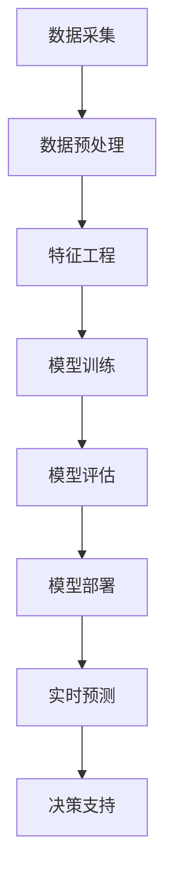

# AI人工智能代理工作流AI Agent WorkFlow：AI代理在股市分析的应用

## 1.背景介绍

近年来,随着人工智能(AI)技术的快速发展,AI已经广泛应用于各个领域,包括金融行业。在股市分析领域,AI代理工作流(AI Agent Workflow)作为一种新兴的分析工具,正在引起越来越多的关注。

股市分析一直是一项艰巨的挑战,因为它涉及大量的数据、复杂的模式和不确定的因素。传统的分析方法往往依赖于人工分析师的经验和直觉,效率低下且容易出现偏差。而AI代理工作流通过利用机器学习、自然语言处理等技术,能够快速高效地处理海量数据,发现隐藏的模式和趋势,为投资者提供更准确的决策支持。

## 2.核心概念与联系

### 2.1 AI代理(AI Agent)

AI代理是一种具有自主性的软件实体,能够感知环境、处理信息、做出决策并执行相应的行为。在股市分析中,AI代理可以被设计为收集和处理各种金融数据、构建预测模型、生成分析报告等功能。

### 2.2 工作流(Workflow)

工作流是一系列有序的活动或任务,旨在实现特定的目标。在AI代理工作流中,工作流定义了AI代理执行各种任务的顺序和依赖关系,确保分析过程的高效和一致性。

### 2.3 Mermaid流程图

上图展示了一个典型的AI代理工作流在股市分析中的应用。该流程包括数据采集、数据预处理、特征工程、模型训练、模型评估、模型部署、实时预测和决策支持等关键步骤。

## 3.核心算法原理具体操作步骤

在AI代理工作流中,涉及多种核心算法,包括机器学习算法、自然语言处理算法等。以下是一些常见算法的原理和操作步骤:

### 3.1 机器学习算法

#### 3.1.1 监督学习算法

监督学习算法是基于已标记的训练数据,学习出一个映射函数,用于对新的输入数据进行预测或分类。常见的监督学习算法包括线性回归、逻辑回归、决策树、随机森林、支持向量机等。

1. 收集并准备训练数据,包括特征数据和对应的标签数据。
2. 将数据集划分为训练集和测试集。
3. 选择合适的算法模型,并设置相应的超参数。
4. 使用训练集训练模型,优化模型参数。
5. 在测试集上评估模型性能,如准确率、精确率、召回率等指标。
6. 根据评估结果,调整模型参数或选择其他算法,重复上述步骤。
7. 最终选择性能最优的模型,部署到实际应用中。

#### 3.1.2 无监督学习算法

无监督学习算法是在没有标记数据的情况下,从原始数据中发现内在的模式和结构。常见的无监督学习算法包括聚类算法(如K-Means、层次聚类)和降维算法(如主成分分析、t-SNE)。

1. 收集原始数据,进行必要的预处理和特征提取。
2. 选择合适的无监督学习算法,如聚类算法或降维算法。
3. 设置算法的相关参数,如聚类数量、距离度量等。
4. 运行算法,获得聚类结果或降维后的数据表示。
5. 对结果进行可视化和分析,发现潜在的模式和结构。
6. 根据分析结果,调整算法参数或选择其他算法,重复上述步骤。
7. 将无监督学习的结果应用于下游任务,如异常检测、推荐系统等。

### 3.2 自然语言处理算法

自然语言处理(NLP)算法用于处理和理解人类语言数据,在股市分析中可应用于新闻文本分析、社交媒体情感分析等场景。常见的NLP算法包括词向量表示、序列标注、文本分类等。

#### 3.2.1 词向量表示算法

词向量表示算法将文本中的单词映射到一个连续的向量空间,使得语义相似的单词在向量空间中彼此靠近。常见的算法包括Word2Vec、GloVe等。

1. 收集大量的文本语料,进行必要的预处理和清理。
2. 选择合适的词向量表示算法,如Word2Vec或GloVe。
3. 设置算法的相关参数,如向量维度、窗口大小、训练迭代次数等。
4. 运行算法,在语料库上训练词向量模型。
5. 将训练好的词向量模型应用于下游的NLP任务,如文本分类、情感分析等。

#### 3.2.2 序列标注算法

序列标注算法用于对序列数据(如文本序列)中的每个元素进行标注或分类,常见的应用包括命名实体识别、词性标注等。常见的算法包括隐马尔可夫模型(HMM)、条件随机场(CRF)等。

1. 收集带有标注的序列数据,作为训练集。
2. 选择合适的序列标注算法,如HMM或CRF。
3. 设置算法的相关参数,如特征函数、正则化系数等。
4. 使用训练集训练序列标注模型。
5. 在测试集上评估模型性能,如准确率、F1分数等指标。
6. 根据评估结果,调整模型参数或选择其他算法,重复上述步骤。
7. 将训练好的模型应用于实际的序列标注任务。

#### 3.2.3 文本分类算法

文本分类算法用于将给定的文本样本归类到预定义的类别中,常见的应用包括新闻分类、垃圾邮件过滤等。常见的算法包括朴素贝叶斯、支持向量机、深度学习模型等。

1. 收集带有类别标签的文本数据,作为训练集。
2. 对文本数据进行预处理,如去除停用词、词干提取等。
3. 选择合适的文本表示方法,如词袋模型(BOW)、TF-IDF、词向量等。
4. 选择合适的分类算法,如朴素贝叶斯、支持向量机或深度学习模型。
5. 使用训练集训练文本分类模型。
6. 在测试集上评估模型性能,如准确率、精确率、召回率等指标。
7. 根据评估结果,调整模型参数或选择其他算法,重复上述步骤。
8. 将训练好的模型应用于实际的文本分类任务。

## 4.数学模型和公式详细讲解举例说明

在AI代理工作流中,许多算法都涉及复杂的数学模型和公式。以下是一些常见模型和公式的详细讲解和举例说明。

### 4.1 线性回归

线性回归是一种常见的监督学习算法,用于建立自变量和因变量之间的线性关系模型。线性回归模型的数学表达式如下:

$$y = \theta_0 + \theta_1x_1 + \theta_2x_2 + ... + \theta_nx_n$$

其中,y是因变量,x是自变量向量,θ是模型参数向量。

线性回归的目标是找到最优的参数θ,使得模型预测值y和实际值y'之间的均方误差最小化:

$$\min_\theta \sum_{i=1}^{m}(y^{(i)} - \hat{y}^{(i)})^2$$

其中,m是训练样本的数量。

这个优化问题可以通过最小二乘法或梯度下降法等方法求解。

例如,在股市分析中,我们可以使用线性回归模型来预测股票的收盘价,将历史交易数据(如开盘价、最高价、最低价等)作为自变量,收盘价作为因变量,通过训练获得最优的模型参数θ,从而对未来的收盘价进行预测。

### 4.2 逻辑回归

逻辑回归是一种常用的分类算法,用于解决二分类问题。逻辑回归模型的数学表达式如下:

$$\hat{y} = \sigma(\theta^T x) = \frac{1}{1 + e^{-\theta^T x}}$$

其中,x是输入特征向量,θ是模型参数向量,σ(z)是sigmoid函数,用于将线性组合θ^T x映射到(0,1)区间,作为样本属于正类的概率估计值。

逻辑回归的目标是最大化训练数据的对数似然函数:

$$\max_\theta \sum_{i=1}^{m}[y^{(i)}\log(\hat{y}^{(i)}) + (1 - y^{(i)})\log(1 - \hat{y}^{(i)})]$$

其中,y^(i)是第i个样本的真实标签(0或1)。

这个优化问题可以通过梯度上升法或牛顿法等方法求解。

例如,在股市分析中,我们可以使用逻辑回归模型来预测某只股票的涨跌情况,将历史交易数据和技术指标作为特征,将"涨"和"跌"作为两个分类标签,通过训练获得最优的模型参数θ,从而对未来的涨跌情况进行预测。

### 4.3 支持向量机(SVM)

支持向量机(SVM)是一种常用的监督学习模型,可用于分类和回归问题。SVM的基本思想是在高维空间中找到一个超平面,将不同类别的样本分开,并使得两类样本到超平面的距离最大化。

对于线性可分的二分类问题,SVM的目标是找到一个超平面w^T x + b = 0,使得:

$$\begin{cases}
w^T x_i + b \geq 1, & y_i = 1 \\
w^T x_i + b \leq -1, & y_i = -1
\end{cases}$$

其中,x_i是第i个样本的特征向量,y_i是对应的标签(1或-1)。

SVM的优化目标是最大化两类样本到超平面的间隔margin:

$$\max_{w, b} \frac{2}{\|w\|} \quad \text{s.t.} \quad y_i(w^T x_i + b) \geq 1, i = 1, 2, ..., m$$

这个优化问题可以通过拉格朗日对偶性转化为对偶问题,并使用核技巧(kernel trick)来处理非线性可分的情况。

例如,在股市分析中,我们可以使用SVM模型来预测股票的涨跌情况,将历史交易数据和技术指标作为特征,将"涨"和"跌"作为两个分类标签,通过训练获得最优的超平面参数w和b,从而对未来的涨跌情况进行预测。

### 4.4 随机森林

随机森林是一种集成学习算法,它通过构建多个决策树,并将它们的预测结果进行组合,从而提高模型的准确性和鲁棒性。

在随机森林中,每个决策树都是通过以下步骤构建的:

1. 从原始训练集中,通过有放回的方式随机抽取一个子集作为该决策树的训练集。
2. 在每个节点上,随机选择一部分特征,并基于这些特征进行最优分裂。
3. 重复步骤2,直到满足停止条件(如最大深度或最小样本数)。

对于分类问题,随机森林的预测结果是每棵树的预测结果的多数投票;对于回归问题,随机森林的预测结果是每棵树的预测结果的平均值。

随机森林的优点包括:

- 能够有效处理高维数据和缺失值。
- 不容易过拟合,具有良好的泛化能力。
- 可以评估特征的重要性。
- 训练和预测速度快,可以并行化。

在股市分析中,随机森林可以用于预测股票的涨跌情况、价格趋势等,通过构建多个决策树模型,并将它们的预测结果进行组合,从而提高预测的准确性和稳定性。

## 5.项目实践:代码实例和详细解释说明

为了更好地理解